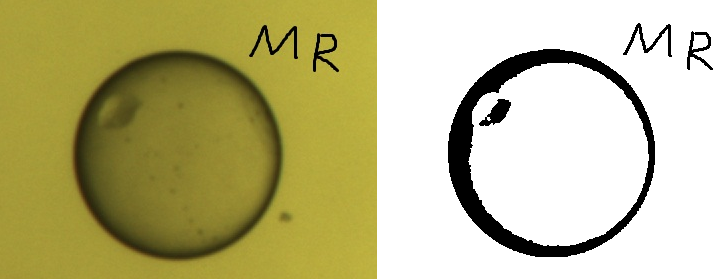
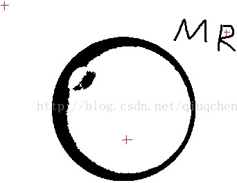
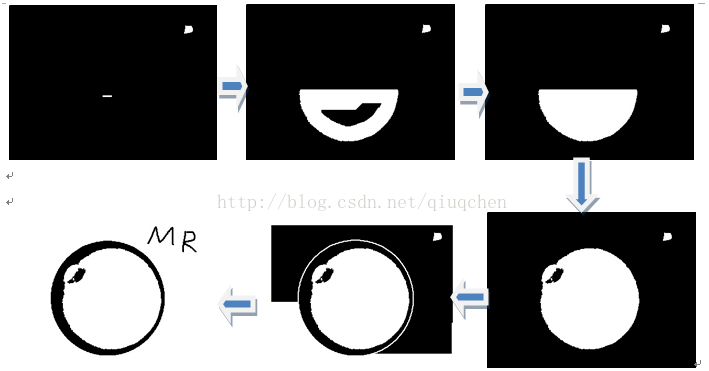

&emsp;&emsp;图像分割是一种重要的图像处理技术，而区域生长是图像分割技术的一种。区域生长的基本思想是将具有相似性的像素集合起来构成区域。首先对每个需要分割的区域找出一个种子像素作为生长的其点，然后将种子像素周围邻域中与种子有相同或相似性质的像素(根据事先确定的生长或相似准则来确定)合并到种子像素所在的区域中。而新的像素继续作为种子向四周生长，直到再没有满足条件的像素可以包括进来，一个区域就生长而成了。<!--more-->
&emsp;&emsp;种子区域生长(`region seeds growing`，`RSG`)算法在实践中关键的问题是种子的选取和相似区域判定准则的确定。种子的选择可以人工选择，也可以通过一些方法自动选取；灰度图的判定准则一般用灰度差值小于某个阈值来表示，不同的判定准则可能会产生不同的分割结果。
&emsp;&emsp;为了说明区域是如何生长的，本文从最简单的情况出发：使用二值图像；人工选取种子；判定准则为是否是前景像素。区域生长实现的步骤如下：

1. 对图像顺序扫描，找到第`1`个还没有归属的像素，设该像素为`(x0, y0)`。
2. 以`(x0, y0)`为中心，考虑`(x0, y0)`的`8`邻域像素`(x, y)`。如果`(x0, y0)`满足生长准则，将`(x, y)`与`(x0, y0)`合并(在同一区域内)，同时将`(x, y)`压入堆栈。
3. 从堆栈中取出一个像素，把它当作`(x0, y0)`返回到步骤`2`。
4. 当堆栈为空时，返回到步骤`1`。
5. 重复步骤`1`至`4`，直到图像中的每个点都有归属时，生长结束。

``` cpp
#include <iostream>
#include <cv.h>
#include <highgui.h>
#include <stack>

using namespace std;
using namespace cv;

static Point connects[8] = { /* 8邻域 */
    Point ( -1, -1 ),
    Point ( 0, -1 ),
    Point ( 1, -1 ),
    Point ( 1, 0 ),
    Point ( 1, 1 ),
    Point ( 0, 1 ),
    Point ( -1, 1 ),
    Point ( -1, 0 )
};

int main() {
    Mat src = imread ( "man.jpg", 0 ); /* 原图 */
    Mat res = Mat::zeros ( src.rows, src.cols, CV_8U ); /* 结果图 */
    Mat flagMat; /* 用于标记是否遍历过某点 */
    res.copyTo ( flagMat );
    Mat bin; /* 二值图像 */
    threshold ( src, bin, 80, 255, CV_THRESH_BINARY );
    stack<Point> seeds; /* 初始3个种子点 */
    seeds.push ( Point ( 0, 0 ) );
    seeds.push ( Point ( 186, 166 ) );
    seeds.push ( Point ( 327, 43 ) );
    res.at<uchar> ( 0, 0 ) = 255;
    res.at<uchar> ( 166, 186 ) = 255;
    res.at<uchar> ( 43, 327 ) = 255;

    while ( !seeds.empty() ) {
        Point seed = seeds.top();
        seeds.pop();
        flagMat.at<uchar> ( seed.y, seed.x ) = 1; /* 标记为已遍历过的点 */

        for ( size_t i = 0; i < 8; i++ ) { /* 遍历8邻域 */
            int tmpx = seed.x + connects[i].x;
            int tmpy = seed.y + connects[i].y;

            if ( tmpx < 0 || tmpy < 0 || tmpx >= src.cols || tmpy >= src.rows ) {
                continue;
            }

            /* 前景点且没有被标记过的点 */
            if ( bin.at<uchar> ( tmpy, tmpx ) != 0 && flagMat.at<uchar> ( tmpy, tmpx ) == 0 ) {
                res.at<uchar> ( tmpy, tmpx ) = 255; /* 生长 */
                flagMat.at<uchar> ( tmpy, tmpx ) = 1; /* 标记 */
                seeds.push ( Point ( tmpx, tmpy ) ); /* 种子压栈 */
            }
        }
    }

    imshow ( "RES", res );
    waitKey ( 0 );
    return 0;
}
```



上面的代码通过人工选择了三个种子，它们在原图中的大致位置如下(红色十字中心)：



区域生长的过程如下：

