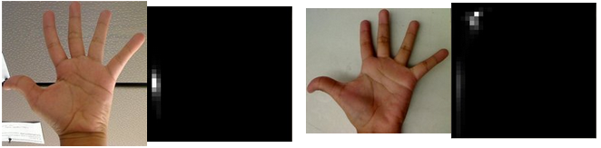
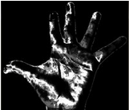
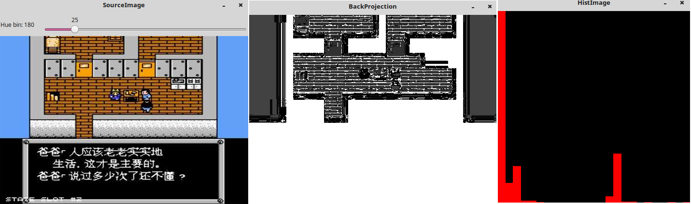
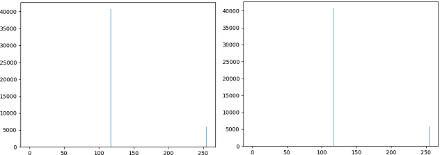
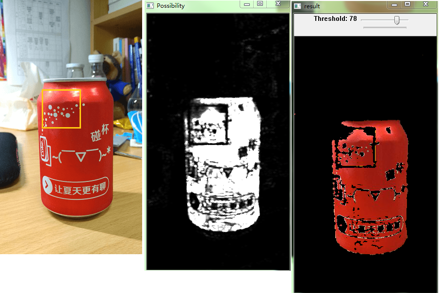
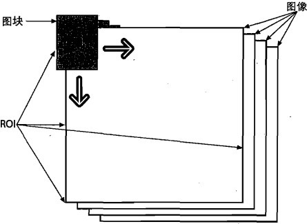
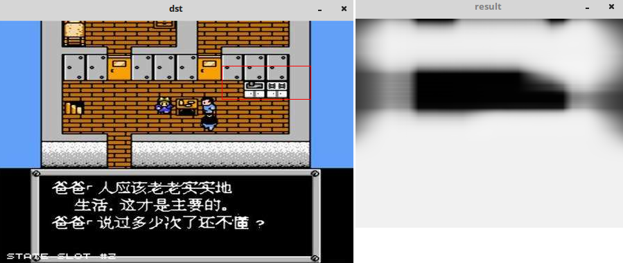

### 概述

&emsp;&emsp;反向投影是一种记录给定图像中的像素点如何适应直方图模型像素分布的方式，简单来讲，反向投影就是首先计算某一特征的直方图模型，然后使用模型去寻找图像中存在的特征。反向投影在某一位置的值就是原图对应位置像素值在原图像中的总数目。<!--more-->

### 反向投影原理

&emsp;&emsp;使用肤色直方图来解释反向投影的工作原理。假设我们已经获得一个肤色直方图(`Hue-Staturation`)，旁边的直方图就是模型直方图(代表手掌的肤色色调)，可以通过掩码操作来抓取手掌所在区域的直方图：



我们需要做的就是使用模型直方图来检测测试图像中的皮肤区域。以下是检测步骤：

&emsp;&emsp;1. 对于测试图像中的每个像素$p(i, j)$获取色调数据，并找到该色调$(h_{ij}, s_{ij})$在直方图中的$bin$位置。<br>
&emsp;&emsp;2. 查询模型直方图中对应的$bin - (h_{ij}, s_{ij})$并读取该$bin$的数值。<br>
&emsp;&emsp;3. 将此数值存储在新的图像中(`BackProjection`)。也可以先归一化模型直方图，这样测试图像的输出就可以在屏幕上显示了。
&emsp;&emsp;4. 通过对测试中的图像中的每个像素采用以上步骤，可以得到如下的`BackProjection`结果图：



&emsp;&emsp;5. 使用统计学的语言，`BackProjection`中存储的数值代表了测试图像中该像素属于皮肤区域的概率。以上图为例，亮的区域是皮肤区域的可能性更大，而暗的区域则表示更低的可能性。
&emsp;&emsp;这个过程可以笼统地说与计算图像直方图相反，计算直方图是统计图像中像素分布的概率，而反向投影是通过直方图来形成图像，其步骤有点类似于直方图均衡化。例如灰度图像的像素值如下：

``` cpp
grayImage =
    0 1 2  3
    4 5 6  7
    8 9 10 11
    8 9 14 15
```

对图像进行直方图统计(`bin`指定的区间为$[0, 3)$、$[4, 7)$、$[8, 11)$和$[12, 16)$)如下：

``` cpp
Histogram = [4 4 6 2]
```

也就是说在$[0, 3)$这个区间的像素值有`4`个，其它含义相同。根据上述的直方图进行反向投影，得到反向投影图像像素值如下：

``` cpp
Back_Projection =
    4 4 4 4
    4 4 4 4
    6 6 6 6
    6 6 2 2
```

例如位置$(0, 0)$上的像素值为`0`，对应的$bin$区间为$[0, 3)$，所以反向直方图在该位置上的$bin$值为`4`；位置$(3, 3)$上的像素为`15`，对应的$bin$区间为$[12, 16)$，故其反向投影图像中的像素为`2`。
&emsp;&emsp;`calcBackProjection`函数共有三种形式，根据传入参数的不同选择不同的调用，为重载函数：

``` cpp
void cv::calcBackProject (
    const Mat *images, int nimages, const int *channels,
    InputArray hist, OutputArray backProject,
    const float **ranges, double scale = 1, bool uniform = true);
void cv::calcBackProject (
    const Mat *images, int nimages, const int *channels,
    const SparseMat &hist, OutputArray backProject,
    const float **ranges, double scale = 1, bool uniform = true);
void cv::calcBackProject (
    InputArrayOfArrays images, const std::vector< int > &channels,
    InputArray hist, OutputArray dst, const std::vector< float > &ranges, double scale);
```

- `images`：输入图像，图像深度必须为`CV_8U`、`CV_16U`或`CV_32F`中的一种，尺寸相同，每一幅图像都可以有任意的通道数。
- `nimages`：输入图像的数量。
- `channels`：用于计算反向投影的通道列表，通道数必须与直方图维度相匹配，第一个数组的通道是从`0`到`image[0].channels() - 1`，第二个数组通道从图像`image[0].channels()`到`image[0].channels() + image[1].channels() - 1`计数。
- `hist`：输入的直方图，直方图的`bin`可以是密集(`dense`)或稀疏(`sparse`)。
- `backProject`：目标反向投影输出图像，是一个单通道图像，与原图像有相同的尺寸和深度。
- `ranges`：直方图中每个维度`bin`的取值范围。
- `scale`：可选输出反向投影的比例因子。
- `uniform`：直方图是否均匀分布(`uniform`)的标识符，一般使用默认值`true`。

``` cpp
#include "opencv2/highgui/highgui.hpp"
#include "opencv2/imgproc/imgproc.hpp"
#include <iostream>
#include "stdio.h"

using namespace std;
using namespace cv;

Mat srcImage, hsvImage, hueImage;
const int hueBinMaxValue = 180;
int hueBinValue = 25;

void Hist_and_Backprojection ( int, void * );

int main() {
    srcImage = imread ( "timg1.jpg" );

    if ( srcImage.empty() ) {
        cout << "图像加载失败" << endl;
        return -1;
    } else {
        cout << "图像加载成功..." << endl << endl;
    }

    cvtColor ( srcImage, hsvImage, CV_BGR2HSV ); /* 将图像转化为HSV图像 */
    hueImage.create ( hsvImage.size(), hsvImage.depth() ); /* 只使用图像的H参数 */
    int ch[] = {0, 0};
    mixChannels ( &hsvImage, 1, &hueImage, 1, ch, 1 );
    /* 轨迹条参数设置 */
    char trackBarName[20];
    sprintf ( trackBarName, "Hue bin: %d", hueBinMaxValue );
    namedWindow ( "SourceImage", WINDOW_AUTOSIZE );
    /* 创建轨迹条并调用回调函数 */
    createTrackbar ( trackBarName, "SourceImage", &hueBinValue, hueBinMaxValue, Hist_and_Backprojection );
    Hist_and_Backprojection ( hueBinValue, 0 );
    imshow ( "SourceImage", srcImage );
    waitKey ( 0 );
    return 0;
}

void Hist_and_Backprojection ( int, void * ) {
    MatND hist;
    int histsize = MAX ( hueBinValue, 2 );
    float hue_range[] = {0, 180};
    const float *ranges = {hue_range};
    /* 计算图像直方图并归一化处理 */
    calcHist ( &hueImage, 1, 0, Mat(), hist, 1, &histsize, &ranges, true, false );
    normalize ( hist, hist, 0, 255, NORM_MINMAX, -1, Mat() );
    /* 获取反向投影 */
    MatND backProjection;
    calcBackProject ( &hueImage, 1, 0, hist, backProjection, &ranges, 1, true );
    imshow ( "BackProjection", backProjection ); /* 输出反向投影 */
    /* 绘制图像直方图 */
    int w = 400;
    int h = 400;
    int bin_w = cvRound ( ( double ) w / histsize );
    Mat histImage = Mat::zeros ( w, h, CV_8UC3 );

    for ( int i = 0; i < hueBinValue; i++ ) {
        rectangle (
            histImage, Point ( i * bin_w, h ),
            Point ( ( i + 1 ) *bin_w, h - cvRound ( hist.at<float> ( i ) *h / 255.0 ) ),
            Scalar ( 0, 0, 255 ), -1
        );
    }

    imshow ( "HistImage", histImage );
}
```



---

### 直方图反向投影

&emsp;&emsp;英文叫`Histogram Backprojection`，所谓反向投影就是首先计算某一特征的直方图模型，然后使用模型去寻找图像中存在的该特征。那么既然存在反向，那什么是正向呢？其实之前做的一维直方图以及二维直方图都可以看作是一种正向投影，就是根据图片经过某种算法可以得到一个直方图，而且同样一张影像投影后得到的直方图是相同的。由图像到直方图的过程可以认为是一种正向投影，那么反过来由直方图到影像的过程可以认为是一种反向投影。在反向投影中，我们需要先求出原图直方图， 然后得到反向投影矩阵，由直方图到反向投影矩阵实际上就是个反向过程。那么直方图反向投影可以干什么呢？又是怎么从直方图到图像的呢？
&emsp;&emsp;首先反向投影用于在输入图像(通常较大)中查找特定图像(通常较小或者仅`1`个像素，以下将其称为`模板图像`)最匹配的点或者区域，也就是定位模板图像出现在输入图像的位置，用于在图像中查找指定特征，它可以用来做图像分割或者在图像中寻找我们感兴趣的部分。简单来说，它会输出与输入图像相同大小的影像。它直接取直方图中的值，即以灰度为例，某种灰度值在整幅图像中所占面积越大，其在直方图中的值越大，反向投影时，其对应的像素的新值越大(越亮)；反过来，某灰度值所占面积越小，其新值就越小，其中每一个像素值代表了输入图像上对应点属于目标对象的概率。更直观地表达就是，输出图像中像素值越高(越白)的点就越可能代表我们要搜索的目标，它经常与`Camshift`算法一起使用。
&emsp;&emsp;那么它是怎么实现的呢？从原理上来说，首先需要为一张包含我们要查找目标的图像创建直方图。最好使用颜色直方图，因为一个物体的颜色要比它的灰度能更好地被用来进行图像分割与对象识别。接着我们把这个颜色直方图投影到输入图像中寻找我们的目标，也就是找到输入图像中每一个像素点的像素值在直方图中对应的概率，这样就得到一个概率影像。最后设置适当的阈值对图像进行二值化，便完成操作。

### 原理

&emsp;&emsp;在理解反向投影原理前，首先要了解反向投影矩阵式如何计算的。假设某幅图像的灰度如下：

<table>
    <tr><td>43</td><td>183</td><td>200</td><td>90</td></tr>
    <tr><td>53</td><td>175</td><td>248</td><td>27</td></tr>
    <tr><td>69</td><td>10</td><td>148</td><td>194</td></tr>
    <tr><td>100</td><td>70</td><td>23</td><td>44</td></tr>
</table>

首先我们可以对它统计灰度直方图，由于这里为了计算简便，将`0`至`255`划分成如下区间，分别统计在各个区间有多少个像素：

0-51 | 52-102 | 103-153 | 154-204 | 205-255
-----|--------|---------|---------|--------
`5`  | `5`    | `1`     | `4`     | `1`

统计完灰度直方图后，下面便是反向投影矩阵的核心了。对于$(0, 0)$像素，其灰度值为`43`，对应灰度直方图中的数量为`5`。所以把`5`赋给$(0, 0)$位置；同理$(0, 1)$值为`183`，对应灰度直方图中的数量为`4`，所以把`4`赋给$(0, 1)$。重复可得到下面灰度矩阵：

<table>
    <tr><td>5</td><td>4</td><td>4</td><td>5</td></tr>
    <tr><td>5</td><td>4</td><td>1</td><td>5</td></tr>
    <tr><td>5</td><td>5</td><td>1</td><td>4</td></tr>
    <tr><td>5</td><td>5</td><td>5</td><td>5</td></tr>
</table>

&emsp;&emsp;下面需要思考的是，反向投影矩阵的这些数值有什么意义。其实矩阵中的值就是某个灰度区间或灰度值对应在原图中的像素个数，如果把灰度值都除以原图像中的像素总数，那么得到的就是某个灰度值或某个灰度区间在原图中出现的概率。用统计学术语来讲，输出图像像素点的值是观测数组在某个分布(直方图)下的概率，概率越高值越高，对应像素就会越白。其实这是一个对图像简化的过程，而所谓简化其实就是提取特征的过程。如果说两幅图像的反向投影矩阵相似或相同，那就意味着它们的灰度直方图分布是相同或相似的。根据前面的结论，如果两幅图像直方图相同或相似，那么这两幅图像有很大可能有相同或相似的特征。但至于是不是相同或相似，需要另作判断，因为直方图忽略了一个很重要的因素：像素位置。最简单的例子如下：


两幅图像大小相同，都有同样大小的白色方块，只是位置不同。这样它们的灰度直方图以及反向投影图是一模一样的：



我们可以判断它们两个有相似的特征(都有白色方块)，但无法确定两幅图片相同(无法确定是否有相同位置)。这虽然看起来有些不够`彻底`，无法判断两幅图像是否相同。但是从另一个角度来说，这其实是实现了图像搜索功能，即只要图像中有相似的特征，不管在哪，都可以识别并找到。我们可以基于此进行简单的目标识别与提取。

### 反向投影步骤

&emsp;&emsp;从编程实现的角度来说，就是不断地在输入图像中切割跟模板图像大小一致的图像块，并用直方图对比的方式与模板图像进行比较。假设我们有一张`100*100`的输入图像，有一张`10*10`的模板图像，查找的过程是这样的：

1. 从输入图像的左上角$(0, 0)$开始，切割一块$(0, 0)$至$(10, 10)$的临时图像。
2. 生成临时图像的直方图。
3. 用临时图像的直方图和模板图像的直方图对比，对比结果记为`c`。
4. 直方图对比结果`c`，就是结果图像$(0, 0)$处的像素值。
5. 切割输入图像从$(0, 1)$至$(10, 11)$的临时图像，对比直方图，并记录到结果图像。
6. 重复步骤`1`至`5`直到输入图像的右下角。

反向投影的结果包含以每个输入图像像素点为起点的直方图对比结果。可以把它看成是一个二维的浮点型数组、二维矩阵，或者单通道的浮点型图像。如果输入图像和模板图像一样大，那么反向投影相当于直方图对比。如果输入图像比模板图像还小，则会报错。

### 代码实现

&emsp;&emsp;`OpenCV`中提供了`cv2.calcBackProject`函数用于反向投影，它与`cv2.calcHist`函数参数基本相同，其中一个参数是要查找目标的直方图。同样在使用目标直方图做反向投影之前，需要先对其进行归一化。该函数返回结果是一个概率图像，再使用圆盘形卷积核对其进行操作，然后设定阈值进行二值化。

``` python
import cv2

def nothing(x):  # 定义一个空回调函数
    pass

# 分别依次读取样本图像以及待提取的图像
coke = cv2.imread("kele.jpg")
coke_roi = cv2.imread("part.jpg")
# 将两幅图像转成HSV空间
coke_hsv = cv2.cvtColor(coke, cv2.COLOR_BGR2HSV)
coke_roi_hsv = cv2.cvtColor(coke_roi, cv2.COLOR_BGR2HSV)
# 首先对样本图像计算2D直方图
coke_roi_hsv_hist = cv2.calcHist([coke_roi_hsv], [0, 1], None, [180, 256], [0, 180, 0, 255])
# 对得到的样本2D直方图进行归一化，这样可以方便显示，归一化后的直方图就变成0至255之间的数了
# cv2.NORM_MINMAX表示对数组所有值进行转换，线性映射到最大最小值之间
cv2.normalize(coke_roi_hsv_hist, coke_roi_hsv_hist, 0, 255, cv2.NORM_MINMAX)
# 对待检测图像进行反向投影，最后一个参数为尺度参数
dst = cv2.calcBackProject([coke_hsv], [0, 1], coke_roi_hsv_hist, [0, 180, 0, 256], 1)
# 构建一个圆形卷积核，用于对图像进行平滑，连接分散的像素
disc = cv2.getStructuringElement(cv2.MORPH_ELLIPSE, (5, 5))
dst = cv2.filter2D(dst, -1, disc)
cv2.imshow("Possibility", dst)  # 显示概率图像
cv2.namedWindow("result")  # 新建一个窗口用于观察结果
# 设置阈值默认为50，即若某像素是目标的概率大于50，则认为是目标
cv2.createTrackbar('Threshold', 'result', 50, 100, nothing)

while 1:
    # 实时获取拖动条对应的阈值
    threshold = cv2.getTrackbarPos('Threshold', 'result')
    # 对反向投影后的概率图像根据阈值进行二值化
    ret, thresh = cv2.threshold(dst, threshold, 255, 0)
    # 注意由于原图是三通道BGR图像，因此在进行位运算之前，先要把thresh转成三通道
    thresh = cv2.merge((thresh, thresh, thresh))
    # 对原图与二值化后的阈值图像进行位运算，得到结果
    res = cv2.bitwise_and(coke, thresh)
    cv2.imshow('result', res)
    k = cv2.waitKey(1) & 0xff

    if k == 27:
        break
```



以上代码实现了对图片中某一个物体的提取。第一幅图是待提取图片的原图以及样本`ROI`(橙色方框标出)，第二幅图是通过反向投影得到的概率图，第三幅图是设置不同概率阈值而得到的不同识别结果。可以看到在阈值设置的比较高的时候，提取结果都是目标，正确率很高，但提取的完整性稍微差一些。当阈值设置的较小时，整个目标的提取比较完整，但是正确率下降了，出现了很多非目标点。因此如果不在乎提取目标的完整性，那么可以将阈值设高，以获得更精确的结果；如果只是为了对目标进行粗提取，之后还有其它精细步骤，比较在乎完整性，那么可以将阈值设低一些。注意这里将图片转成`HSV`空间然后使用`2D`直方图进行提取的，因为前面说了，`2D`直方图可以反映物体的颜色，相较于灰度直方图可以更好反映特征。

---

### cvCalcBackProjectPatch

&emsp;&emsp;使用函数`cvCalcBackProjectPatch`可以在一幅图中寻找某个特定的小物体。`cvCalcBackProject`用于计算一个像素是否为一个已知目标的一部分，`cvCalcBackProjectPatch`用于计算一块区域是否包含已知的目标。函数`cvCalcBackProjectPatch`在整个输入图像使用一个滑动窗口：



&emsp;&emsp;在输入图像矩阵的每一个位置，块中所有的像素点都被设置为在目标图像中对应的块中心位置的像素点。这一点很重要，因为图像的许多特性(例如纹理)在单一的像素级别上无法确定，但可从一组像素确定。
&emsp;&emsp;`cvCalcBackProjectPatch`有两种用法：当采样窗口小于目标时，作为一个区域检测器，当采样窗口和目标一样大时，作为目标检测器。接下来讲讲具体实现步骤：

1. 首先需要一幅只包含小物体的图片(图片大小和物体一样大即可)，计算其二维直方图(`HSV`空间中的`h`(亮度)和`s`(饱和度)二维直方图。
2. 输入一幅待搜索的图片，转化为`HSV`空间，只取`h`和`s`分量。
3. 设置搜索块大小和物体大小相同(即和第`1`步中图片大小相同)，使用`cvCalcBackProjectPatch`反向块投影和图片`result`。
4. 在`result`中取最大值所在位置，即可得到物体在输入图片中的位置了。最大值用`cvMinMaxLoc`函数求即可。

``` cpp
#include <cv.h>
#include <highgui.h>

void GetHSV ( const IplImage *image, IplImage **h, IplImage **s, IplImage **v );

int main() {
    IplImage *src = cvLoadImage ( "desk.jpg", 1 );
    IplImage *h_src = NULL;
    IplImage *s_src = NULL;
    GetHSV ( src, &h_src, &s_src, NULL );
    IplImage *images[] = {h_src, s_src};
    CvHistogram *hist_src = NULL;
    /*计算二维直方图*/
    int dims = 2;
    int size[] = {30, 32};
    float range_h[] = {0, 180};
    float range_s[] = {0, 256};
    float *ranges[] = {range_h, range_s};
    hist_src = cvCreateHist ( dims, size, CV_HIST_ARRAY, ranges );
    cvCalcHist ( images, hist_src );
    cvNormalizeHist ( hist_src, 1 );
    IplImage *dst = cvLoadImage ( "timg1.jpg", 1 );
    IplImage *h_dst = NULL;
    IplImage *s_dst = NULL;
    GetHSV ( dst, &h_dst, &s_dst, NULL );
    images[0] = h_dst;
    images[1] = s_dst;
    CvSize patch_size = cvSize ( src->width, src->height );
    IplImage *result = cvCreateImage (
        cvSize ( h_dst->width - patch_size.width + 1,
                 h_dst->height - patch_size.height + 1 ),
        IPL_DEPTH_32F, 1 );
    cvCalcBackProjectPatch ( images, result, patch_size, hist_src, CV_COMP_CORREL, 1 );
    cvShowImage ( "result", result );
    /* 找出最大值位置，从而得到杯子的所在位置 */
    CvPoint max_location;
    cvMinMaxLoc ( result, NULL, NULL, NULL, &max_location, NULL );
    max_location.x += cvRound ( patch_size.width / 2 );
    max_location.y += cvRound ( patch_size.height / 2 );
    /* 在dst图像中，用红框标出我们要检测的物体 */
    CvPoint top = cvPoint ( max_location.x - patch_size.width / 2, max_location.y - patch_size.height / 2 );
    CvPoint bottom = cvPoint ( max_location.x + patch_size.width / 2, max_location.y + patch_size.height / 2 );
    cvRectangle ( dst, top, bottom, CV_RGB ( 255, 0, 0 ), 1, 8, 0 );
    cvShowImage ( "dst", dst );
    cvWaitKey ( 0 );
    cvReleaseImage ( &src );
    cvReleaseImage ( &dst );
    cvReleaseImage ( &h_src );
    cvReleaseImage ( &h_dst );
    cvReleaseImage ( &s_dst );
    cvReleaseImage ( &s_src );
    cvReleaseHist ( &hist_src );
    cvReleaseImage ( &result );
    cvDestroyAllWindows();
}

void GetHSV ( const IplImage *image, IplImage **h, IplImage **s, IplImage **v ) {
    IplImage *hsv = cvCreateImage ( cvGetSize ( image ), 8, 3 );
    cvCvtColor ( image, hsv, CV_BGR2HSV );

    if ( ( h != NULL ) && ( *h == NULL ) ) {
        *h = cvCreateImage ( cvGetSize ( image ), 8, 1 );
    }

    if ( ( s != NULL ) && ( *s == NULL ) ) {
        *s = cvCreateImage ( cvGetSize ( image ), 8, 1 );
    }

    if ( ( v != NULL ) && ( *v == NULL ) ) {
        *v = cvCreateImage ( cvGetSize ( image ), 8, 1 );
    }

    cvSplit ( hsv, *h, ( s == NULL ) ? NULL : *s, ( v == NULL ) ? NULL : *v, NULL );
    cvReleaseImage ( &hsv );
}
```

假设要查找下图中白色的煤气灶，执行结果如下：



不过通过这个方法来检测物体效率确实很低，如果使用`OpenCV`提供的分类器的话，效率会有所提高。