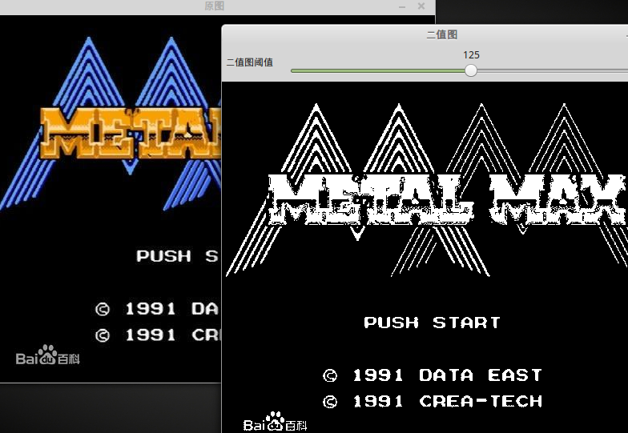
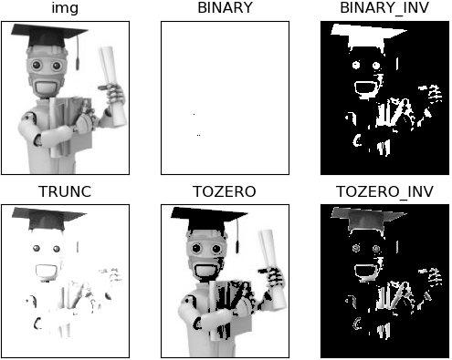
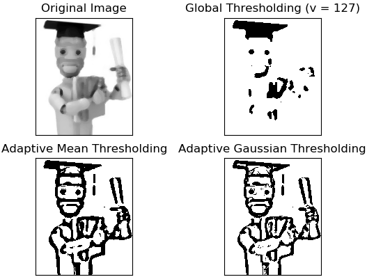

&emsp;&emsp;与边缘检测相比，轮廓检测有时能更好的反映图像的内容。而要对图像进行轮廓检测，则必须要先对图像进行二值化，图像的二值化就是将图像上的像素点的灰度值设置为`0`或`255`，这样将使整个图像呈现出明显的黑白效果。在数字图像处理中，二值图像占有非常重要的地位，图像的二值化使图像中数据量大为减少，从而能凸显出目标的轮廓。<!--more-->
&emsp;&emsp;对图像进行二值化的关键函数为`cvThreshold`，它采用`Canny`方法对图像进行边缘检测：

``` cpp
void cvThreshold (
    const CvArr *src, CvArr *dst, double threshold,
    double max_value, int threshold_type );
```

参数`src`表示输入图像，必须为单通道灰度图；参数`dst`表示输出的边缘图像，为单通道黑白图；参数`threshold`表示阈值；参数`max_value`表示最大值；参数`threshold_type`表示运算方法，在`OpenCV`的`imgproc\types_c.h`中可以找到运算方法的定义：

``` cpp
enum { /* Threshold types */
    CV_THRESH_BINARY     = 0, /* value = value > threshold ? max_value : 0     */
    CV_THRESH_BINARY_INV = 1, /* value = value > threshold ? 0 : max_value     */
    CV_THRESH_TRUNC      = 2, /* value = value > threshold ? threshold : value */
    CV_THRESH_TOZERO     = 3, /* value = value > threshold ? value : 0         */
    CV_THRESH_TOZERO_INV = 4, /* value = value > threshold ? 0 : value         */
    CV_THRESH_MASK       = 7,
    /* use Otsu algorithm to choose the optimal threshold value;
       combine the flag with one of the above CV_THRESH_* values */
    CV_THRESH_OTSU       = 8
};
```

代码如下：

``` cpp
#include <opencv2/opencv.hpp>

IplImage *g_pGrayImage = NULL;
IplImage *g_pBinaryImage = NULL;
const char *pstrWindowsBinaryTitle = "二值图";

void on_trackbar ( int pos ) {
    /* 转为二值图 */
    cvThreshold ( g_pGrayImage, g_pBinaryImage, pos, 255, CV_THRESH_BINARY );
    cvShowImage ( pstrWindowsBinaryTitle, g_pBinaryImage ); /* 显示二值图 */
}

int main ( int argc, char **argv ) {
    const char *pstrWindowsSrcTitle = "原图";
    const char *pstrWindowsToolBarName = "二值图阈值";

    IplImage *pSrcImage = cvLoadImage ( "zzjb.jpg", CV_LOAD_IMAGE_UNCHANGED ); /* 从文件中加载原图 */
    /* 转为灰度图 */
    g_pGrayImage = cvCreateImage ( cvGetSize ( pSrcImage ), IPL_DEPTH_8U, 1 );
    cvCvtColor ( pSrcImage, g_pGrayImage, CV_BGR2GRAY );
    g_pBinaryImage = cvCreateImage ( cvGetSize ( g_pGrayImage ), IPL_DEPTH_8U, 1 ); /* 创建二值图 */
    /* 显示原图 */
    cvNamedWindow ( pstrWindowsSrcTitle, CV_WINDOW_AUTOSIZE );
    cvShowImage ( pstrWindowsSrcTitle, pSrcImage );
    cvNamedWindow ( pstrWindowsBinaryTitle, CV_WINDOW_AUTOSIZE ); /* 创建二值图窗口 */
    /* 滑动条 */
    int nThreshold = 0;
    cvCreateTrackbar ( pstrWindowsToolBarName, pstrWindowsBinaryTitle, &nThreshold, 254, on_trackbar );
    on_trackbar ( 1 );
    cvWaitKey ( 0 );
    cvDestroyWindow ( pstrWindowsSrcTitle );
    cvDestroyWindow ( pstrWindowsBinaryTitle );
    cvReleaseImage ( &pSrcImage );
    cvReleaseImage ( &g_pGrayImage );
    cvReleaseImage ( &g_pBinaryImage );
    return 0;
}
```



`OpenCV`还有个`cvAdaptiveThreshold`函数，这个函数会使用`Otsu`算法(大律法或最大类间方差法)来计算出一个全局阈值，然后根据这个阈值进行二值化。

---

### cv2.threshold

&emsp;&emsp;`cv2.threshold`的作用是：当像素高于阈值时，给像素赋予新值，否则赋予另外一种颜色。

``` python
cv2.threshold(src, thresh, maxval, type[, dst]) -> retval,dst
```

示例如下：

``` python
import cv2
import matplotlib.pyplot as plt

img = cv2.imread('ml.png', 0)
ret, thresh1 = cv2.threshold(img, 1, 255, cv2.THRESH_BINARY)
ret, thresh2 = cv2.threshold(img, 127, 255, cv2.THRESH_BINARY_INV)
ret, thresh3 = cv2.threshold(img, 127, 255, cv2.THRESH_TRUNC)
ret, thresh4 = cv2.threshold(img, 127, 255, cv2.THRESH_TOZERO)
ret, thresh5 = cv2.threshold(img, 127, 255, cv2.THRESH_TOZERO_INV)

titles = ['img', 'BINARY', 'BINARY_INV', 'TRUNC', 'TOZERO', 'TOZERO_INV']
images = [img, thresh1, thresh2, thresh3, thresh4, thresh5]

for i in range(6):
    plt.subplot(2, 3, i + 1), plt.imshow(images[i], 'gray')
    plt.title(titles[i])
    plt.xticks([]), plt.yticks([])

plt.show()
```



---

### adaptiveThreshold

&emsp;&emsp;自适应阈值二值化函数根据图片一小块区域的值来计算对应区域的阈值，从而得到也许更为合适的图片：

``` python
dst = cv2.adaptiveThreshold(src, maxval, thresh_type, type, Block_Size, C)
```

- `src`：输入图，只能输入单通道图像，通常来说为灰度图。
- `dst`：输出图。
- `maxval`：当像素值超过了阈值(或者小于阈值，根据`type`来决定)，所赋予的值。
- `thresh_type`：阈值的计算方法，包含以下`2`种类型：

1. `cv2.ADAPTIVE_THRESH_MEAN_C`
2. `cv2.ADAPTIVE_THRESH_GAUSSIAN_C`

- `type`：二值化操作的类型，与固定阈值函数相同，包含以下`5`种类型：

1. `cv2.THRESH_BINARY`
2. `cv2.THRESH_BINARY_INV`
3. `cv2.THRESH_TRUNC`
4. `cv2.THRESH_TOZERO`
5. `cv2.THRESH_TOZERO_INV`

- `Block_Size`：图片中分块的大小。
- `C`：阈值计算方法中的常数项。

``` python
import cv2
from matplotlib import pyplot as plt

img = cv2.imread('ml.png', 0)
img = cv2.medianBlur(img, 5)
ret, th1 = cv2.threshold(img, 127, 255, cv2.THRESH_BINARY)
th2 = cv2.adaptiveThreshold(img, 255, cv2.ADAPTIVE_THRESH_MEAN_C, cv2.THRESH_BINARY, 11, 2)
th3 = cv2.adaptiveThreshold(img, 255, cv2.ADAPTIVE_THRESH_GAUSSIAN_C, cv2.THRESH_BINARY, 11, 2)
titles = ['Original Image', 'Global Thresholding (v = 127)',
          'Adaptive Mean Thresholding', 'Adaptive Gaussian Thresholding']
images = [img, th1, th2, th3]

for i in range(4):
    plt.subplot(2, 2, i + 1), plt.imshow(images[i], 'gray')
    plt.title(titles[i])
    plt.xticks([]), plt.yticks([])

plt.show()
```

