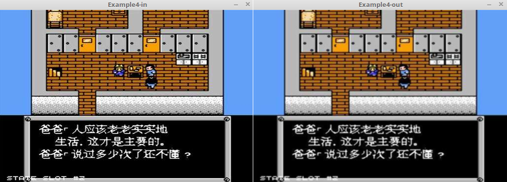

&emsp;&emsp;图像平滑(`image smoothing`)是为了弱化或消除图像中的细节、突变、边缘和噪声，也可以称为`模糊`。它主要用到了`cvSmooth`函数：<!--more-->

``` cpp
void cvSmooth (
    const CvArr *src, CvArr *dst, int smoothtype = CV_GAUSSIAN,
    int param1, int param2, double param3, double param4);
```

参数`src`是输入图像，`dst`是输出图像。`smoothtype`平滑方法有以下几种：

- `CV_BLUR_NO_SCALE`(简单非尺度变换的模糊)：对每个像素的`param1 * param2`邻域求和。如果邻域大小是变化的，可以事先利用函数`cvIntegral`计算积分图像。
- `CV_BLUR`(`simple blur`)：对每个像素`param1 * param2`邻域求和并做尺度变换`1 / (param1 * param2)`。
- `CV_GAUSSIAN`(`gaussian blur`)：对图像进行核大小为`param1 * param2`的高斯卷积。
- `CV_MEDIAN`(`median blur`)：对图像进行核大小为`param1 * param1`的中值滤波(邻域是方的)。
- `CV_BILATERAL`(双向滤波)：应用双向`3 * 3`滤波，彩色`sigma`为`param1`，空间`sigma`为`param2`。

&emsp;&emsp;`param1`是平滑操作的第一个参数；`param2`是平滑操作的第二个参数。对于简单非尺度变换的高斯模糊的情况，如果`param2`的值为零，则表示其被设定为`param1`。`param3`对应高斯参数的`Gaussian sigma`(标准差)，如果为零，则标准差由下面的核尺寸计算：

``` cpp
sigma = (n / 2 - 1) * 0.3 + 0.8
```

其中`n = param1`对应水平核，`n = param2`对应垂直核。
&emsp;&emsp;对小的卷积核(`3 * 3`至`7 * 7`)，使用如上公式所示的标准`sigma`速度会快。如果`param3`不为零，而`param1`和`param2`为零，则核大小由`sigma`计算(以保证足够精确的操作)。
&emsp;&emsp;函数`cvSmooth`可使用上面任何一种方法平滑图像，每一种方法都有自己的特点以及局限。

``` cpp
#include <opencv2/opencv.hpp>
#include <iostream>

using namespace std;
using namespace cv;

void smooth ( IplImage *image );

int main ( int argc, char **argv ) {
    IplImage *img = cvLoadImage ( argv[1] );
    smooth ( img );
}

/* 对图像做简单的平滑处理。方法是对传进来的图片每个像素点“3 * 3”区域做高斯平滑 */
void smooth ( IplImage *image ) {
    cvNamedWindow ( "Example4-in" ); /* 创建两个窗口 */
    cvNamedWindow ( "Example4-out" );
    cvShowImage ( "Example4-in", image );
    IplImage *out = cvCreateImage ( /* cvCreateImage创建图像结构空间 */
                        cvGetSize ( image ), /* 大小与传入的图像等大 */
                        IPL_DEPTH_8U,/* 像素点的数据类型 */
                        3 /* 当前图像3通道 */
                    );
    /* 参数分别为输入、输出、高斯、“3 * 3” */
    cvSmooth ( image, out, CV_GAUSSIAN, 3, 3 );
    cvShowImage ( "Example4-out", out );
    cvReleaseImage ( &image );
    cvReleaseImage ( &out );
    cvWaitKey ( 0 );
    cvDestroyWindow ( "Example4-in" );
    cvDestroyWindow ( "Example4-out" );
}
```

