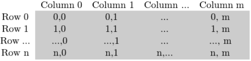
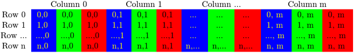
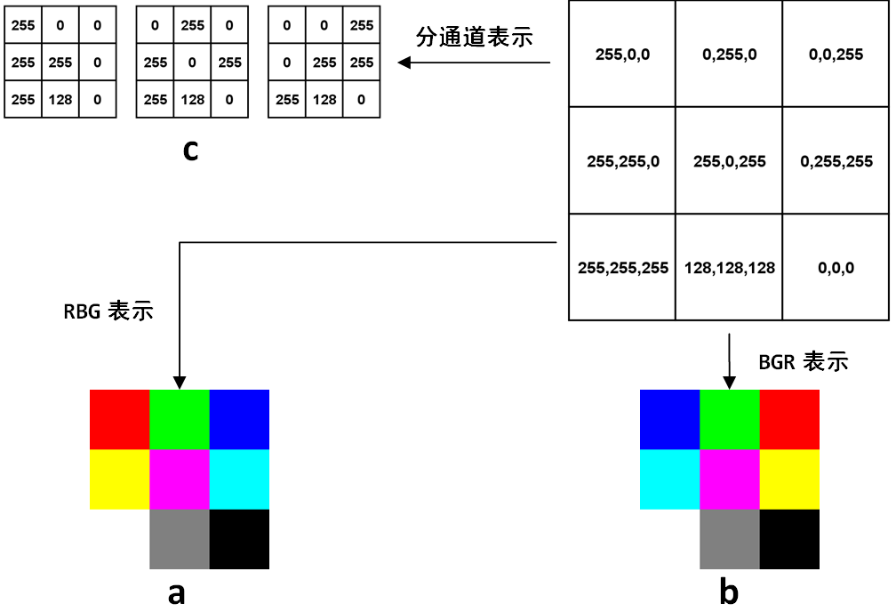

&emsp;&emsp;单通道的灰度图像在计算机中的表示，就是一个`8`位无符号整形的矩阵。在`OpenCV`的`C++`代码中，表示图像有个专门的结构叫做`cv::Mat`；在`Python OpenCV`中，因为已经有了`numpy`，所以这个矩阵就用`numpy`的`array`表示。<!--more-->
&emsp;&emsp;如果图像是一幅灰度图像，从左到右，从上到下，依次是矩阵的每一行每一列，这时候矩阵`M(i, j)`的值自然就是当前像素点的灰度值：



&emsp;&emsp;而对于一幅彩色图像，由于它的像素分量`channel`并不是一个，所以每一列又分为了几个`channel`。拿常见的`RGB`图像来说，就像这样：



&emsp;&emsp;例如矩阵的`img[i, j, k]`，`i`是高度(即行序号)，`j`是宽度(即列序号)；`k`是通道。下图是一幅`3 * 3`图像在计算机中表示的例子：



&emsp;&emsp;右上角的矩阵里每个元素都是一个`3`维数组，分别代表这个像素上的三个通道的值。最常见的`RGB`通道中，第一个元素就是红色`Red`的值，第二个元素是绿色`Green`的值，第三个元素是蓝色`Blue`，最终得到的图像如图`a`所示。然而在`OpenCV`中，默认的图像表示为`BGR`，得到的图像是图`b`。可以看到，前两行的颜色顺序都交换了，最后一行是三个通道等值的灰度图，所以没有影响。
&emsp;&emsp;至于`OpenCV`为什么不是`RGB`，这是历史遗留问题。在`OpenCV`刚开始研发的年代，`BGR`是相机设备厂商的主流表示方法。虽然后来`RGB`成了主流和默认，但是这个底层的顺序却保留下来了。事实上`Windows`下的最常见格式之一`bmp`，底层字节的存储顺序还是`BGR`。`OpenCV`的这个特殊之处还是需要注意的，比如在`Python`中，图像都是用`numpy`的`array`表示，但是同样的`array`在`OpenCV`中的显示效果和`matplotlib`中的显示效果就会不一样。

``` python
import numpy as np
import cv2
import matplotlib.pyplot as plt

img = np.array(  # 上图中的矩阵
    [[[255,   0,   0], [  0, 255,   0], [0,   0, 255]],
     [[255, 255,   0], [255,   0, 255], [0, 255, 255]],
     [[255, 255, 255], [128, 128, 128], [0,   0,   0]]],
    dtype=np.uint8
)

plt.imsave('img_pyplot.jpg', img)  # 用matplotlib存储
cv2.imwrite('img_cv2.jpg', img)  # 用OpenCV存储
```

不管是`RGB`还是`BGR`，都是`高度 * 宽度 * 通道数`的三维数组，即`H * W * C`的表达方式。而在深度学习中，因为要对不同通道应用卷积，所以用的是另一种方式`C * H * W`，就是把每个通道都单独表达成一个二维矩阵，如图`c`所示。