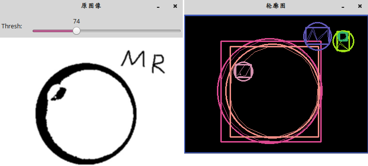
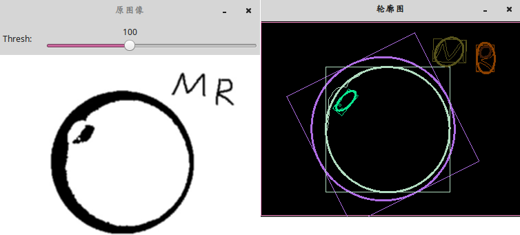
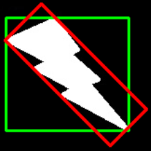
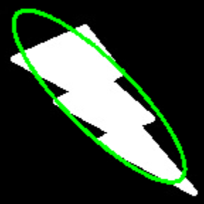

&emsp;&emsp;首先，轮廓的多边形逼近指的是：使用多边形来近似表示一个轮廓。其次，多边形逼近的目的是为了减少轮廓的顶点数目。但多边形逼近的结果依然是一个轮廓，只是这个轮廓相对要粗旷一些。<!--more-->
&emsp;&emsp;首先介绍一个逼近多边形的函数`approxPolyDP`：

``` cpp
void cv::approxPolyDP ( InputArray curve, OutputArray approxCurve, double epsilon, bool closed );
```

该函数的作用是用指定精度逼近多边形曲线。

- `curve`：输入的二维点集，可以是`vector`类型或`Mat`类型。
- `approxCurve`：多边形逼近的结果，其类型与输入的点集类型一致。
- `epsilon`：逼近的精度，为原始曲线和逼近曲线间的最大值。
- `closed`：如果为`true`，逼近的曲线为封闭曲线；如果为`false`，则逼近曲线不封闭。

### 使用矩形和最小圆包围图像

&emsp;&emsp;使用`boundingRect`函数计算包围轮廓的矩形框，使用`minEnclosingCircle`函数计算包围轮廓的最小圆包围。
&emsp;&emsp;`boundingRect`函数计算并返回点集最外面的矩形边界：

``` cpp
void cv::boundingRect ( InputArray points );
```

&emsp;&emsp;`minEnclosingCircle`利用迭代算法，对给定的二维点集寻找计算可包围点集的最小圆形，其定义如下：

``` cpp
void cv::minEnclosingCircle ( InputArray points, Point2f &center, float &radius );
```

- `points`：输入的二维点集，数据类型为`vector`或`Mat`类型。
- `center`：绘制圆的圆心坐标。
- `radius`：圆的半径。

``` cpp
#include <cv.h>
#include <highgui.h>

using namespace std;
using namespace cv;

Mat srcImage, grayImage;
int thresh = 100;
const int threshMaxValue = 255;
RNG rng ( 12345 );

void thresh_callback ( int, void * );

int main() {
    srcImage = imread ( "res.jpg" );

    if ( srcImage.empty() ) {
        cout << "图像加载失败!";
        return -1;
    } else {
        cout << "图像加载成功!" << endl << endl;
    }

    cvtColor ( srcImage, grayImage, COLOR_BGR2GRAY );
    blur ( grayImage, grayImage, Size ( 3, 3 ) );
    namedWindow ( "原图像", WINDOW_AUTOSIZE );
    imshow ( "原图像", grayImage );
    createTrackbar ( "Thresh:", "原图像", &thresh, threshMaxValue, thresh_callback );
    thresh_callback ( thresh, 0 );
    waitKey ( 0 );
    return 0;
}

void thresh_callback ( int, void * ) {
    Mat threshold_output;
    vector<vector<Point> > contours;
    vector<Vec4i> hierarchy;
    /* 图像二值化检测边缘 */
    threshold ( grayImage, threshold_output, thresh, 255, THRESH_BINARY );
    /* 寻找图像轮廓 */
    findContours ( threshold_output, contours, hierarchy, RETR_TREE, \
                   CHAIN_APPROX_SIMPLE, Point ( 0, 0 ) );
    /* 使用多边形逼近检测到的图像轮廓来寻找包围轮廓的矩形和最小圆 */
    vector<vector<Point> > contours_poly ( contours.size() );
    vector<Rect> boundRect ( contours.size() );
    vector<Point2f> center ( contours.size() );
    vector<float> radius ( contours.size() );

    for ( int i = 0; i < contours.size(); i++ ) {
        approxPolyDP ( Mat ( contours[i] ), contours_poly[i], 3, true );
        boundRect[i] = boundingRect ( Mat ( contours_poly[i] ) );
        minEnclosingCircle ( ( Mat ) contours_poly[i], center[i], radius[i] );
    }

    /* 绘制检测到的图像轮廓、矩形和最小包围圆 */
    Mat drawing = Mat::zeros ( threshold_output.size(), CV_8UC3 );

    for ( int i = 0; i < contours.size(); i++ ) {
        Scalar color = Scalar ( rng.uniform ( 0, 255 ), rng.uniform ( 0, 255 ), rng.uniform ( 0, 255 ) );
        drawContours ( drawing, contours_poly, i, color, 1, 8, vector<Vec4i>(), 0, Point() );
        /* Rect类中tl表示top_left即左上角的点，br表示bottom_right即右下方的点 */
        rectangle ( drawing, boundRect[i].tl(), boundRect[i].br(), color, 2, 8, 0 );
        circle ( drawing, center[i], ( int ) radius[i], color, 2, 8, 0 );
    }

    namedWindow ( "轮廓图", WINDOW_AUTOSIZE );
    imshow ( "轮廓图", drawing );
}
```



### 使用旋转的矩形和椭圆包围图像轮廓

&emsp;&emsp;`minAreaRect`对于输入的二维点集，计算包围点集的最小矩形：

``` cpp
void cv::minAreaRect ( InputArray points );
```

&emsp;&emsp;`fitEllipse`根据输入的二维点集使用椭圆拟合方法包围二维点集：

``` cpp
void cv::fitEllipse ( InputArray points );
```

示例代码如下：

``` cpp
#include <cv.h>
#include <highgui.h>

using namespace std;
using namespace cv;

Mat srcImage, grayImage;
int thresh = 100;
const int threshMaxValue = 255;
RNG rng ( 12345 );

void thresh_callback ( int, void * );

int main() {
    srcImage = imread ( "res.jpg" );

    if ( srcImage.empty() ) {
        cout << "图像加载失败!";
        return -1;
    } else {
        cout << "图像加载成功!" << endl << endl;
    }

    cvtColor ( srcImage, grayImage, COLOR_BGR2GRAY );
    blur ( grayImage, grayImage, Size ( 3, 3 ) );
    namedWindow ( "原图像", WINDOW_AUTOSIZE );
    imshow ( "原图像", grayImage );
    createTrackbar ( "Thresh:", "原图像", &thresh, threshMaxValue, thresh_callback );
    thresh_callback ( thresh, 0 );
    waitKey ( 0 );
    return 0;
}

void thresh_callback ( int, void * ) {
    Mat threshold_output;
    vector<vector<Point> > contours;
    vector<Vec4i> hierarchy;
    threshold ( grayImage, threshold_output, thresh, 255, THRESH_BINARY );
    findContours (
        threshold_output, contours, hierarchy,
        RETR_TREE, CHAIN_APPROX_SIMPLE, Point ( 0, 0 ) );
    vector<RotatedRect> minRect ( contours.size() );
    vector<RotatedRect> minEllipse ( contours.size() );

    /* 如果轮廓上的点大于5个，则用椭圆填充 */
    for ( int i = 0; i < contours.size(); i++ ) {
        minRect[i] = minAreaRect ( Mat ( contours[i] ) );

        if ( contours[i].size() > 5 ) {
            minEllipse[i] = fitEllipse ( Mat ( contours[i] ) );
        }
    }

    /*绘制检测到的图像轮廓、旋转矩形和椭圆 */
    Mat drawing = Mat::zeros ( threshold_output.size(), CV_8UC3 );

    for ( int i = 0; i < contours.size(); i++ ) {
        Scalar color = Scalar ( rng.uniform ( 0, 255 ), rng.uniform ( 0, 255 ), \
                                rng.uniform ( 0, 255 ) );
        drawContours ( drawing, contours, i, color, 1, 8, vector<Vec4i>(), 0, Point() );
        ellipse ( drawing, minEllipse[i], color, 2, 8 );
        /* 旋转矩形 */
        Point2f rect_points[4];
        minRect[i].points ( rect_points );

        for ( int j = 0; j < 4; j++ ) {
            line ( drawing, rect_points[j], rect_points[ ( j + 1 ) % 4], color, 1, 8 );
        }
    }

    namedWindow ( "轮廓图", WINDOW_AUTOSIZE );
    imshow ( "轮廓图", drawing );
}
```



---

### 边界矩形

&emsp;&emsp;有两类边界矩形，即直边界矩形和旋转的边界矩形。
&emsp;&emsp;**直边界矩形**：一个直矩形(就是没有旋转的矩形)，它不会考虑对象是否旋转，所以边界矩形的面积不是最小的。可以使用函数`cv2.boundingRect`查找得到。`(x, y)`为矩形左上角的坐标，`(w, h)`是矩形的宽和高：

``` python
x, y, w, h = cv2.boundingRect(cnt)
img = cv2.rectangle(img, (x, y), (x + w, y + h), (0, 255, 0), 2)
```

&emsp;&emsp;**旋转的边界矩形**：这个边界矩形是面积最小的，因为它考虑了对象的旋转，用到的函数为`cv2.minAreaRect`，返回的是一个`Box2D`结构，其中包含矩形左上角角点的坐标`(x, y)`，矩形的宽和高`(w, h)`，以及旋转角度。但是要绘制这个矩形需要矩形的`4`个角点，可以通过函数`cv2.boxPoints`获得：

``` python
rect = cv2.minAreaRect(cnt)  # 最小外接矩形
box = np.int0(cv2.boxPoints(rect))  # 矩形的四个角点取整
cv2.drawContours(img_color1, [box], 0, (255, 0, 0), 2)
```

其中`np.int0(x)`是把`x`取整的操作，比如`377.93`就会变成`377`，也可以用`x.astype(np.int)`。
&emsp;&emsp;把这两中边界矩形显示在下图中，其中绿色的为直矩形，红色的为旋转矩形：



### 最小外接圆

&emsp;&emsp;函数`cv2.minEnclosingCircle`可以帮我们找到一个对象的外切圆，它是所有能够包括对象的圆中面积最小的一个：

``` python
(x, y), radius = cv2.minEnclosingCircle(cnt)
center = (int(x), int(y))
radius = int(radius)
img = cv2.circle(img, center, radius, (0, 255, 0), 2)
```


### 椭圆拟合

&emsp;&emsp;使用的函数为`cv2.ellipse`，返回值其实就是旋转边界矩形的内切圆：

``` python
ellipse = cv2.fitEllipse(cnt)
im = cv2.ellipse(im, ellipse, (0, 255, 0), 2)
```

