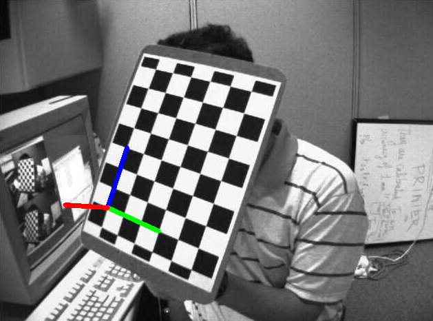
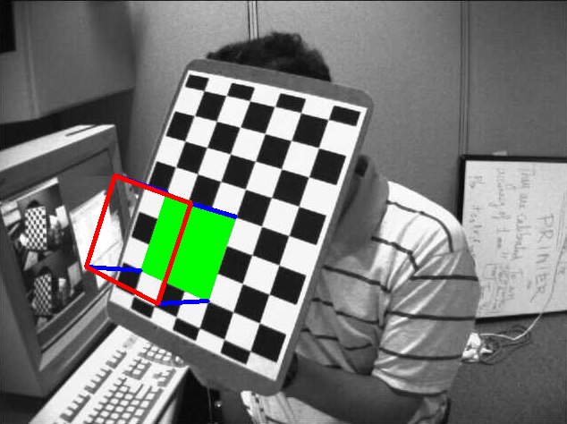

&emsp;&emsp;在摄像机标定实验中，我们已经得到了摄像机矩阵、畸变系数等。有了这些信息，我们就可以估计图像中图案的姿势，比如目标对象是如何摆放，如何旋转等。对一个平面对象来说，我们可以假设`Z = 0`，这样问题就转化成摄像机在空间中是如何摆放(然后拍摄)的。所以如果知道对象在空间中的姿势，我们就可以在图像中绘制一些`2D`的线条来产生`3D`的效果。<!--more-->
&emsp;&emsp;我们的问题是，在棋盘的第一个角点绘制`3D`坐标轴(`X`、`Y`和`Z`轴)，`X`轴为蓝色，`Y`轴为绿色，`Z`轴为红色。在视觉效果上来看，`Z`轴应该是垂直与棋盘平面的。
&emsp;&emsp;首先要加载前面结果中摄像机矩阵和畸变系数：

``` python
import cv2
import numpy as np
import glob

with np.load('B.npz') as X:  # Load previously saved data
    mtx, dist, _, _ = [X[i] for i in ('mtx', 'dist', 'rvecs', 'tvecs')]
```

&emsp;&emsp;现在创建一个函数`draw`，它的参数有棋盘上的角点(使用`cv2.findChessboardCorners`得到)和要绘制的`3D`坐标轴上的点：

``` python
def draw(img, corners, imgpts):
    corner = tuple(corners[0].ravel())
    img = cv2.line(img, corner, tuple(imgpts[0].ravel()), (255, 0, 0), 5)
    img = cv2.line(img, corner, tuple(imgpts[1].ravel()), (0, 255, 0), 5)
    img = cv2.line(img, corner, tuple(imgpts[2].ravel()), (0, 0, 255), 5)
    return img
```

&emsp;&emsp;和前面一样，我们要设置终止条件、对象点(棋盘上的`3D`角点)和坐标轴点。`3D`空间中的坐标轴点是为了绘制坐标轴，我们绘制的坐标轴的长度为`3`，所以`X`轴从`(0, 0, 0)`绘制到`(3, 0, 0)`，`Y`轴也是；`Z`轴从`(0, 0, 0)`绘制到`(0, 0, -3)`，负值表示它是朝着(垂直于)摄像机方向。

``` python
criteria = (cv2.TERM_CRITERIA_EPS + cv2.TERM_CRITERIA_MAX_ITER, 30, 0.001)
objp = np.zeros((6 * 7, 3), np.float32)
objp[:, :2] = np.mgrid[0:7, 0:6].T.reshape(-1, 2)
axis = np.float32([[3, 0, 0], [0, 3, 0], [0, 0, -3]]).reshape(-1, 3)
```

&emsp;&emsp;像通常一样，我们需要加载图像。搜寻`7 * 6`的格子，如果发现，我们就把它优化到亚像素级，然后使用函数`cv2.solvePnPRansac`来计算旋转和变换。但我们有了变换矩阵之后，就可以利用它们将这些坐标轴点映射到图像平面中去。简单来说，我们在图像平面上找到了与`3D`空间中的点`(3, 0, 0)`、`(0, 3, 0)`和`(0, 0, 3)`相对应的点，然后就可以使用函数`draw`从图像上的第一个角点开始绘制连接这些点的直线了：

``` python
for fname in glob.glob('left*.jpg'):
    img = cv2.imread(fname)
    gray = cv2.cvtColor(img, cv2.COLOR_BGR2GRAY)
    ret, corners = cv2.findChessboardCorners(gray, (7, 6), None)

    if ret == True:
        corners2 = cv2.cornerSubPix(gray, corners, (11, 11), (-1, -1), criteria)
        # Find the rotation and translation vectors.
        _, rvecs, tvecs, inliers = cv2.solvePnPRansac(objp, corners2, mtx, dist)
        # project 3D points to image plane
        imgpts, jac = cv2.projectPoints(axis, rvecs, tvecs, mtx, dist)
        img = draw(img, corners2, imgpts)
        cv2.imshow('img', img)
        k = cv2.waitKey(0) & 0xff

        if k == 's':
            cv2.imwrite(fname[:6] + '.png', img)

cv2.destroyAllWindows()
```

结果如下所示，每条坐标轴的长度都是`3`个格子的长度：



### 渲染一个立方体

&emsp;&emsp;如果你想绘制一个立方体，要对`draw`函数进行如下修改：

``` python
def draw(img, corners, imgpts):
    imgpts = np.int32(imgpts).reshape(-1, 2)
    # draw ground floor in green
    img = cv2.drawContours(img, [imgpts[:4]], -1, (0, 255, 0), -3)

    # draw pillars in blue color
    for i, j in zip(range(4), range(4, 8)):
        img = cv2.line(img, tuple(imgpts[i]), tuple(imgpts[j]), (255), 3)

    # draw top layer in red color
    img = cv2.drawContours(img, [imgpts[4:]], -1, (0, 0, 255), 3)
    return img
```

修改后的坐标轴点如下所示，它们是`3D`空间中的一个立方体的`8`个角点：

``` python
axis = np.float32(
    [[0, 0,  0], [0, 3,  0], [3, 3,  0], [3, 0,  0],
     [0, 0, -3], [0, 3, -3], [3, 3, -3], [3, 0, -3]])
```

