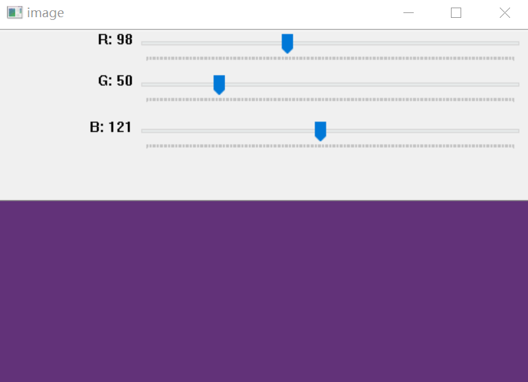

&emsp;&emsp;我们知道视频是由一系列图像构成的，这些构成视频的图像称为`帧`(`frame`)。此外，在视频文件里还有个参数叫做`帧率`(`frame rate`)，用来表示两帧之间的间隔时间，帧率的单位是`帧/秒`。这个参数只和视频的播放速度有关，对于单独的一帧图像来说没有任何用途。<!--more-->

``` cpp
#include <iostream>
#include <highgui.h>

using namespace std;
using namespace cv;

int main ( void ) {
    VideoCapture capture ( "mm4_op.avi" ); /* 打开视频文件 */

    if ( !capture.isOpened() ) { /* isOpened判断视频是否打开成功 */
        cout << "Movie open Error" << endl;
        return -1;
    }

    double rate = capture.get ( CV_CAP_PROP_FPS ); /* 获取视频帧频 */
    cout << "帧率为: " << rate << endl;
    cout << "总帧数为: " << capture.get ( CV_CAP_PROP_FRAME_COUNT ) << endl; /* 输出帧总数 */
    Mat frame;
    double position = 0.0;
    capture.set ( CV_CAP_PROP_POS_FRAMES, position ); /* 视频播放的位置，这里设置为第0帧 */

    while ( 1 ) {
        if ( !capture.read ( frame ) ) { /* 读取视频帧 */
            break;
        }

        imshow ( "Movie Player", frame );
        char c = waitKey ( 33 ); /* 获取按键值 */

        if ( c == 27 ) {
            break;
        }
    }

    capture.release();
    destroyWindow ( "Movie Player" );
    return 0;
}
```

&emsp;&emsp;1. 打开和读取视频流`VideoCapture`
&emsp;&emsp;视频捕获需要的所有函数都集成在`VideoCapture`这个类里面。虽然它底层依赖另一个`FFmpeg`开源库，但是它已经被集成在`opencv`里。既然`VideoCapture`是一个类，那么在使用时候，需要先定义一个`VideoCapture`类的对象来打开和读取视频流。有两种方法，一种如上述代码所示，另一种可通过`open`函数来完成：

``` cpp
VideoCapture capture;
capture.open ( "mm4_op.avi" );
```

从`OpenCV`源码中可以查看`VideoCapture`的定义，在它的构造函数中，如果使用整型数当参数的话，就可以将这个对象绑定到一个摄像机，将系统指派的`ID`号当作参数传入即可。例如可以传入`0`来打开第一个摄像机，传入`1`打开第二个摄像机，以此类推。如果使用字符串当做参数，就会打开由这个字符串(文件名)指定的视频文件。
&emsp;&emsp;2. 是否成功打开视频`isOpened`、视频关闭`release`以及视频解码`read`
&emsp;&emsp;`isOpened`的函数原型如下：

``` python
bool VideoCapture::isOpened();
```

当析构函数调用时，会自动关闭视频。如果希望提前关闭的话，可以调用`release`函数，例如`capture.release`。视频的每一帧都是一幅普通的图像，因此仅仅需要从`VideoCapture`对象里释放出每一帧图像，并保存成`Mat`格式。
&emsp;&emsp;`read`的函数原型如下：

``` cpp
bool VideoCapture::read ( Mat &image );
```

读取视频帧的时候也会自动进行解码操作，其实这个方法包含了`VideoCapture::grab`和`VideoCapture::retrieve`两个操作。`read`方法很方便，当获取不到视频帧时，就返回`false`。
&emsp;&emsp;3. 获取视频属性`get`和设置属性`set`
&emsp;&emsp;`get`函数返回特定的视频属性：

``` cpp
double VideoCapture::get ( int propId );
```

`get`函数返回一个`double`(`8`个字节)类型的数据来表示这些属性。然后你可以使用位操作符来操作这个返回值，从而得到想要的整型数据。这个函数有一个参数`propId`，代表着试图查询的属性`ID`。参数的值可以有很多种，这里只用到了两种，分别是`CV_CAP_PROP_FPS`和`CV_CAP_PROP_FRAME_COUNT`，它们分别表示要返回的值为帧速率和视频文件的总帧数。还有其他的数值可以查看`highgui_c.h`。当需要设置这些值的时候，可以调用`set`函数：

``` cpp
bool VideoCapture::set ( int propId, double value );
```

函数的第一个参数是需要设置的属性`ID`，第二个参数是需要设定的值，如果返回`true`，就表示成功设定，否则就是`false`。代码使用`set`函数设置了视频播放的位置，其实不用设置也可以，`opencv`会默认从开始`0`位置开始执行。
&emsp;&emsp;再看下面的代码：

``` cpp
char c = waitKey ( 33 );

if ( c == 27 ) {
    break;
}
```

这是当帧被显示后，系统会等待`33`毫秒，如果用户这时候触发了一个按键，`c`就会被设置成这个按键的`ASCII`码，否则`c`会被设置成`-1`；如果触发了`ESC`键(`ASCII`码为`27`)，则退出循环。
&emsp;&emsp;下面讲解如何在`OpenCV`中用`createTrackbar`函数创建和使用轨迹条，以视频进度的调整。

``` cpp
#include <iostream>
#include <highgui.h>
#include <opencv2/highgui/highgui.hpp>
#include <opencv2/imgproc/imgproc.hpp>

using namespace std;
using namespace cv;

void onTrackbarSlide ( int pos, void *capture ) { /* 进度条控制 */
    ( * ( ( VideoCapture * ) capture ) ).set ( CV_CAP_PROP_POS_FRAMES, pos );
}

int main ( void ) {
    VideoCapture capture ( "mm4_op.avi" ); /* 打开视频文件 */

    if ( !capture.isOpened() ) {
        cout << "Movie open Error" << endl;
        return -1;
    }

    double rate = capture.get ( CV_CAP_PROP_FPS ); /* 获取视频帧频 */
    cout << "帧率为:" << " " << rate << endl;
    int total_rate = capture.get ( CV_CAP_PROP_FRAME_COUNT ); /* 获取总帧数 */
    cout << "总帧数为:" << " " << total_rate << endl; /* 输出帧总数 */
    Mat frame;
    namedWindow ( "Movie Player" );
    int slider_position = 0;

    if ( total_rate != 0 ) { /* 创建进度条 */
        createTrackbar (
            "position", "Movie Player", &slider_position,
            total_rate, onTrackbarSlide, &capture );
    }

    while ( 1 ) {
        if ( !capture.read ( frame ) ) { /* 读取视频帧 */
            break;
        }

        imshow ( "Movie Player", frame );
        char c = waitKey ( 33 ); /* 获取按键值 */

        if ( c == 27 ) {
            break;
        }
    }

    capture.release();
    destroyWindow ( "Movie Player" );
    return 0;
}
```

新界面比原来的增加了一个进度条，通过进度条可以调节播放的的进度。先看看`createTrackbar`函数：

``` cpp
int createTrackbar (
    const string &trackbarname, const string &winname, int *value,
    int count, TrackbarCallback onChange = 0, void *userdata = 0 );
```

- `trackbarname`：进度条的名字，用来代表创建的轨迹条。
- `winname`：窗口的名字，表示这个进度条会依附到哪个窗口上，即对应`namedWindow`创建窗口时填的那个窗口名，滑动条不会遮挡图像。
- `value`：滑块的位置，在创建时滑块的初始位置就是该变量当前的值，当滑动条被拖动时，`OpenCV`会自动将进度条当前位置所代表的值传给指针指向的整数。
- `count`：滑块可以达到的最大位置的值，注意滑块最小的位置的值始终为`0`。
- `onChange`是一个指向回调函数的指针，每次滑块位置改变时，这个函数都会进行回调，并且这个函数的原型必须为`void XXXX(int, void*);`，其中第一个参数是轨迹条的位置，第二个参数是用户数据(看下面的参数)，如果回调是`NULL`指针，表示没有回调函数的调用，仅第三个参数`value`有变化。
- `userdata`是用户传给回调函数的数据，用来处理进度条事件，上述代码就是使用该参数传递一个`VideoCapture`变量，以至于进度条能控制视频帧。

&emsp;&emsp;`createTrackbar`函数为我们创建一个具有特定名称和范围的进度条，并且指定一个和进度条位置同步的变量，而且要指定回调函数`onChange`，在轨迹条位置改变的时候来调用这个回调函数。可能有些朋友看完上述解释还是有点模糊，还是搞不懂进度条怎么和视频联系到一块呢？首先是进度条通过窗口的名字(第二个参数)绑定到了指定的窗口上，再通过一个整形变量(第三个参数)记录进度条所滑动到达的位置。当进度条滑动时候，会触发回调函数(第五个参数)，而第六个参数是正是回调函数的一个参数。回调函数`onTrackbarSlide(int pos,void* capture)`的作用就是当进度条被触发时候，设置读取视频帧的位置。
&emsp;&emsp;但是当移动进度条时，该进度条总是定位不准，比如想滑动进度条到`500`帧，结果很难滑到该帧处的，会出现跳跃的现象。我用的是`opencv 2.0`版本，同样的代码在`opencv 1.0`里完全没错，可是这是为什么？原因在于`opencv 2.0`以后采用`ffmpeg`采集视频，而`opencv 1.0`采用`vfw`采集视频。当`opencv`在定位时，调用了`ffmpeg`的`av_seek_frame`函数：

``` cpp
int av_seek_frame ( AVFormatContext *s, int stream_index, int64_t timestamp, int flags );
```

参数`flags`有如下选项：

``` cpp
AVSEEK_FLAG_BACKWARD = 1;
AVSEEK_FLAG_BYTE = 2;
AVSEEK_FLAG_ANY = 4;
```

`ffmpeg`默认的是选取关键帧(这个概念需要具体定义)，`opencv`里面这个函数的参数`flags`是`0`：

``` cpp
int ret = av_seek_frame ( ic, video_stream, timestamp, 0 );
```

也就是按照默认的读取关键帧，因此视频跳跃就出现了。解决这个问题方法是将`0`改为`AVSEEK_FLAG_ANY`：

``` cpp
int ret = av_seek_frame ( ic, video_stream, timestamp, AVSEEK_FLAG_ANY );
```

之后重新编译`opencv`库，就可以了。
&emsp;&emsp;还有几个函数也是经常用到的，例如获取当前进度条的位置`getTrackbarPos`函数，以及设置当前进度条的位置`setTrackbarPos`函数等，这些函数都定义在`opencv2/highgui/highgui.hpp`文件中。

---

&emsp;&emsp;`python`播放视频代码如下：

``` python
import cv2

cap = cv2.VideoCapture('mm4_op.avi')

while (cap.isOpened()):
    ret, frame = cap.read()
    cv2.imshow('frame', frame)

    if cv2.waitKey(1) & 0xFF == ord('q'):
        break

cap.release()
cv2.destroyAllWindows()
```

`cap.read`函数返回一个二元组，元组的第一个值是`ret`，表明是否成功从缓冲中读取了`frame`；元组的第二个值`frame`就是视频本身。

---

### 滑动条的使用

&emsp;&emsp;首先需要创建一个滑动条，例如`cv2.createTrackbar('R', 'image', 0, 255, call_back)`，其中参数`R`是滑动条的名称，`image`是所在窗口的名称，`0`是当前的值，`255`是最大值，`call_back`是回调函数名称，回调函数默认有一个表示当前值的参数。
&emsp;&emsp;创建好之后，可以在回调函数中获取滑动条的值，也可以用`cv2.getTrackbarPos`得到，其中`参数一`是滑动条的名称，`参数二`是窗口的名称。下面实现一个`RGB`的调色板：

``` python
import cv2
import numpy as np

def nothing(x):  # 回调函数，“x”表示滑块的位置，本例暂不使用
    pass

img = np.zeros((300, 512, 3), np.uint8)
cv2.namedWindow('image')

# 创建RGB三个滑动条
cv2.createTrackbar('R', 'image', 0, 255, nothing)
cv2.createTrackbar('G', 'image', 0, 255, nothing)
cv2.createTrackbar('B', 'image', 0, 255, nothing)

while (True):
    cv2.imshow('image', img)

    if cv2.waitKey(1) == 27:
        break

    # 获取滑块的值
    r = cv2.getTrackbarPos('R', 'image')
    g = cv2.getTrackbarPos('G', 'image')
    b = cv2.getTrackbarPos('B', 'image')
    img[:] = [b, g, r]  # 设定img的颜色
```

