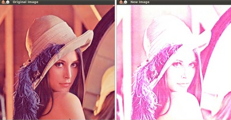

### 图像处理

&emsp;&emsp;一般来说，图像处理算子是带有一幅或多幅输入图像，并产生一幅输出图像的函数。图像变换可分为以下两种：<!--more-->

- 点算子(像素变换)。
- 邻域(基于区域的)算子。

### 像素变换

&emsp;&emsp;在这一类图像处理变换中，仅仅根据输入像素值(有时可加上某些全局信息或参数)计算相应的输出像素值。这类算子包括亮度和对比度调整，以及颜色校正和变换。

### 亮度和对比度调整

&emsp;&emsp;两种常用的点过程(即点算子)，是用常数对点进行乘法和加法运算：

``` python
g(x) = a * f(x) + b
```

两个参数`a`(`a > 0`)和`b`一般称作`增益`和`偏置参数`，我们往往用这两个参数来分别控制对比度和亮度。你可以把`f(x)`看成源图像像素，把`g(x)`看成输出图像像素。这样一来，上面的式子就能写得更清楚一些：

``` python
g(i, j) = a * f(i, j) + b
```

其中`i`和`j`表示像素位于第`i`行和第`j`列。下面的代码执行运算`g(i, j) = a * f(i, j) + b`：

``` cpp
#include <opencv2/core/core.hpp>
#include <opencv2/highgui/highgui.hpp>
#include <iostream>

using namespace std;
using namespace cv;

double alpha; /* 控制对比度 */
int beta; /* 控制亮度 */

int main ( int argc, char **argv ) {
    Mat image = imread ( argv[1] ); /* 读入用户提供的图像 */
    Mat new_image = Mat::zeros ( image.size(), image.type() );
    /* 初始化 */
    cout << " Basic Linear Transforms " << endl;
    cout << "-------------------------" << endl;
    cout << "* Enter the alpha value [1.0-3.0]: ";
    cin >> alpha;
    cout << "* Enter the beta value [0-100]: ";
    cin >> beta;

    /* 执行运算“new_image(i,j) = alpha * image(i,j) + beta” */
    for ( int y = 0; y < image.rows; y++ ) {
        for ( int x = 0; x < image.cols; x++ ) {
            for ( int c = 0; c < 3; c++ ) {
                new_image.at<Vec3b> ( y, x ) [c] = \
                    saturate_cast<uchar> ( alpha * ( image.at<Vec3b> ( y, x ) [c] ) + beta );
            }
        }
    }

    /* 创建窗口 */
    namedWindow ( "Original Image", 1 );
    namedWindow ( "New Image", 1 );
    /* 显示图像 */
    imshow ( "Original Image", image );
    imshow ( "New Image", new_image );
    waitKey(); /* 等待用户按键 */
    return 0;
}
```

建立两个变量，用于存储用户输入的`a`和`b`：

``` cpp
double alpha;
int beta;
```

然后用`imread`载入图像，并将其存入一个`Mat`对象：

``` cpp
Mat image = imread ( argv[1] );
```

因为要对图像进行一些变换，所以需要一个新的`Mat`对象存储变换后的图像。我们希望这个`Mat`对象拥有下面的性质：

- 像素值初始化为`0`。
- 与原图像有相同的大小和类型。

``` cpp
Mat new_image = Mat::zeros ( image.size(), image.type() );
```

`Mat::zeros`采用`Matlab`风格的初始化方式，用`image.size`和`image.type`来对`Mat`对象进行`0`初始化。
&emsp;&emsp;为了执行运算`g(i, j) = a * f(i, j) + b`，我们要访问图像的每一个像素。因为是对`RGB`图像进行运算，每个像素有三个值(`R`、`G`、`B`)，所以要分别访问它们。下面是访问像素的代码片段：

``` cpp
for ( int y = 0; y < image.rows; y++ ) {
    for ( int x = 0; x < image.cols; x++ ) {
        for ( int c = 0; c < 3; c++ ) {
            new_image.at<Vec3b> ( y, x ) [c] = \
                saturate_cast<uchar> ( alpha * ( image.at<Vec3b> ( y, x ) [c] ) + beta );
        }
    }
}
```

注意以下两点：

- 为了访问图像的每一个像素，我们使用语法`image.at<Vec3b>(y, x)[c]`，其中`y`是像素所在的行，`x`是像素所在的列，`c`是`R`、`G`、`B`(`0`、`1`、`2`)之一。
- 因为`g(i, j) = a * f(i, j) + b`的运算结果可能超出像素取值范围，还可能是非整数(如果`a`是浮点数的话)，所以要用`saturate_cast`对结果进行转换，以确保它为有效值。

&emsp;&emsp;我们可以不用`for`循环来访问每个像素，而是直接采用下面这个命令：

``` CPP
image.convertTo ( new_image, -1, alpha, beta );
```

这里的`convertTo`将执行我们想做的`new_image = alpha * image + beta`。
&emsp;&emsp;运行代码，取参数`a = 2.2`和`b = 50`：

``` cpp
$ ./BasicLinearTransforms lena.jpg
Basic Linear Transforms
-------------------------
* Enter the alpha value [1.0-3.0]: 2.2
* Enter the beta value [0-100]: 50
```

