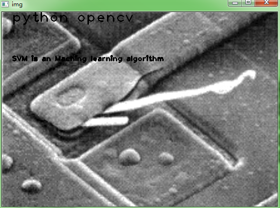
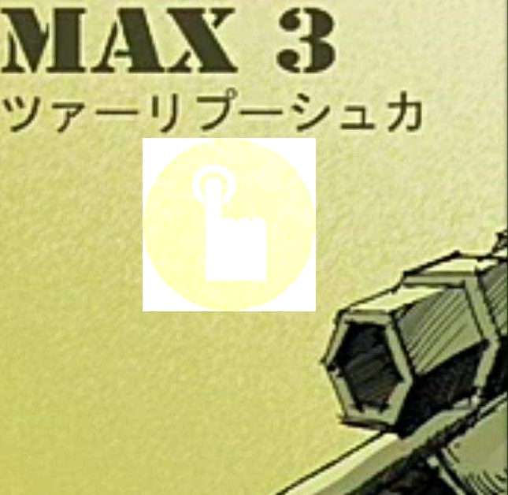
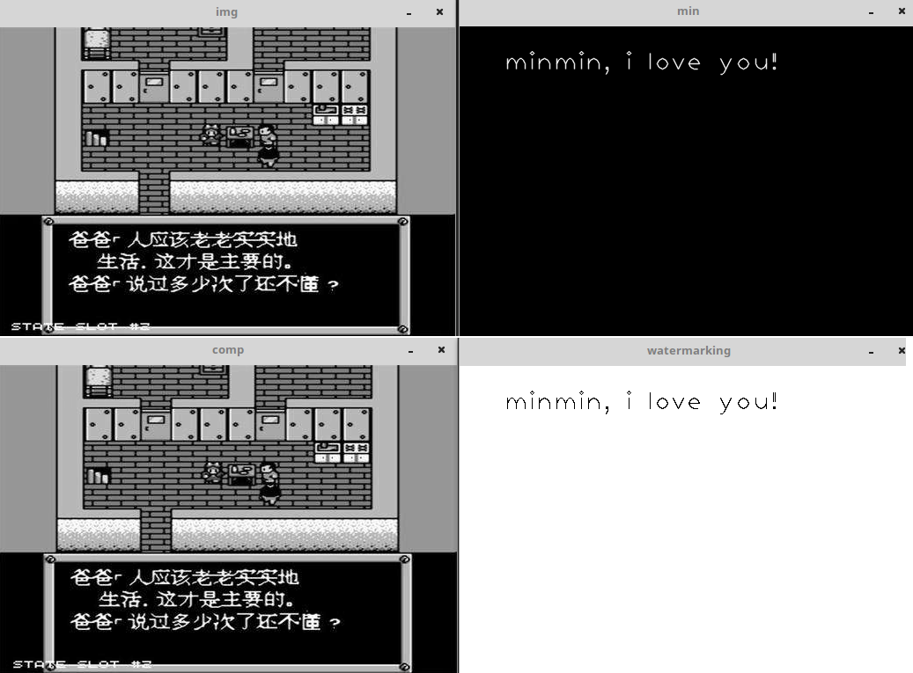

&emsp;&emsp;添加文字水印：<!--more-->

``` python
import cv2

fn = "jcdl.jpg"

if __name__ == '__main__':
    img = cv2.imread(fn)
    # add watermark to photo
    cv2.putText(img, "python opencv", (20, 20), cv2.FONT_HERSHEY_PLAIN, \
                2.0, (0, 0, 0), thickness=2)
    cv2.putText(img, "SVM is an Maching learning algorithm", \
                (20, 100), cv2.FONT_HERSHEY_PLAIN, 1.0, (0, 0, 0), thickness=2)
    cv2.imshow('img', img)
    cv2.waitKey()
    cv2.destroyAllWindows()
```



&emsp;&emsp;`cv2.putText`函数原型如下：

``` python
cv2.putText(img, text, org, fontFace, fontScale, color [, thickness [, lineType [, bottomLeftOrigin]]])
```

- `img`：Image.
- `text`：Text string to be drawn.
- `org`：`Bottom-left` corner of the text string in the image.
- `font`：`CvFont` structure initialized using `InitFont()`.
- `fontFace`：Font type. You can choose one of them:

1. `FONT_HERSHEY_SIMPLEX`
2. `FONT_HERSHEY_PLAIN`
3. `FONT_HERSHEY_DUPLEX`
4. `FONT_HERSHEY_COMPLEX`
5. `FONT_HERSHEY_TRIPLEX`
6. `FONT_HERSHEY_COMPLEX_SMALL`
7. `FONT_HERSHEY_SCRIPT_SIMPLEX`
8. `FONT_HERSHEY_SCRIPT_COMPLEX`

where each of the font `ID's` can be combined with `FONT_HERSHEY_ITALIC` to get the slanted letters.

- `fontScale`：Font scale factor that is multiplied by the `font-specific` base size.
- `color`：Text color.
- `thickness`：Thickness of the lines used to draw a text.
- `lineType`：Line type.
- `bottomLeftOrigin`：When `true`, the image data origin is at the `bottom-left` corner. Otherwise, it is at the `top-left` corner.

&emsp;&emsp;添加图片水印：

``` cpp
#include <opencv2/opencv.hpp>
#include <iostream>

using namespace cv;

int main () {
    Mat image = imread ( "timg.jpg" );
    Mat logo = imread ( "logo.jpg" );
    Mat ROIimage = image ( cv::Rect ( 385, 270, logo.cols, logo.rows ) );
    addWeighted ( ROIimage, 1.0, logo, 0.7, 0, ROIimage );
    namedWindow ( "logo" );
    imshow ( "logo", image );
    waitKey ( 0 );
    return 0;
}
```



&emsp;&emsp;简单的不可见水印如下：

``` cpp
#include <cv.h>
#include <highgui.h>

void kcvWatermarking ( IplImage *img, IplImage *mask ) {
    int w = img->width;
    int h = img->height;
    /* 确保mask中只有黑白两种灰度值 */
    cvThreshold ( mask, mask, 128, 255, CV_THRESH_BINARY );

    for ( int i = 0; i < h; ++i ) {
        for ( int j = 0; j < w; ++j ) {
            if ( CV_IMAGE_ELEM ( mask, uchar, i, j ) ) {
                CV_IMAGE_ELEM ( img, uchar, i, j ) |= 0x1;
            } else {
                CV_IMAGE_ELEM ( img, uchar, i, j ) &= 0xfe;
            }
        }
    }
}

void kcvGetWatermarking ( IplImage *img, IplImage *dst ) {
    int w = img->width;
    int h = img->height;

    for ( int i = 0; i < h; ++i ) {
        for ( int j = 0; j < w; ++j ) {
            if ( CV_IMAGE_ELEM ( img, uchar, i, j ) & 0x1 ) {
                CV_IMAGE_ELEM ( dst, uchar, i, j ) = 0;
            } else {
                CV_IMAGE_ELEM ( dst, uchar, i, j ) = 255;
            }
        }
    }
}

int main ( int argc, char **argv ) {
    IplImage *img = cvLoadImage ( "timg1.jpg", 0 );
    IplImage *mask = cvCreateImage ( cvGetSize ( img ), 8, 1 );
    IplImage *dst = cvCreateImage ( cvGetSize ( img ), 8, 1 );

    cvSetZero ( mask );
    CvFont font = cvFont ( 2 );
    char text[] = "minmin, i love you!";
    cvPutText ( mask, text, cvPoint ( 50, 50 ), &font, CV_RGB ( 255, 255, 255 ) );
    cvNamedWindow ( "img" );
    cvNamedWindow ( "min" );
    cvShowImage ( "img", img );
    cvShowImage ( "min", mask );
    /* 执行水印 */
    kcvWatermarking ( img, mask );
    cvNamedWindow ( "comp" );
    cvShowImage ( "comp", img );
    /* 获得水印 */
    kcvGetWatermarking ( img, dst );
    cvNamedWindow ( "watermarking" );
    cvShowImage ( "watermarking", dst );
    cvWaitKey ( 0 );
    cvDestroyAllWindows();
    cvReleaseImage ( &img );
    cvReleaseImage ( &mask );
    cvReleaseImage ( &dst );
    return 0;
}
```



&emsp;&emsp;**补充说明**：在添加图片水印时，如果两个图片的尺寸接近，有可能会运行错误。