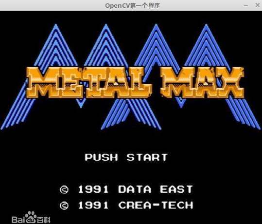

&emsp;&emsp;下面是最简单的`OpenCV`示例，功能为加载图像文件并显示出来：<!--more-->

``` cpp
#include <opencv2/opencv.hpp>

using namespace std;

int main() {
    const char *pstrImageName = "zzjb.jpg";
    const char *pstrWindowsTitle = "OpenCV第一个程序";
    /* 从文件中读取图像 */
    IplImage *pImage = cvLoadImage ( pstrImageName, CV_LOAD_IMAGE_UNCHANGED );
    cvNamedWindow ( pstrWindowsTitle, CV_WINDOW_AUTOSIZE ); /* 创建窗口 */
    cvShowImage ( pstrWindowsTitle, pImage ); /* 在指定窗口中显示图像 */
    cvWaitKey(); /* 等待按键事件 */
    cvDestroyWindow ( pstrWindowsTitle );
    cvReleaseImage ( &pImage );
    return 0;
}
```

对该文件进行编译：

``` bash
g++ opencv_test.cpp -o opencv_test `pkg-config --libs --cflags opencv`
```



&emsp;&emsp;`cvNamedWindow`的功能为创建窗口：

``` cpp
int cvNamedWindow ( const char *name, int flags = CV_WINDOW_AUTOSIZE );
```

参数`name`表示窗口的名字，即窗口标题。被创建的窗口可以通过它们的名字被引用。参数`flags`表示窗口属性标志，目前唯一支持的标志是`CV_WINDOW_AUTOSIZE`。当这个标志被设置后，用户不能手动改变窗口大小，窗口大小会自动调整以适合被显示图像。注意，如果已经存在这个名字的窗口，这个函数将不做任何事情。
&emsp;&emsp;`cvShowImage`的功能为在指定窗口中显示图像：

``` cpp
void cvShowImage ( const char *name, const CvArr *image );
```

参数`name`为窗口的名字，`image`为被显示的图像。
&emsp;&emsp;`cvWaitKey`的功能为等待按键事件：

``` cpp
int cvWaitKey ( int delay = 0 );
```

参数`delay`为延迟的毫秒数，当`delay`小于或等于`0`时表示无限等待。如果超过指定时间，则返回`-1`，否则返回被按键的值。

---

### cvLoadImage和cvSaveImage

#### cvLoadImage

&emsp;&emsp;函数原型如下：

``` cpp
IplImage *cvLoadImage ( const char *filename, int flags = CV_LOAD_IMAGE_COLOR );
```

参数`filename`是要被读入的文件的文件名，`flags`是指定读入图像的颜色和深度。
&emsp;&emsp;指定的颜色可以将输入的图片转为`3`信道(`CV_LOAD_IMAGE_COLOR`)、单信道(`CV_LOAD_IMAGE_GRAYSCALE`)或者保持不变(`CV_LOAD_IMAGE_UNCHANGED`)。

#### cvSaveImage

&emsp;&emsp;函数原型如下：

``` cpp
int cvSaveImage ( const char *filename, const CvArr *image );
```

参数`filename`是文件名，`image`是要保存的图像。
&emsp;&emsp;函数`cvSaveImage`保存图像到指定文件，图像格式的的选择依赖于`filename`的扩展名。特别提醒，由于`TIFF`文件格式比较混乱，此函数读取`TIFF`图片可能会失败。
&emsp;&emsp;`cvLoadImage`使用方法如下：

``` python
cvLoadImage ( filename, -1 ); /* 默认读取图像的原通道数   */
cvLoadImage ( filename,  0 ); /* 强制转化读取图像为灰度图 */
cvLoadImage ( filename,  1 ); /* 读取彩色图              */
```


---

### cvSetImageROI函数

&emsp;&emsp;有时候我们需要从一幅图像中获取感兴趣的区域(`region of interesting`，`ROI`)，将该区域裁剪成小图像，作为后期处理的输入。利用`cvSetImageROI`函数便可以轻松搞定：

``` cpp
void cvSetImageROI ( IplImage *image，CvRect rect );
```

参数`image`是待处理图像，`rect`是`ROI`矩形。

``` cpp
cvSetImageROI ( image, cvRect ( 100, 100, 356, 156 ) );
```

`(100, 100)`表示`ROI`区域的左上角坐标，`(356, 156)`分别表示`ROI`区域的长宽。
&emsp;&emsp;执行`cvSetImageROI`之后，显示`image`图像是只显示`ROI`标识的一部分，即改变了指针`image`，但是它仍然保留有原来图像的信息。在执行如下代码之后，`image`指向原来的图像信息：

``` cpp
cvResetImageROI ( image );
```

&emsp;&emsp;**补充说明**：`opencv 3`不需要`cvSetImageROI`来选择`ROI`，可以通过`Mat`的区域来实现这一功能。