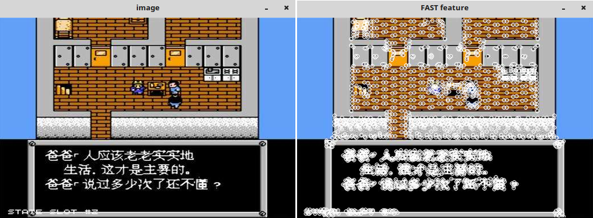

&emsp;&emsp;`OpenCV`提供`FeatureDetector`实现特征检测及匹配：<!--more-->

``` cpp
class CV_EXPORTS FeatureDetector {
public:
    virtual ~FeatureDetector();

    void detect (
        const Mat &image,
        vector<KeyPoint> &keypoints,
        const Mat &mask = Mat()
    ) const;

    void detect (
        const vector<Mat> &images,
        vector<vector<KeyPoint> > &keypoints,
        const vector<Mat> &masks = vector<Mat>()
    ) const;

    virtual void read ( const FileNode & );
    virtual void write ( FileStorage & ) const;
    static Ptr<FeatureDetector> create ( const string &detectorType );

protected:
    ...
};
```

`FeatureDetetor`是虚类，通过定义`FeatureDetector`的对象可以使用多种特征检测方法，通过`create`函数调用：

``` cpp
Ptr<FeatureDetector> FeatureDetector::create ( const string &detectorType );
```

`OpenCV 2.4.3`提供了`10`种特征检测方法：

方法         | 说明
-------------|------
`FAST`       | `FastFeatureDetector`
`STAR`       | `StarFeatureDetector`
`SIFT`       | `SIFT (nonfree module)`
`SURF`       | `SURF (nonfree module)`
`ORB`        | `ORB`
`MSER`       | `MSER`
`GFTT`       | `GoodFeaturesToTrackDetector`
`HARRIS`     | `GoodFeaturesToTrackDetector` with `Harris` detector enabled
`Dense`      | `DenseFeatureDetector`
`SimpleBlob` | `SimpleBlobDetector`

图片中的特征大体可分为三种：点特征、线特征、块特征。`FAST`算法是`Rosten`提出的一种快速提取的点特征，`Harris`与`GFTT`也是点特征，更具体来说是角点特征。`SimpleBlob`是简单块特征，可以通过设置`SimpleBlobDetector`的参数决定提取图像块的主要性质，提供`5`种：颜色`By color`、面积`By area`、圆形度`By circularity`、最大`inertia`与最小`inertia`的比例`By ratio of the minimum inertia to maximum inertia`以及凸性`By convexity`。
&emsp;&emsp;最常用的当属`SIFT`以及后来发展起来的`SURF`，都可以看做较为复杂的块特征。这两个算法在`OpenCV`的`nonfree`的模块里面，需要在附件引用项中添加`opencv_nonfree243.lib`，同时在代码中加入：

``` cpp
initModule_nonfree();
```

### FastFeatureDetector

&emsp;&emsp;代码如下：

``` cpp
#include <opencv2/core/core.hpp>
#include <opencv2/features2d/features2d.hpp>
#include <opencv2/highgui/highgui.hpp>
#include <vector>

using namespace cv;

int main() {
    Mat image;
    image = imread ( "timg1.jpg" );
    imshow ( "image", image );
    std::vector<KeyPoint> keyPoints; /* vector of keyPoints */
    /* construction of the fast feature detector object */
    FastFeatureDetector fast ( 40 ); /* 检测的阈值为40 */
    fast.detect ( image, keyPoints ); /* feature point detection */
    drawKeypoints ( image, keyPoints, image, Scalar::all ( 255 ), DrawMatchesFlags::DRAW_OVER_OUTIMG );
    imshow ( "FAST feature", image );
    cvWaitKey ( 0 );
    return 0;
}
```

