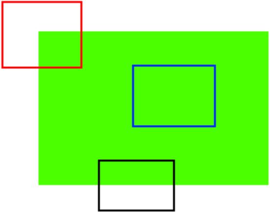

&emsp;&emsp;我相信你们大多数人都玩过拼图游戏吧。首先你们拿到一张图片的一堆碎片，要做的就是把这些碎片以正确的方式排列起来从而重建这幅图像。问题是，你怎样做到的呢？如果把你做游戏的原理写成计算机程序，那计算机就也会玩拼图游戏了。如果计算机可以玩拼图，我们就可以给计算机一大堆自然图片，然后就可以让计算机把它拼成一张大图了。如果计算机可以自动拼接自然图片，那我们是不是可以给计算机关于一个建筑的的大量图片，然后让计算机给我们创建一个`3D`的模型呢？<!--more-->
&emsp;&emsp;问题和联想可以无边无际。但是所有的这些问题都是建立在一个基础问题之上的。这个问题就是：我们是如何玩拼图的？我们是如何把一堆碎片拼在一起的？我们有时如何把一个个自然场景拼接成一个单独图像的？
&emsp;&emsp;答案就是：我们要寻找一些唯一的特征，这些特征要适于被跟踪，容易被比较。如果我们要定义这样一种特征，虽然知道它是什么，但很难用语言来描述。如果让你找出一个可以在不同图片之间相互比较的好的特征，你肯定能搞定。这就是为什么小孩子也会玩拼图的原因。我们在一副图像中搜索这样的特征，我们能找到它们，而且也能在其他图像中找到这些特征，然后再把它们拼接到一块(在拼图游戏中，我们更注重的是图片之间的连续性)。我们的这些能力都是天生的。
&emsp;&emsp;所以我们的一个问题现在扩展成了几个，但是更加确切了。这些特征是什么呢(我们的答案必须也能被计算机理解)？
&emsp;&emsp;好吧，很难说人是怎样找出这些特征的，这些能力已经刻在我们的大脑中了。但是如果我们深入地观察一些图像并搜索不同的`pattern`，就会发现一些有趣的事。以下图为例：

&emsp;&emsp;图像很简单，在图像的上方给出了六个小图。你要做的就是找到这些小图在原始图像中的位置，能找到多少正确结果呢？
&emsp;&emsp;`A`和`B`是平面，而且它们的图像中很多地方都存在，很难找到这些小图的准确位置。
&emsp;&emsp;`C`和`D`更简单，它们是建筑的边缘，你可以找到它们的近似位置。但是准确位置还是很难找到，这是因为沿着边缘所有的地方都一样。所以边缘是比平面更好的特征，但是还不够好(在拼图游戏中要找连续的边缘)。
&emsp;&emsp;最后`E`和`F`是建筑的一些角点，它们能很容易的被找到。因为在角点的地方，无论你向哪个方向移动小图，结果都会有很大的不同，所以可以把它们当成一个好的特征。为了更好的理解这个概念，我们举个更简单的例子。

&emsp;&emsp;如上图所示，蓝色框中的区域是一个平面很难被找到和跟踪。无论你向那个方向移动蓝色框，长的都一样。对于黑色框中的区域，它是一个边缘。如果你沿垂直方向移动，它会改变，但是如果沿水平方向移动就不会改变。而红色框中的角点，无论你向那个方向移动，得到的结果都不同，这说明它是唯一的。所以，基本上来说角点是一个好的图像特征(不仅仅是角点，有些情况斑点也是好的图像特征)。
&emsp;&emsp;现在我们终于回答了前面的问题了(`这些特征是什么？`)。但是下一个问题又来了，我们怎样找到它们？或者说我们怎样找到角点？我们也已经用一种直观的方式做了回答，比如在图像中找一些区域，无论你想那个方向移动这些区域变化都很大。找到图像特征的技术被称为`特征检测`。
&emsp;&emsp;现在我们找到了图像特征(假设你已经搞定)。在找到这些之后，你应该在其他图像中也找到同样的特征。我们应该怎么做呢？选择特征周围的一个区域，然后用我们自己的语言来描述它，比如`上边是蓝天，下边是建筑，在建筑上有很多玻璃等`，你就可以在其他图片中搜索相同的区域了。基本上看来，你是在描述特征。同样，计算机也要对特征周围的区域进行描述，这样它才能在其他图像中找到相同的特征，我们把这种描述称为`特征描述`。当你有了特征很它们的描述后，你就可以在所有的图像中找这个相同的特征了，找到之后你就可以做任何你想做的了。