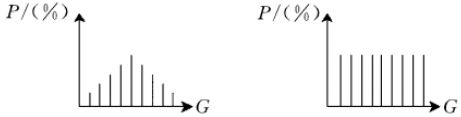
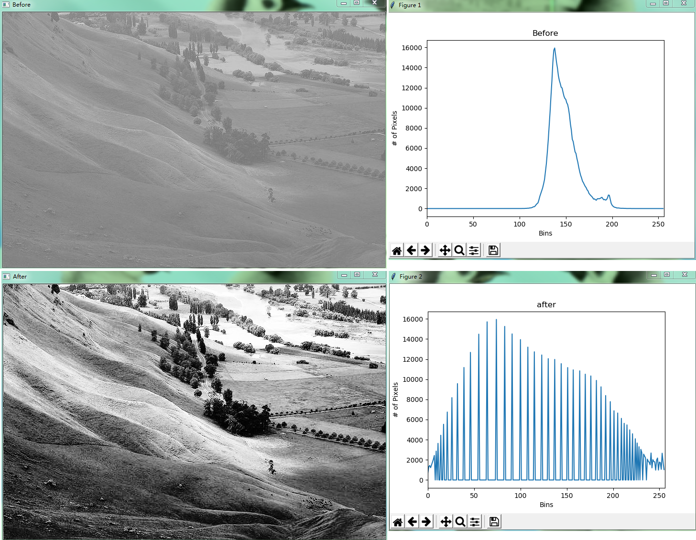
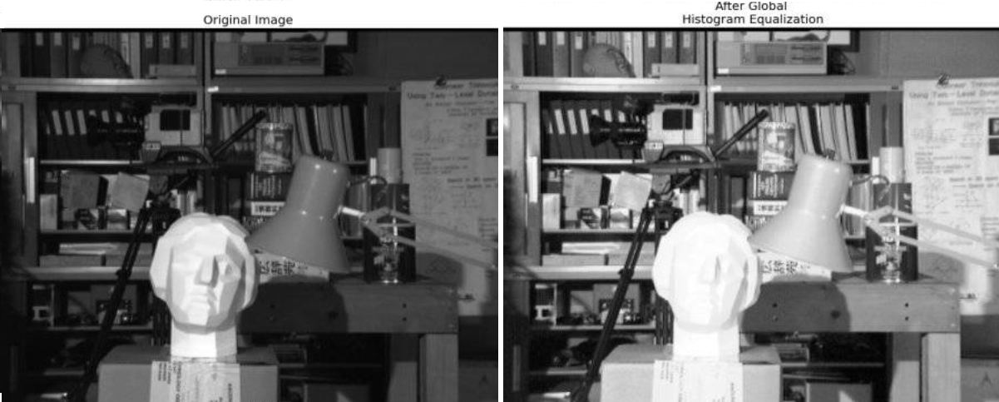
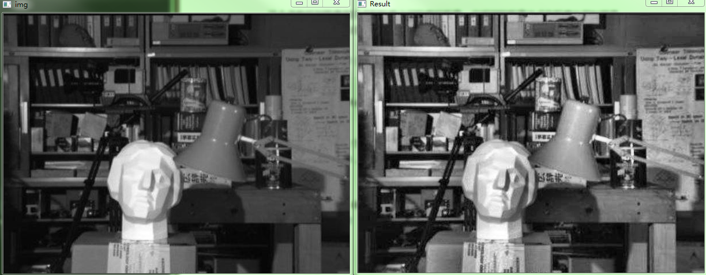

&emsp;&emsp;直方图均衡化(`Histogram Equalization`)又称`直方图平坦化`，实质上是对图像进行非线性拉伸，重新分配图像象元值，使一定灰度范围内象元值的数量大致相等。这样，原来直方图中间的峰顶部分对比度得到增强，而两侧的谷底部分对比度降低，输出图像的直方图是一个较平的分段直方图：如果输出数据分段值较小的话，会产生粗略分类的视觉效果。<!--more-->
&emsp;&emsp;灰度直方图是灰度级的函数，反映的是图像中具有该灰度级像素的个数，其横坐标是灰度级$r$，纵坐标是该灰度级出现的频率(即像素的个数)$P_r(r)$，整个坐标系描述的是图像灰度级的分布情况，由此可以看出图像的灰度分布特性。若大部分像素集中在低灰度区域，图像呈现暗的特性；若像素集中在高灰度区域，图像呈现亮的特性。<br>
&emsp;&emsp;下图就是直方图均衡化，就是将随机分布的图像直方图修改成均匀分布的直方图。基本思想是对原始图像的像素灰度做某种映射变换，使变换后图像灰度的概率密度呈均匀分布。这就意味着图像灰度的动态范围得到了增加，提高了图像的对比度。



&emsp;&emsp;通过这种技术可以清晰地在直方图上看到图像亮度的分布情况，并可按照需要对图像亮度调整。另外，这种方法是可逆的，如果已知均衡化函数，就可以恢复原始直方图。
&emsp;&emsp;设变量$r$代表图像中像素灰度级，对灰度级进行归一化处理，则$0 ≤ r ≤ 1$，其中$r = 0$表示黑，$r = 1$表示白。对于一幅给定的图像，每个像素值在$[0, 1]$的灰度级是随机的。用概率密度函数$P_r(r)$来表示图像灰度级的分布。<br>
&emsp;&emsp;为了有利于数字图像处理，引入离散形式。在离散形式下，用$r_k$代表离散灰度级，用$P_r(r_k)$代表$P_r(r)$，并且下式成立：

$$
P_r(r_k) = \frac{n_k}{n}，0 ≤ r_k ≤ 1，k = 0、1、2、...、n - 1
$$

式中$n_k$为图像中出现$r_k$这种灰度的像素数，$n$是图像中的像素总数，而$\frac{n_k}{n}$就是概率论中的频数。图像进行直方图均衡化的函数表达式为：

$$
S_i = T(r_i) = \sum_{i = 0}^{k - 1} \frac{n_i}{n}
$$

式中，$k$为灰度级数。相应的反变换为：

$$
r^i = T^{-1}(S_i)
$$

&emsp;&emsp;直方图均衡化使用函数`equalizeHist`：

``` python
equalizeHist(src, dst=None)
```

参数`src`是图像矩阵，`dst`选择默认即可。

``` python
from matplotlib import pyplot as plt1
from matplotlib import pyplot as plt2
import cv2

image = cv2.imread("test.jpg", cv2.IMREAD_GRAYSCALE)
cv2.imshow("Before", image)
# 图像直方图
hist1 = cv2.calcHist([image], [0], None, [256], [0, 256])
eq = cv2.equalizeHist(image)  # 灰度图像直方图均衡化
cv2.imshow("After", eq)
hist2 = cv2.calcHist([eq], [0], None, [256], [0, 256])

plt1.figure()  # 新建一个图像
plt1.title("Before")  # 图像的标题
plt1.xlabel("Bins")  # X轴标签
plt1.ylabel("# of Pixels")  # Y轴标签
plt1.plot(hist1)  # 画图
plt1.xlim([0, 256])  # 设置x坐标轴范围
# --------------
plt2.figure()  # 新建一个图像
plt2.title("after")  # 图像的标题
plt2.xlabel("Bins")  # X轴标签
plt2.ylabel("# of Pixels")  # Y轴标签
plt2.plot(hist2)  # 画图
plt2.xlim([0, 256])  # 设置x坐标轴范围

plt2.show()  # 显示图像
plt1.show()  # 显示图像
```



&emsp;&emsp;也可以使用查找表来拉伸直方图，观察上图中原始图像的直方图，很容易发现大部分强度值范围都没有用到。因此先检测图像`非0`的最低(`imin`)强度值和最高(`imax`)强度值。将最低值`imin`设为`0`，最高值`imax`设为`255`，中间的按

$$
255.0 * \frac{i - imin}{imax - imin} + 0.5
$$

的形式设置。

``` python
import cv2
import numpy as np

image = cv2.imread("test.jpg", 0)
lut = np.zeros(256, dtype=image.dtype)  # 创建空的查找表
hist = cv2.calcHist([image],  # 计算图像的直方图
                    [0],  # 使用的通道
                    None,  # 没有使用mask
                    [256],  # it is a 1D histogram
                    [0.0, 255.0])

minBinNo, maxBinNo = 0, 255

# 计算从左起第一个不为0的直方图柱的位置
for binNo, binValue in enumerate(hist):
    if binValue != 0:
        minBinNo = binNo
        break

# 计算从右起第一个不为0的直方图柱的位置
for binNo, binValue in enumerate(reversed(hist)):
    if binValue != 0:
        maxBinNo = 255 - binNo
        break

print(minBinNo, maxBinNo)

for i, v in enumerate(lut):  # 生成查找表
    print(i)

    if i < minBinNo:
        lut[i] = 0
    elif i > maxBinNo:
        lut[i] = 255
    else:
        lut[i] = int(255.0 * (i - minBinNo) / (maxBinNo - minBinNo) + 0.5)

result = cv2.LUT(image, lut)
cv2.imshow("Result", result)
cv2.imwrite("LutImage.jpg", result)
cv2.waitKey(0)
cv2.destroyAllWindows()
```


---

### CLAHE有限对比适应性直方图均衡化

&emsp;&emsp;以上所做的直方图均衡化会改变整个图像的对比度，但是在很多情况下，这样做的效果并不好。例如，下图分别是输入图像和进行直方图均衡化之后的输出图像：



&emsp;&emsp;的确在进行完直方图均衡化之后，图片背景的对比度被改变了。但是再对比一下两幅图像中雕像的面图，由于太亮我们丢失了很多信息。造成这种结果的根本原因是，这幅图像的直方图并不是集中在某一个区域(试着画出它的直方图，你就明白了)。
&emsp;&emsp;为了解决这个问题，我们需要使用自适应的直方图均衡化。这种情况下，整幅图像会被分成很多小块，这些小块被称为`tiles`(在`OpenCV`中`tiles`的大小默认是`8*8`)，然后再对每一个小块分别进行直方图均衡化。所以在每一个的区域中，直方图会集中在某一个小的区域中(除非有噪声干扰)。如果有噪声的话，噪声会被放大。为了避免这种情况的出现要使用对比度限制。对于每个小块来说，如果直方图中的`bin`超过对比度的上限的话，就把其中的像素点均匀分散到其他`bins`中，然后在进行直方图均衡化。最后，为了去除每一个小块之间`人造的`(由于算法造成)边界，再使用双线性差值，对小块进行缝合。

``` python
import numpy as np
import cv2

img = cv2.imread('test1.jpg', 0)
# create a CLAHE object (Arguments are optional).
clahe = cv2.createCLAHE(clipLimit=2.0, tileGridSize=(8, 8))
cl1 = clahe.apply(img)
cv2.imshow("img", img)
cv2.imshow("Result", cl1)
cv2.waitKey(0)
cv2.destroyAllWindows()
```

