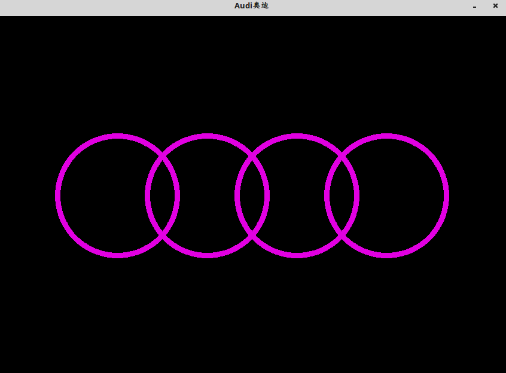
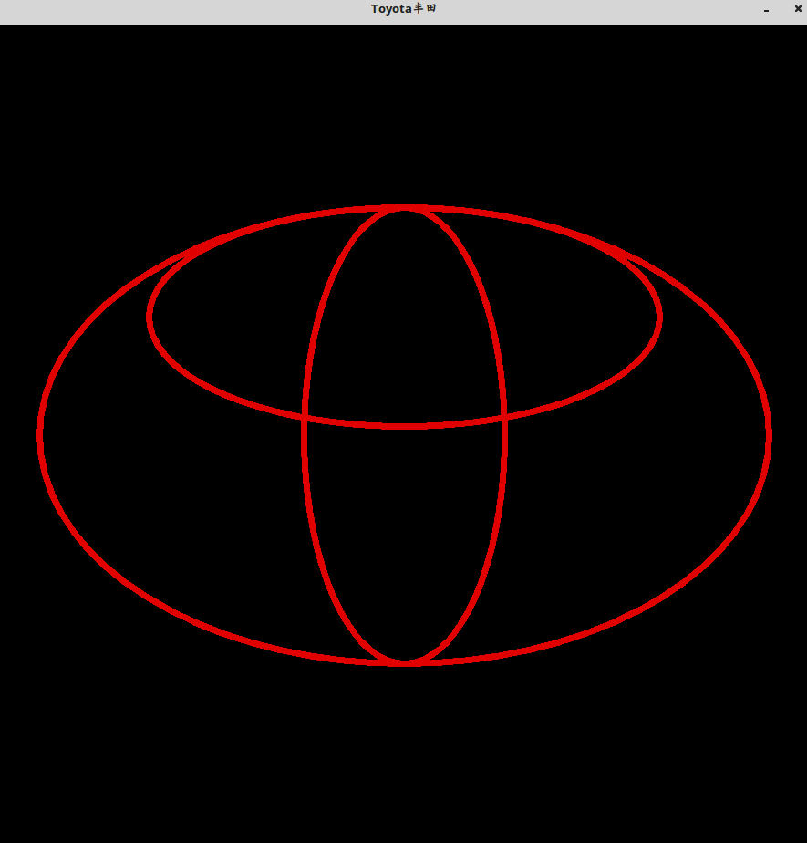
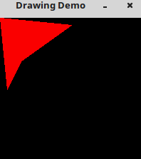
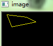
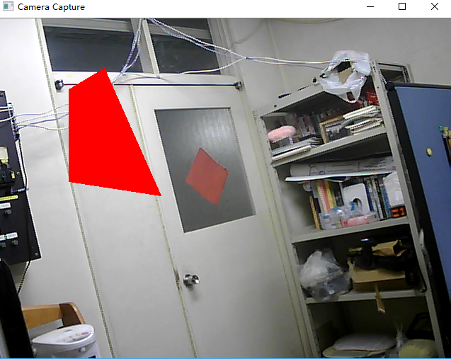

### cvRectangle

&emsp;&emsp;其函数原型如下：<!--more-->

``` cpp
void cvRectangle (
    CvArr *img, CvPoint pt1, CvPoint pt2, CvScalar color,
    int thickness = 1, int line_type = 8, int shift = 0);
```

- `img`：图像。
- `pt1`：矩形的一个顶点。
- `pt2`：矩形对角线上的另一个顶点。
- `color`：线条颜色(`RGB`)或亮度(灰度图像)。
- `thickness`：组成矩形的线条的粗细程度。取负值时(例如`CV_FILLED`)，函数绘制填充了色彩的矩形。
- `line_type`：线条的类型，详见`cvLine`的描述。
- `shift`：坐标点的小数点位数。

``` cpp
IplImage *img = cvLoadImage ( "lv.jpg" );
cvRectangle ( img, cvPoint ( 5, 10 ), cvPoint ( 30, 40 ), cvScalar ( 201, 102, 62 ), 3, 4, 0 );
cvNamedWindow ( "donkeyaime", CV_WINDOW_AUTOSIZE );
cvShowImage ( "donkeyaime", img );
cvWaitKey ( 0 );
cvReleaseImage ( &img );
```

### Circle

&emsp;&emsp;该函数的作用是绘制圆形：

``` cpp
void cvCircle (
    CvArr *img, CvPoint center, int radius, CvScalar color,
    int thickness = 1, int line_type = 8, int shift = 0);
```

- `img`：图像。
- `center`：圆心坐标。
- `radius`：圆形的半径。
- `color`：线条的颜色。
- `thickness`：如果是正数，表示组成圆的线条的粗细程度，否则表示圆是否被填充。
- `line_type`：线条的类型，详见`cvLine`的描述。
- `shift`：圆心坐标点和半径值的小数点位数。

``` cpp
#include <opencv2/core/core.hpp>
#include <opencv2/highgui/highgui.hpp>
#include "opencv2/imgproc/imgproc.hpp"

using namespace cv;

#define Win_Name2 "Audi奥迪"

int main ( int argc, char **argv ) {
    Mat image2 = Mat::zeros ( 600, 850, CV_8UC3 ); /* 生成一个窗口 */
    circle ( image2, Point ( 200, 300 ), 100, Scalar ( 225, 0, 225 ), 7, 8 );
    circle ( image2, Point ( 350, 300 ), 100, Scalar ( 225, 0, 225 ), 7, 8 );
    circle ( image2, Point ( 500, 300 ), 100, Scalar ( 225, 0, 225 ), 7, 8 );
    circle ( image2, Point ( 650, 300 ), 100, Scalar ( 225, 0, 225 ), 7, 8 );
    imshow ( Win_Name2, image2 );
    waitKey();
    return 0;
}
```



### Ellipse

&emsp;&emsp;该函数的作用是绘制椭圆圆弧和椭圆扇形：

``` cpp
void cvEllipse (
    CvArr *img, CvPoint center, CvSize axes, double angle, double start_angle,
    double end_angle, CvScalar color, int thickness = 1, int line_type = 8, int shift = 0);
```

- `img`：图像。
- `center`：椭圆圆心坐标。
- `axes`：轴的长度。
- `angle`：偏转的角度。
- `start_angle`：圆弧起始角的角度。
- `end_angle`：圆弧终结角的角度。
- `color`：线条的颜色。
- `thickness`：线条的粗细程度。
- `line_type`：线条的类型，详见`cvLine`的描述。
- `shift`：圆心坐标点和数轴的精度。

``` cpp
#include <opencv2/core/core.hpp>
#include <opencv2/highgui/highgui.hpp>
#include "opencv2/imgproc/imgproc.hpp"

using namespace cv;

#define Win_Name1 "Toyota丰田"

int main ( int argc, char **argv ) {
    Mat image1 = Mat::zeros ( 900, 900, CV_8UC3 );
    ellipse ( image1, Point ( 450, 450 ), Size ( 400, 250 ), 0, 0, 360, Scalar ( 0, 0, 225 ), 5, 8 );
    ellipse ( image1, Point ( 450, 450 ), Size ( 250, 110 ), 90, 0, 360, Scalar ( 0, 0, 225 ), 5, 8 );
    ellipse ( image1, Point ( 450, 320 ), Size ( 280, 120 ), 0, 0, 360, Scalar ( 0, 0, 225 ), 5, 8 );
    imshow ( Win_Name1, image1 );
    waitKey();
    return 0;
}
```



### cvFillPoly

&emsp;&emsp;`cvFillPoly`用于对一个单独被多边形轮廓所限定的区域内进行填充。函数可以填充复杂的区域，例如有漏洞的区域和有交叉点的区域等。

``` cpp
void cvFillPoly (
    CvArr *img, CvPoint **pts, int *npts, int contours,
    CvScalar color, int line_type = 8, int shift = 0);
```

- `img`：图像。
- `pts`：指向多边形的数组指针。
- `npts`：多边形的顶点个数的数组。
- `contours`：组成填充区域的线段的数量。
- `color`：多边形的颜色。
- `line_type`：组成多边形的线条的类型。
- `shift`：顶点坐标的小数点位数。

``` cpp
#include "cv.h"
#include "highgui.h"

int main ( int argc, char *argv[] ) {
    char wndname[] = "Drawing Demo";
    cvNamedWindow ( wndname );
    int arr[1];
    arr[0] = 4;
    CvPoint **pt = new CvPoint*[1];
    pt[0] = new CvPoint[4];
    pt[0][0] = cvPoint ( 0, 0 );
    pt[0][1] = cvPoint ( 100, 10 );
    pt[0][2] = cvPoint ( 30, 60 );
    pt[0][3] = cvPoint ( 10, 100 );
    IplImage *image = cvCreateImage ( cvSize ( 200, 200 ), 8, 3 );
    cvPolyLine ( image, pt, arr, 1, 1, CV_RGB ( 250, 0, 0 ) );
    cvFillPoly ( image, pt, arr, 1, CV_RGB ( 250, 0, 0 ) );
    cvShowImage ( wndname, image );
    cvWaitKey ( 1000000 );
    return 0;
}
```



### polylines

&emsp;&emsp;其函数原型如下：

``` python
cv2.polylines(img, pts, isClosed, color[, thickness[, lineType[, shift]]])
```

参数分别为：图像、顶点集、是否闭合、颜色、线宽度等。

``` python
import numpy as np
import cv2

img = np.zeros((512, 512, 3), np.uint8)

pts = np.array(
    [[10, 5],
     [20, 30],
     [70, 20],
     [50, 10]],
    np.int32
)

pts = pts.reshape((-1, 1, 2))
img = cv2.polylines(img, [pts], True, (0, 255, 255))
cv2.imshow('image', img)
cv2.waitKey(0)
cv2.destroyAllWindows()
```



### fillConvexPoly

&emsp;&emsp;该函数用于绘制一个被填充的凸多边形。这个函数比`fillPoly`快得多，它不仅仅可以填充凸多边形，还可以填充不与自身相交的单调多边形，这种多边形的轮廓与任何水平线(扫描线)最多有`2`个交点(它的最顶上那条边`和/或`最底部那条边可以是水平的)：

``` python
cv2.fillConvexPoly (img, points, color[, lineType[, shift]]) -> None
```

参数`img`是目标图片，`points`是多边形的顶点数组，`npts`是多边形的顶点个数，`color`是多边形的颜色，`lineType`是多边形边界的线条类型，`shift`是顶点坐标中包含的小数位数目。

``` python
import cv2
import numpy as np

def main():
    cap = cv2.VideoCapture(0)

    while (True):
        ret, frame = cap.read()  # カメラのキャプチャからフレームを取得する
        contours = np.array([[100, 100], [100, 230], [230, 250], [150, 70]])  # 多角形を記述
        # fillConvexPolyで多角形を描画
        cv2.fillConvexPoly(frame, points=contours, color=(0, 0, 255))
        cv2.imshow('Camera Capture', frame)

        if cv2.waitKey(10) > 0:  # 何かキーを押したら終了
            cap.release()
            cv2.destroyAllWindows()
            break

if __name__ == '__main__':
    main()
```

