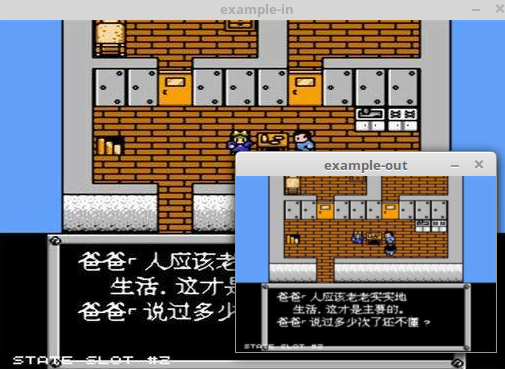

### cvResize

&emsp;&emsp;函数功能为图像大小变换：<!--more-->

``` cpp
void cvResize ( const CvArr *src, CvArr *dst, int interpolation = CV_INTER_LINEAR );
```

参数`src`表示输入图像；`dst`表示输出图像；`interpolation`表示插值方法，可以有以下`4`种：

- `CV_INTER_NN`：最近邻插值。
- `CV_INTER_LINEAR`：双线性插值。
- `CV_INTER_AREA`：使用像素关系重采样。当图像缩小时候，该方法可以避免波纹出现。当图像放大时，类似于`CV_INTER_NN`方法。
- `CV_INTER_CUBIC`：立方插值。

### cvCreateImage

&emsp;&emsp;函数功能为创建图像：

``` cpp
IplImage *cvCreateImage ( CvSize size, int depth, int channels );
```

参数`size`表示图像的大小；`depth`表示图像的深度，可以为`IPL_DEPTH_8U`、`IPL_DEPTH_16U`等；`channels`表示图像的通道数。

``` cpp
#include <opencv2/opencv.hpp>

using namespace std;

int main() {
    const char *pstrImageName = "zzjb.jpg";
    const char *pstrSaveImageName = "zzjb缩放图.jpg";
    const char *pstrWindowsSrcTitle = "原图";
    const char *pstrWindowsDstTitle = "缩放图";
    double fScale = 0.314; /* 缩放倍数 */
    CvSize czSize; /* 目标图像尺寸 */
    IplImage *pSrcImage = cvLoadImage ( pstrImageName, CV_LOAD_IMAGE_UNCHANGED );
    IplImage *pDstImage = NULL;
    /* 计算目标图像大小 */
    czSize.width = pSrcImage->width * fScale;
    czSize.height = pSrcImage->height * fScale;
    /* 创建图像并缩放 */
    pDstImage = cvCreateImage ( czSize, pSrcImage->depth, pSrcImage->nChannels );
    cvResize ( pSrcImage, pDstImage, CV_INTER_AREA );
    /* 创建窗口 */
    cvNamedWindow ( pstrWindowsSrcTitle, CV_WINDOW_AUTOSIZE );
    cvNamedWindow ( pstrWindowsDstTitle, CV_WINDOW_AUTOSIZE );
    /* 在指定窗口中显示图像 */
    cvShowImage ( pstrWindowsSrcTitle, pSrcImage );
    cvShowImage ( pstrWindowsDstTitle, pDstImage );
    cvWaitKey(); /* 等待按键事件 */
    cvSaveImage ( pstrSaveImageName, pDstImage ); /* 保存图片 */
    cvDestroyWindow ( pstrWindowsSrcTitle );
    cvDestroyWindow ( pstrWindowsDstTitle );
    cvReleaseImage ( &pSrcImage );
    cvReleaseImage ( &pDstImage );
    return 0;
}
```


---

&emsp;&emsp;代码如下：

``` cpp
#include <highgui.h>
#include <cv.h>

IplImage *doPryDown ( IplImage *in, int filter = CV_GAUSSIAN_5x5 ) {
    IplImage *out = cvCreateImage (
                        cvSize ( in->width / 2, in->height / 2 ),
                        in->depth, in->nChannels );
    cvPyrDown ( in, out, CV_GAUSSIAN_5x5 );
    return ( out );
}

int main() {
    cvNamedWindow ( "example-in" );
    cvNamedWindow ( "example-out" );
    IplImage *in = cvLoadImage ( "./zzjb.jpg" );
    cvShowImage ( "example-in", in );
    IplImage *out = doPryDown ( in );
    cvShowImage ( "example-out", out );
    cvWaitKey ( 0 );
    cvReleaseImage ( &in );
    cvReleaseImage ( &out );
    cvDestroyWindow ( "example-in" );
    cvDestroyWindow ( "example-out" );
}
```



&emsp;&emsp;函数`cvPyrDown`使用`Gaussian`金字塔分解对输入图像向下采样，对图像进行缩放处理：

``` cpp
void cvPyrDown ( const CvArr *src, CvArr *dst, int filter = CV_GAUSSIAN_5x5 );
```

参数`src`为输入图像；`dst`为输出图像，其宽度和高度应是输入图像的一半；`filter`是卷积滤波器类型，目前仅支持`CV_GAUSSIAN_5x5`。