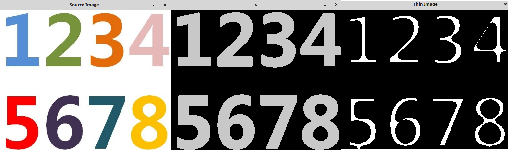
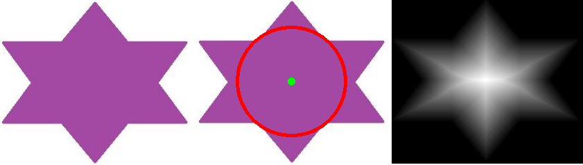

&emsp;&emsp;`opencv`距离变换使用的是`distanceTransform`函数：<!--more-->

``` cpp
void distanceTransform (
    InputArray src, OutputArray dst, int distanceType,
    int maskSize, int dstType = CV_32F);

void distanceTransform (
    InputArray src, OutputArray dst, OutputArray labels,
    int distanceType, int maskSize, intlabelType = DIST_LABEL_CCOMP);
```

`Python`的原型如下：

``` python
cv2.distanceTransform(src, distanceType, maskSize[, dst]) -> dst
```

`distanceTransform`方法用于计算图像中每一个非零点距离自己最近的零点的距离，该函数的参数`dst`保存了每一个点与最近的零点的距离信息，图像上越亮的点，代表了离零点的距离越远。
&emsp;&emsp;细化轮廓如下：

``` cpp
#include <iostream>
#include <cv.h>
#include <highgui.h>
#include <stack>

using namespace std;
using namespace cv;

int main ( int argc, char *argv[] ) {
    float maxValue = 0; /* 定义距离变换矩阵中的最大值 */
    Mat image = imread ( argv[1] );
    Mat imageGray;
    cvtColor ( image, imageGray, CV_RGB2GRAY );
    imageGray = ~imageGray; /* 取反 */
    GaussianBlur ( imageGray, imageGray, Size ( 5, 5 ), 2 ); /* 滤波 */
    threshold ( imageGray, imageGray, 20, 200, CV_THRESH_BINARY ); /* 阈值 */
    imshow ( "s", imageGray );
    Mat imageThin ( imageGray.size(), CV_32FC1 ); /* 定义保存距离变换结果的Mat矩阵 */
    distanceTransform ( imageGray, imageThin, CV_DIST_L2, 3 ); /* 距离变换 */
    Mat distShow;
    distShow = Mat::zeros ( imageGray.size(), CV_8UC1 ); /* 定义细化后的字符轮廓 */

    for ( int i = 0; i < imageThin.rows; i++ ) {
        for ( int j = 0; j < imageThin.cols; j++ ) {
            if ( imageThin.at<float> ( i, j ) > maxValue ) {
                maxValue = imageThin.at<float> ( i, j ); /* 获取距离变换的极大值 */
            }
        }
    }

    for ( int i = 0; i < imageThin.rows; i++ ) {
        for ( int j = 0; j < imageThin.cols; j++ ) {
            if ( imageThin.at<float> ( i, j ) > maxValue / 1.9 ) {
                distShow.at<uchar> ( i, j ) = 255; /* 符合距离大于最大值一定比例条件的点设为255 */
            }
        }
    }

    imshow ( "Source Image", image );
    imshow ( "Thin Image", distShow );
    waitKey();
    return 0;
}
```



&emsp;&emsp;查找物体的质心：

``` cpp
#include <iostream>
#include <cv.h>
#include <highgui.h>
#include <stack>

using namespace std;
using namespace cv;

int main ( int argc, char *argv[] ) {
    float maxValue = 0; /* 定义距离变换矩阵中的最大值 */
    Point Pt ( 0, 0 );
    Mat image = imread ( argv[1] );
    Mat imageGray;
    cvtColor ( image, imageGray, CV_RGB2GRAY );
    imageGray = ~imageGray; /* 取反 */
    GaussianBlur ( imageGray, imageGray, Size ( 5, 5 ), 2 ); /* 滤波 */
    threshold ( imageGray, imageGray, 20, 200, CV_THRESH_BINARY ); /* 阈值化 */
    Mat imageThin ( imageGray.size(), CV_32FC1 ); /* 定义保存距离变换结果的Mat矩阵 */
    distanceTransform ( imageGray, imageThin, CV_DIST_L2, 3 ); /* 距离变换 */
    Mat distShow;
    distShow = Mat::zeros ( imageGray.size(), CV_8UC1 ); /* 定义细化后的字符轮廓 */

    for ( int i = 0; i < imageThin.rows; i++ ) {
        for ( int j = 0; j < imageThin.cols; j++ ) {
            distShow.at<uchar> ( i, j ) = imageThin.at<float> ( i, j );

            if ( imageThin.at<float> ( i, j ) > maxValue ) {
                maxValue = imageThin.at<float> ( i, j ); /* 获取距离变换的极大值 */
                Pt = Point ( j, i ); /* 坐标 */
            }
        }
    }

    normalize ( distShow, distShow, 0, 255, CV_MINMAX ); /* 为了显示清晰，做了0至255归一化 */
    circle ( image, Pt, maxValue, Scalar ( 0, 0, 255 ), 3 );
    circle ( image, Pt, 3, Scalar ( 0, 255, 0 ), 3 );
    imshow ( "Source Image", image );
    imshow ( "Center", distShow );
    waitKey();
    return 0;
}
```



可以看到中心处最亮，说明了中心点距离零点的距离最远，而最远处就可以作为物体的质心。