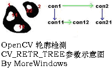
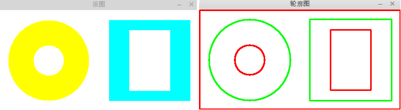
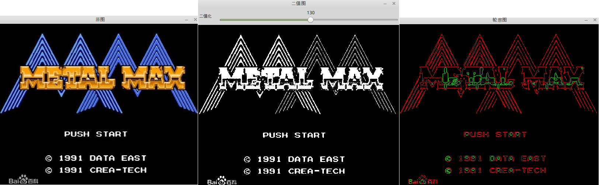

&emsp;&emsp;轮廓检测的原理通俗地说就是掏空内部点，比如原图中有`3 * 3`的矩形点，那么就可以将中间的那一个点去掉。在`opencv`中使用轮廓检测是非常方便的，直接使用`cvFindContours`函数就能完成对图像轮廓的检测。<!--more-->
&emsp;&emsp;`cvFindContours`函数功能是对图像进行轮廓检测，这个函数将生成一条链表以保存检测出的各个轮廓信息，并传出指向这条链表表头的指针。

``` cpp
int cvFindContours (
    CvArr *image, CvMemStorage *storage, CvSeq **first_contour,
    int header_size = sizeof ( CvContour ), int mode = CV_RETR_LIST,
    int method = CV_CHAIN_APPROX_SIMPLE, CvPoint offset = cvPoint ( 0, 0 ) );
```

- `image`：输入图像，必须为一个`8`位的二值图像。
- `storage`：存储轮廓的容器，为`CvMemStorage`类型，定义在`OpenCV`的`core\types_c.h`中。
- `first_contour`：输出参数，这个参数将指向用来存储轮廓信息的链表表头。
- `header_size`：存储轮廓链表的表头大小，当参数`method`传入`CV_CHAIN_CODE`时，要设置成`sizeof(CvChain)`，其它情况统一设置成`sizeof(CvContour)`。
- `mode`：轮廓检测的模式，有如下取值：

1. `CV_RETR_EXTERNAL`：只检索最外面的轮廓。
2. `CV_RETR_LIST`：检索所有的轮廓，并将其保存到一条链表当中。
3. `CV_RETR_CCOMP`：检索所有的轮廓，并将他们组织为两层：顶层是各部分的外部边界，第二层是空洞的边界。
4. `CV_RETR_TREE`：检索所有的轮廓，并重构嵌套轮廓的整个层次，可以参见下图：



- `method`：表示轮廓边缘的近似方法，常用值如下：

1. `CV_CHAIN_CODE`：以`Freeman`链码的方式输出轮廓，所有其他方法输出多边形(顶点的序列)。
2. `CV_CHAIN_APPROX_SIMPLE`：压缩水平的、垂直的和斜的部分，也就是函数只保留他们的终点部分。

- `offset`：偏移量，比如你要从图像的`(100, 0)`开始进行轮廓检测，那么就传入`(100, 0)`。

&emsp;&emsp;使用`cvFindContours`函数能检测出图像的轮廓，将轮廓绘制出来则需要`cvDrawContours`函数。

``` cpp
void cvDrawContours (
    CvArr *img, CvSeq *contour, CvScalar external_color, CvScalar hole_color,
    int max_level, int thickness = 1, int line_type = 8, CvPoint offset = cvPoint ( 0, 0 ) );
```

- `img`：输入图像，函数将在这张图像上绘制轮廓。
- `contour`：指向轮廓链表的指针。
- `external_color`和`hole_color`：表示颜色，绘制时会根据轮廓的层次来交替使用这二种颜色。
- `max_level`：绘制轮廓的最大层数。如果是`0`，只绘制`contour`；如果是`1`，追加绘制和`contour`同层的所有轮廓；如果是`2`，追加绘制比`contour`低一层的轮廓，以此类推；如果值是负值，则函数并不绘制`contour`后的轮廓，但是将画出其子轮廓，一直到`abs(max_level) - 1`层。
- `thickness`：表示轮廓线的宽度。如果为`CV_FILLED`，则会填充轮廓内部。
- `line_type`：表示轮廓线的类型。
- `offset`：表示偏移量，如果传入`(10, 20)`，那绘制将从图像的`(10, 20)`处开始。

``` cpp
#include <opencv2/opencv.hpp>

using namespace std;

int main ( int argc, char **argv ) {
    const char *pstrWindowsSrcTitle = "原图";
    const char *pstrWindowsOutLineTitle = "轮廓图";
    const int IMAGE_WIDTH = 400;
    const int IMAGE_HEIGHT = 200;

    IplImage *pSrcImage = cvCreateImage ( cvSize ( IMAGE_WIDTH, IMAGE_HEIGHT ), IPL_DEPTH_8U, 3 );
    cvRectangle ( pSrcImage, cvPoint ( 0, 0 ),
        cvPoint ( pSrcImage->width, pSrcImage->height ),
        CV_RGB ( 255, 255, 255 ), CV_FILLED ); /* 填充成白色 */
    CvPoint ptCircleCenter = cvPoint ( IMAGE_WIDTH / 4, IMAGE_HEIGHT / 2 ); /* 画圆 */
    int nRadius = 80;
    cvCircle ( pSrcImage, ptCircleCenter, nRadius, CV_RGB ( 255, 255, 0 ), CV_FILLED );
    ptCircleCenter = cvPoint ( IMAGE_WIDTH / 4, IMAGE_HEIGHT / 2 );
    nRadius = 30;
    cvCircle ( pSrcImage, ptCircleCenter, nRadius, CV_RGB ( 255, 255, 255 ), CV_FILLED );
    /* 画矩形 */
    CvPoint ptLeftTop = cvPoint ( IMAGE_WIDTH / 2 + 20, 20 );
    CvPoint ptRightBottom = cvPoint ( IMAGE_WIDTH - 20, IMAGE_HEIGHT - 20 );
    cvRectangle ( pSrcImage, ptLeftTop, ptRightBottom, CV_RGB ( 0, 255, 255 ), CV_FILLED );
    ptLeftTop = cvPoint ( IMAGE_WIDTH / 2 + 60, 40 );
    ptRightBottom = cvPoint ( IMAGE_WIDTH - 60, IMAGE_HEIGHT - 40 );
    cvRectangle ( pSrcImage, ptLeftTop, ptRightBottom, CV_RGB ( 255, 255, 255 ), CV_FILLED );
    /* 显示原图 */
    cvNamedWindow ( pstrWindowsSrcTitle, CV_WINDOW_AUTOSIZE );
    cvShowImage ( pstrWindowsSrcTitle, pSrcImage );
    /* 转为灰度图 */
    IplImage *pGrayImage = cvCreateImage ( cvGetSize ( pSrcImage ), IPL_DEPTH_8U, 1 );
    cvCvtColor ( pSrcImage, pGrayImage, CV_BGR2GRAY );
    /* 转为二值图 */
    IplImage *pBinaryImage = cvCreateImage ( cvGetSize ( pGrayImage ), IPL_DEPTH_8U, 1 );
    cvThreshold ( pGrayImage, pBinaryImage, 250, 255, CV_THRESH_BINARY );
    CvMemStorage *pcvMStorage = cvCreateMemStorage(); /* 检索轮廓并返回检测到的轮廓的个数 */
    CvSeq *pcvSeq = NULL;
    cvFindContours (
        pBinaryImage, pcvMStorage, &pcvSeq, sizeof ( CvContour ),
        CV_RETR_TREE, CV_CHAIN_APPROX_SIMPLE, cvPoint ( 0, 0 ) );
    /* 画轮廓图 */
    IplImage *pOutlineImage = cvCreateImage ( cvGetSize ( pSrcImage ), IPL_DEPTH_8U, 3 );
    int nLevels = 5;
    /* 填充成白色 */
    cvRectangle ( pOutlineImage, cvPoint ( 0, 0 ),
        cvPoint ( pOutlineImage->width, pOutlineImage->height ),
        CV_RGB ( 255, 255, 255 ), CV_FILLED );
    cvDrawContours ( pOutlineImage, pcvSeq, CV_RGB ( 255, 0, 0 ), CV_RGB ( 0, 255, 0 ), nLevels, 2 );
    /* 显示轮廓图 */
    cvNamedWindow ( pstrWindowsOutLineTitle, CV_WINDOW_AUTOSIZE );
    cvShowImage ( pstrWindowsOutLineTitle, pOutlineImage );
    cvWaitKey ( 0 );
    cvReleaseMemStorage ( &pcvMStorage );
    cvDestroyWindow ( pstrWindowsSrcTitle );
    cvDestroyWindow ( pstrWindowsOutLineTitle );
    cvReleaseImage ( &pSrcImage );
    cvReleaseImage ( &pGrayImage );
    cvReleaseImage ( &pBinaryImage );
    cvReleaseImage ( &pOutlineImage );
    return 0;
}
```



由图可以看出，轮廓线已经按层次交替的绘制成功了，读者可以修改程序中的`cvDrawContours`中的`nLevels`参数，看看图形会有什么变化。

``` cpp
#include <opencv2/opencv.hpp>

using namespace std;

IplImage *g_pGrayImage = NULL;
const char *pstrWindowsBinaryTitle = "二值图";
const char *pstrWindowsOutLineTitle = "轮廓图";
CvSeq *g_pcvSeq = NULL;

void on_trackbar ( int pos ) {
    /* 转为二值图 */
    IplImage *pBinaryImage = cvCreateImage ( cvGetSize ( g_pGrayImage ), IPL_DEPTH_8U, 1 );
    cvThreshold ( g_pGrayImage, pBinaryImage, pos, 255, CV_THRESH_BINARY );
    /* 显示二值图 */
    cvShowImage ( pstrWindowsBinaryTitle, pBinaryImage );
    CvMemStorage *cvMStorage = cvCreateMemStorage();
    /* 检索轮廓并返回检测到的轮廓的个数 */
    cvFindContours ( pBinaryImage, cvMStorage, &g_pcvSeq );
    IplImage *pOutlineImage = cvCreateImage ( cvGetSize ( g_pGrayImage ), IPL_DEPTH_8U, 3 );
    int _levels = 5;
    cvZero ( pOutlineImage );
    cvDrawContours ( pOutlineImage, g_pcvSeq, CV_RGB ( 255, 0, 0 ), CV_RGB ( 0, 255, 0 ), _levels );
    cvShowImage ( pstrWindowsOutLineTitle, pOutlineImage );
    cvReleaseMemStorage ( &cvMStorage );
    cvReleaseImage ( &pBinaryImage );
    cvReleaseImage ( &pOutlineImage );
}

int main ( int argc, char **argv ) {
    const char *pstrWindowsSrcTitle = "原图";
    const char *pstrWindowsToolBarName = "二值化";
    IplImage *pSrcImage = cvLoadImage ( "zzjb.jpg", CV_LOAD_IMAGE_UNCHANGED ); /* 从文件中加载原图 */
    /* 显示原图 */
    cvNamedWindow ( pstrWindowsSrcTitle, CV_WINDOW_AUTOSIZE );
    cvShowImage ( pstrWindowsSrcTitle, pSrcImage );
    /* 转为灰度图 */
    g_pGrayImage = cvCreateImage ( cvGetSize ( pSrcImage ), IPL_DEPTH_8U, 1 );
    cvCvtColor ( pSrcImage, g_pGrayImage, CV_BGR2GRAY );
    /* 创建二值图和轮廓图窗口 */
    cvNamedWindow ( pstrWindowsBinaryTitle, CV_WINDOW_AUTOSIZE );
    cvNamedWindow ( pstrWindowsOutLineTitle, CV_WINDOW_AUTOSIZE );
    /* 滑动条 */
    int nThreshold = 0;
    cvCreateTrackbar ( pstrWindowsToolBarName, pstrWindowsBinaryTitle, &nThreshold, 254, on_trackbar );
    on_trackbar ( 1 );
    cvWaitKey ( 0 );
    cvDestroyWindow ( pstrWindowsSrcTitle );
    cvDestroyWindow ( pstrWindowsBinaryTitle );
    cvDestroyWindow ( pstrWindowsOutLineTitle );
    cvReleaseImage ( &pSrcImage );
    cvReleaseImage ( &g_pGrayImage );
    return 0;
}
```



可以明显看出，由于图像的二值化处理只是根据图像中单个像素的值来决定，因此这种最简单轮廓检测所产生的结果和人眼观测的实际感觉肯定是有比较大的区别的。