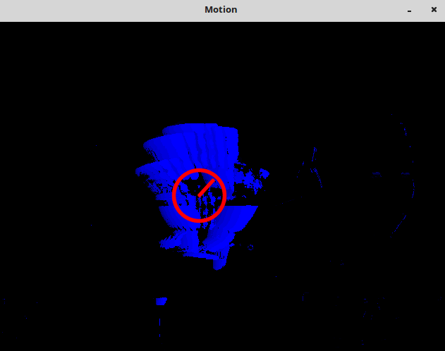

&emsp;&emsp;运动模板是一种有效的跟踪普通运动的方法，尤其应用在姿态识别中。运动模板方法首先需要的是知道物体的轮廓，而轮廓的获取可以有很多的方法，关于轮廓的获取方法在此不做多余的叙述。<!--more-->
&emsp;&emsp;运动模板程序的大致编程思路应该是是这样的：获得当前帧与上一帧的差，然后对差图像进行二值化；更新运动历史图像；然后计算运动历史图像的梯度方向，并将整个运动分割为独立的运动部分，在用一个结构序列标记每一个运动分割，最后计算出选择区域的全局运动方向，从而获得运动目标的质心位置与运动方向。
&emsp;&emsp;`opencv`中完成运动模板构建的函数是`cvUpdateMotionHistory`：

``` cpp
void cvUpdateMotionHistory (
    const CvArr *silhouette, /* 非0像素代表前景物体的最新的分割轮廓 */
    CvArr *mhi,              /* 运动模板，也即运动历史图像         */
    double timestamp,        /* 当前系统时间                    */
    double duration          /* 运动跟踪的最大持续时间            */
);
```

在`cvUpdateMotionHistory`中，所有图像都是单通道图像，图像`silhouette`是一幅单字节图像，其中非零像素代表前景物体的分割轮廓。图像`mhi`是一幅浮点值图像，代表运动模板(也就是运动历史图像)。`timestamp`是当前系统时间，以毫秒为单位。`mhi`中任何比`timestamp`减去`duration`的值早(少)的像素将被设置为`0`。
&emsp;&emsp;一旦运动模板记录了不同时间的物体轮廓，就可以用计算`mhi`图像的梯度来获取全局运动信息。使用如下函数：

``` cpp
void cvCalcMotionGradient (
    const CvArrs *mhi,    /* 运动历史图像                            */
    CvArr *mask,          /* 非0值代表此点处的梯度有效                 */
    CvArr *orientation,   /* 每一点梯度方向的角度                     */
    double delta1,
    double delta2,        /* delta1、delta2分别是允许的最小和最大梯度值 */
    int aperture_size = 3 /* 设置梯度算子的宽和高                      */
);
```

梯度方向求出后，即可以计算全局运动方向，给出如下函数：

``` cpp
double cvCalcGlobalOrientation (
    /* 前三个参数都是根据上面两个函数得出来的 */
    const CvArr *orientation,
    const CvArr *mask,
    const CvArr *mhi,
    double timestamp,
    double duration
);
```

&emsp;&emsp;分割和计算局部运动的函数是`cvSegmentMotion`：

``` cpp
CvSeq *cvSegmentMotion (
    const CvArr *mhi, CvArr *seg_mask, CvMemStorage *storage,
    double timestamp, double seg_thresh);
```

示例代码如下：

``` cpp
#include "opencv2/video/tracking.hpp"
#include "opencv2/highgui/highgui.hpp"
#include "opencv2/imgproc/imgproc_c.h"
#include <time.h>
#include <stdio.h>
#include <ctype.h>

/* 不同的跟踪参数 */
const double MHI_DURATION = 0.5;
const double MAX_TIME_DELTA = 0.5;
const double MIN_TIME_DELTA = 0.05;

const int N = 2; /* 用于运动检测的循环帧数，与机器速度及FPS设置有关 */
IplImage **buf = NULL;
int last = 0;

/* 临时图像 */
IplImage *mhi = 0; /* MHI：运动历史图像 */
IplImage *orient = 0; /* 方向 */
IplImage *mask = 0; /* 有效的运动掩码 */
IplImage *segmask = 0; /* 运动分割映射 */
CvMemStorage *storage = 0; /* 临时存储区 */

/* parameters:
   img - input video frame
   dst - resultant motion picture
   args - optional parameters */
void update_mhi ( IplImage *img, IplImage *dst, int diff_threshold ) {
    double timestamp = ( double ) clock() / CLOCKS_PER_SEC; /* 获取当前时间，以秒为单位 */
    CvSize size = cvSize ( img->width, img->height ); /* 获取当前帧尺寸 */
    int i, idx1 = last, idx2;
    IplImage *silh;
    CvSeq *seq;
    CvRect comp_rect;
    double count;
    double angle;
    CvPoint center;
    double magnitude;
    CvScalar color;

    /* 开始时为图像分配内存 or 帧尺寸改变时重新分配内存 */
    if ( !mhi || mhi->width != size.width || mhi->height != size.height ) {
        if ( buf == 0 ) {
            buf = ( IplImage ** ) malloc ( N * sizeof ( buf[0] ) );
            memset ( buf, 0, N * sizeof ( buf[0] ) );
        }

        for ( i = 0; i < N; i++ ) {
            cvReleaseImage ( &buf[i] );
            buf[i] = cvCreateImage ( size, IPL_DEPTH_8U, 1 );
            cvZero ( buf[i] );
        }

        cvReleaseImage ( &mhi );
        cvReleaseImage ( &orient );
        cvReleaseImage ( &segmask );
        cvReleaseImage ( &mask );
        mhi = cvCreateImage ( size, IPL_DEPTH_32F, 1 );
        cvZero ( mhi ); /* clear MHI at the beginning */
        orient = cvCreateImage ( size, IPL_DEPTH_32F, 1 );
        segmask = cvCreateImage ( size, IPL_DEPTH_32F, 1 );
        mask = cvCreateImage ( size, IPL_DEPTH_8U, 1 );
    }

    cvCvtColor ( img, buf[last], CV_BGR2GRAY ); /* RGB帧图像格式转换为gray */
    idx2 = ( last + 1 ) % N; /* index of (last - (N-1))th frame */
    last = idx2;
    silh = buf[idx2];
    /* 相邻两帧的差 */
    cvAbsDiff ( buf[idx1], buf[idx2], silh );
    cvThreshold ( silh, silh, diff_threshold, 1, CV_THRESH_BINARY ); /* 对差图像做二值化 */
    cvUpdateMotionHistory ( silh, mhi, timestamp, MHI_DURATION ); /* 更新运动历史 */
    /* convert MHI to blue 8u image
       cvCvtScale的第四个参数 shift = (MHI_DURATION - timestamp) * 255. / MHI_DURATION
       控制帧差的消失速率 */
    cvCvtScale ( mhi, mask, 255. / MHI_DURATION, ( MHI_DURATION - timestamp ) * 255. / MHI_DURATION );
    cvZero ( dst );
    cvMerge ( mask, 0, 0, 0, dst );
    /* B, G, R, 0 convert to BLUE image
       计算运动的梯度方向以及正确的方向掩码
       Filter size = 3 */
    cvCalcMotionGradient ( mhi, mask, orient, MAX_TIME_DELTA, MIN_TIME_DELTA, 3 );

    if ( !storage ) {
        storage = cvCreateMemStorage ( 0 );
    } else {
        cvClearMemStorage ( storage );
    }

    /* 运动分割：获得运动部件的连续序列 */
    seq = cvSegmentMotion ( mhi, segmask, storage, timestamp, MAX_TIME_DELTA );

    for ( i = -1; i < seq->total; i++ ) {
        if ( i < 0 ) { /* 对整幅图像操作 */
            comp_rect = cvRect ( 0, 0, size.width, size.height );
            color = CV_RGB ( 255, 255, 255 );
            magnitude = 100; /* 画线长度以及圆半径的大小控制 */
        } else { /* 第i个运动组件 */
            comp_rect = ( ( CvConnectedComp * ) cvGetSeqElem ( seq, i ) )->rect;

            if ( comp_rect.width + comp_rect.height < 100 ) { /* 去掉小的部分 */
                continue;
            }

            color = CV_RGB ( 255, 0, 0 );
            magnitude = 30;
        }

        /* 选择组件ROI */
        cvSetImageROI ( silh, comp_rect );
        cvSetImageROI ( mhi, comp_rect );
        cvSetImageROI ( orient, comp_rect );
        cvSetImageROI ( mask, comp_rect );
        /* 在选择的区域内，计算运动方向 */
        angle = cvCalcGlobalOrientation ( orient, mask, mhi, timestamp, MHI_DURATION );
        angle = 360.0 - angle; /* adjust for images with top-left origin */
        /* 在轮廓内计算点数；Norm(L1) = 所有像素值的和 */
        count = cvNorm ( silh, 0, CV_L1, 0 );
        cvResetImageROI ( mhi );
        cvResetImageROI ( orient );
        cvResetImageROI ( mask );
        cvResetImageROI ( silh );

        /* 检查小运动的情形 */
        if ( count < comp_rect.width * comp_rect.height * 0.05 ) { /* 像素的5% */
            continue;
        }

        /* 画一个带箭头的记录以表示方向 */
        center = cvPoint ( ( comp_rect.x + comp_rect.width / 2 ), ( comp_rect.y + comp_rect.height / 2 ) );
        cvCircle ( dst, center, cvRound ( magnitude * 1.2 ), color, 3, CV_AA, 0 );
        cvLine (
            dst, center,
            cvPoint ( cvRound ( center.x + magnitude * cos ( angle * CV_PI / 180 ) ), \
                      cvRound ( center.y - magnitude * sin ( angle * CV_PI / 180 ) ) ),
            color, 3, CV_AA, 0
        );
    }
}

int main ( int argc, char **argv ) {
    IplImage *motion = 0;
    CvCapture *capture = 0;

    if ( argc == 1 || ( argc == 2 && strlen ( argv[1] ) == 1 && isdigit ( argv[1][0] ) ) ) {
        capture = cvCaptureFromCAM ( argc == 2 ? argv[1][0] - '0' : 0 );
    } else if ( argc == 2 ) {
        capture = cvCaptureFromAVI ( argv[1] );
    }

    if ( capture ) {
        cvNamedWindow ( "Motion", 1 );

        for ( ;; ) {
            IplImage *image = cvQueryFrame ( capture );

            if ( !image ) {
                break;
            }

            if ( !motion ) {
                motion = cvCreateImage ( cvSize ( image->width, image->height ), 8, 3 );
                cvZero ( motion );
                motion->origin = image->origin;
            }

            update_mhi ( image, motion, 30 );
            cvShowImage ( "Motion", motion );

            if ( cvWaitKey ( 1 ) >= 0 ) {
                break;
            }
        }

        cvReleaseCapture ( &capture );
        cvDestroyWindow ( "Motion" );
    }

    return 0;
}
```

