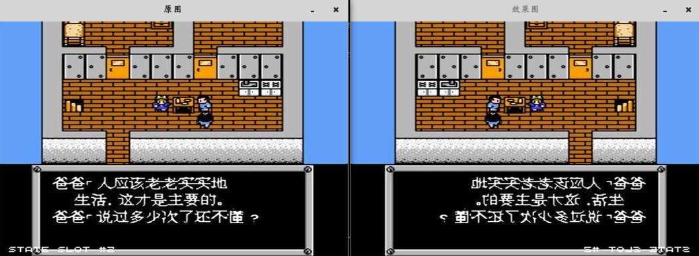

&emsp;&emsp;`cvRemap`可以对图像进行普通几何变换，它利用下面指定的矩阵变换输入图像：<!--more-->

``` cpp
src(mapx(x, y), mapy(x, y)) -> dst(x, y)
```

与其它几何变换类似，可以使用一些插值方法(由用户指定，同`cvResize`)来计算非整数坐标的像素值。

``` cpp
void cvRemap (
    const CvArr *src, CvArr *dst, const CvArr *mapx, const CvArr *mapy,
    int flags = CV_INTER_LINEAR + CV_WARP_FILL_OUTLIERS,
    CvScalar fillval = cvScalarAll ( 0 ));
```

- `src`：输入图像。
- `dst`：输出图像。
- `mapx`：`x`坐标的映。
- `mapy`：`y`坐标的映射。
- `flags`：这是插值方法，要和以下开关选项的组合：

1. `CV_WARP_FILL_OUTLIERS`：填充边界外的像素，如果输出图像的部分像素落在变换后的边界外，那么它们的值设定为`fillval`。

``` cpp
#include "cv.h"
#include "cxcore.h"
#include "highgui.h"
#include <iostream>

int main ( int argc, char **argv ) {
    uchar DataSrc[] = {
        1, 2, 3,
        4, 5, 6,
        7, 8, 9 };
    CvMat MatSrc;
    cvInitMatHeader ( &MatSrc, 3, 3, CV_8UC1, DataSrc ); /* 初始化矩阵 */
    CvMat *MatDst = cvCreateMat ( 3, 3, CV_8UC1 ); /* 创建矩阵 */
    float DataMapx[] = { /* cvRemap函数的mapx一定要为float型 */
        1, 2, 0,
        1, 2, 0,
        1, 2, 0 };
    CvMat mapx;
    cvInitMatHeader ( &mapx, 3, 3, CV_32FC1, DataMapx ); /* 注意类型是CV_32FC1 */
    float DataMapy[] = {
        0, 0, 1,
        1, 1, 2,
        2, 2, 0 };
    CvMat mapy;
    cvInitMatHeader ( &mapy, 3, 3, CV_32FC1, DataMapy );
    cvRemap ( &MatSrc, MatDst, &mapx, &mapy, CV_INTER_LINEAR | CV_WARP_FILL_OUTLIERS );
    /* 打印原矩阵 */
    std::cout << "MatSrc:" << std::endl;

    for ( int rows = 0; rows < MatSrc.height; rows++ ) {
        uchar *DataPt = ( uchar * ) ( MatSrc.data.ptr + rows * MatSrc.step );

        for ( int cols = 0; cols < MatSrc.width; cols++ ) {
            uchar data = * ( DataPt + cols );
            std::cout << ( int ) data << " ";
        }

        std::cout << std::endl;
    }

    /* 打印mapx */
    std::cout << "mapx:" << std::endl;

    for ( int rows = 0; rows < mapx.height; rows++ ) {
        float *DataPt = ( float * ) ( mapx.data.ptr + rows * mapx.step );

        for ( int cols = 0; cols < mapx.width; cols++ ) {
            float data = * ( DataPt + cols );
            std::cout << ( float ) data << " ";
        }

        std::cout << std::endl;
    }

    /* 打印mapy */
    std::cout << "mapy:" << std::endl;

    for ( int rows = 0; rows < mapy.height; rows++ ) {
        float *DataPt = ( float * ) ( mapy.data.ptr + rows * mapy.step );

        for ( int cols = 0; cols < mapy.width; cols++ ) {
            float data = * ( DataPt + cols );
            std::cout << ( float ) data << " ";
        }

        std::cout << std::endl;
    }

    /* 打印结果矩阵 */
    std::cout << "MatDst:" << std::endl;

    for ( int rows = 0; rows < MatDst->height; rows++ ) {
        uchar *DataPt = ( uchar * ) ( MatDst->data.ptr + rows * MatDst->step );

        for ( int cols = 0; cols < MatDst->width; cols++ ) {
            uchar data = * ( DataPt + cols );
            std::cout << ( int ) data << " ";
        }

        std::cout << std::endl;
    }

    return 0;
}
```

执行结果：

``` cpp
MatSrc:
1 2 3
4 5 6
7 8 9
mapx:
1 2 0
1 2 0
1 2 0
mapy:
0 0 1
1 1 2
2 2 0
MatDst:
2 3 4
5 6 7
8 9 1
```


---

&emsp;&emsp;重映射就是把一幅图像中某位置的像素放置到另一个图片指定位置的过程，`opencv`使用`remap`函数进行重映射：

``` cpp
void remap (
    InputArray src, OutputArray dst, InputArray map1, InputArray map2,
    int interpolation, intborderMode = BORDER_CONSTANT,
    const Scalar &borderValue = Scalar());
```

- `src`：输入图像，即原图像，需要单通道`8`位或者浮点类型的图像。
- `dst`：输出图像，即目标图像，需和原图形一样的尺寸和类型。
- `map1`：它有两种可能表示的对象：

1. 表示点`(x, y)`的第一个映射。
2. 表示`CV_16SC2`、`CV_32FC1`等。

- `map2`：它有两种可能表示的对象：

1. 若`map1`表示点`(x, y)`时，这个参数不代表任何值。
2. 表示`CV_16UC1`、`CV_32FC1`等。

- `interpolation`：插值方式，有四种插值方式：

1. `INTER_NEAREST`：最近邻插值。
2. `INTER_LINEAR`：双线性插值。
3. `INTER_CUBIC`：双三样条插值。
4. `INTER_LANCZOS4`：`lanczos`插值。

- `intborderMode`：边界模式，默认是`BORDER_CONSTANT`。
- `borderValue`：边界颜色，默认是黑色。

以下代码使用`remap`对图像进行水平翻转：

``` cpp
#include <opencv2/opencv.hpp>

using namespace cv;

int main() {
    Mat srcImage = imread ( "timg1.jpg" );
    Mat dstImage, map_x, map_y;
    imshow ( "原图", srcImage );
    /* 创建和原始图像一样的效果图、x重映射图和y重映射图 */
    dstImage.create ( srcImage.size(), srcImage.type() );
    map_x.create ( srcImage.size(), CV_32FC1 );
    map_y.create ( srcImage.size(), CV_32FC1 );

    /* 双层循环，遍历每一个像素点，改变map_x和map_y的值 */
    for ( int i = 0; i < srcImage.rows; i++ ) {
        for ( int j = 0; j < srcImage.cols; j++ ) {
            map_x.at<float> ( i, j ) = static_cast<float> ( srcImage.cols - j - 1 );
            map_y.at<float> ( i, j ) = static_cast<float> ( i );
        }
    }

    /* 进行重映射操作 */
    remap ( srcImage, dstImage, map_x, map_y, CV_INTER_LINEAR, \
            BORDER_CONSTANT, Scalar ( 255, 0, 0 ) );
    imshow ( "效果图", dstImage );
    waitKey ( 0 );
    return 0;
}
```

