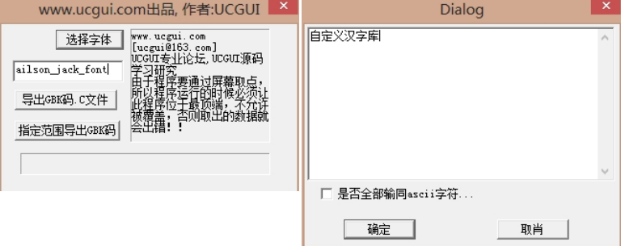

&emsp;&emsp;首先打开`ucgui_font.exe`，然后点击`选择字体`，选择你需要的字体，并设置字形及大小。<!--more-->
&emsp;&emsp;接着输入生成的文件的名字(不要含中文)，这里输入的文件名是`ailson_jack_font`。点击`指定范围导出GBK码`按钮，然后在弹出的窗口里面输入你自己要定义的汉字库。



&emsp;&emsp;输入完后点击`确定`按钮，即可在`ucgui_font.exe`所在文件夹里生成一个`.c`文件，然后将这个`.c`文件添加到你的工程里。在`main`函数所在的文件中添加如下内容：

``` cpp
#ifndef GUI_FLASH
    #define GUI_FLASH
#endif

extern GUI_FLASH const GUI_FONT GUI_FontHZ_ailson_jack_font;
```

在`main`函数里面输入如下代码，即可调用刚才生成的`.c`文件字库：

``` cpp
GUI_Init(); /* GUI初始化 */
GUI_SetBkColor ( GUI_GYAN ); /* 设置背景颜色 */
GUI_SetColor ( GUI_RED ); /* 设置前景颜色 */
GUI_Clear(); /* 按指定颜色清屏 */
GUI_SetFont ( &GUI_FontHZ_ailson_jack_font );
GUI_DispStringAt ( "自定义汉字库", 12, 70 );
```