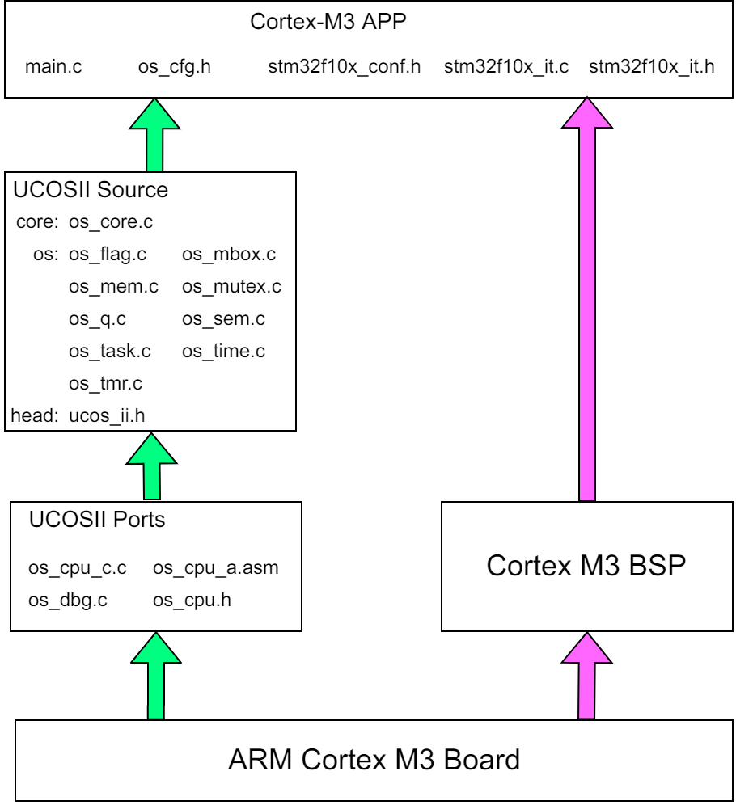

&emsp;&emsp;`UCOS-II`是一个可移植、可裁剪的、抢占式多任务实时内核，适用于多种微处理器。<!--more-->
&emsp;&emsp;`UCOS-II`的架构如下：



&emsp;&emsp;**Step one**：下面这几个文件可以完全不用修改：

``` cpp
+----------------------------
|core: os_core.c
|  os: os_flag.c  os_mbox.c
|      os_mem.c   os_mutex.c
|      os_q.c     os_sem.c
|      os_task.c  os_time.c
|      os_tmr.c
|head: ucos_ii.h
+----------------------------
```

&emsp;&emsp;**Step two**：`os_ports`在`uCOS-II\Ports\ARM-Cortex-M3\Generic\IAR`目录下。对于`os_cpu_c.c`文件，`stm32`的启动代码里有部分函数和该文件重复了，所以要把重复的代码删除，并在`os_cpu.h`中注释掉它们的外部声明。

``` cpp
#if 0
#define OS_CPU_CM3_NVIC_ST_CTRL    (*((volatile INT32U *)0xE000E010uL)) /* SysTick Ctrl & Status Reg. */
#define OS_CPU_CM3_NVIC_ST_RELOAD  (*((volatile INT32U *)0xE000E014uL)) /* SysTick Reload  Value Reg. */
#define OS_CPU_CM3_NVIC_ST_CURRENT (*((volatile INT32U *)0xE000E018uL)) /* SysTick Current Value Reg. */
#define OS_CPU_CM3_NVIC_ST_CAL     (*((volatile INT32U *)0xE000E01CuL)) /* SysTick Cal     Value Reg. */
#define OS_CPU_CM3_NVIC_PRIO_ST    (*((volatile INT8U  *)0xE000ED23uL)) /* SysTick Handler Prio  Reg. */
#define OS_CPU_CM3_NVIC_ST_CTRL_COUNT                    0x00010000uL   /* Count flag.                */
#define OS_CPU_CM3_NVIC_ST_CTRL_CLK_SRC                  0x00000004uL   /* Clock Source.              */
#define OS_CPU_CM3_NVIC_ST_CTRL_INTEN                    0x00000002uL   /* Interrupt enable.          */
#define OS_CPU_CM3_NVIC_ST_CTRL_ENABLE                   0x00000001uL   /* Counter mode.              */
#define OS_CPU_CM3_NVIC_PRIO_MIN                               0xFFu    /* Min handler prio.          */
#endif

#if 0
void OS_CPU_SysTickHandler ( void );
void OS_CPU_SysTickInit ( INT32U cnts );
#endif
```

&emsp;&emsp;在`os_cpu.h`文件中，同样把下面几个外部声明的函数注释掉：

``` cpp
#if 0
/* See OS_CPU_C.C */
void OS_CPU_SysTickHandler ( void );
void OS_CPU_SysTickInit ( void );
/* See BSP.C */
INT32U OS_CPU_SysTickClkFreq ( void );
#endif
```

&emsp;&emsp;`os_cpu_a.asm`是汇编代码。由于它里面有部分指令集不适合`stm32`，所以要进行如下修改：

- 将所有的`PUBLIC`改为`EXPORT`。
- 把对齐部分也改一下，也是因为指令集不匹配：

``` cpp
;       RSEG CODE:CODE:NOROOT(2)
    PRESERVE8
    AREA |.text|, CODE, READONLY, ALIGN=2
    THUMB
    REQUIRE8
```

注意，`AREA`不能顶头写，这是规定，不然会编译出错。
&emsp;&emsp;在`os_dbg.c`文件中，把`#define OS_COMPILER_OPT __root`改为`#define OS_COMPILER_OPT //__root`。
&emsp;&emsp;**Step three**：将`ST`的官方库导进去即可。
&emsp;&emsp;**Step four**：在`startup_stm32f10x_hd.s`文件中，将`PendSV_Handler`替换成`OS_CPU_PendSVHandler`。在`stm32f10x_it.c`文件中加头文件`ucos_ii.h`，并添加如下代码：

``` cpp
void SysTick_Handler ( void ) {
    OSIntEnter(); /* 进入中断 */
    OSTimeTick(); /* 调用ucos的时钟服务程序 */
    OSIntExit(); /* 触发任务切换软中断 */
}
```

在`os_cfg.h`中对部分功能进行剪裁：

``` cpp
#define OS_FLAG_EN        0
#define OS_MBOX_EN        0
#define OS_MEM_EN         0
#define OS_MUTEX_EN       0
#define OS_Q_EN           0
#define OS_SEM_EN         0
#define OS_TMR_EN         0
#define OS_DEBUG_EN       0
#define OS_APP_HOOKS_EN   0
#define OS_EVENT_MULTI_EN 0
```

至此系统移植完成了。下面就是写自己的`app`，`main.c`如下：

``` cpp
#include "led.h"
#include "sys.h"
#include "usart.h"
#include "stm32f10x.h"
#include "stm32f10x_conf.h"
#include "ucos_ii.h"

#define STARTUP_TASK_PRIO     8
#define STARTUP_TASK_STK_SIZE 80

void SysTick_init ( void ) {
    SysTick_Config ( SystemCoreClock / OS_TICKS_PER_SEC );
}

void TestLed1 ( void *p_arg ) {
    while ( 1 ) {
        LED0 = !LED0;
        OSTimeDlyHMSM ( 0, 0, 0, 500 );
    }
}

void TestLed2 ( void *p_arg ) {
    while ( 1 ) {
        printf ( "hello\r\n" );
        OSTimeDlyHMSM ( 0, 0, 2, 0 );
    }
}

static OS_STK task_testled1[STARTUP_TASK_STK_SIZE];
static OS_STK task_testled2[STARTUP_TASK_STK_SIZE];

int main ( void ) {
    SysTick_init();
    LED_Init();
    uart_init ( 9600 );
    OSInit();
    OSTaskCreate ( TestLed1, ( void * ) 0, &task_testled1[STARTUP_TASK_STK_SIZE - 1], STARTUP_TASK_PRIO - 1 );
    OSTaskCreate ( TestLed2, ( void * ) 0, &task_testled2[STARTUP_TASK_STK_SIZE - 1], STARTUP_TASK_PRIO );
    OSStart();
    return 0;
}
```