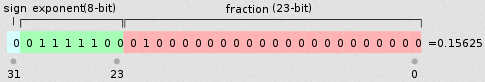
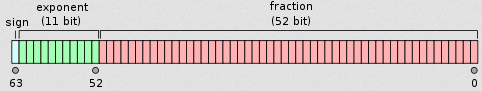

&emsp;&emsp;代码如下：<!--more-->

``` cpp
#include <stdio.h>

int main ( void ) {
    int num = 9; /* num是整型变量，设为9 */
    float *pFloat = ( float * ) &num; /* pFloat表示num的内存地址，但是设为浮点数 */
    printf ( "num的值为: %d\n", num ); /* 显示num的整型值 */
    printf ( "*pFloat的值为: %f\n", *pFloat ); /* 显示num的浮点值 */
    *pFloat = 9.0; /* 将num的值改为浮点数 */
    printf ( "num的值为: %d\n", num ); /* 显示num的整型值 */
    printf ( "*pFloat的值为: %f\n", *pFloat ); /* 显示num的浮点值 */
}
```

执行结果：

``` cpp
num的值为: 9
*pFloat的值为: 0.000000
num的值为: 1091567616
*pFloat的值为: 9.000000
```

`num`和`*pFloat`在内存中明明是同一个数，为什么浮点数和整数的解读结果会差别这么大？要理解这个结果，一定要搞懂浮点数在计算机内部的表示方法。
&emsp;&emsp;在讨论浮点数之前，先看一下整数在计算机内部是怎样表示的。

``` cpp
int num = 9;
```

上面这条命令声明了一个整数变量，类型为`int`，值为`9`(二进制写法为`1001`)。普通的`32`位计算机用`4`个字节表示`int`变量，所以`9`就被保存为`00000000_00000000_00000000_00001001`，写成`16`进制就是`0x00000009`。那么我们的问题就简化成：为什么`0x00000009`还原成浮点数，就成了`0.000000`？
&emsp;&emsp;先来看一个公式，计算浮点数的公式：根据国际标准`IEEE 754`，任意一个二进制浮点数$V$可以表示成下面的形式：

$$
V = (-1)^s * M * 2^E
$$

- $(-1)^s$表示符号位，当$s = 0$，$V$为正数；当$s = 1$，$V$为负数。
- $M$表示有效数字，大于等于`1`，小于`2`。
- $2^E$表示指数位。

&emsp;&emsp;举例来说，十进制的`5.0`写成二进制是`101.0`，相当于$1.01 \ast 2^2$。那么按照上面$V$的格式，可以得出`s = 0，M = 1.01，E = 2`。十进制的`-5.0`写成二进制是`-101.0`，相当于$-1.01 \ast 2^2$，那么`s = 1，M = 1.01，E = 2`。
&emsp;&emsp;`IEEE 754`规定，对于`32`位的浮点数，最高的`1`位是符号位`s`，接着的`8`位是指数`E`，剩下的`23`位为有效数字`M`。



&emsp;&emsp;对于`64`位的浮点数，最高的`1`位是符号位`S`，接着的`11`位是指数`E`，剩下的`52`位为有效数字`M`。



&emsp;&emsp;`IEEE 754`对有效数字`M`和指数`E`，还有一些特别规定：前面说过$1 ≤ M < 2$，也就是说，`M`可以写成`1.xxxxxx`的形式，其中`xxxxxx`表示小数部分。`IEEE 754`规定，在计算机内部保存`M`时，默认这个数的第一位总是`1`，因此可以被舍去，只保存后面的`xxxxxx`部分。比如保存`1.01`的时候，只保存`01`，等到读取的时候，再把第一位的`1`加上去。这样做的目的是节省`1`位有效数字。以`32`位浮点数为例，留给`M`只有`23`位，将第一位的`1`舍去以后，等于可以保存`24`位有效数字。
&emsp;&emsp;至于指数`E`，情况就比较复杂。首先`E`为一个无符号整数`unsigned int`。这意味着，如果`E`为`8`位，它的取值范围为`0`至`255`；如果`E`为`11`位，它的取值范围为`0`至`2047`。但是我们知道，科学计数法中的`E`是可以出现负数的，所以`IEEE 754`规定，`E`的真实值必须再减去一个中间数。对于`8`位(单精度)的`E`，这个中间数是`127`；对于`11`位(双精度)的`E`，这个中间数是`1023`。例如$2^{10}$的`E`是`10`，所以保存成`32`位浮点数时，必须保存成`10 + 127 = 137`，即`10001001`。然后，指数`E`还可以再分成三种情况：

1. `E`不全为`0`或不全为`1`：这时浮点数就采用上面的规则表示，即指数`E`的计算值减去`127`(或`1023`)，得到真实值，再将有效数字`M`前加上第一位的`1`。
2. `E`全为`0`：这时浮点数的指数`E`等于`1`至`127`(或者`1`至`1023`)，有效数字`M`不再加上第一位的`1`，而是还原为`0.xxxxxx`的小数。这样做是为了表示$±0$，以及接近于`0`的很小的数字。
3. `E`全为`1`：这时如果有效数字`M`全为`0`，表示`±无穷大`(正负取决于符号位`s`)；如果有效数字`M`不全为`0`，表示这个数不是一个数(`NaN`)。

&emsp;&emsp;下面让我们回到一开始的问题：为什么`0x00000009`还原成浮点数，就成了`0.000000`？首先将`0x00000009`拆分，得到第一位符号位`s = 0`，后面`8`位的指数`E = 00000000`，最后`23`位的有效数字`M = 000_0000_0000_0000_0000_1001`。由于指数`E`全为`0`，所以符合上面的第二种情况。因此，浮点数$V$就写成：

$$
V = (-1)^0 * 0.00000000000000000001001 * 2^{-126} = 1.001 * 2^{-146}
$$

显然，$V$是一个很小的接近于`0`的正数，所以用十进制小数表示就是`0.000000`。