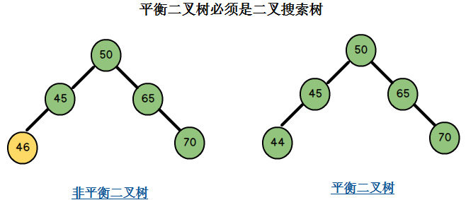
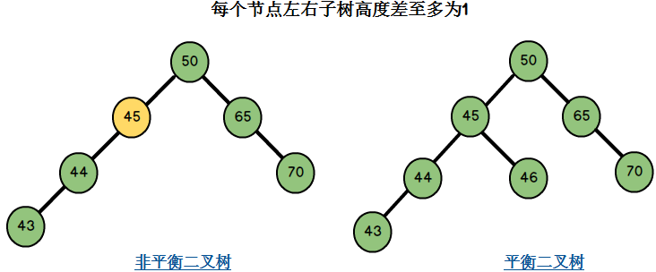
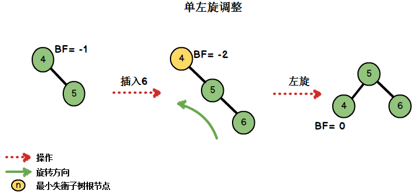
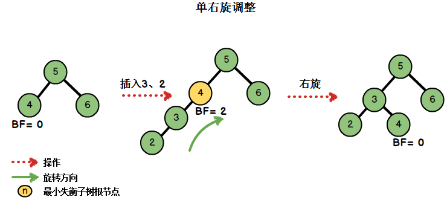
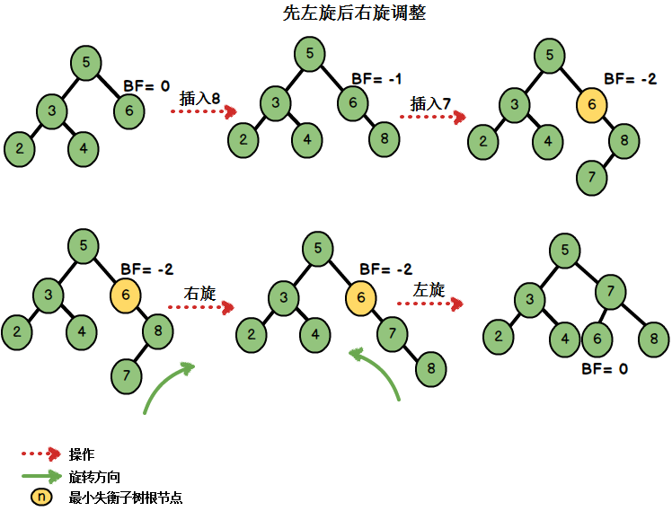
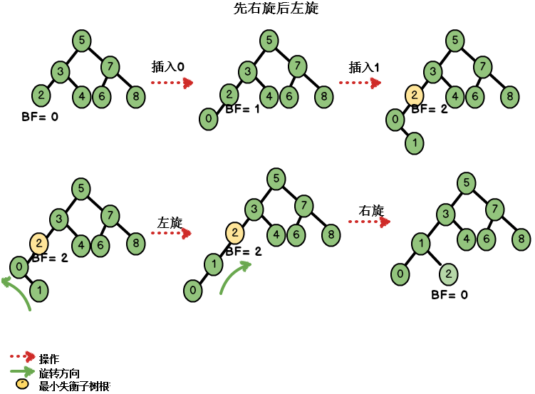
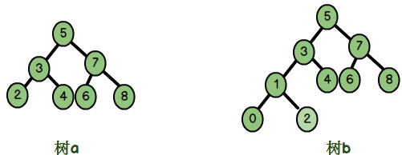

### AVL树简介

&emsp;&emsp;`AVL`树是最先发明的自平衡二叉查找树(`Self-Balancing Binary Search Tree`)，简称`平衡二叉树`。一棵`AVL`树有如下必要条件：<!--more-->

- 它必须是二叉查找树。
- 每个节点的左子树和右子树的高度差至多为`1`。



上图中左边二叉树的节点`45`的左孩子`46`比`45`大，不满足二叉搜索树的条件，因此它不是一棵平衡二叉树。右边二叉树满足二叉搜索树的条件，同时它满足条件二，因此它是一棵平衡二叉树。



左边二叉树的节点`45`左子树高度`2`，右子树高度`0`，左右子树高度差为`2 - 0 = 2`，不满足条件二。右边二叉树的节点均满足左右子树高度差至多为1，同时它满足二叉搜索树的要求，因此它是一棵平衡二叉树。
&emsp;&emsp;`AVL`树的查找、插入、删除操作在平均和最坏的情况下都是$O(log_{2}n)$，这得益于它时刻维护着二叉树的平衡。如果我们需要查找的集合本身没有顺序，在频繁查找的同时也经常的插入和删除，`AVL`树是不错的选择。不平衡的二叉查找树在查找时的效率是很低的，因此`AVL`如何维护二叉树的平衡是我们的学习重点。

### AVL树相关概念

&emsp;&emsp;平衡因子：将二叉树上节点的左子树高度减去右子树高度的值称为该节点的平衡因子`BF`(`Balance Factor`)。在图二右边的`AVL`树上：

- 节点`50`的左子树高度为`3`，右子树高度为`2`，`BF = 3 - 2 = 1`。
- 节点`45`的左子树高度为`2`，右子树高度为`1`，`BF = 2 - 1 = 1`。
- 节点`46`的左子树高度为`0`，右子树高度为`0`，`BF = 0 - 0 = 0`。
- 节点`65`的左子树高度为`0`，右子树高度为`1`，`BF = 0 - 1 = -1`。

对于平衡二叉树，`BF`的取值范围为`[-1, 1]`。如果发现某个节点的`BF`值不在此范围，则需要对树进行调整。
&emsp;&emsp;最小不平衡子树：距离插入节点最近的，且平衡因子的绝对值大于`1`的节点为根的子树。


上图中，左边二叉树的节点`45`的`BF`为`1`，插入节点`43`后，节点`45`的`BF`为`2`。节点`45`是距离插入点`43`最近的`BF`不在`[-1, 1]`范围内的节点，因此以节点`45`为根的子树为最小不平衡子树。

### AVL树的实现详解

&emsp;&emsp;1、节点结构如下：

``` cpp
struct AVLTreeNode {
    AVLTreeNode ( T value, AVLTreeNode<T> *l, AVLTreeNode<T> *r )
        : key ( value ), lchild ( l ), rchild ( r ) {}

    T key;
    int height;
    AVLTreeNode<T> *lchild;
    AVLTreeNode<T> *rchild;
};
```

`AVL`的节点结构为`AVLTreeNode`，它包括：

- `key`：节点的值。
- `height`：节点的高度，用于计算父节点的平衡因子。
- `lchild`：若节点有左子树，则`lchild`指向节点的左孩子，否则指向`nullptr`。
- `rchild`：若节点有右子树，则`rchild`指向节点的右孩子，否则指向`nullptr`。

在另外一些`AVL`节点的设计方案中，会把`BF`作为结点的一个属性存储起来，而在这里存储的是节点的高度，通过节点的高度也可以间接计算出节点的`BF`。例如节点`A`的左孩子的`height`为`2`，右孩子的`height`为`1`，那么节点`A`的平衡因子为`2 - 1 = 1`。
&emsp;&emsp;2、`AVL`树的抽象数据结构(`ADT`)：

``` cpp
template<typename T>
class AVLTree {
public:
    AVLTree(); /* 构造函数 */
    ~AVLTree(); /* 析构函数 */

    void preOrder(); /* 前序遍历AVL树 */
    void InOrder(); /* 中序遍历AVL树 */
    void postOrder(); /* 后序遍历AVL树 */

    void print_tree() const; /* 打印AVL树 */
    void destory(); /* 销毁AVL树 */

    void insert ( T key ); /* 插入指定值的节点 */
    void remove ( T key ); /* 移除指定值的节点 */

    AVLTreeNode<T> *search_recurse ( T key ); /* 利用递归算法进行指定值的查找 */
    AVLTreeNode<T> *search_iterator ( T key ); /* 利用迭代算法进行指定值的查找 */
    T minimum(); /* 返回AVL中的最小值 */
    T maximum(); /* 返回AVL中的最大值 */

    int height(); /* 返回树的高度 */
private:
    AVLTreeNode<T> *root; /* AVL树的根节点 */
private:
    void preOrder ( AVLTreeNode<T> *pnode ) const;
    void inOrder ( AVLTreeNode<T> *pnode ) const;
    void postOrder ( AVLTreeNode<T> *pnode ) const;

    void print_tree ( AVLTreeNode<T> *tree, T key, int direction ) const;
    void destory ( AVLTreeNode<T> *&pnode );

    int height ( AVLTreeNode<T> *pnode );
    int max ( int a, int b );

    AVLTreeNode<T> *insert ( AVLTreeNode<T> *&pnode, T key );
    AVLTreeNode<T> *remove ( AVLTreeNode<T> *&pnode, T key ); /* 删除AVL树中节点pdel，并返回被删除的节点 */

    AVLTreeNode<T> *minimum ( AVLTreeNode<T> *pnode ) const;
    AVLTreeNode<T> *maximum ( AVLTreeNode<T> *pnode ) const;

    AVLTreeNode<T> *search_recurse ( AVLTreeNode<T> *pnode, T key ) const;
    AVLTreeNode<T> *search_iterator ( AVLTreeNode<T> *pnode, T key ) const;

    AVLTreeNode<T> *leftRotation ( AVLTreeNode<T> *pnode ); /* 单旋：左旋操作 */
    AVLTreeNode<T> *rightRotation ( AVLTreeNode<T> *pnode ); /* 单旋：右旋操作 */
    AVLTreeNode<T> *leftRightRotation ( AVLTreeNode<T> *pnode ); /* 双旋：先左旋后右旋操作 */
    AVLTreeNode<T> *rightLeftRotation ( AVLTreeNode<T> *pnode ); /* 双旋：先右旋后左旋操作 */
};
```

这里定义了`AVL`树的类型`AVLTree`，它包含了：

- `AVL`树的根节点`root`，这是唯一的数据成员。
- 操作的外部接口与内部实现接口，例如`preOrder`为提供给用户使用的接口，接口声明为`public`；而`preOrder(AVLTreeNode* pnode)`是类内部为了递归操作所使用的接口，接口声明为`private`。
- 旋转操作(`rotation`)用来调整失去平衡的二叉树，四个内部接口针对四种失衡情况进行调整。

构造函数和析构函数如下：

``` cpp
/* 构造函数 */
template <typename T>
AVLTree<T>::AVLTree() : root ( nullptr ) {};

/* 析构函数 */
template <typename T>
AVLTree<T>::~AVLTree() {
    destory ( root );
}
```

&emsp;&emsp;3、`AVL`树的高度。我们的节点结构中并不存储结点的`BF`，取而代之的是节点的高度。一个节点的`BF`可由其左右子树的高度计算出来。我们提供返回一个节点高度的操作：

``` cpp
/* 返回一棵树的高度 */
template <typename T>
int AVLTree<T>::height ( AVLTreeNode<T> *pnode ) {
    if ( pnode != nullptr ) {
        return pnode->height;
    }

    return 0; /* 如果是空树，高度为0 */
};

template <typename T>
int AVLTree<T>::height() {
    return height ( root );
};
```

&emsp;&emsp;4、`AVL`树失衡调整。节点的插入或删除都有可能导致`AVL`树失去平衡，因此失衡调整是插入与删除操作的基础。`AVL`树的失衡调整可以分为四种情况，接下来逐一分析，假设我们要为数组`a[] = {4, 5, 6, 3, 2, 8, 7, 0, 1}`构建一棵`AVL`树。
&emsp;&emsp;情况一：左单旋转首先插入`{4, 5, 6}`，在插入元素`6`后出现不平衡的情况：



当我们在右子树插入右孩子导致`AVL`失衡时，我们需要进行单左旋调整。旋转围绕最小失衡子树的根节点进行。在删除新节点时也有可能会出现需要单左旋的情况。左旋代码如下：

``` cpp
/* 左旋转操作，返回旋转后的根节点 */
template<typename T>
AVLTreeNode<T> *AVLTree<T>::leftRotation ( AVLTreeNode<T> *proot ) {
    AVLTreeNode<T> *prchild = proot->rchild;
    proot->rchild = prchild->lchild;
    prchild->lchild = proot;
    /* 更新节点的高度值 */
    proot->height = max ( height ( proot->lchild ), height ( proot->rchild ) ) + 1;
    /* 更新节点的高度值 */
    prchild->height = max ( height ( prchild->lchild ), height ( prchild->rchild ) ) + 1;
    return prchild;
};
```

结合例子进行分析：参数`proot`为最小失衡子树的根节点，上图中为节点`4`；若节点`5`有左子树，则该左子树成为节点`4`的右子树；节点`4`成为节点`5`的左子树；最后更新节点的高度值。
&emsp;&emsp;情况二：右单旋转。我们继续插入元素`{3, 2}`，此时二叉树为：



插入`3`、`2`后出现了不平衡的情况。此时的插入情况是`在左子树上插入左孩子导致AVL树失衡`，我们需要进行单右旋调整。单右旋代码为：

``` cpp
/* 右旋转操作，返回旋转后的根节点 */
template <typename T>
AVLTreeNode<T> *AVLTree<T>::rightRotation ( AVLTreeNode<T> *proot ) {
    AVLTreeNode<T> *plchild = proot->lchild;
    proot->lchild = plchild->rchild;
    plchild->rchild = proot;
    proot->height = max ( height ( proot->lchild ), height ( proot->rchild ) ) + 1; /* 更新节点的高度值 */
    plchild->height = max ( height ( plchild->lchild ), height ( plchild->rchild ) ) + 1; /* 更新节点的高度值 */
    return plchild;
};
```

结合例子进行分析：参数`proot`为最小失衡子树的根节点，在上图中为节点`4`；若节点`3`有右子树，则该右子树成为节点`4`的左子树；节点`4`成为节点`3`的左子树；调整节点的高度值。
&emsp;&emsp;情况三：先左旋后右旋。需要进行两次旋转的原因是第一次旋转后，`AVL`树仍旧处于不平衡的状态，第二次旋转再次进行调整。我们继续插入元素`{8, 7}`：



这种情况总结起来就是`在右子树上插入左孩子导致AVL树失衡`，此时我们需要进行先右旋后左旋的调整。调整的代码为：

``` cpp
/* 先右旋再左旋，参数proot为最小失衡子树的根节点，返回旋转后的根节点 */
template<typename T>
AVLTreeNode<T> *AVLTree<T>::rightLeftRotation ( AVLTreeNode<T> *proot ) {
    proot->rchild = rightRotation ( proot->rchild );
    return leftRotation ( proot );
};
```

首先对最小不平衡子树的根节点(也就是节点`6`)的右孩子(也就是`8`)进行右旋操作，再对节点`6`进行一次左旋操作。
&emsp;&emsp;情况四：先左旋后右旋。根据对称性原理，当`在左子树上插入右孩子导致AVL树失衡`，此时需要进行先左旋后右旋的调整。接着插入节点`{0, 1}`：



调整的代码为：

``` cpp
/* 先左后右做旋转，参数proot为最小失衡子树的根节点，该函数返回旋转后的根节点 */
template <typename T>
AVLTreeNode<T> *AVLTree<T>::leftRightRotation ( AVLTreeNode<T> *proot ) {
    proot->lchild = leftRotation ( proot->lchild );
    return rightRotation ( proot );
};
```

首先对最小不平衡子树的根节点(也就是节点`2`)的左孩子(也就是`0`)进行左旋操作，再对节点`2`进行一次右旋操作。
&emsp;&emsp;四种失衡调整如下：

类型        | 使用情形
------------|--------
单左旋      | 在左子树插入左孩子节点，使得平衡因子绝对值由`1`增至`2`
单右旋      | 在右子树插入右孩子节点，使得平衡因子绝对值由`1`增至`2`
先左旋后右旋 | 在左子树插入右孩子节点，使得平衡因子绝对值由`1`增至`2`
先右旋后左旋 | 在右子树插入左孩子节点，使得平衡因子绝对值由`1`增至`2`

&emsp;&emsp;5、插入新节点。其实上面已经展示了一个完整的插入过程：

``` cpp
/* 插入操作，递归地进行插入，该函数返回插入后的根节点 */
template <typename T>
AVLTreeNode<T> *AVLTree<T>::insert ( AVLTreeNode<T> *&pnode, T key ) {
    if ( pnode == nullptr ) { /* 寻找到插入的位置 */
        pnode = new AVLTreeNode<T> ( key, nullptr, nullptr );
    } else if ( key > pnode->key ) { /* 插入值比当前结点值大，插入到当前结点的右子树上 */
        pnode->rchild = insert ( pnode->rchild, key );

        if ( height ( pnode->rchild ) - height ( pnode->lchild ) == 2 ) { /* 插入后出现失衡 */
            if ( key > pnode->rchild->key ) { /* 情况一：插入右子树的右节点，进行左旋 */
                pnode = leftRotation ( pnode );
            } else if ( key < pnode->rchild->key ) { /* 情况三：插入右子树的左节点，进行先右再左旋转 */
                pnode = rightLeftRotation ( pnode );
            }
        }
    } else if ( key < pnode->key ) { /* 插入值比当前节点值小，插入到当前结点的左子树上 */
        pnode->lchild = insert ( pnode->lchild, key );

        if ( height ( pnode->lchild ) - height ( pnode->rchild ) == 2 ) { /* 如果插入导致失衡 */
            if ( key < pnode->lchild->key ) { /* 情况二：插入到左子树的左孩子节点上，进行右旋 */
                pnode = rightRotation ( pnode );
            } else if ( key > pnode->lchild->key ) {
                pnode = leftRightRotation ( pnode ); /* 情况四：插入到左子树的右孩子节点上，进行先左后右旋转 */
            }
        }
    }

    pnode->height = max ( height ( pnode->lchild ), height ( pnode->rchild ) ) + 1;
    return pnode;
};
```

&emsp;&emsp;6、删除节点。删除节点也可能导致`AVL`树的失衡，实际上删除节点和插入节点是一种互逆的操作：

- 删除右子树的节点导致`AVL`树失衡时，相当于在左子树插入节点导致`AVL`树失衡，即情况情况二或情况四。
- 删除左子树的节点导致`AVL`树失衡时，相当于在右子树插入节点导致`AVL`树失衡，即情况情况一或情况三。

另外，`AVL`树也是一棵二叉排序树，因此在删除节点时也要维护二叉排序树的性质。删除的代码如下：

``` cpp
/* 删除指定元素 */
template<typename T>
AVLTreeNode<T> *AVLTree<T>::remove ( AVLTreeNode<T> *&pnode, T key ) {
    if ( pnode != nullptr ) {
        if ( key == pnode->key ) { /* 找到删除的节点 */
            /* 因AVL也是二叉排序树，删除节点要维护其二叉排序树的条件 */
            if ( pnode->lchild != nullptr && pnode->rchild != nullptr ) { /* 若左右都不为空 */
                /* 左子树比右子树高，在左子树上选择节点进行替换 */
                if ( height ( pnode->lchild ) > height ( pnode->rchild ) ) {
                    /* 使用左子树最大节点来代替被删节点，而删除该最大节点 */
                    AVLTreeNode<T> *ppre = maximum ( pnode->lchild ); /* 左子树最大节点 */
                    pnode->key = ppre->key; /* 将最大节点的值覆盖当前结点 */
                    pnode->lchild = remove ( pnode->lchild, ppre->key ); /* 递归地删除最大节点 */
                } else { /* 在右子树上选择节点进行替换 */
                    /* 使用最小节点来代替被删节点，而删除该最小节点 */
                    AVLTreeNode<T> *psuc = minimum ( pnode->rchild ); /* 右子树的最小节点 */
                    pnode->key = psuc->key; /* 将最小节点值覆盖当前结点 */
                    pnode->rchild = remove ( pnode->rchild, psuc->key ); /* 递归地删除最小节点 */
                }
            } else {
                AVLTreeNode<T> *ptemp = pnode;

                if ( pnode->lchild != nullptr ) {
                    pnode = pnode->lchild;
                } else if ( pnode->rchild != nullptr ) {
                    pnode = pnode->rchild;
                }

                delete ptemp;
                return nullptr;
            }
        } else if ( key > pnode->key ) { /* 要删除的节点比当前节点大，则在右子树进行删除 */
            pnode->rchild = remove ( pnode->rchild, key );

            /* 删除右子树节点导致不平衡：相当于情况二或情况四 */
            if ( height ( pnode->lchild ) - height ( pnode->rchild ) == 2 ) {
                /* 相当于在左子树上插入右节点造成的失衡(情况四) */
                if ( height ( pnode->lchild->rchild ) > height ( pnode->lchild->lchild ) ) {
                    pnode = leftRightRotation ( pnode );
                } else { /* 相当于在左子树上插入左节点造成的失衡(情况二) */
                    pnode = rightRotation ( pnode );
                }
            }
        } else if ( key < pnode->key ) { /* 要删除的节点比当前节点小，则在左子树进行删除 */
            pnode->lchild = remove ( pnode->lchild, key );

            /* 删除左子树节点导致不平衡：相当于情况三或情况一 */
            if ( height ( pnode->rchild ) - height ( pnode->lchild ) == 2 ) {
                /* 相当于在右子树上插入左节点造成的失衡(情况三) */
                if ( height ( pnode->rchild->lchild ) > height ( pnode->rchild->rchild ) ) {
                    pnode = rightLeftRotation ( pnode );
                } else { /* 相当于在右子树上插入右节点造成的失衡(情况一) */
                    pnode = leftRotation ( pnode );
                }
            }
        }

        return pnode;
    }

    return nullptr;
};
```

删除节点时，如果节点同时拥有左子树和右子树，则在高度较低的子树上选择最大(或最小)元素进行替换，这样能保证替换后不会再出现失衡的现象。至此，`AVL`树较为复杂的部分都已经分析完毕。剩下的其他操作是普通的二叉排序树共通的操作。
&emsp;&emsp;7、查找元素。二叉树是一种递归的定义，因此二叉树的许多操作都可以通过递归简单地实现，例如遍历二叉树、查找指定元素、销毁二叉树等。基于二叉排序树的特殊性质，元素查找操作也能够使用非递归算法简单地实现，我们提供递归与非递归两种版本的元素查找算法：

``` cpp
/* 递归查找指定元素 */
template <typename T>
AVLTreeNode<T> *AVLTree<T>::search_recurse ( T key ) {
    return search_recurse ( root, key );
};

template <typename T>
AVLTreeNode<T> *AVLTree<T>::search_recurse ( AVLTreeNode<T> *pnode, T key ) const {
    if ( pnode != nullptr ) {
        if ( key == pnode->key ) {
            return pnode;
        }

        if ( key > pnode->key ) {
            return search_recurse ( pnode->rchild, key );
        } else {
            return search_recurse ( pnode->lchild, key );
        }
    }

    return nullptr;
};

/* 非递归查找指定元素 */
template <typename T>
AVLTreeNode<T> *AVLTree<T>::search_iterator ( T key ) {
    return search_iterator ( root, key );
};

template <typename T>
AVLTreeNode<T> *AVLTree<T>::search_iterator ( AVLTreeNode<T> *pnode, T key ) const {
    while ( pnode != nullptr ) {
        if ( pnode->key == key ) {
            return pnode;
        } else if ( key > pnode->key ) {
            pnode = pnode->rchild;
        } else {
            pnode = pnode->lchild;
        }
    }

    return nullptr;
};
```

&emsp;&emsp;8、遍历二叉树。对于二叉树的遍历，如果区分左右孩的顺序，共有三种遍历方式：

- 先序遍历，或称前序遍历。
- 中序遍历，对二叉排序树来说，中序遍历刚好输出一个非递减的序列(假设我们对元素的访问操作是`输出`)。
- 后序遍历。

遍历操作可以对二叉树的节点进行访问，这个访问是个抽象的词语。访问可以是输出节点值，或者是销毁这个节点或其他允许对节点进行的操作。我们就下图的`AVL`树介绍遍历算法：



&emsp;&emsp;先序遍历如下：

``` cpp
template<typename T>
void AVLTree<T>::preOrder ( AVLTreeNode<T> *pnode ) const {
    if ( pnode != nullptr ) {
        cout << pnode->key << endl;
        preOrder ( pnode->lchild );
        preOrder ( pnode->rchild );
    }
};

template<typename T>
void AVLTree<T>::preOrder() {
    preOrder ( root );
};
```

若二叉树为空，则空操作返回，否则先访问根节点，然后前序遍历左子树，再前序遍历右子树(简记为`VLR`)。前序遍历树`a`为`5 3 2 4 7 6 8`；前序遍历树`b`为`5 3 2 4 1 0 7 6 8`。
&emsp;&emsp;中序遍历如下：

``` cpp
template<typename T>
void AVLTree<T>::inOrder ( AVLTreeNode<T> *pnode ) const {
    if ( pnode != nullptr ) {
        inOrder ( pnode->lchild );
        cout << pnode->key << endl;
        inOrder ( pnode->rchild );
    }
};

template<typename T>
void AVLTree<T>::InOrder() {
    inOrder ( root );
};
```

若二叉树为空，则空操作返回，否则从根节点开始，中序遍历根节点的左子树，然后访问根节点，最后中序遍历右子树(简记为`LVR`)。中序遍历树`a`为`2 3 4 5 6 7 8`；中序遍历树`b`为`0 1 2 3 4 5 6 7 8`。
&emsp;&emsp;后序遍历如下：

``` cpp
template<typename T>
void AVLTree<T>::postOrder ( AVLTreeNode<T> *pnode ) const {
    if ( pnode != nullptr ) {
        postOrder ( pnode->lchild );
        postOrder ( pnode->rchild );
        cout << pnode->key << endl;
    }
}

template<typename T>
void AVLTree<T>::postOrder() {
    postOrder ( root );
};
```

若树为空，则返回空操作，否则从左到右先叶子后节点的方式遍历访问左右子树，左右子树都访问结束，才访问根节点(简称为`LRV`)。后序遍历树`a`为`2 4 3 6 8 7 5`；后序遍历树`b`为`0 2 1 4 3 6 8 7 5`。
&emsp;&emsp;9、`AVL`树的销毁。采用后序遍历`AVL`树来销毁二叉树，即先销毁根节点的左子树，然后销毁根节点的右子树，最后才销毁根节点：

``` cpp
/* 销毁AVL树 */
template<typename T>
void AVLTree<T>::destory ( AVLTreeNode<T> *&pnode ) {
    if ( pnode != nullptr ) {
        destory ( pnode->lchild ); /* 递归销毁左子树 */
        destory ( pnode->rchild ); /* 递归销毁右子树 */
        delete pnode; /* 销毁根节点 */
        pnode = nullptr;
    }
};

template<typename T>
void AVLTree<T>::destory() {
    destory ( root );
}
```

&emsp;&emsp;10、求最大最小值。二叉排序树的最小值位于最左节点，最大值位于其最右节点：

``` cpp
/* 返回树中最大节点值 */
template <typename T>
AVLTreeNode<T> *AVLTree<T>::maximum ( AVLTreeNode<T> *pnode ) const {
    if ( pnode != nullptr ) {
        while ( pnode->rchild != nullptr ) {
            pnode = pnode->rchild;
        }

        return pnode;
    }

    return nullptr;
};

template<typename T>
T AVLTree<T>::maximum() {
    AVLTreeNode<T> *presult = maximum ( root );

    if ( presult != nullptr ) {
        return presult->key;
    }
};

/* 返回树中最小节点值 */
template <typename T>
AVLTreeNode<T> *AVLTree<T>::minimum ( AVLTreeNode<T> *pnode ) const {
    if ( pnode != nullptr ) {
        while ( pnode->lchild != nullptr ) {
            pnode = pnode->lchild;
        }

        return pnode;
    }

    return nullptr;
};

template<typename T>
T AVLTree<T>::minimum() {
    AVLTreeNode<T> *presult = minimum ( root );

    if ( presult != nullptr ) {
        return presult->key;
    }
};
```

&emsp;&emsp;11、打印树的信息：

``` cpp
/* 打印二叉查找树
key       -- 节点的键值
direction -- 0，表示该节点是根节点；
            -1，表示该节点是它的父结点的左孩子；
             1，表示该节点是它的父结点的右孩子 */
template <class T>
void AVLTree<T>::print_tree ( AVLTreeNode<T> *tree, T key, int direction ) const {
    if ( tree != nullptr ) {
        if ( direction == 0 ) { /* tree是根节点 */
            cout << setw ( 2 ) << tree->key << " is root" << endl;
        } else { /* tree是分支节点 */
            cout << setw ( 2 ) << tree->key << " is " << setw ( 2 ) << key << "'s " \
                 << setw ( 12 ) << ( direction == 1 ? "right child" : "left child" ) << endl;
        }

        print_tree ( tree->lchild, tree->key, -1 );
        print_tree ( tree->rchild, tree->key, 1 );
    }
}

template <class T>
void AVLTree<T>::print_tree() const {
    if ( root != nullptr ) {
        print_tree ( root, root->key, 0 );
    }
}
```

&emsp;&emsp;12、测试代码如下：

``` cpp
#include "AVLTree.h"
#include <iostream>

using namespace std;

int main ( void ) {
    AVLTree<int> a;

    for ( int i = 0; i <= 8; i++ ) {
        a.insert ( i );
    }

    cout << "树高：" << a.height() << endl;
    cout << "前序遍历:" << endl;
    a.preOrder();
    cout << "中序遍历:" << endl;
    a.InOrder();
    cout << "后序遍历:" << endl;
    a.postOrder();
    a.print_tree();
    cout << "删除元素10" << endl;
    a.remove ( 10 );
    AVLTreeNode<int> *b = a.search_iterator ( 10 );

    if ( b != nullptr ) {
        cout << b->key;
    } else {
        cout << "无此元素" << endl;
    }

    getchar();
    return 0;
}
```

&emsp;&emsp;**补充说明**：平衡二叉树的结果不是唯一的。