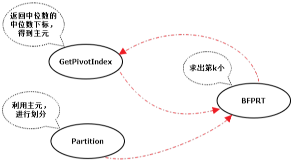

&emsp;&emsp;在一堆数中求其前`k`大或前`k`小的问题，简称`TOP-K`问题。而目前解决`TOP-K`问题最有效的算法即是`BFPRT`算法，又称为`中位数的中位数`算法，该算法由`Blum`、`Floyd`、`Pratt`、`Rivest`、`Tarjan`提出，最坏时间复杂度为`O(n)`。<!--more-->
&emsp;&emsp;在首次接触`TOP-K`问题时，我们的第一反应就是可以先对所有数据进行一次排序，然后取其前`k`即可，但是这么做有两个问题：

- 快速排序的平均复杂度为`O(nlogn)`，但最坏时间复杂度为`O(n^2)`，不能始终保证较好的复杂度。
- 我们只需要前`k`大的，而对其余不需要的数也进行了排序，浪费了大量排序时间。

除这种方法之外，堆排序也是一个比较好的选择，可以维护一个大小为`k`的堆，时间复杂度为`O(nlogk)`。

&emsp;&emsp;那是否还存在更有效的方法呢？`BFPRT`算法的做法就是在快速排序的基础上，通过判断主元位置与`k`的大小使递归的规模变小，其次通过修改快速排序中主元的选取方法来降低快速排序在最坏情况下的时间复杂度。下面先来简单回顾下快速排序的过程，以升序为例：

1. 选取主元(数组中随机一个元素)。
2. 以选取的主元为分界点，把小于主元的放在左边，大于主元的放在右边。
3. 分别对左边和右边进行递归，重复上述过程。

&emsp;&emsp;`BFPRT`算法步骤如下：
&emsp;&emsp;第一步选取主元：

1. 将`n`个元素划分为`floor(n/5)`个组，每组`5`个元素，若有剩余，舍去。
2. 使用插入排序找到`floor(n/5)`个组中每一组的中位数。
3. 对于`2`中找到的所有中位数，调用`BFPRT`算法求出它们的中位数，作为主元。

第二步以`3`选取的主元为分界点，把小于主元的放在左边，大于主元的放在右边。第三步判断主元的位置与`k`的大小，有选择的对左边或右边递归。



``` cpp
#include <iostream>
#include <algorithm>

using namespace std;

int BFPRT(int array[], int left, int right, const int &k); /* 返回中位数的中位数下标 */

int InsertSort(int array[], int left, int right) { /* 插入排序，返回中位数下标 */
    int temp;
    int j;

    for (int i = left + 1; i <= right; i++) {
        temp = array[i];
        j = i - 1;

        while (j >= left && array[j] > temp) {
            array[j + 1] = array[j--];
        }

        array[j + 1] = temp;
    }

    return ((right - left) >> 1) + left;
}

int GetPivotIndex(int array[], int left, int right) {
    if (right - left < 5) {
        return InsertSort(array, left, right);
    }

    int sub_right = left - 1;

    for (int i = left; i + 4 <= right; i += 5) {
        int index = InsertSort(array, i, i + 4); /* 找到五个元素的中位数的下标 */
        swap(array[++sub_right], array[index]); /* 依次放在左侧 */
    }

    return BFPRT(array, left, sub_right, ((sub_right - left + 1) >> 1) + 1);
}

/* 利用中位数的中位数的下标进行划分，返回分界线下标 */
int Partition(int array[], int left, int right, int pivot_index) {
    swap(array[pivot_index], array[right]); /* 把主元放置于末尾 */
    int divide_index = left; /* 跟踪划分的分界线 */

    for (int i = left; i < right; i++) {
        if (array[i] < array[right]) {
            swap(array[divide_index++], array[i]); /* 比主元小的都放在左侧 */
        }
    }

    swap(array[divide_index], array[right]); /* 最后把主元换回来 */
    return divide_index;
}

int BFPRT(int array[], int left, int right, const int &k) {
    int pivot_index = GetPivotIndex(array, left, right); /* 得到中位数的中位数下标 */
    int divide_index = Partition(array, left, right, pivot_index); /* 进行划分，返回划分边界 */
    int num = divide_index - left + 1;

    if (num == k) {
        return divide_index;
    } else if (num > k) {
        return BFPRT(array, left, divide_index - 1, k);
    } else {
        return BFPRT(array, divide_index + 1, right, k - num);
    }
}

int main() {
    int k = 5;
    int array[10] = { 1, 1, 2, 3, 1, 5, -1, 7, 8, -10 };
    cout << "原数组: ";

    for (int i = 0; i < 10; i++) {
        cout << array[i] << " ";
    }

    cout << endl;
    cout << "第" << k << "小值为: " << array[BFPRT(array, 0, 9, k)] << endl;
    cout << "变换后的数组: ";

    for (int i = 0; i < 10; i++) {
        cout << array[i] << " ";
    }

    cout << endl;
    return 0;
}
```

执行结果：

``` cpp
原数组: 1 1 2 3 1 5 -1 7 8 -10
第5小值为: 1
变换后的数组: -10 -1 1 1 1 2 3 5 7 8
```