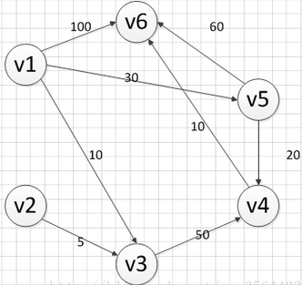

&emsp;&emsp;迪杰斯特拉算法是由荷兰计算机科学家狄克斯特拉于`1959`年提出的，因此又叫`狄克斯特拉算法`。它是从一个顶点到其余各顶点的最短路径算法，解决的是有向图中最短路径问题。迪杰斯特拉算法主要特点是以起始点为中心向外层层扩展，直到扩展到终点为止。<!--more-->
&emsp;&emsp;迪科斯彻算法使用了广度优先搜索解决赋权有向图或者无向图的单源最短路径问题，算法最终得到一个最短路径树。该算法常用于路由算法或者作为其他图算法的一个子模块。
&emsp;&emsp;`Dijkstra`算法采用的是一种贪心的策略，声明一个数组`dis`来保存源点到各个顶点的最短距离和一个保存已经找到了最短路径的顶点的集合`T`。初始时，源点`s`的路径权重被赋为`0`(`dis[s] = 0`)。若对于顶点`s`，存在能直接到达的边`(s, m)`，则把`dis[m]`设为`w(s, m)`，同时把所有其他(`s`不能直接到达的)顶点的路径长度设为无穷大。初始时，集合`T`只有顶点`s`。然后从`dis`数组选择最小值，则该值就是源点`s`到该值对应的顶点的最短路径，并且把该点加入到`T`中，此时完成一个顶点。我们需要看看新加入的顶点是否可以到达其他顶点，并且看看通过该顶点到达其他点的路径长度是否比源点直接到达短，如果是，那么就替换这些顶点在`dis`中的值。然后又从`dis`中找出最小值，重复上述动作，直到`T`中包含了图的所有顶点。
&emsp;&emsp;下面求出从顶点`v1`到其他各个顶点的最短路径：



首先先声明一个`dis`数组，该数组初始化的值为：

<table>
<tr align="center">
    <td>0</td><td>∞</td><td>10</td><td>∞</td><td>30</td><td>100</td>
</tr>
</table>

顶点集`T`的初始化为`T = {v1}`。既然是求`v1`顶点到其余各个顶点的最短路程，那就先找一个离`1`号顶点最近的顶点。通过数组`dis`可知，当前离`v1`顶点最近是`v3`顶点。当选择了`2`号顶点后，`dis[2]`(下标从`0`开始)的值就已经从`估计值`变为了`确定值`，即`v1`顶点到`v3`顶点的最短路程就是当前`dis[2]`值，然后将`V3`加入到`T`中。目前离`v1`顶点最近的是`v3`顶点，并且这个图所有的边都是正数，那么肯定不可能通过第三个顶点中转，使得`v1`顶点到`v3`顶点的路程进一步缩短了。因为`v1`顶点到其它顶点的路程肯定没有`v1`到`v3`顶点短。
&emsp;&emsp;既然确定了一个顶点的最短路径，下面就要根据这个新入的顶点`V3`会有出度，发现以`v3`为弧尾的有`<v3, v4>`，那么我们看看路径`v1-v3-v4`的长度是否比`v1-v4`短。其实这个已经是很明显的了，因为`dis[3]`代表的就是`v1-v4`的长度为无穷大，而`v1-v3-v4`的长度为`10 + 50 = 60`，所以更新`dis[3]`的值，得到如下结果：

<table>
<tr align="center">
    <td>0</td><td>∞</td><td>10</td><td>60</td><td>30</td><td>100</td>
</tr>
</table>

因此`dis[3]`要更新为`60`。这个过程有个专业术语叫做`松弛`，即`v1`顶点到`v4`顶点的路程即`dis[3]`，通过`<v3, v4>`这条边松弛成功。这便是`Dijkstra`算法的主要思想：通过`边`来松弛`v1`顶点到其余各个顶点的路程。
&emsp;&emsp;然后，我们又从除`dis[2]`和`dis[0]`外的其他值中寻找最小值，发现`dis[4]`的值最小。通过之前解释的原理，可以知道`v1`到`v5`的最短距离就是`dis[4]`的值，然后把`v5`加入到集合`T`中。随后考虑`v5`的出度是否会影响我们的数组`dis`的值，`v5`有两条出度，即`<v5, v4>`和`<v5, v6>`，然后我们发现`v1-v5-v4`的长度为`50`，而`dis[3]`的值为`60`，所以我们要更新`dis[3]`的值。另外，`v1-v5-v6`的长度为`90`，而`dis[5]`为`100`，所以我们需要更新`dis[5]`的值。更新后的`dis`数组如下图：

<table>
<tr align="center">
    <td>0</td><td>∞</td><td>10</td><td>50</td><td>30</td><td>90</td>
</tr>
</table>

&emsp;&emsp;继续从`dis`中选择未确定的顶点的值中选择一个最小的值，发现`dis[3]`的值是最小的，所以把`v4`加入到集合`T`中，此时集合`T = {v1, v3, v5, v4}`。考虑`v4`的出度是否会影响我们的数组`dis`的值，`v4`有一条出度`<v5, v4>`，我们发现`v1-v5-v4-v6`的长度为`60`，而`dis[5]`的值为`90`，所以我们要更新`dis[5]`的值，更新后的`dis`数组如下图：

<table>
<tr align="center">
    <td>0</td><td>∞</td><td>10</td><td>50</td><td>30</td><td>60</td>
</tr>
</table>

使用同样原理，分别确定了`v6`和`v2`的最短路径，最后`dis`的数组的值如下：

<table>
<tr align="center">
    <td>0</td><td>∞</td><td>10</td><td>50</td><td>30</td><td>60</td>
</tr>
</table>

从图中可以发现`v1-v2`的值为`∞`，代表没有路径从`v1`到达`v2`。所以得到的最后的结果为：

``` cpp
起点  终点  最短路径           长度
----------------------------------
v1    v2    无                ∞
      v3    {v1, v3}          10
      v4    {v1, v5, v4}      50
      v5    {v1, v5}          30
      v6    {v1, v5, v4, v6}  60
```

&emsp;&emsp;`Dijkstra.h`如下：

``` cpp
#include <iostream>
#include <string>
#include <limits.h>

using namespace std;

/* 本程序使用Dijkstra算法实现求解最短路径的问题，采用邻接矩阵来存储图 */
struct Dis { /* 记录起点到每个顶点的最短路径的信息 */
    string path;
    int value;
    bool visit;
    Dis() {
        visit = false;
        value = 0;
        path = "";
    }
};

class Graph_DG {
private:
    int vexnum; /* 图的顶点个数 */
    int edge;   /* 图的边数 */
    int **arc;  /* 邻接矩阵 */
    Dis *dis;   /* 记录各个顶点最短路径的信息 */
public:
    Graph_DG(int vexnum, int edge); /* 构造函数 */
    ~Graph_DG(); /* 析构函数 */
    /* 判断我们每次输入的的边的信息是否合法，顶点从1开始编号 */
    bool check_edge_value(int start, int end, int weight);
    void createGraph(); /* 创建图 */
    void print(); /* 打印邻接矩阵 */
    void Dijkstra(int begin); /* 求最短路径 */
    void print_path(int); /* 打印最短路径 */
};
```

`Dijkstra.cpp`如下：

``` cpp
#include "Dijkstra.h"

Graph_DG::Graph_DG(int vexnum, int edge) { /* 构造函数 */
    /* 初始化顶点数和边数 */
    this->vexnum = vexnum;
    this->edge = edge;
    /* 为邻接矩阵开辟空间和赋初值 */
    arc = new int *[this->vexnum];
    dis = new Dis[this->vexnum];

    for (int i = 0; i < this->vexnum; i++) {
        arc[i] = new int[this->vexnum];

        for (int k = 0; k < this->vexnum; k++) {
            arc[i][k] = INT_MAX; /* 邻接矩阵初始化为无穷大 */
        }
    }
}

Graph_DG::~Graph_DG() { /* 析构函数 */
    delete[] dis;

    for (int i = 0; i < this->vexnum; i++) {
        delete this->arc[i];
    }

    delete arc;
}

/* 判断我们每次输入的的边的信息是否合法，顶点从1开始编号 */
bool Graph_DG::check_edge_value(int start, int end, int weight) {
    if (start < 1 || end < 1 || start > vexnum || end > vexnum || weight < 0) {
        return false;
    }

    return true;
}

void Graph_DG::createGraph() {
    cout << "请输入每条边的起点和终点(顶点编号从1开始)以及其权重:" << endl;
    int start;
    int end;
    int weight;
    int count = 0;

    while (count != this->edge) {
        cin >> start >> end >> weight;

        /* 首先判断边的信息是否合法 */
        while (!this->check_edge_value(start, end, weight)) {
            cout << "输入的边的信息不合法，请重新输入" << endl;
            cin >> start >> end >> weight;
        }

        arc[start - 1][end - 1] = weight; /* 对邻接矩阵对应上的点赋值 */
                                          // 无向图添加上这行代码："arc[end - 1][start - 1] = weight;"
        ++count;
    }
}

void Graph_DG::print() {
    cout << "图的邻接矩阵为:" << endl;
    int count_row = 0; /* 打印行的标签 */
    int count_col = 0; /* 打印列的标签 */

    while (count_row != this->vexnum) { /* 开始打印 */
        count_col = 0;

        while (count_col != this->vexnum) {
            if (arc[count_row][count_col] == INT_MAX) {
                cout << "∞" << " ";
            } else {
                cout << arc[count_row][count_col] << " ";
            }

            ++count_col;
        }

        cout << endl;
        ++count_row;
    }
}

void Graph_DG::Dijkstra(int begin) {
    /* 首先初始化dis数组 */
    int i;

    for (i = 0; i < this->vexnum; i++) {
        /* 设置当前的路径 */
        dis[i].path = "v" + to_string(begin) + "-->v" + to_string(i + 1);
        dis[i].value = arc[begin - 1][i];
    }

    /* 设置起点的到起点的路径为0 */
    dis[begin - 1].value = 0;
    dis[begin - 1].visit = true;
    int count = 1;

    /* 计算剩余的顶点的最短路径(剩余“this->vexnum-1”个顶点) */
    while (count != this->vexnum) {
        int temp = 0; /* temp用于保存当前dis数组中最小的那个下标 */
        int min = INT_MAX; /* min记录的当前的最小值 */

        for (i = 0; i < this->vexnum; i++) {
            if (!dis[i].visit && dis[i].value < min) {
                min = dis[i].value;
                temp = i;
            }
        }

        // cout << temp + 1 << "  "<<min << endl;
        /* 把temp对应的顶点加入到已经找到的最短路径的集合中 */
        dis[temp].visit = true;
        ++count;

        for (i = 0; i < this->vexnum; i++) {
            /* 注意这里的条件“arc[temp][i] != INT_MAX”必须加，不然会出现溢出，从而造成程序异常 */
            if (!dis[i].visit && arc[temp][i] != INT_MAX && (dis[temp].value + arc[temp][i]) < dis[i].value) {
                /* 更新最短路径和长度 */
                dis[i].value = dis[temp].value + arc[temp][i];
                dis[i].path = dis[temp].path + "-->v" + to_string(i + 1);
            }
        }
    }
}

void Graph_DG::print_path(int begin) {
    string str;
    str = "v" + to_string(begin);
    cout << "以" << str << "为起点的图的最短路径为:" << endl;

    for (int i = 0; i != this->vexnum; i++) {
        if (dis[i].value != INT_MAX) {
            cout << dis[i].path << "=" << dis[i].value << endl;
        } else {
            cout << dis[i].path << "是无最短路径的" << endl;
        }
    }
}
```

`main.cpp`如下：

``` cpp
#include "Dijkstra.h"

/* 检验输入边数和顶点数的值是否有效，顶点数和边数的关系是：((Vexnum*(Vexnum - 1)) / 2) < edge */
bool check(int Vexnum, int edge) {
    if (Vexnum <= 0 || edge <= 0 || ((Vexnum * (Vexnum - 1)) / 2) < edge) {
        return false;
    }

    return true;
}

int main() {
    int vexnum;
    int edge;
    cout << "输入图的顶点个数和边的条数:" << endl;
    cin >> vexnum >> edge;

    while (!check(vexnum, edge)) {
        cout << "输入的数值不合法，请重新输入" << endl;
        cin >> vexnum >> edge;
    }

    Graph_DG graph(vexnum, edge);
    graph.createGraph();
    graph.print();
    graph.Dijkstra(1);
    graph.print_path(1);
    return 0;
}
```

执行结果：

``` cpp
输入图的顶点个数和边的条数:
6 8
请输入每条边的起点和终点(顶点编号从1开始)以及其权重:
1 3 10
1 5 30
1 6 100
2 3 5
3 4 50
4 6 10
5 6 60
5 4 20
图的邻接矩阵为:
∞ ∞ 10 ∞ 30 100
∞ ∞ 5 ∞ ∞ ∞
∞ ∞ ∞ 50 ∞ ∞
∞ ∞ ∞ ∞ ∞ 10
∞ ∞ ∞ 20 ∞ 60
∞ ∞ ∞ ∞ ∞ ∞
以v1为起点的图的最短路径为:
v1-->v1=0
v1-->v2是无最短路径的
v1-->v3=10
v1-->v5-->v4=50
v1-->v5=30
v1-->v5-->v4-->v6=60
```