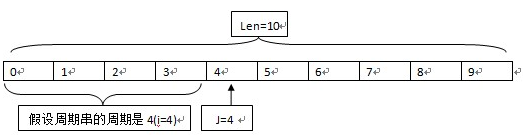

&emsp;&emsp;什么是周期串，举个简单的例子，`abcabcabcabc`这个字符串叫做`周期串`，这个周期串中的`abc`、`abcabc`、`abcabcabc`就是它的子串，它的周期是`3`、`6`、`12`。怎么理解？`abc`的长度是`3`，重复出现四次，因此它的周期是`3`；`abcabc`长度是`6`，重复出现`2`次，因此它的周期是`6`，`abcabcabcabc`长度是`12`，重复出现`1`次，因此它的周期是`12`。现在我们要实现一个算法来输出它的周期：<!--more-->

``` cpp
#include <stdio.h>
#include <stdlib.h>
#include <string.h>

int main ( int argc, char *argv[] ) {
    char s[100];
    scanf ( "%s", s );
    int len = strlen ( s );
    int i;

    for ( i = 1; i <= len; i++ ) {
        if ( len % i == 0 ) {
            int j, ok = 1;

            for ( j = i; j < len; j++ ) {
                if ( s[j] == s[j % i] ) {
                    continue;
                } else {
                    ok = 0;
                    break;
                }
            }

            if ( ok ) {
                printf ( "%d\n", i );
            };
        }
    }

    return 0;
}
```

&emsp;&emsp;首先我们假设这个周期串的长度为`i`，则根据这个`s`的长度，周期串的周期可能是`1、2、3、4、...、len`，所以外面套一个`for`循环用来遍历各种可能出现的周期。然后，我们从周期长度的下一个位置开始和前面那个周期子串中的字符逐个比较，如果发现出现一个不相等，说明这个串长到此结束。



&emsp;&emsp;由上图可以清楚的得出，`j = 4`的时候`j % i = 0`，所以`s[0]`必须要和`s[4]`相等，以此类推可以知道`len[1] = len[5]`、`len[2] = len[6]`等。当`len[j] != len[i % j]`得出一个周期，然后执行下次循环计算下一个周期。