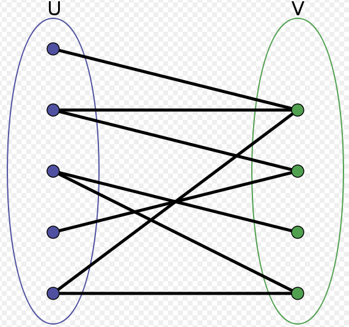
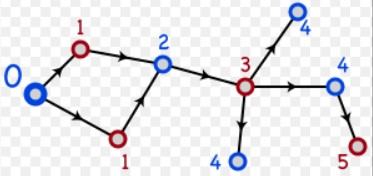

&emsp;&emsp;二分图又称双分图、二部图、偶图，指顶点可以分成两个不相交的集`U`和`V`(`U`和`V`皆为独立集)，使得在同一个集内的顶点不相邻(没有共同边)的图。<!--more-->



&emsp;&emsp;设`G = (V, E)`是一个无向图，如果顶点`V`可分割为两个互不相交的子集`(U, V)`，并且图中的每条边`(i, j)`所关联的两个顶点`i`和`j`分别属于这两个不同的顶点集`(i in U, j in V)`，则称图`G`为一个二分图。
&emsp;&emsp;无向图`G`为二分图的充分必要条件是，`G`至少有两个顶点，且其所有回路的长度均为偶数。如果无回路，相当于任一回路的长度为`0`，`0`视为偶数。



&emsp;&emsp;可以将`U`和`V`当做着色图：`U`中所有节点为蓝色，`V`中所有节点着绿色，每条边的两个端点的颜色不同，符合图着色问题的要求。相反，用这样的着色方式对非二分图是行不通的，根据`triangle`：其中一个顶点着蓝色并且另一个着绿色后，三角形的第三个顶点与上述具有两个颜色的顶点相连，无法再对其着蓝色或绿色。
&emsp;&emsp;二分图的判定如下：

``` cpp
#include <iostream>
#include <vector>
#include <string>

using namespace std;

vector<int> G[10]; /* 图 */
int color[10]; /* 顶点i的颜色(1 or -1) */
int V = 4; /* 顶点数 */

bool dfs(int s, int c) { /* 把顶点染成“1”或“-1” */
    color[s] = c; /* 把顶点v染成颜色c */

    for (int i = 0; i < G[s].size(); i++) {
        if (color[G[s][i]] == c) { /* 如果相邻的顶点同色，则返回false */
            return false;
        }

        /* 如果相邻的顶点还没被染色，则染成“-c” */
        if (color[G[s][i]] == 0 && !dfs(G[s][i], -1 * c)) {
            return false;
        }
    }

    return true; /* 如果所有顶点都染过色了。则返回true */
}

int main() {
    G[0].push_back(1);
    G[0].push_back(3);
    G[1].push_back(0);
    G[1].push_back(2);
    G[2].push_back(1);
    G[2].push_back(3);
    G[3].push_back(0);
    G[3].push_back(2);
    fill(color, color + 10, 0);
    string suc = "yes";

    for (int i = 0; i < V; i++) {
        if (color[i] == 0)
            if (dfs(i, 1) == false) {
                suc = "no";
                break;
            }
    }

    cout << suc << endl;

    for (int i = 0; i < V; i++) {
        cout << color[i] << " ";
    }

    cout << endl;
    return 0;
}
```