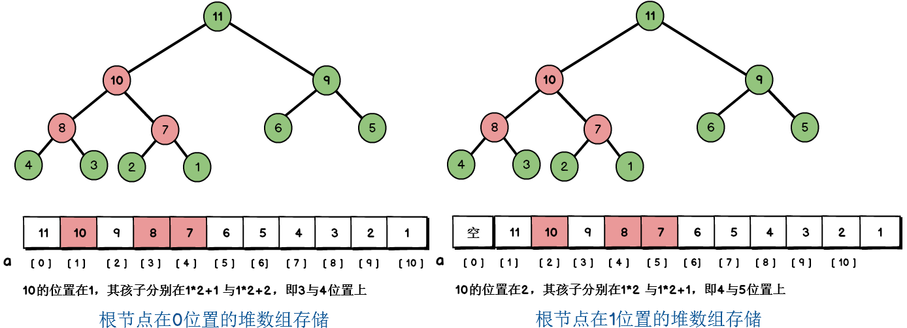

### 二叉堆的定义

&emsp;&emsp;这里所说的堆(`heap`)是数据结构中的堆，而不是内存模型中的堆。堆通常是一个可以被看做一棵树，它满足下列性质：堆中任意节点的值总是不大于(不小于)其子节点的值；堆总是一棵完全树。<!--more-->
&emsp;&emsp;将任意节点不大于其子节点的堆叫做`最小堆`(大顶堆)或`小根堆`，而将任意节点不小于其子节点的堆叫做`最大堆`(小顶堆)或`大根堆`。常见的堆有二叉堆、左倾堆、斜堆、二项堆、斐波那契堆等。
&emsp;&emsp;二叉堆是一种特殊的堆，二叉堆是完全二叉树或近似完全二叉树。二叉堆满足堆特性：父节点的键值总是保持固定的序关系于任何一个子节点的键值，且每个节点的左子树和右子树都是一个二叉堆。
&emsp;&emsp;最大堆如下：

<div align="center">


</div>

&emsp;&emsp;最小堆如下：

<div align="center">


</div>

### 二叉堆的存储

&emsp;&emsp;二叉堆一般使用数组来表示。二叉树有一条性质：如果对一棵有`n`个节点的完全二叉树的节点按层序编号(从第一层开始到最下一层，每一层从左到右编号，从`1`开始编号)，对任一节点`i`有：

- 如果`i = 1`，则节点为根节点，没有双亲。
- 如果`2 * i > n`，则节点`i`没有左孩子；否则其左孩子节点为`2 * i`(`n`为节点总数)。
- 如果`2 * i + 1 > n`，则节点`i`没有右孩子；否则其右孩子节点为`2 * i + 1`。
- 索引为`i`的父结点的索引是`floor(i/2)`。

简单来说：

- 如果根节点在数组中的位置是`1`，第`n`个位置的子节点分别在`2n`与`2n + 1`，因此第`1`个位置的子节点在`2`和`3`。
- 如果根节点在数组中的位置是`0`，第`n`个位置的子节点分别在`2n + 1`与`2n + 2`，因此第`0`个位置的子节点在`1`和`2`。

得益于数组的随机存储能力，我们能够很快确定堆中节点的父节点与子节点。下面以大顶堆展示一下堆的数组存储：



本文以大顶堆为例进行堆的讲解，其根节点位置为`0`。

### 二叉堆的具体实现

&emsp;&emsp;在二叉堆上可以进行插入节点、删除节点、取出堆顶元素等操作。

#### 二叉堆的抽象数据类型

&emsp;&emsp;二叉堆的抽象数据类型如下：

``` cpp
/* 大顶堆类定义 */
template <typename T>
class MaxHeap {
public:
    bool insert ( T val ); /* 往二叉堆中插入元素 */
    bool remove ( T data ); /* 移除元素 */
    void print(); /* 打印堆 */
    T getTop(); /* 获取堆顶元素 */
    bool createMaxHeap ( T a[], int size ); /* 根据指定的数组来创建一个最大堆 */
    MaxHeap ( int cap = 10 );
    ~MaxHeap();
private:
    int capacity; /* 容量，也即是数组的大小 */
    int size; /* 堆大小，也就是数组中有效元素的个数 */
    T *heap; /* 底层的数组 */
private:
    void filterUp ( int index ); /* 从index所在节点开始，向根节点调整堆 */
    void filterDown ( int begin, int end ); /* 从begin所在节点开始，向end方向调整堆 */
};
```

注意`capacity`与`size`的区别，`capacity`指的是数组的固有大小，`size`值数组中有效元素的个数，有效元素为组成堆的元素。构造函数和析构函数如下：

``` cpp
/* 默认构造函数 */
template <typename T>
MaxHeap<T>::MaxHeap ( int cap )
    : capacity ( cap ), size ( 0 ), heap ( nullptr ) {
    heap = new T[capacity];
};

/* 析构函数 */
template<typename T>
MaxHeap<T>::~MaxHeap() {
    delete[] heap;
};
```

#### 二叉堆的插入

&emsp;&emsp;在数组的最末尾插入新节点，然后自下而上地调整子节点与父节点的位置：比较当前结点与父节点的大小，若不满足大顶堆的性质，则交换两节点，从而使当前子树满足二叉堆的性质。时间复杂度为`O(logn)`。当我们在上图的堆中插入元素`12`：


调整过程如下：

1. 节点`12`添加在数组尾部，位置为`11`。
2. 节点`12`的双亲位置为`floor(11/2) = 5`，即节点`6`；节点`12`比节点`6`大，与节点`6`交换位置，交换后节点`12`的位置为`5`。
3. 节点`12`的双亲位置为`floor(5/2) = 2`，即节点`9`；节点`12`比节点`9`大，与节点`9`交换位置，交换后节点`12`的位置为`2`。
4. 节点`12`的双亲位置为`floor(2/2) = 1`，即节点`11`；节点`12`比节点`11`大，与节点`11`交换位置，交换后节点`12`的位置为`1`。
5. `12`已经到达根节点，调整过程结束。

这个从下到上的调整过程为：

``` cpp
/* 从下到上调整堆，插入元素时使用 */
template <typename T>
void MaxHeap<T>::filterUp ( int index ) {
    T value = heap[index]; /* 插入节点的值，即图中的12 */

    while ( index > 0 ) { /* 如果还未到达根节点，继续调整 */
        int indexParent = ( index - 1 ) / 2; /* 求其双亲节点 */

        if ( value < heap[indexParent] ) {
            break;
        } else {
            heap[index] = heap[indexParent];
            index = indexParent;
        }
    }

    heap[index] = value; /* 将12插入相应的位置 */
};
```

为了提高效率，我们不必进行节点的交换，直接用父节点的值覆盖子节点。最后把新节点插入相应的位置即可。基于这个调整函数，我们的插入函数为：

``` cpp
/* 插入元素 */
template <typename T>
bool MaxHeap<T>::insert ( T val ) {
    if ( size == capacity ) { /* 如果数组已满，返回false */
        return false;
    }

    heap[size] = val;
    filterUp ( size );
    size++;
    return true;
};
```

#### 二叉堆的删除

&emsp;&emsp;堆的删除是这样一个过程：用数组最末尾节点覆盖被删节点，再从该节点从上到下调整二叉堆。例如删除根节点`12`：


可能有人会产生疑惑，删除后数组最末尾不是多了一个`6`吗？的确是这样，但我们把数组中有效元素的个数减少了`1`，最末尾的`6`并不是堆的组成元素。这个从上到下的调整过程为：

``` cpp
/* 从上到下调整堆，删除元素时候使用 */
template<typename T>
void MaxHeap<T>::filterDown ( int current, int end ) {
    int child = current * 2 + 1; /* 当前结点的左孩子 */
    T value = heap[current]; /* 保存当前结点的值 */

    while ( child <= end ) {
        /* 选出两个孩子中较大的孩子 */
        if ( child < end && heap[child] < heap[child + 1] ) {
            child++;
        }

        if ( value > heap[child] ) { /* 无需调整或调整结束 */
            break;
        } else {
            heap[current] = heap[child]; /* 孩子节点覆盖当前结点 */
            current = child; /* 向下移动 */
            child = child * 2 + 1;
        }
    }

    heap[current] = value;
};
```

基于调整函数的删除函数：

``` cpp
/* 删除元素 */
template<typename T>
bool MaxHeap<T>::remove ( T data ) {
    if ( size == 0 ) { /* 如果堆是空的 */
        return false;
    }

    int index;

    /* 获取值在数组中的索引 */
    for ( index = 0; index < size; index++ ) {
        if ( heap[index] == data ) {
            break;
        }
    }

    if ( index == size ) { /* 数组中没有该值 */
        return false;
    }

    /* 使用最后一个节点来代替当前结点，然后再向下调整当前结点 */
    heap[index] = heap[size - 1];
    filterDown ( index, size-- );
    return true;
};
```

#### 其余操作

&emsp;&emsp;其余操作很简单，不在这里啰嗦：

``` cpp
/* 打印大顶堆 */
template <typename T>
void MaxHeap<T>::print() {
    for ( int i = 0; i < size; i++ ) {
        cout << heap[i] << " ";
    }
};

/* 获取堆顶元素 */
template <typename T>
T MaxHeap<T>::getTop() {
    if ( size != 0 ) {
        return heap[0];
    }
};

/* 根据指定的数组来创建一个最大堆 */
template<typename T>
bool MaxHeap<T>::createMapHeap ( T a[], int size ) {
    if ( size > capacity ) { /* 堆的容量不足以创建 */
        return false;
    }

    for ( int i = 0; i < size; i++ ) {
        insert ( a[i] );
    }

    return true;
};
```

#### 测试

&emsp;&emsp;测试代码如下：

``` cpp
#include "MaxHeap.h"
#include <iostream>

using namespace std;

int main ( int argc, char *argv[] ) {
    MaxHeap<int> heap ( 11 );

    /* 逐个元素构建大顶堆 */
    for ( int i = 0; i < 10; i++ ) {
        heap.insert ( i );
    }

    heap.print();
    cout << endl;
    heap.remove ( 8 );
    heap.print();
    cout << endl;
    /* 根据指定的数组创建大顶堆 */
    MaxHeap<int> heap2 ( 11 );
    int a[10] = { 1, 2, 3, 4, 5, 6, 7, 8, 9, 10 };
    heap2.createMaxHeap ( a, 10 );
    heap2.print();
    getchar();
    return 0;
}
```

执行结果：

``` cpp
9 8 5 6 7 1 4 0 3 2
9 7 5 6 2 1 4 0 3
10 9 6 7 8 2 5 1 4 3
```

&emsp;&emsp;如果是小顶堆，则修改如下：

``` cpp
/* 从下到上调整堆，插入元素时候使用 */
template <typename T>
void MinHeap<T>::filterUp ( int index ) {
    T value = heap[index]; /* 插入节点的值，即图中的12 */

    while ( index > 0 ) { /* 如果还未到达根节点，则继续调整 */
        int indexParent = ( index - 1 ) / 2; /* 求其双亲节点 */

        if ( value >= heap[indexParent] ) {
            break;
        } else {
            heap[index] = heap[indexParent];
            index = indexParent;
        }
    }

    heap[index] = value; /* 将12插入最后的位置 */
};

/* 从上到下调整堆，删除元素时候使用 */
template<typename T>
void MinHeap<T>::filterDown ( int current, int end ) {
    int child = current * 2 + 1; /* 当前结点的左孩子 */
    T value = heap[current]; /* 保存当前结点的值 */

    while ( child <= end ) {
        /* 选出两个孩子中较小的孩子 */
        if ( child < end && heap[child] > heap[child + 1] ) {
            child++;
        }

        if ( value < heap[child] ) { /* 无须调整或调整结束 */
            break;
        } else {
            heap[current] = heap[child]; /* 孩子节点覆盖当前结点 */
            current = child; /* 向下移动 */
            child = child * 2 + 1;
        }
    }

    heap[current] = value;
};
```