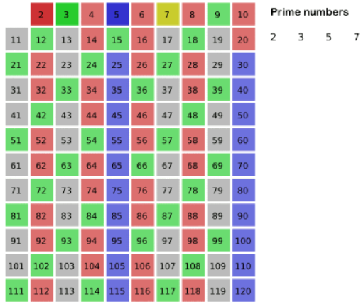

&emsp;&emsp;埃拉托斯特尼筛法(`sieve of Eratosthenes`)简称埃氏筛，也有人称素数筛。这是一种简单且历史悠久的筛法，是列出所有小素数最有效的方法之一。<!--more-->
&emsp;&emsp;给出要筛数值的范围`n`，找出`sqrt(n)`以内的素数`p1、p2、...、pk`。先用`2`去筛，即把`2`留下，把`2`的倍数剔除掉；再用下一个素数，也就是用`3`筛，把`3`留下，把`3`的倍数剔除掉；接下去用下一个素数`5`筛，把`5`留下，把`5`的倍数剔除掉，不断重复下去：



`python`代码如下：

``` python
def eratosthenes(n):
    IsPrime = [True] * (n + 1)
    IsPrime[1] = False

    for i in range(2, int(n ** 0.5) + 1):
        if IsPrime[i]:
            for j in range(i * 2, n + 1, i):
                IsPrime[j] = False

    return {x for x in range(2, n + 1) if IsPrime[x]}

if __name__ == "__main__":
    print(eratosthenes(120))
```

`C++`代码如下：

``` cpp
#include <stdlib.h>
#include <math.h>
#include <iostream>

using namespace std;
#define MAXN 1000

bool flag[MAXN] = { false };

void erat ( int maxn ) {
    flag[0] = false; /* 0不是素数 */
    flag[1] = false; /* 1不是素数 */

    for ( int i = 2; i <= maxn; i++ ) {
        flag[i] = true;
    }

    for ( int i = 2; i <= maxn; ++i ) {
        if ( flag[i] ) { /* 当i为素数时，i的所有倍数都不是素数 */
            for ( int j = i * i; j <= maxn; j += i ) {
                flag[j] = false;
            }
        }
    }
}

int main() {
    erat ( 120 );

    for ( int i = 0; i < MAXN; i++ ) {
        if ( flag[i] ) {
            printf ( "%d\n", i );
        }
    }
}
```