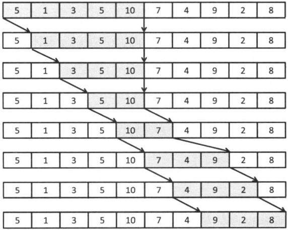

&emsp;&emsp;给定长度为`n`的整数数列`a`以及整数`S`，求出总和不小于`S`的连续子序列的长度的最小值。如果不存在，则输出`0`。样例输入：<!--more-->

``` cpp
n = 10
S = 15
a = {5, 1, 3, 5, 10, 7, 4, 9, 2, 8}
```

输出`2`，即`5 + 10`。可以采用尺取法来解决(反复地推进区间的开头和末尾，来求取满足条件的最小区间的方法是尺取法)：

1. 以`s = t = sum = 0`初始化。
2. 只要依然有`sum < S`，就不断将`sum`增加`at`，并将`t`增加`1`。
3. 如果`2`中无法满足`sum ≥ S`则终止。否则的话，更新`res = min(res, t - s)`。
4. 将`sum`减去`as`，`s`增加`1`，然后回到`2`。

``` cpp
void solve() {
    int res = n + 1;
    int s = 0, t = 0, sum = 0;

    for ( ;; ) {
        while ( t < n && sum < S ) {
            sum += a[t++];
        }

        if ( sum < S ) {
            break;
        }

        res = min ( res, t - s );
        sum -= a[s++];
    }

    if ( res > n ) { /* 解不存在 */
        res = 0;
    }

    printf ( "%d\n", res );
}
```

