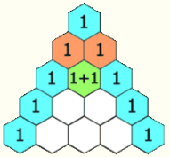

&emsp;&emsp;帕斯卡三角又称`贾宪三角`、`杨辉三角`，它是二项式系数在三角形中的一种几何排列：<!--more-->



从上图可看出杨辉三角的几个显著特征：每行数值左右对称，且均为正整数；行数递增时，列数亦递增；除斜边上的`1`外，其余数值均等于其肩部两数之和。
&emsp;&emsp;用`C`语言编程打印出`MAX_ROW`行杨辉三角数，例如`MAX_ROW = 5`：

``` cpp
1
1  1
1  2  1
1  3  3  1
1  4  6  4  1
1  5  10 10 5  1
```

代码如下：

``` cpp
#include "stdio.h"

#define MAX_ROW 5

int CalcTriVal ( int dwRow, int dwCol ) {
    if ( ( 0 == dwCol ) || ( dwRow == dwCol ) ) {
        return 1;
    } else {
        return CalcTriVal ( dwRow - 1, dwCol - 1 ) + CalcTriVal ( dwRow - 1, dwCol );
    }
}

void RecursiveYangHui ( void ) {
    int dwRow = 0, dwCol = 0;

    for ( dwRow = 0; dwRow <= MAX_ROW; dwRow++ ) {
        for ( dwCol = 0; dwCol <= dwRow; dwCol++ ) {
            printf ( "%5d", CalcTriVal ( dwRow, dwCol ) );
        }

        printf ( "\n" );
    }
}

int main() {
    RecursiveYangHui();
    return 0;
}
```