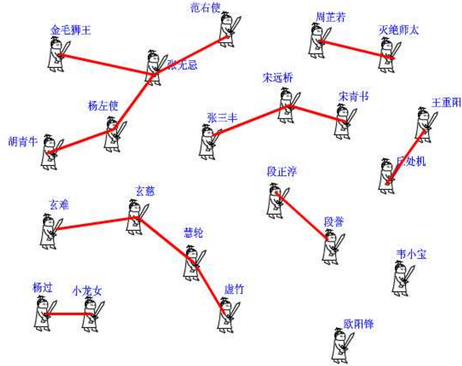
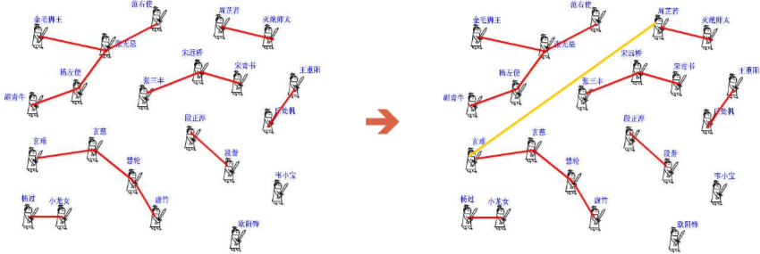
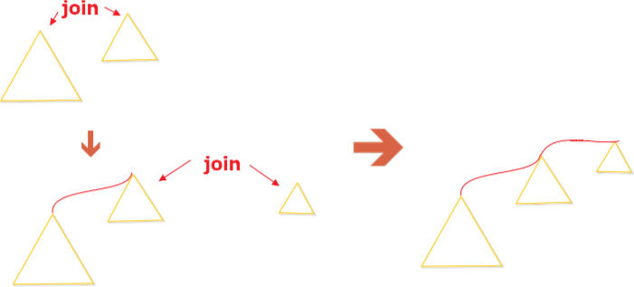
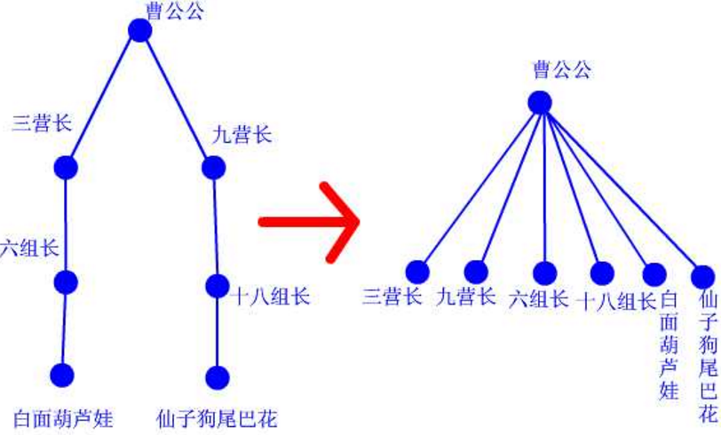
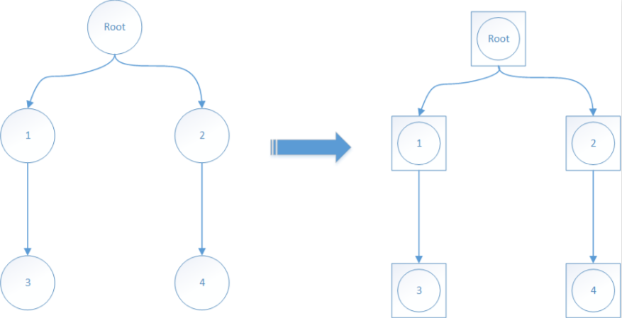
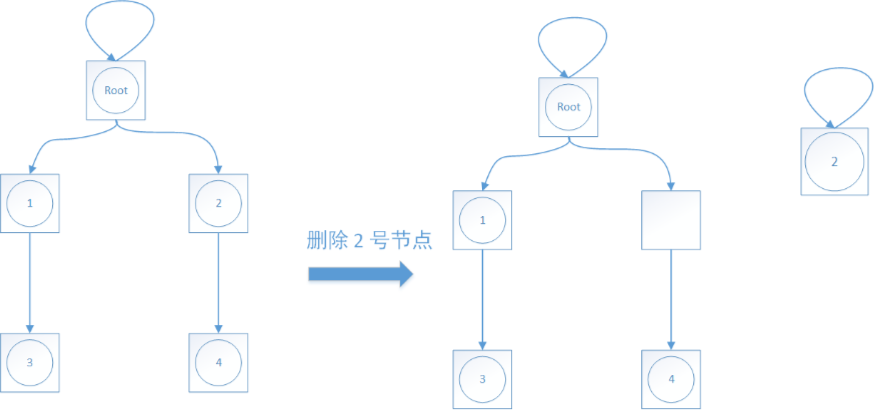

### 并查集的定义

&emsp;&emsp;并查集是一种树型的数据结构，用于处理一些不相交集合(`Disjoint Sets`)的合并及查询问题，常常在使用中以森林来表示。集就是让每个元素构成一个单元素的集合，也就是按一定顺序将属于同一组的元素所在的集合合并。<!--more-->

### 并查集的用途

- 维护一个无向图的连通性，判断`n`个点`m`条边时最少加多少边可以连通所有点。
- 判断在一个无向图中，两点间加边是否会产生环(最小生成树克鲁斯卡尔中有用到)。
- 维护集合等操作。

### 并查集的操作

&emsp;&emsp;所谓并查集，顾名思义操作就两种：

- **并**：合并两个集合。
- **查**：查找两个元素是否在一个集合(或者说查找元素的根节点)。

&emsp;&emsp;关于并查集的原理，先看一个小故事：
&emsp;&emsp;话说江湖上散落着各式各样的大侠，有上千个之多。他们没有什么正当职业，整天背着剑在外面走来走去，碰到和自己不是一路人的，就免不了要打一架。但大侠们有一个优点就是讲义气，绝对不打自己的朋友。而且他们信奉`朋友的朋友就是我的朋友`，只要是能通过朋友关系串联起来的，不管拐了多少个弯，都认为是自己人。这样一来，江湖上就形成了一个一个的群落，通过两两之间的朋友关系串联起来。而不在同一个群落的人，无论如何都无法通过朋友关系连起来，于是就可以放心往死了打。但是两个原本互不相识的人，如何判断是否属于一个朋友圈呢？
&emsp;&emsp;我们可以在每个朋友圈内推举出一个比较有名望的人，作为该圈子的代表人物，这样每个圈子就可以这样命名`齐达内朋友之队`、`罗纳尔多朋友之队`等。两人只要互相对一下自己的队长是不是同一个人，就可以确定敌友关系了。
&emsp;&emsp;但是还有问题啊，大侠们只知道自己直接的朋友是谁，很多人压根就不认识队长，要判断自己的队长是谁，只能漫无目的的通过朋友的朋友关系问下去：`你是不是队长？你是不是队长？`。这样一来，队长面子上挂不住了，而且效率太低，还有可能陷入无限循环中。于是队长下令，重新组队。队内所有人实行分等级制度，形成树状结构，我队长就是根节点，下面分别是二级队员、三级队员。每个人只要记住自己的上级是谁就行了。遇到判断敌友的时候，只要一层层向上问，直到最高层，就可以在短时间内确定队长是谁了。由于我们关心的只是两个人之间是否连通，至于他们是如何连通的，以及每个圈子内部的结构是怎样的，甚至队长是谁，并不重要。所以我们可以放任队长随意重新组队，只要不搞错敌友关系就好了。于是，门派产生了。



&emsp;&emsp;下面我们来看并查集的实现：

- `int pre[1000];`这个数组记录了每个大侠的上级是谁。大侠们从`1`或者`0`开始编号(依据题意而定)，`pre[15] = 3;`就表示`15`号大侠的上级是`3`号大侠。
- 如果一个人的上级就是他自己，那说明他就是掌门人了，查找到此为止。也有孤家寡人自成一派的，比如欧阳锋，那么他的上级就是他自己。

&emsp;&emsp;每个人都只认自己的上级。比如胡青牛同学只知道自己的上级是杨左使。张无忌是谁？不认识！要想知道自己的掌门是谁，只能一级级查上去。`find`这个函数就是找掌门用的，意义再清楚不过了。

``` cpp
int find ( int x ) { /* 查找我(x)的掌门 */
    int r = x; /* 委托r去找掌门 */

    while ( pre[r] != r ) { /* 如果r的上级不是r自己(也就是说找到的大侠他不是掌门) */
        r = pre[r]; /* r就接着找他的上级，直到找到掌门为止 */
    }

    return r; /* 掌门驾到 */
}
```

&emsp;&emsp;再来看看`join`函数，就是在两个点之间连一条线，这样一来，原先它们所在的两个板块的所有点就都可以互通了。这在图上很好办，画条线就行了。但我们现在是用并查集来描述武林中的状况的，一共只有一个`pre`数组，该如何实现呢？还是举江湖的例子，假设现在武林中的形势如图所示。虚竹小和尚与周芷若是我非常喜欢的两个人物，他们的终极`boss`分别是玄慈方丈和灭绝师太，那明显就是两个阵营了。我不希望他们互相打架，就对他俩说：`你们两位拉拉勾，做好朋友吧`。他们看在我的面子上，同意了。这一同意可非同小可，整个少林和峨眉派的人就不能打架了。这么重大的变化，可如何实现呀，要改动多少地方？其实非常简单，我对玄慈方丈说：`大师，麻烦你把你的上级改为灭绝师太吧。这样一来，两派原先的所有人员的终极boss都是师太，那还打个球啊！反正我们关心的只是连通性，门派内部的结构不要紧的`。玄慈一听肯定火大了：`凭什么是我变成她手下呀，怎么不反过来？我抗议`。抗议无效，上天安排的。反正谁加入谁效果是一样的，我就随手指定了一个。这段函数的意思很明白了吧！



``` cpp
void join ( int x, int y ) { /* 我想让虚竹和周芷若做朋友 */
    int fx = find ( x ), fy = find ( y ); /* 虚竹的老大是玄慈，芷若的老大是灭绝 */

    if ( fx != fy ) { /* 玄慈和灭绝显然不是同一个人 */
        pre[fx] = fy; /* 方丈只好委委屈屈地当了师太的手下了 */
    }
}
```

&emsp;&emsp;关于合并操作的一个优化：如果是按照这样强行指定一个树合并的另一个树中而不加以判断，那么很容易造出一个极不平衡的树，就像下图一样：



&emsp;&emsp;接前面的例子来说，玄慈很火大的说凭什么让我当他的手下，明明我的人手比她多，不行我不服。为了平息方丈的怨气，懒懒的老天终于又加了一项规定，门派人手少的给人手多的当手下，人手相同时候老天指定。终于这样大家都满意了，这样就保证了树可以维持在一个比较平衡的程度。注意：合并时一定要分清谁合并到谁身上了，否则和我们引入秩的目的相反。

``` cpp
/* 数组rank初始化是都为1，代表手下的人数 */
void join ( int x, int y ) { /* 我想让虚竹和周芷若做朋友 */
    int fx = find ( x ), fy = find ( y ); /* 虚竹的老大是玄慈，芷若MM的老大是灭绝 */

    if ( fx != fy ) { /* 玄慈和灭绝显然不是同一个人 */
        if ( rank[fx] >= rank[fy] ) { /* 俩人开始比谁的手下多 */
            pre[fy] = fx; /* 方丈技不如人当了师太的手下 */
            rank[fx] += rank[fy]; /* 方丈的手下都归师太 */
        } else {
            pre[fx] = fy; /* 师太人数比不过当了方丈的手下啦 */
            rank[fy] += rank[fx]; /* 师太的手下都归方丈 */
        }
    }
}
```

&emsp;&emsp;关于按照秩来合并，也有按照树的层数来合并，这样可以把查询的次数保持在`log`的水平。但是如果同时用了路径压缩的话，树的层数就很难维护，所以我这里采用子孙节点的数量来维护。
&emsp;&emsp;再来看看路径压缩算法。建立门派的过程是用`join`函数两两连接起来的，谁当谁的手下完全随机。最后的树状结构会变成什么样子，我也完全无法预计，一字长蛇阵也有可能。这样查找的效率就会比较低下。最理想的情况就是所有人的直接上级都是掌门，一共就两级结构，只要找一次就找到掌门了。哪怕不能完全做到，也最好尽量接近。这样就产生了路径压缩算法。设想这样一个场景：两个互不相识的大侠碰面了，想知道能不能揍。于是赶紧打电话问自己的上级：`你是不是掌门`。上级说：`我不是呀，我的上级是谁谁谁，你问问他看看`。一路问下去，原来两人的最终`boss`都是东厂曹公公。`哎呀呀，原来是自己人，失礼失礼，在下三营六组白面葫芦娃`、`幸会幸会，在下九营十八组仙子狗尾巴花`。两人高高兴兴地手拉手喝酒去了。`等等，两位同学请留步，还有事情没完成呢`，我叫住他俩。`哦，对了，还要做路径压缩`，两人醒悟。白面葫芦娃打电话给他的上级六组长：`组长啊，我查过了，其实我们的掌门是曹公公。不如我们一起集结拜在曹公公手下吧，省得级别太低，以后查找掌门麻烦`、`唔，有道理`。白面葫芦娃接着打电话给刚才拜访过的三营长...仙子狗尾巴花也做了同样的事情。这样，查询中所有涉及到的人物都聚集在曹公公的直接领导下。每次查询都做了优化处理，所以整个门派树的层数都会维持在比较低的水平上。查询和路径压缩都有递归和非递归两种方法，递归好写，非递归好懂。



``` cpp
int find ( int x ) { /* 非递归写法 */
    int r = x;

    while ( r != pre[r] ) {
        r = pre[r];
    }

    int i = x, j;

    while ( pre[i] != r ) { /* 如果说不是掌门 */
        j = pre[i]; /* 存下这位大侠的上级 */
        pre[i] = r; /* 告诉这位大侠掌门是谁 */
        i = j; /* 去找大侠的上级告诉他掌门是谁 */
    }

    return r;
}

int find ( int x ) { /* 递归写法 */
    if ( pre[x] != x ) {
        /* 找的祖先递归赋值，将本次查找经过的每个节点都直接连到祖先节点上 */
        pre[x] = find ( pre[x] );
    }

    return pre[x];
}
```

### 并查集的删除

&emsp;&emsp;一般来说，并查集的并、查两个功能在`80%`的场景中都是就够用的，但是你保不准万一哪天哪个大侠发现了盟主是自己多年前的杀父仇人想要出联盟，发现自己都没办法叛逃了多难受。
&emsp;&emsp;对于删除操作，在完美的并查集中(所有节点都直接连接在根节点上)，理论上只要把要删除的节点的上级重新指向自己就可以了。但是实际情况中，我们的并查集形成的树的形态都是不可预估形态的，如果直接将一个节点指向自己可能会将他的`下级`和他一块删除，这就和我们的想法违背了。所以在一个需要删除的并查集中初始化时就要处理一下：

- 首先每个节点不再指向自己，而是另一个并不会出现的节点，类似于将每个节点放到一个盒子中。
- 这样，删除时只需要把这个节点从当前盒子拿出来，放到另一个盒子中。
- 由于节点之间都是通过盒子来确定关系的，所以盒子中元素是否存在并不影响节点之间的关系。

于是我们就找到了并查集中删除某个节点的方法，我把它形象地称为`找假爹`，因为每一个祖先节点都相当于假的。把每个节点都套入一个盒子中，他们之间的关系并不会改变。



如果要删除`2`号节点，那么我们把`2`拿出来放到另一个盒子中就可以了，可以看到原来的那个树结构并没有发生变化。但是`2`已经不在这里面了。



但是要怎么找这些假节点呢，很简单，假设最多会有`1000`个节点，就从`1001`开始作为假节点，初始化就变成了这样：

``` cpp
int index; /* 存放盒子节点使用到哪一个了 */

void init ( int n ) {
    index = n;

    for ( int i = 0; i < n; i++ ) { /* 普通节点指向他的盒子节点 */
        pre[i] = index++;
    }

    for ( int i = n; i < 2 * n; i++ ) { /* 盒子节点指向自己就像一般的并查集一样 */
        pre[i] = i;
    }
}

void del ( int n ) {
    pre[n] = index; /* 将要删除的节点重新指向一个新的盒子 */
    pre[index] = index++; /* 盒子节点指向自己 */
}
```

&emsp;&emsp;注意，这样操作节点的数量一定要保证足够大，否则当删除操作越来越多的时候，节点不够用就会运行错误了。当然还有一种方法就是动态维护节点的数量，来将那些被删除过的`空盒子`重新利用起来。

---

&emsp;&emsp;某省调查城镇交通状况，得到现有城镇道路统计表，表中列出了每条道路直接连通的城镇。省政府`畅通工程`的目标是使全省任何两个城镇间都可以实现交通(但不一定有直接的道路相连，只要互相间接通过道路可达即可)。问最少还需要建设多少条道路？
&emsp;&emsp;测试输入包含若干测试用例。每个测试用例的第`1`行给出两个正整数，分别是城镇数目`N`(`< 1000`)和道路数目`M`；随后的`M`行对应`M`条道路，每行给出一对正整数，分别是该条道路直接连通的两个城镇的编号。为简单起见，城镇从`1`到`N`编号。注意，两个城市之间可以有多条道路相通，也就是说：

``` cpp
3 3
1 2
1 2
2 1
```

这种输入也是合法的。当`N`为`0`时，输入结束，该用例不被处理。对每个测试用例，在`1`行里输出最少还需要建设的道路数目。
&emsp;&emsp;输入如下内容：

``` cpp
4 2
1 3
4 3
3 3
1 2
1 3
2 3
5 2
1 2
3 5
999 0
0
```

输出如下：

``` cpp
1
0
2
998
```

&emsp;&emsp;首先在地图上给你若干个城镇，这些城镇都可以看作点，然后告诉你哪些对城镇之间是有道路直接相连的。最后要解决的是整幅图的连通性问题，比如随意给你两个点，让你判断它们是否连通，或者问你整幅图一共有几个连通分支，也就是被分成了几个互相独立的块。像畅通工程这题，问还需要修几条路，实质就是求有几个连通分支。如果是`1`个连通分支，说明整幅图上的点都连起来了，不用再修路了；如果是`2`个连通分支，则只要再修`1`条路，从两个分支中各选一个点，把它们连起来，那么所有的点都是连起来的了；如果是`3`个连通分支，则只要再修两条路...
&emsp;&emsp;以下面这组数据输入数据来说明：

``` cpp
4 2
1 3
4 3
```

第一行告诉你，一共有`4`个点和`2`条路。下面两行告诉你，`1`、`3`之间有条路，`4`、`3`之间有条路。那么整幅图就被分成了`1-3-4`和`2`两部分。只要再加一条路，把`2`和其他任意一个点连起来，畅通工程就实现了，那么这个这组数据的输出结果就是`1`。好了，现在编程实现这个功能吧，城镇有几百个，路有不知道多少条，而且可能有回路。这可如何是好？
&emsp;&emsp;使用并查集就可以轻松解决！并查集由一个整数型的数组和两个函数构成。数组`pre`记录了每个点的前导点，函数`find`是查找，`join`是合并：

``` cpp
int pre[1000];

int find ( int x ) { /* 查找根节点 */
    int r = x;

    while ( pre[r] != r ) { /* 返回根节点r */
        r = pre[r];
    }

    int i = x, j;

    while ( i != r ) { /* 路径压缩 */
        j = pre[i]; /* 在改变上级之前，用临时变量j记录下他的值 */
        pre[i] = r; /* 把上级改为根节点 */
        i = j;
    }

    return r;
}

/* 判断x、y是否连通，如果已经连通，就不用管了；
   如果不连通，就把它们所在的连通分支合并起来 */
void join ( int x, int y ) {
    int fx = find ( x ), fy = find ( y );

    if ( fx != fy ) {
        pre[fx] = fy;
    }
}
```

&emsp;&emsp;整个系统的代码如下：

``` cpp
#include "stdio.h"
#include "string.h"

int pre[1000];

int find ( int x ) {
    int r = x;

    while ( pre[r] != r ) {
        r = pre[r];
    }

    int i = x;
    int j;

    while ( i != r ) {
        j = pre[i];
        pre[i] = r;
        i = j;
    }

    return r;
}

int main ( void ) {
    int n, m, p1, p2, i, total, f1, f2;

    while ( scanf ( "%d", &n ) && n ) { /* 读入n，如果n为0，结束 */
        /* 刚开始的时候，有n个城镇，一条路都没有，那么要修“n-1”条路才能把它们连起来 */
        total = n - 1;

        /* 每个点互相独立，自成一个集合，从1编号到n，所以每个点的上级都是自己 */
        for ( i = 1; i <= n; i++ ) {
            pre[i] = i;
        }

        scanf ( "%d", &m ); /* 共有m条路 */

        while ( m-- ) {
            /* 下面这段代码，其实就是join函数，只是稍作改动以适应题目要求 */
            /* 每读入一条路，看它的端点p1、p2是否已经在一个连通分支里了 */
            scanf ( "%d %d", &p1, &p2 );
            f1 = find ( p1 );
            f2 = find ( p2 );

            /* 如果是不连通的，那么把这两个分支连起来，分支的总数就减少了1，还需建的路也就减了1 */
            if ( f1 != f2 ) {
                pre[f2] = f1;
                total--;
            }

            /* 如果两点已经连通了，那么这条路只是在图上增加了一个环，对连通性没有任何影响，无视掉 */
        }

        printf ( "%d\n", total ); /* 最后输出还要修的路条数 */
    }

    return 0;
}
```