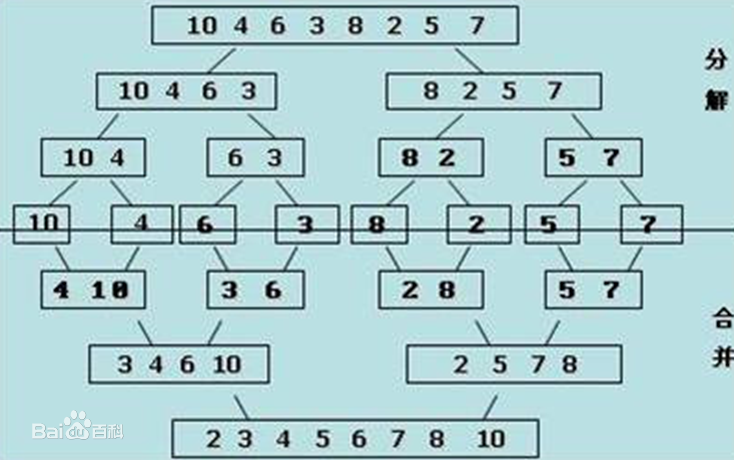

&emsp;&emsp;归并排序(`MERGE-SORT`)是建立在归并操作上的一种有效的排序算法，该算法是采用`分治法`(`Divide and Conquer`)的一个非常典型的应用。将已有序的子序列合并，得到完全有序的序列：即先使每个子序列有序，再使子序列段间有序。若将两个有序表合并成一个有序表，称为`二路归并`。<!--more-->
&emsp;&emsp;归并过程为：比较`a[i]`和`a[j]`的大小，若`a[i] ≤ a[j]`，则将第一个有序表中的元素`a[i]`复制到`r[k]`中，并令`i`和`k`分别加上`1`；否则将第二个有序表中的元素`a[j]`复制到`r[k]`中，并令`j`和`k`分别加上`1`，如此循环下去，直到其中一个有序表取完，然后再将另一个有序表中剩余的元素复制到`r`中从下标`k`到下标`t`的单元。归并排序的算法我们通常用递归实现，先把待排序区间`[s, t]`以中点二分，接着把左边子区间排序，再把右边子区间排序，最后把左区间和右区间用一次归并操作合并成有序的区间`[s, t]`。



### 归并操作

&emsp;&emsp;归并操作指的是将两个顺序序列合并成一个顺序序列的方法。如设有数列`{6, 202, 100, 301, 38, 8, 1}`：

1. 初始状态：`{6, 202, 100, 301, 38, 8, 1}`。
2. 第一次归并后：`{6, 202}`，`{100, 301}`，`{8, 38}`，`{1}`，比较次数为`3`。
3. 第二次归并后：`{6, 100, 202, 301}`，`{1, 8, 38}`，比较次数为`4`。
4. 第三次归并后：`{1, 6, 8, 38, 100, 202, 301}`，比较次数为`4`。

总的比较次数为`3 + 4 + 4 = 11`，逆序数为`14`。

### 算法描述

&emsp;&emsp;归并操作的工作原理如下：

1. 申请空间，使其大小为两个已经排序序列之和，该空间用来存放合并后的序列。
2. 设定两个指针，最初位置分别为两个已经排序序列的起始位置。
3. 比较两个指针所指向的元素，选择相对小的元素放入到合并空间，并移动指针到下一位置。
4. 重复步骤`3`直到某一指针超出序列尾。将另一序列剩下的所有元素直接复制到合并序列尾。

``` cpp
#include <stdlib.h>
#include <stdio.h>

void Merge ( int sourceArr[], int tempArr[], int startIndex, int midIndex, int endIndex ) {
    int i = startIndex, j = midIndex + 1, k = startIndex;

    while ( i != midIndex + 1 && j != endIndex + 1 ) {
        if ( sourceArr[i] >= sourceArr[j] ) {
            tempArr[k++] = sourceArr[j++];
        } else {
            tempArr[k++] = sourceArr[i++];
        }
    }

    while ( i != midIndex + 1 ) {
        tempArr[k++] = sourceArr[i++];
    }

    while ( j != endIndex + 1 ) {
        tempArr[k++] = sourceArr[j++];
    }

    for ( i = startIndex; i <= endIndex; i++ ) {
        sourceArr[i] = tempArr[i];
    }
}

/* 内部使用递归 */
void MergeSort ( int sourceArr[], int tempArr[], int startIndex, int endIndex ) {
    int midIndex;

    if ( startIndex < endIndex ) {
        midIndex = ( startIndex + endIndex ) / 2;
        MergeSort ( sourceArr, tempArr, startIndex, midIndex );
        MergeSort ( sourceArr, tempArr, midIndex + 1, endIndex );
        Merge ( sourceArr, tempArr, startIndex, midIndex, endIndex );
    }
}

int main ( int argc, char *argv[] ) {
    int a[8] = {50, 10, 20, 30, 70, 40, 80, 60};
    int i, b[8];
    MergeSort ( a, b, 0, 7 );

    for ( i = 0; i < 8; i++ ) {
        printf ( "%d ", a[i] );
    }

    printf ( "\n" );
    return 0;
}
```