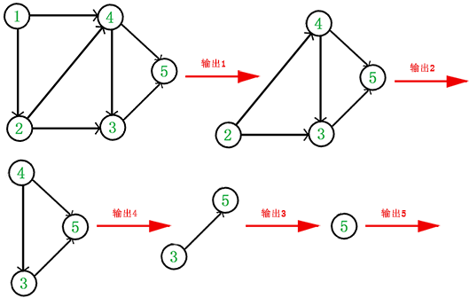
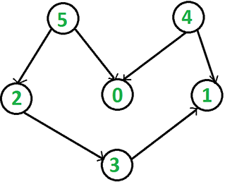

&emsp;&emsp;在图论中，拓扑排序(`Topological Sorting`)是一个有向无环图(`Directed Acyclic Graph`，`DAG`)的所有顶点的线性序列，且该序列必须满足下面两个条件：<!--more-->

- 每个顶点出现且只出现一次。
- 若存在一条从顶点`A`到顶点`B`的路径，那么在序列中顶点`A`出现在顶点`B`的前面。

有向无环图才有拓扑排序，非`DAG`图没有拓扑排序的说法。例如下面这个图：


它是一个`DAG`图，那么如何写出它的拓扑排序呢？这里说一种比较常用的方法：

1. 从`DAG`图中选择一个没有前驱(即入度为`0`)的顶点并输出。
2. 从图中删除该顶点和所有以它为起点的有向边。
3. 重复`1`和`2`直到当前的`DAG`图为空或当前图中不存在无前驱的顶点为止。后一种情况说明有向图中必然存在环。



于是，得到拓扑排序后的结果是`{1, 2, 4, 3, 5}`。通常，一个有向无环图可以有一个或多个拓扑排序序列。
&emsp;&emsp;拓扑排序通常用来`排序`具有依赖关系的任务。比如，如果用一个`DAG`图来表示一个工程，其中每个顶点表示工程中的一个任务，用有向边`<A, B>`表示在做任务`B`之前必须先完成任务`A`。故在这个工程中，任意两个任务要么具有确定的先后关系，要么是没有关系，绝对不存在互相矛盾的关系(`环路`)。
&emsp;&emsp;根据上面讲的方法，我们关键是要维护一个入度为`0`的顶点的集合。图的存储方式有两种，即邻接矩阵和邻接表，这里我们采用邻接表来存储图：

``` cpp
#include <iostream>
#include <list>
#include <queue>
#include "stdlib.h"

using namespace std;

class Graph { /* 类声明 */
    int V;          /* 顶点个数                  */
    list<int> *adj; /* 邻接表                    */
    queue<int> q;   /* 维护一个入度为0的顶点的集合 */
    int *indegree;  /* 记录每个顶点的入度         */
public:
    Graph ( int V );               /* 构造函数 */
    ~Graph();                      /* 析构函数 */
    void addEdge ( int v, int w ); /* 添加边   */
    bool topological_sort();       /* 拓扑排序 */
};

Graph::Graph ( int V ) { /* 类定义 */
    this->V = V;
    adj = new list<int>[V];
    indegree = new int[V]; /* 入度全部初始化为0 */

    for ( int i = 0; i < V; ++i ) {
        indegree[i] = 0;
    }
}

Graph::~Graph() {
    delete[] adj;
    delete[] indegree;
}

void Graph::addEdge ( int v, int w ) {
    adj[v].push_back ( w );
    ++indegree[w];
}

bool Graph::topological_sort() {
    for ( int i = 0; i < V; ++i )
        if ( indegree[i] == 0 ) {
            q.push ( i ); /* 将所有入度为0的顶点入队 */
        }

    int count = 0; /* 计数，记录当前已经输出的顶点数 */

    while ( !q.empty() ) {
        int v = q.front(); /* 从队列中取出一个顶点 */
        q.pop();
        cout << v << " "; /* 输出该顶点 */
        ++count;
        /* 将所有v指向的顶点的入度减1，并将入度减为0的顶点入栈 */
        list<int>::iterator beg = adj[v].begin();

        for ( ; beg != adj[v].end(); ++beg )
            if ( ! ( --indegree[*beg] ) ) {
                q.push ( *beg ); /* 若入度为0，则入栈 */
            }
    }

    if ( count < V ) {
        return false; /* 没有输出全部顶点，有向图中有回路 */
    } else {
        return true; /* 拓扑排序成功 */
    }
}

int main() {
    Graph g ( 6 ); /* 创建图 */
    g.addEdge ( 5, 2 );
    g.addEdge ( 5, 0 );
    g.addEdge ( 4, 0 );
    g.addEdge ( 4, 1 );
    g.addEdge ( 2, 3 );
    g.addEdge ( 3, 1 );
    g.topological_sort();
    cout << endl;
    return 0;
}
```

测试如下`DAG`图：



输出结果是`{4, 5, 2, 0, 3, 1}`，这是该图的拓扑排序序列之一。
&emsp;&emsp;每次在入度为`0`的集合中取顶点，并没有特殊的取出规则，随机取出也行，这里使用的`queue`。取顶点的顺序不同会得到不同的拓扑排序序列，当然前提是该图存在多个拓扑排序序列。由于输出每个顶点的同时还要删除以它为起点的边，故上述拓扑排序的时间复杂度为`O(V + E)`。