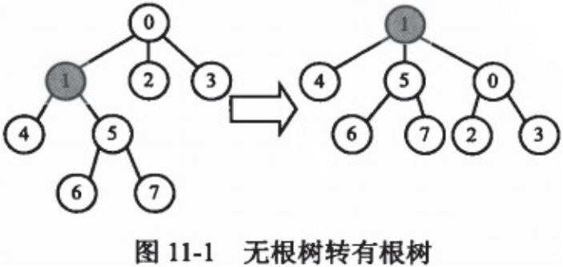

&emsp;&emsp;输入一个拥有`N`个结点的无根树的边，指点一个结点为根节点，把这棵树转化为一棵有根树，输出各个节点的父亲编号(`n <= 10^6`)。<!--more-->



&emsp;&emsp;我使用一个`vector`数组`G[i]`(`i`为节点编号)保存各个节点的相邻点，然后使用`P[i]`(`i`为节点编号)保存每个节点的父节点的编号。把各个边的信息保存到`G[i]`之后，从指定节点开始，采用`dfs`算法遍历，把各个节点的父节点编号存放在`P[i]`，最后输出。

``` cpp
#include <iostream>
#include <vector>

using namespace std;

#define MAX 1000001

vector<int> G[MAX];
int P[MAX];

void inputTree ( int n ) {
    int u, v; /* 存放两个节点编号 */

    /* 输入边信息 */
    for ( int i = 0; i < n - 1; ++i ) {
        cin >> u >> v;
        G[u].push_back ( v );
        G[v].push_back ( u );
    }
}

void dfs ( int u, int fa ) { /* u为当前节点，fa为它的父节点 */
    int d = G[u].size();

    for ( int i = 0; i < d; ++i ) {
        int v = G[u][i];

        if ( v != fa ) {
            dfs ( v, P[v] = u );
        }
    }
}

int main() {
    int n; /* 节点数 */
    int root; /* 根节点编号 */
    cin >> n;
    inputTree ( n );
    cin >> root;
    P[root] = -1;
    dfs ( root, P[root] );

    for ( int i = 0; i < n; ++i ) { /* 输出 */
        cout << "R[" << i << "] : " << P[i] << endl;
    }

    return 0;
}
```

执行结果：

``` cpp
$ ./test
8  # 节点数
0 1
0 2
0 3
1 4
1 5
5 6
5 7
1  # 根节点
R[0] : 1
R[1] : -1
R[2] : 0
R[3] : 0
R[4] : 1
R[5] : 1
R[6] : 5
R[7] : 5
```