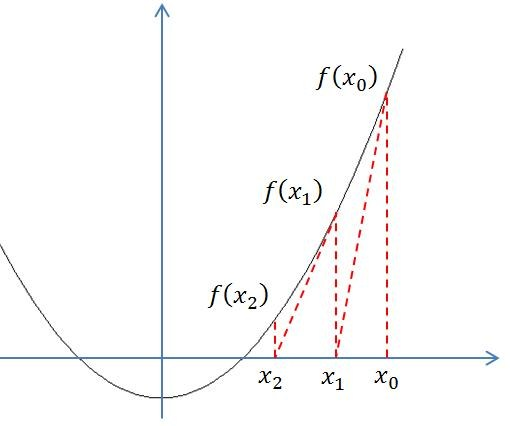

### 牛顿迭代法解方程

&emsp;&emsp;利用迭代算法解决问题，需要做好以下三个方面的工作：<!--more-->

1. 确定迭代变量：在可以用迭代算法解决的问题中，我们可以确定至少存在一个可直接或间接地不断由旧值递推出新值的变量，这个变量就是迭代变量。
2. 建立迭代关系式：所谓迭代关系式，指如何从变量的前一个值推出其下一个值的公式(或关系)。迭代关系式的建立是解决迭代问题的关键，通常可以使用递推或倒推的方法来完成。
3. 对迭代过程进行控制：在什么时候结束迭代过程？这是编写迭代程序必须考虑的问题。不能让迭代过程无休止地执行下去。迭代过程的控制通常可分为两种情况：一种是所需的迭代次数是个确定的值，可以计算出来；另一种是所需的迭代次数无法确定。对于前一种情况，可以构建一个固定次数的循环来实现对迭代过程的控制；对于后一种情况，需要进一步分析得出可用来结束迭代过程的条件。

&emsp;&emsp;接下来，我介绍一种迭代算法的典型案例：`牛顿-拉夫逊(拉弗森)方法`。牛顿-拉夫逊(拉弗森)方法又称`牛顿迭代法`，也称`牛顿切线法`：先任意设定一个与真实的根接近的值$x0$作为第一次近似根，由$x0$求出$f(x0)$，过$(x0, f(x0))$点做$f(x)$的切线，交$x$轴于$x1$，把它作为第二次近似根，再由$x1$求出$f(x1)$，过$(x1, f(x1))$点做$f(x)$的切线，交$x$轴于$x2$，...如此继续下去，直到足够接近(比如$|x - x0| < 1e-6$时)真正的根$x$为止。而$f'(x0) = f(x0)/(x1 - x0)$，所以$x1 = x0 - f(x0)/f'(x0)$。



&emsp;&emsp;用牛顿迭代法求下列方程在值等于`1.5`附近的根：

$$
2x^3 - 4x^2 + 3x - 6 = 0
$$

``` cpp
#include <stdio.h>
#include <math.h>

int main ( void ) {
    float x, x0, f, f1;
    x = 1.5;

    do {
        x0 = x;
        f = 2 * x0 * x0 * x0 - 4 * x0 * x0 + 3 * x0 - 6;
        f1 = 6 * x0 * x0 - 8 * x0 + 3;
        x = x0 - f / f1;
    } while ( fabs ( x - x0 ) >= 1e-5 );

    printf ( "%f\n", x );
    return 0;
}
```

执行结果：当`x = 1.5`时，方程$2x^3 - 4x^2 + 3x - 6 = 0$附近的根为`2.000000`。

---

### 牛顿迭代法求平方

&emsp;&emsp;牛顿迭代法求`a`的平方根，迭代公式为：

$$
X_{n + 1} = \frac{X_{n} + \frac{a}{X_n}}{2}
$$

实质是迭代法，先输入符合条件的数`a`，给$X_0$和$X_1$赋值，使得差的绝对值大于$10^{-10}$。当差大于等于$10^{-10}$时，使用迭代公式使$X_0$和$X_1$的差小于$10^{-10}$，则平方根就是$X_0$或$X_1$。

``` cpp
#include <stdio.h>
#include <math.h>

int main() {
    float a, x0, x1;
    int flag = 1;

    while ( flag ) {
        printf ( "a = " );
        scanf ( "%f", &a );

        if ( a >= 0 ) {
            flag = 0;
        } else {
            printf ( "你所输入的数不能求平方根，请重试！\n" );
        }
    }

    x0 = 1;
    x1 = x0 + 1;

    while ( fabs ( x0 - x1 ) >= 1e-10 ) {
        x0 = x1;
        x1 = 0.5 * ( x0 + a / x0 );
    }

    printf ( "%.2f的平方根是：%.2f\n", a, x1 );
    return 0;
}
```