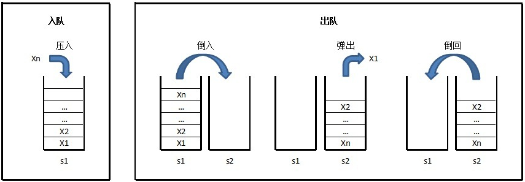

&emsp;&emsp;题目描述：用两个栈来实现一个队列，完成队列的`Push`和`Pop`操作，队列中的元素为`int`类型。<!--more-->
&emsp;&emsp;输入：每个输入文件包含一个测试样例。对于每个测试样例，第一行输入一个`n`(`1 <= n <= 100000`)，代表队列操作的个数。接下来的`n`行，每行输入一个队列操作：`PUSH X`向队列中`push`一个整数`x`(`x >= 0`)，`POP`从队列中`pop`一个数。
&emsp;&emsp;输出：对应每个测试案例，打印所有`pop`操作中从队列`pop`中的数字。如果执行`pop`操作时，队列为空，则打印`-1`。样例输入：

``` cpp
3
PUSH 10
POP
POP
```

样例输出：

``` cpp
10
-1
```



``` cpp
#include <stdio.h>

#define N 100005

int stack1[N], stack2[N];

int main() {
    int n, top1, top2, v;
    char s[10];

    while ( scanf ( "%d", &n ) != EOF ) {
        top1 = 0, top2 = 0;

        while ( n-- ) {
            scanf ( "%s", s );

            if ( s[1] == 'U' ) { /* PUSH */
                scanf ( "%d", &v );
                stack1[top1++] = v;
            } else {
                /* 只有把前面“倒过来”的数输出完，后面的数才能“倒过来” */
                if ( top2 == 0 ) {
                    while ( top1 ) {
                        /* 类似于从一摞书A中自上向下取，放到第二摞书B中，
                           实现了“倒栈”，倒完了就是一个队列的顺序了 */
                        stack2[top2++] = stack1[--top1];
                    }
                }

                if ( top2 ) {
                    printf ( "%d\n", stack2[--top2] );
                } else {
                    printf ( "-1\n" );
                }
            }
        }
    }

    return 0;
}
```