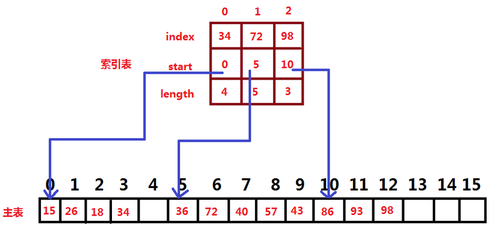

### 基本概念

&emsp;&emsp;索引查找又称`分级查找`，基本思想是：首先把一个集合或线性表(它们对应为主表)按照一定的函数关系或条件划分成若干个逻辑上的子表，为每个子表分别建立一个索引项，由所有的索引项构成主表的一个索引表，然后可采用顺序或链接的方式来存储索引表和每个子表。索引表的类型可定义如下：<!--more-->

``` cpp
struct IndexItem {
    IndexKeyType index; /* IndexKeyType为事先定义的索引值类型 */
    int start;          /* 子表中第一个元素所在的下标位置      */
    int length;         /* 子表的长度域                     */
};

/* ILMSize为事先定义的整型常量，大于等于索引项数m */
typedef struct IndexItem indexlist[ILMSize];
```

主表的类型可定义如下：

``` cpp
/* MaxSize为事先定义的整型常量，大于等于主表中元素的个数n */
typedef struct ElemType mainlist[MaxSize];
```

在索引表中的每个索引项对应多条记录，则称为`稀疏索引`；若每个索引项唯一对应一条记录，则称为`稠密索引`。

### 索引查找算法

&emsp;&emsp;首先根据给定的索引值`K1`，在索引表上查找出索引值等于`K1`的索引项，以确定对应子表在主表中的开始位置和长度，然后再根据给定的关键字`K2`，在对应的子表中查找出关键字等于`K2`的元素。
&emsp;&emsp;设数组`A`是具有`mainlist`类型的一个主表，数组`B`是具有`indexlist`类型的在主表`A`上建立的一个索引表，`m`为索引表`B`的实际长度，即所含的索引项的个数，`K1`和`K2`分别为给定带查找的索引值和关键字，并假定每个子表采用顺序存储，则索引查找算法为：

``` cpp
/* 利用主表A和大小为m的索引表B索引，查找索引值为K1、关键字为K2的记录，
   返回该记录在主表中的下标位置，若查找失败则返回“-1” */
int Indsch ( mainlist A, indexlist B, int m, IndexKeyType K1, KeyType K2 ) {
    int i, j;

    for ( i = 0; i < m; i++ )
        if ( K1 == B[i].index ) {
            break;
        }

    if ( i == m ) {
        return -1; /* 查找失败 */
    }

    j = B[i].start;

    while ( j < B[i].start + B[i].length ) {
        if ( K2 == A[j].key ) {
            break;
        } else {
            j++;
        }
    }

    if ( j < B[i].start + B[i].length ) {
        return j; /* 查找成功 */
    } else {
        return -1; /* 查找失败 */
    }
}
```

&emsp;&emsp;若`IndexKeyType`被定义为字符串类型，则算法中相应的条件改为：

``` cpp
strcmp ( K1, B[i].index ) == 0;
```

&emsp;&emsp;同理，若`KeyType`被定义为字符串类型，则算法中相应的条件也应该改为：

``` cpp
strcmp ( K2, A[j].key ) == 0;
```

&emsp;&emsp;若每个子表在主表`A`中采用的是链接存储，则只要把上面算法中的`while`循环和其后的`if`语句进行如下修改即可：

``` cpp
while ( j != -1 ) { /* 用“-1”作为空指针标记 */
    if ( K2 == A[j].key ) {
        break;
    } else {
        j = A[j].next;
    }
}

return j;
```

若索引表`B`为稠密索引，则更为简单，只需查找索引表`B`，成功时直接返回`B[i].start`即可。
&emsp;&emsp;索引查找的比较次数等于算法中查找索引表的比较次数和查找相应子表的比较次数之和。假定索引表的长度为`m`，子表长度为`s`，则索引查找的平均查找长度为：

$$
ASL = \frac{1 + m}{2} + \frac{1 + s}{2} = 1 + \frac{m + s}{2}
$$

假定每个子表具有相同的长度，即$s = \frac{n}{m}$，则：

$$
ASL = 1 + \frac{m + \frac{n}{m}}{2}
$$

当$m = \frac{n}{m}$(即$m = \sqrt{n}$，此时$s$也等于$\sqrt{n}$)，$ASL = 1 + \sqrt{n}$最小，时间复杂度为$O(\sqrt{n})$。可见，索引查找的速度快于顺序查找，但低于二分查找。<br>
&emsp;&emsp;在索引存储中，不仅便于查找单个元素，而且更方便查找一个子表中的全部元素，若在主表中的每个子表后都预留有空闲位置，则索引存储也便于进行插入和删除运算。

### 分块查找

&emsp;&emsp;分块查找属于索引查找，其对应的索引表为稀疏索引，具体地说，分块查找要求主表中每个子表(又称为`块`)之间是递增(或递减)有序的。即前块中最大关键字必须小于后块中的最小关键字，但块内元素的排列可无序。它还要求索引值域为每块中的最大关键字。下图是用于分块查找的主表和索引表的示例：



&emsp;&emsp;分块查找的算法同上面的索引查找算法类似，具体如下：

``` cpp
/* 利用主表A和大小为m的索引表B分块查找关键字为K的记录 */
int Blocksch ( mainlist A, indexlist B, int m, KeyType K ) {
    int i, j;

    for ( i = 0; i < m; i++ )
        if ( K <= B[i].index ) {
            break;
        }

    if ( i == m ) {
        return -1; /* 查找失败 */
    }

    j = B[i].start;

    while ( j < B[i].start + B[i].length ) {
        if ( K == A[j].key ) {
            break;
        } else {
            j++;
        }
    }

    if ( j < B[i].start + B[i].length ) {
        return j;
    } else {
        return -1;
    }
}
```

&emsp;&emsp;若在索引表上不是顺序查找，而是二分查找相应的索引项，则需要把算法中的`for`循环语句更换为如下的程序段：

``` cpp
int low = 0, high = m - 1;

while ( low <= high ) {
    int mid = ( low + high ) / 2;

    if ( K == B[mid].index ) {
        i = mid;
        break;
    } else if ( K < B[mid].index ) {
        high = mid - 1;
    } else {
        low = mid + 1;
    }
}

if ( low > high ) {
    i = low;
}
```

这里当二分查找失败时，应把`low`的值赋给`i`，此时`b[i].index`是刚大于`K`的索引值。当然，若`low`的值为`m`，则表示真正的查找失败。