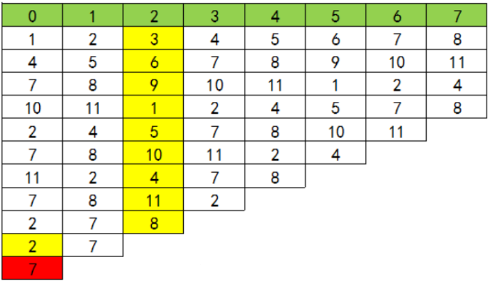

&emsp;&emsp;约瑟夫环是一个经典的数学问题：`N`个人编号分别为`1`、`2`、`...`，`N`，依次报数，每报到`M`时，杀掉那个人，求最后胜利者的编号。<!--more-->
&emsp;&emsp;实际上这个问题可以用一个公式来解决：

``` cpp
f(N, M) = (f(N − 1, M) + M) % N
```

- `f(N, M)`：`N`个人报数，每报到`M`时杀掉那个人，最终胜利者的编号。
- `f(N − 1, M)`：`N-1`个人报数，每报到`M`时杀掉那个人，最终胜利者的编号。

&emsp;&emsp;我们用数字`1`至`11`表示`11`个人，他们先排成一排，假设每报到`3`的人被杀掉：

- 刚开始时，头一个人编号是`1`，从他开始报数，第一轮被杀掉的是编号`3`的人。
- 编号`4`的人从`1`开始重新报数，这时候我们可以认为编号`4`这个人是队伍的头。第二轮被杀掉的是编号`6`的人。
- 编号`7`的人开始重新报数，这时候我们可以认为编号`7`这个人是队伍的头。第三轮被杀掉的是编号`9`的人。
- `...`
- 第九轮时，编号`2`的人开始重新报数，这时候我们可以认为编号`2`这个人是队伍的头。这轮被杀掉的是编号`8`的人。
- 下一个人还是编号为`2`的人，他从`1`开始报数，不幸的是他在这轮被杀掉了。
- 最后的胜利者是编号为`7`的人。

&emsp;&emsp;下图表示这一过程：



&emsp;&emsp;假设我们已经知道`11`个人时，胜利者的下标位置为`6`。那下一轮`10`个人时，胜利者的下标位置为多少？实际上，第一轮删掉编号为`3`的人后，之后的人都往前面移动了`3`位，胜利者也往前移动了`3`位，所以他的下标位置由`6`变成`3`。
&emsp;&emsp;假设我们已经知道`10`个人时，胜利者的下标位置为`3`。那前一轮`11`个人时，胜利者的下标位置为多少？这可以看作是上一个问题的逆过程，大家都往后移动`3`位，所以`f(11, 3) = f(10, 3) + 3`。不过有可能数组会越界，所以最后对当前人数的个数进行取模：`f(11, 3) = (f(10, 3) + 3) % 11`。
&emsp;&emsp;现在改为人数改为`N`，报到`M`时，把那个人杀掉，那么数组是怎么移动的？每杀掉一个人，下一个人成为头，相当于把数组向前移动`M`位。若已知`N - 1`个人时，胜利者的下标位置为`f(N − 1, M)`，则`N`个人的时候，就是往后移动`M`位。因为有可能数组越界，超过的部分会被接到头上，所以还要取模，即`f(N, M) = (f(N − 1, M) + M) % N`。
&emsp;&emsp;代码如下，因为求出的结果是数组中的下标，所以最终的编号还要加`1`：

``` cpp
int cir ( int n, int m ) {
    int p = 0;

    for ( int i = 2; i <= n; i++ ) {
        p = ( p + m ) % i;
    }

    return p + 1;
}
```