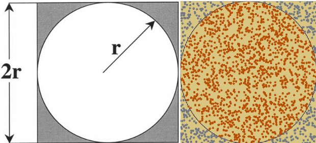
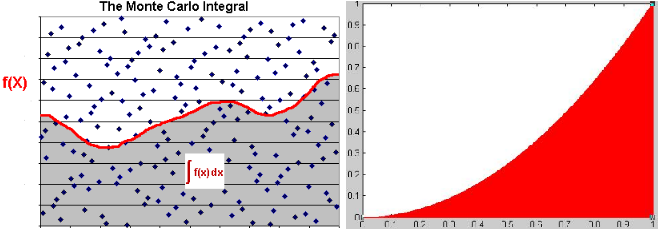
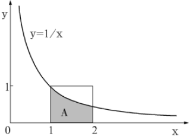

### 蒙特卡洛介绍

&emsp;&emsp;蒙特卡罗方法是一种计算方法，其原理是通过大量随机样本，去了解一个系统，进而得到所要计算的值。<!--more-->

### 蒙特卡洛的应用

#### 圆周率的计算

&emsp;&emsp;最经典的应用就是利用蒙特卡洛算法求圆周率。正方形内部有一个相切的圆，它们的面积之比是`π/4`。现在在这个正方形内部，随机产生`10000`个点(即`10000`个坐标对$(x, y)$)，计算它们与中心点的距离，从而判断是否落在圆的内部。



如果这些点均匀分布，那么圆内的点应该占到所有点的`π/4`，因此将这个比值乘以`4`，就是`π`的值：

$$
\frac{Area\ of\ Circle}{Area\ of\ Square} = \frac{\pi r^2}{(2r)^2} = \frac{\pi}{4}
$$

``` cpp
#include <iostream>
#include <cmath>
#include <ctime>

#define COUNT 500000

using namespace std;

/* 是否在单位圆范围之内 */
bool InCircle ( double  x, double  y ) {
    if ( ( x * x + y * y ) <= 1 ) {
        return true;
    }

    return false;
}

int main() {
    int num = 0;
    srand ( ( unsigned ) time ( NULL ) );

    for ( int i = 0; i < COUNT; i++ ) {
        double x, y;
        x = rand() * 1.0 / RAND_MAX;
        y = rand() * 1.0 / RAND_MAX;

        if ( InCircle ( x, y ) ) {
            num++;
        }
    }

    cout << "PI: " << ( num * 4.0 ) / COUNT << endl;
}
```

#### 积分的计算

&emsp;&emsp;将上面的方法加以推广，就可以计算任意一个积分的值。例如计算函数$y = x^2$在$[0, 1]$区间的积分，就是求出下图红色部分的面积：



这个函数在$(1, 1)$点的取值为`1`，所以整个红色区域在一个面积为`1`的正方形里面。在该正方形内部产生大量随机点，可以计算出有多少点落在红色区域(判断条件$y < x^2$)，这个比重就是所要求的积分值。<br>
&emsp;&emsp;接下来用蒙特卡洛积分求自然常数`e`，其积分如下图：



假设满足上述条件的点有`m`个，而全部的点有`n`个，所以得到近似公式如下：

$$
S = \int_{1}^{2} \frac{1}{x} dx \approx \frac{m}{n} \ast (2 - 1) \ast (1 - 0)
$$

而依据牛顿莱布尼兹公式可以得到：

$$
S = \int_{1}^{2} \frac{1}{x} dx = ln2 - ln1 = ln2
$$

这两种方法结果应该是相等的，于是得到如下结论：

$$
ln2 = \frac{m}{n} \Rightarrow log_2e = \frac{n}{m} \Rightarrow e = 2^{\frac{n}{m}}
$$

``` cpp
#include <iostream>
#include <cmath>
#include <ctime>

#define MAX_ITERS 10000000

using namespace std;

struct Point {
    double x, y;
};

double Rand ( double L, double R ) {
    return L + ( R - L ) * rand() * 1.0 / RAND_MAX;
}

Point getPoint() {
    Point t;
    t.x = Rand ( 1.0, 2.0 );
    t.y = Rand ( 0.0, 1.0 );
    return t;
}

double getResult() {
    int m = 0;
    int n = MAX_ITERS;
    srand ( time ( NULL ) );

    for ( int i = 0; i < n; i++ ) {
        Point t = getPoint();
        double res = t.x * t.y;

        if ( res <= 1.0 ) {
            m++;
        }
    }

    return pow ( 2.0, 1.0 * n / m );
}

int main() {
    for ( int i = 0; i < 20; i++ ) {
        cout << getResult() << endl;
    }

    return 0;
}
```