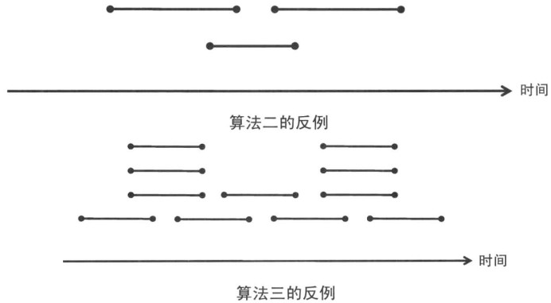

&emsp;&emsp;贪心法又称贪心算法、贪婪算法，是一种在每一步选择中都采取在当前状态下最好或最优(即最有利)的选择，从而希望导致结果是最好或最优的算法。比如在旅行推销员问题中，如果旅行员每次都选择最近的城市，那这就是一种贪心算法。<!--more-->
&emsp;&emsp;贪心算法在有最优子结构的问题中尤为有效，最优子结构的意思是局部最优解能决定全局最优解。简单地说，问题能够分解成子问题来解决，子问题的最优解能递推到最终问题的最优解。
&emsp;&emsp;贪心算法与动态规划的不同在于，它对每个子问题的解决方案都做出选择，不能回退。动态规划则会保存以前的运算结果，并根据以前的结果对当前进行选择，有回退功能。
&emsp;&emsp;贪心法可以解决一些最优化问题，例如求图中的最小生成树、哈夫曼编码等。对于其他问题，贪心法一般不能得到我们所要求的答案。一旦一个问题可以通过贪心法来解决，那么贪心法一般是解决这个问题的最好办法。由于贪心法的高效性以及其所求得的答案比较接近最优结果，也可以用作辅助算法或者直接解决一些要求结果不特别精确的问题。
&emsp;&emsp;贪心算法的步骤如下：

1. 建立数学模型来描述问题。
2. 把求解的问题分成若干个子问题。
3. 对每一子问题求解，得到子问题的局部最优解。
4. 把子问题的解局部最优解合成原来解问题的一个解。

实现该算法的过程：

``` cpp
从问题的某一初始解出发；

while 能朝给定总目标前进一步：
    do 求出可行解的一个解元素；

最后，由所有解元素组合成问题的一个可行解。
```

对于大部分的问题，贪心法通常都不能找出最佳解，因为它们一般没有测试所有可能的解。贪心法容易过早做决定，因而没法达到最佳解，例如所有对图着色问题。
&emsp;&emsp;题目描述：有`1`元、`5`元、`10`元、`50`元、`100`元和`500`元的硬币，各`C1`、`C5`、`C10`、`C50`、`C100`、`C500`枚。现在要用来支付`A`元，最少需要各种硬币多少，假定本题至少存在一种支付方案。样例输入：

``` cpp
C1 = 3, C5 = 2, C10 = 1, C50 = 3, C100 = 0, C500 = 2, A = 620
```

样例输出如下：

``` cpp
6 (500的1个，50的2个，10的1个，5元的2个，合计6个)
```

解决方法是优先使用面值大的硬币：

``` cpp
#include <iostream>
#include <string.h>
#include <algorithm>
#include <cstdlib>

using namespace std;

int A, v[6] = { 1, 5, 10, 50, 100, 500 }, c[6];

int main() {
    while (cin >> A) {
        memset(c, 0, sizeof(c));

        for (int i = 0; i < 6; i++) {
            cin >> c[i];
        }

        int ans = 0;

        for (int i = 5; i >= 0; i--) {
            int t = min(A / v[i], c[i]);
            A -= t * v[i];
            ans += t;
        }

        cout << ans << endl;
    }

    return 0;
}
```

&emsp;&emsp;有`n`项工作，每项工作分别在`si`开始，`ti`结束。对每项工作，你都可以选择参加或不参加，但选择了参加某项工作就必须自始至终参加全程参与，即参与工作的时间段不能有重叠(即使开始的时间和结束的时间重叠都不行)。输入如下：

``` cpp
n = 5
s = {1, 2, 4, 6, 8}
T = {3, 5, 7, 9, 10}
```

输出如下：

``` cpp
3 (选择工作1、3和5)
```

&emsp;&emsp;对这个问题，如果使用贪心算法的话，可能有以下几种考虑：每次选取结束时间最早的；每次选取用时最短的；在可选工作中，每次选取与最小可选工作有重叠的部分。对于上面的几种算法，只有第一个算法是正确的，其它的都可以找到相应的反例：



代码如下：

``` cpp
#include <queue>
#include <cstdlib>
#include <iostream>

using namespace std;

const int N = 5;
int s[N] = { 1, 2, 4, 6, 8 };
int t[N] = { 3, 5, 7, 9, 10 };

int solve() {
    pair<int, int> itv[N]; /* 用于对工作排序的pair数组 */

    /* 对pair进行的是字典序比较。为了让结束时间早的
       工作排在前面，把T存入first，把S存入second */
    for (int i = 0; i < N; i++) {
        itv[i].first = t[i];
        itv[i].second = s[i];
    }

    sort(itv, itv + N);
    int count = 0;
    int t = 0; /* t是最后所选工作的结束时间 */

    for (int i = 0; i < N; i++) {
        if (t < itv[i].second) {
            count++;
            t = itv[i].first;
        }
    }

    return count;
}

int main() {
    cout << solve() << endl;
    return 0;
}
```