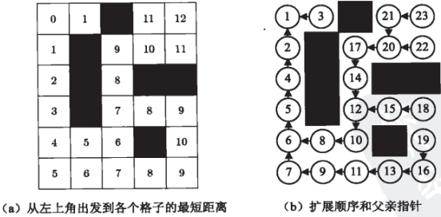
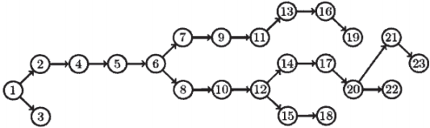

### 电子老鼠走迷宫

&emsp;&emsp;说明：老鼠走迷宫是递回求解的基本题型，我们在二维阵列中使用`2`表示迷宫墙壁，使用`1`来表示老鼠的行走路径，试以程式求出由入口至出口的路径。
&emsp;&emsp;解法：老鼠的走法有上、左、下、右四个方向，在每前进一格之后就选一个方向前进，无法前进时退回选择下一个可前进方向，如此在阵列中依序测试四个方向，直到走到出口为止，这是递归的基本题。

``` cpp
#include <stdio.h>
#include <stdlib.h>

unsigned int migo[7][7] = { /* 迷宫图 */
    {2, 2, 2, 2, 2, 2, 2},
    {2, 0, 0, 0, 0, 0, 2},
    {2, 0, 2, 0, 2, 0, 2},
    {2, 0, 0, 0, 0, 2, 2},
    {2, 2, 0, 2, 0, 2, 2},
    {2, 0, 0, 0, 0, 0, 2},
    {2, 2, 2, 2, 2, 2, 2}
};

unsigned int starti = 1, startj = 1; /* 出发点 */
unsigned int endi = 5, endj = 5; /* 出口 */
unsigned int success = 0;

int visit ( int i, int j ) {
    migo[i][j] = 1;

    if ( i == endi && j == endj ) { /* 判断有没有到出口 */
        success = 1;
    }

    if ( success != 1 && migo[i][j + 1] == 0 ) {
        visit ( i, j + 1 ); /* 四种走法：右、下、左和上 */
    }

    if ( success != 1 && migo[i + 1][j] == 0 ) {
        visit ( i + 1, j );
    }

    if ( success != 1 && migo[i][j - 1] == 0 ) {
        visit ( i, j - 1 );
    }

    if ( success != 1 && migo[i - 1][j] == 0 ) {
        visit ( i - 1, j );
    }

    if ( success != 1 ) {
        migo[i][j] = 0;
    }

    return success;
}

int main ( void ) {
    unsigned int i, j;
    printf ( "显示迷宫：\n" );

    for ( i = 0; i < 7; i++ ) {
        for ( j = 0; j < 7; j++ )
            if ( migo[i][j] == 2 ) {
                printf ( "X" );
            } else {
                printf ( " " );
            }

        printf ( "\n" );
    }

    if ( visit ( starti, startj ) == 0 ) {
        printf ( "\n没有找到出口！\n" );
    } else {
        printf ( "\n显示路径:\n" );

        for ( i = 0; i < 7; i++ ) {
            for ( j = 0; j < 7; j++ ) {
                if ( migo[i][j] == 2 ) {
                    printf ( "X" );
                } else if ( migo[i][j] == 1 ) {
                    printf ( "*" );
                } else {
                    printf ( " " );
                }
            }

            printf ( "\n" );
        }
    }

    return 0;
}
```

&emsp;&emsp;由于迷宫的设计，老鼠走迷宫的入口至出口路径可能不只一条，如何求出所有的路径呢？解法求所有路径看起来复杂但其实更简单，只要在老鼠走至出口时显示经过的路径，然后退回上一格重新选择下一个位置继续递回就可以了，比求出单一路径还简单，我们的程式只要作一点修改就可以了。(我的理解为让老鼠把所有路线都走一遍，如果到头了，则把路线打印出来。老鼠不能回头，如果发现自己不能移动，则把自己的当前路径设为无效的。)

``` cpp
#include <stdio.h>
#include <stdlib.h>

int migo[9][9] = { /* 迷宫图 */
    {2, 2, 2, 2, 2, 2, 2, 2, 2},
    {2, 0, 0, 0, 0, 0, 0, 0, 2},
    {2, 0, 2, 2, 0, 2, 2, 0, 2},
    {2, 0, 2, 0, 0, 2, 0, 0, 2},
    {2, 0, 2, 0, 2, 0, 2, 0, 2},
    {2, 0, 0, 0, 0, 0, 2, 0, 2},
    {2, 2, 0, 2, 2, 0, 2, 0, 2},
    {2, 0, 0, 0, 0, 0, 0, 0, 2},
    {2, 2, 2, 2, 2, 2, 2, 2, 2}
};

int starti = 1, startj = 1; /* 出发点 */
int endi = 7, endj = 7; /* 出口 */

void visit ( int i, int j ) {
    int m, n;
    migo[i][j] = 1;

    if ( i == endi && j == endj ) { /* 判断有没有到出口 */
        for ( m = 0; m < 9; m++ ) {
            for ( n = 0; n < 9; n++ ) {
                if ( migo[m][n] == 2 ) {
                    printf ( "X" );
                } else if ( migo[m][n] == 1 ) {
                    printf ( "*" );
                } else {
                    printf ( " " );
                }
            }

            printf ( "\n" );
        }

        printf ( "\n" );
    }

    if ( migo[i][j + 1] == 0 ) {
        visit ( i, j + 1 ); /* 四种走法：右、下、左和上 */
    }

    if ( migo[i + 1][j] == 0 ) {
        visit ( i + 1, j );
    }

    if ( migo[i][j - 1] == 0 ) {
        visit ( i, j - 1 );
    }

    if ( migo[i - 1][j] == 0 ) {
        visit ( i - 1, j );
    }

    migo[i][j] = 0;
}

int main ( void ) {
    int i, j;
    printf ( "显示迷宫：\n" );

    for ( i = 0; i < 9; i++ ) {
        for ( j = 0; j < 9; j++ )
            if ( migo[i][j] == 2 ) {
                printf ( "X" );
            } else {
                printf ( " " );
            }

        printf ( "\n" );
    }

    visit ( starti, startj );
    return 0;
}
```


---

### 走迷宫的BFS算法

&emsp;&emsp;一个网格迷宫由`n`行`m`列的单元格组成，每一个单元格要么是空地(用`1`表示)，要么是障碍物(用`0`来表示)。你的任务是找一条从起点到终点的最短移动序列，当中`UDLR`分别表示往上、下、左、右移动到相邻单元格。不论什么时候都不能在障碍格中，也不能走到迷宫之外，起点和终点保证是空地。<!--more-->
&emsp;&emsp;还记得二叉树的`BFS`吗？节点的访问顺序恰好是它们到根结点距离从小到大的顺序。类似地，也可以用`BFS`来按照到起点的距离顺序遍历迷宫。假定起点在左上角，就从该点开始用`BFS`遍历迷宫图，逐步计算出它到每个结点的最短距离(左图)，以及这些最短路径上每个结点的`前一个结点`(右图)。



如果把上图`b`中的箭头理解成`指向父亲的指针`，那么迷宫中的格子就变成了一棵树：除了起点之外，每个结点恰好有一个父亲：



图的`BFS`几乎和二叉树的`BFS`一样，但需要避免重复访问一个结点，代码使用标记`vis[x][y]`记录格子`(x, y)`是否被走过，和`DFS`一样。

``` cpp
#include <cstdio>
#include <cstdlib>
#include <cstring>

#define MAXN 100

int q[MAXN * MAXN];
int vis[MAXN][MAXN], fa[MAXN][MAXN], dist[MAXN][MAXN];
int dx[4] = {0, 1, 0, -1}, dy[4] = {1, 0, -1, 0};
int maze[MAXN][MAXN];
int n, m;
int dir[MAXN * MAXN];
int last_dir[MAXN][MAXN];
char name[4] = {'R', 'D', 'L', 'U'};

void bfs ( int x, int y ) {
    int front = 0, rear = 0, d, u;
    u = x * m + y;
    vis[x][y] = 1;
    fa[x][y] = u;
    dist[x][y] = 0;
    q[rear++] = u;

    while ( front < rear ) {
        u = q[front++];
        x = u / m;
        y = u % m;

        for ( d = 0; d < 4; d++ ) {
            int nx = x + dx[d], ny = y + dy[d];

            if ( nx >= 0 && nx < n && ny >= 0 && ny < m && !maze[nx][ny] && !vis[nx][ny] ) {
                int v = nx * m + ny;
                q[rear++] = v;
                vis[nx][ny] = 1;
                fa[nx][ny] = u;
                dist[nx][ny] = dist[x][y] + 1;
                last_dir[nx][ny] = d;
            }
        }
    }
}

void print_path ( int x, int y ) {
    int c = 0;

    for ( ;; ) {
        int fx = fa[x][y] / m;
        int fy = fa[x][y] % m;

        if ( fx == x && fy == y ) {
            break;
        }

        dir[c++] = last_dir[x][y];
        x = fx;
        y = fy;
    }

    while ( c-- ) {
        putchar ( name[dir[c]] );
    }
}

int main() {
    memset ( vis, 0, sizeof ( vis ) );
    memset ( maze, 0, sizeof ( maze ) );
    n = 6;
    m = 5;
    maze[0][2] = maze[1][1] = maze[2][1] = maze[2][3] = maze[2][4] = maze[3][1] = maze[4][3] = 1;
    bfs ( 0, 0 );
    print_path ( 0, 4 );
    return 0;
}
```

&emsp;&emsp;为方便起见，我们把格子从上到下编号为`0、1、2、...、n * m`，因此第`i`行第`j`个格子的编号为`i * m + j`，而编号为`u`的行号为`u / m`，列号为`u % m`。当格子`(x, y)`拓展出格子`(nx, ny)`后，我们不仅需要更新`dist[nx][ny] = dist[x][y] + 1`，还要保存新格子`(nx, ny)`的父亲编号`fa[nx][ny]`以及从父亲节点到它的移动方向`last_dir[nx][ny]`。
&emsp;&emsp;`print_path`的递归形式如下：

``` cpp
void print_path(int x, int y) {
    int fx = fa[x][y] / m;
    int fy = fa[x][y] % m;

    if (fx != x || fy != y) {
        print_path(fx, fy);
        putchar(name[last_dir[x][y]]);
    }
}
```

&emsp;&emsp;类似的`C++`代码如下：

``` cpp
#include <iostream>
#include <queue>
#include <cstdlib>

using namespace std;

const int MAX_N = 100;
const int MAX_M = 100;
const int INF = 0x3f3f3f3f;

typedef pair<int, int> P;

char maze[MAX_N][MAX_M + 1] = { /* 表示迷宫的字符串的数组 */
    { '#', 'S', '#', '#', '#', '#', '#', '#', '.', '#' },
    { '.', '.', '.', '.', '.', '.', '#', '.', '.', '#' },
    { '.', '#', '.', '#', '#', '.', '#', '#', '.', '#' },
    { '.', '#', '.', '.', '.', '.', '.', '.', '.', '.' },
    { '#', '#', '.', '#', '#', '.', '#', '#', '#', '#' },
    { '.', '.', '.', '.', '#', '.', '.', '.', '.', '#' },
    { '.', '#', '#', '#', '#', '#', '#', '#', '.', '#' },
    { '.', '.', '.', '.', '#', '.', '.', '.', '.', '.' },
    { '.', '#', '#', '#', '#', '.', '#', '#', '#', '.' },
    { '.', '.', '.', '.', '#', '.', '.', '.', 'G', '#' }
};

int N, M;
int sx, sy; /* 起点的坐标 */
int gx, gy; /* 终点的坐标 */

int d[MAX_N][MAX_M]; /* 到各个位置的最短距离的数组 */

int dx[4] = { 1, 0, -1, 0 }, dy[4] = { 0, 1, 0, -1 }; /* 到各个位置的最短距离的数组 */

int bfs() { /* 求从(sx,xy)到(gx,gy)的最短距离，如果无法到达，则是INF */
    queue<P> que;

    for (int i = 0; i < N; i++)
        for (int j = 0; j < M; j++) {
            d[i][j] = INF; /* 初始化所有点的距离为INF */
        }

    que.push(P(sx, sy));
    d[sx][sy] = 0; /* 将起点加入队列，并把这一地点的距离设为0 */

    while (que.size()) { /* 不断循环，直到队列的长度为0 */
        P p = que.front(); /* 从队列的最前端取出元素 */
        que.pop();

        if (p.first == gx && p.second == gy) {
            break;
        }

        for (int i = 0; i < 4; i++) { /* 四个方向的循环 */
            /* 移动后的坐标记为(nx,ny) */
            int nx = p.first + dx[i];
            int ny = p.second + dy[i];

            /* 判断是否可以移动以及是否已经访问过(“d[nx][ny] != INF”即为已经访问过) */
            if (0 <= nx && nx < N && 0 <= ny && ny < M && maze[nx][ny] != '#' && d[nx][ny] == INF) {
                que.push(P(nx, ny)); /* 可以移动的话，则加入到队列，并且到该位置的距离确定为到p的距离加上“1” */
                d[nx][ny] = d[p.first][p.second] + 1;
            }
        }
    }

    return d[gx][gy];
}

int main() {
    cin >> N >> M;

    for (int i = 0; i < N; i++)
        for (int j = 0; j < M; j++) {
            if (maze[i][j] == 'S') {
                sx = i;
                sy = j;
            }

            if (maze[i][j] == 'G') {
                gx = i;
                gy = j;
            }
        }

    int dst = bfs();
    cout << dst << endl; /* 输出最短路径长度 */
    return 0;
}
```