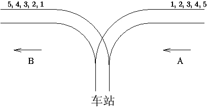

&emsp;&emsp;某城市有一个火车站，铁轨铺设如下图所示。有`n`节车厢从`A`方向驶入车站，按进站顺序编号为`1`至`n`。你的任务是让它们按照某种特定的顺序进入`B`方向的铁轨并使出车站。为了重组车厢，你可以借助中转站`C`；这是一个可以停放任意多节车厢的车站，但由于末端封顶，驶入`C`的车厢必须按照相反的顺序驶出`C`。对于每个车厢，一旦从`A`进入`C`，就不能再回到`A`了；一旦从`C`进入`B`，就不能回到`C`了。换言之，在任意时刻，只有两种选择：`A -> C`和`C -> B`。<!--more-->



样例输入：

``` cpp
5
1 2 3 4 5
5
5 4 1 2 3
6
6 5 4 3 2 1
```

样例输出：

``` cpp
Yes
No
Yes
```

代码如下：

``` cpp
#include <cstdio>
#include <stack>

using namespace std;

#define MAXN 1000 + 10

int n, target[MAXN];

int main ( void ) {
    while ( scanf ( "%d", &n ) == 1 ) {
        stack<int> s;
        int A = 1, B = 1;

        for ( int i = 1; i <= n; i++ ) {
            scanf ( "%d", &target[i] );
        }

        int ok = 1;

        while ( B <= n ) {
            if ( A == target[B] ) {
                A++; /* 车厢按顺序进出中转站C，则跳出循环 */
                B++;
            } else if ( !s.empty() && s.top() == target[B] ) {
                s.pop(); /*若车厢按逆序进中转站C，则跳出循环 */
                B++;
            } else if ( A <= n ) {
                s.push ( A++ ); /* 调整车厢为逆序出中转站C */
            } else {
                ok = 0; /* 车厢既不是按顺序，也不是按逆序进出中转站C */
                break;
            }
        }

        printf ( "%s\n", ok ? "Yes" : "No" );
    }

    return 0;
}
```

为了方便，数组下标均从`1`开始。例如`target[1]`是指目标序列中第一个车厢的编号，`stack[1]`是指栈底元素(栈空当且仅当`top = 0`)。