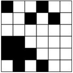

&emsp;&emsp;输入一个`n * n`的黑白图像(`1`表示黑色，`0`表示白色)，任务是统计其中八连块的个数。如果两个黑格子有公共边或者有公共顶点，就说它们属于同一个八连块。如下图所示，八连块的个数为`3`：<!--more-->



即输入为：

``` cpp
6
1 0 0 1 0 0
0 0 1 0 1 0
0 0 0 0 0 0
1 1 0 0 0 0
1 1 1 0 0 0
0 1 0 1 0 0
```

输出为`3`。

``` cpp
#include <stdio.h>
#include <string.h>

#define MAX 1000+10

/* mat存图像，1代表黑；vis标记是否访问过这个格子 */
char mat[MAX][MAX], vis[MAX][MAX];

void dfs ( int x, int y ) {
    if ( !mat[x][y] || vis[x][y] ) {
        return;
    }

    vis[x][y] = 1; /* 标记此点访问过 */
    /* 递归访问周围8个点 */
    dfs ( x - 1, y - 1 );
    dfs ( x - 1, y );
    dfs ( x - 1, y + 1 );
    dfs ( x, y - 1 );
    dfs ( x, y + 1 );
    dfs ( x + 1, y - 1 );
    dfs ( x + 1, y );
    dfs ( x + 1, y + 1 );
}

int main ( void ) {
    memset ( mat, 0, sizeof ( mat ) );
    memset ( vis, 0, sizeof ( vis ) );
    int i, j, n, cnt = 0;
    scanf ( "%d", &n );

    for ( i = 1; i <= n; i++ ) {
        for ( j = 1; j <= n; j++ ) {
            scanf ( "%d", &mat[i][j] );
        }
    }

    for ( i = 1; i <= n; i++ ) {
        for ( j = 1; j <= n; j++ ) {
            if ( mat[i][j] && !vis[i][j] ) { /* 找没访问过的黑格 */
                cnt++;
                dfs ( i, j );
            }
        }
    }

    printf ( "%d\n", cnt );
    return 0;
}
```