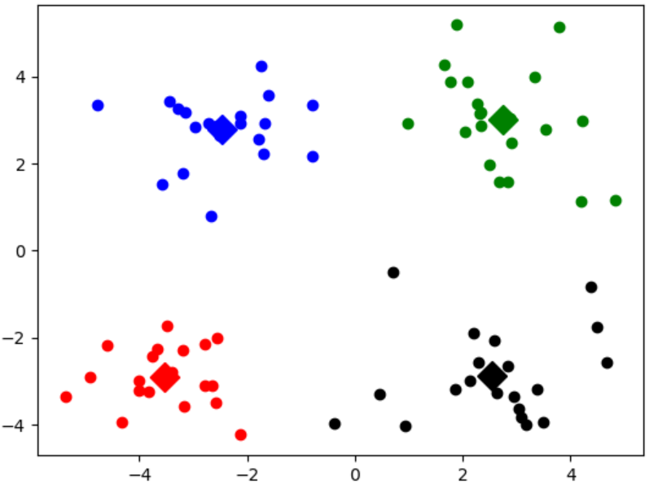
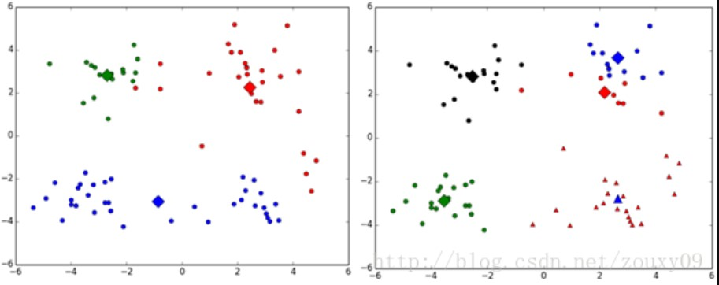
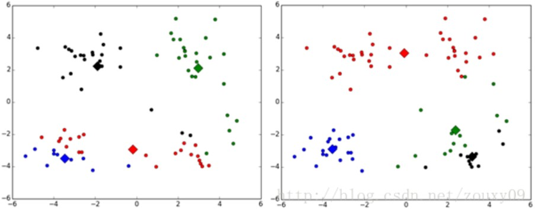
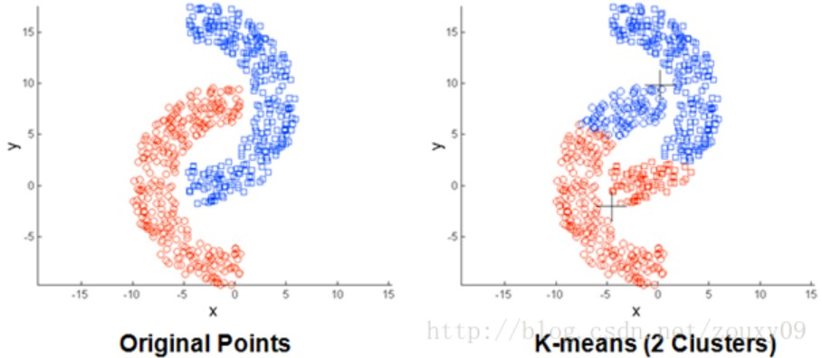
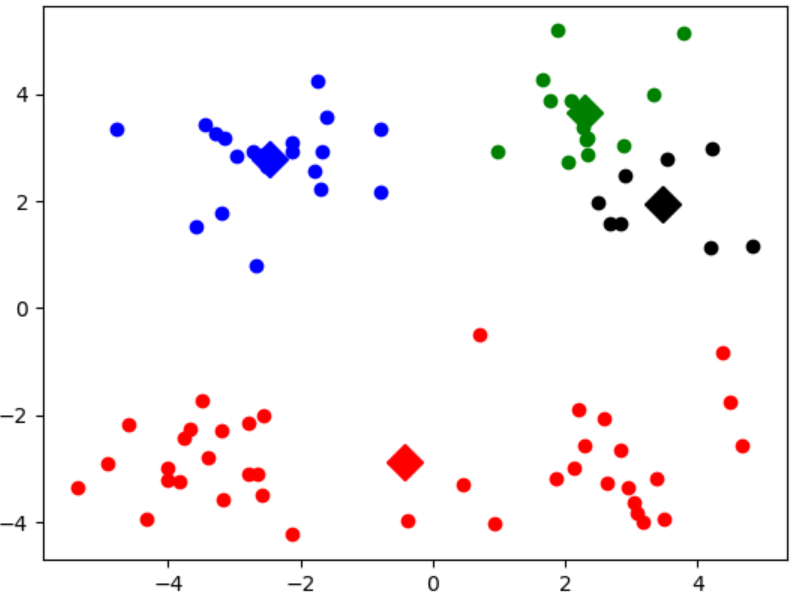

&emsp;&emsp;俗话说`物以类聚，人以群分`，而聚类算法就是体现这样的思想。聚类是一种非监督学习，与之前学习的分类和回归算法不同(监督学习)，监督学习是有有`label`标签的，而非监督学习没有。<!--more-->
&emsp;&emsp;聚类是把相似的对象归到同一簇中，有点像全自动分类。聚类的应用场景有很多，例如在电商行业，通过用户的购买历史进行聚类，针对不同的用户群体推送不同的广告。

### 算法流程

&emsp;&emsp;`K-Means`聚类首先随机确定`K`个初始点作为质心，这也是`K-Means`聚类的一个问题，`K`值的不合理选择会使得模型效果很差。然后将数据集中的每个点分配到一个簇中，具体来讲，就是为每个点找到距其最近的质心(这里算的是欧式距离，当然也可以使用其他距离)，并将其分配至该质心所对应的簇；这一步完成之后，每个簇的质心更新为该簇所有点的平均值。算法伪代码如下：

``` python
创建k个点作为起始质心(通常是随机选择)
当任意一个点的簇分配结果发生改变时(不改变时算法结束)
    对数据集中的每个数据点
        对每个质心
            计算质心与数据点之间的距离
        将数据点分配到距其最近的簇
    对每一个簇，计算簇中所有点的均值并将均值作为质心
```

数据集`testSet.txt`的部分数据如下：

``` python
1.658985    4.285136
-3.453687   3.424321
4.838138    1.151539
-5.379713   -3.362104
0.972564    2.924086
-3.567919   1.531611
0.450614    -3.302219
-3.487105   -1.724432
2.668759    1.594842
-3.156485   3.191137
3.165506    -3.999838
-2.786837   -3.099354
```

&emsp;&emsp;`K`均值聚类函数如下：

``` python
from numpy import *
import matplotlib.pyplot as plt

def loadDataSet(filename):  # 将文本文件导入到一个列表中
    dataMat = []
    fr = open(filename)

    for line in fr.readlines():
        curLine = line.strip().split('\t')
        fltLine = list(map(float, curLine))
        dataMat.append(fltLine)

    return dataMat

def distEclud(vecA, vecB):  # 计算两个向量的欧式距离
    return sqrt(sum(power(vecA - vecB, 2)))

# 为给定数据集构建一个包含k个随机质心的集合。随机质心必须要在整个
# 数据集的边界之内，这可以通过找到数据集每一维的最小和最大值来完成
def randCent(dataSet, k):
    n = shape(dataSet)[1]  # 列的数量
    centroids = mat(zeros((k, n)))  # 创建k个质心矩阵

    for j in range(n):  # 创建随机簇质心，并且在每一维的边界内
        minJ = min(dataSet[:, j])  # 最小值
        rangeJ = float(max(dataSet[:, j]) - minJ)  # 范围 = 最大值 - 最小值
        centroids[:, j] = mat(minJ + rangeJ * random.rand(k, 1))  # 随机生成

    return centroids

# k-means聚类算法，该算法会创建k个质心，然后将每个点分配到最近的质心，
# 再重新计算质心。这个过程重复数次，直到数据点的簇分配结果不再改变位置
def kMeans(dataSet, k, distMeas=distEclud, createCent=randCent):
    m = shape(dataSet)[0]  # 行数
    clusterAssment = mat(zeros((m, 2)))  # 一列记录簇索引值，一列存储误差(指的是当前点到簇质心的距离)
    centroids = createCent(dataSet, k)  # 创建质心，随机k个质心
    clusterChanged = True

    while clusterChanged:
        clusterChanged = False

        for i in range(m):  # 循环每一个数据点，并分配到最近的质心中去
            minDist = inf
            minIndex = -1

            for j in range(k):
                distJI = distMeas(centroids[j, :], dataSet[i, :])  # 计算数据点到质心的距离
                # 如果距离比minDist(最小距离)还小，更新minDist(最小距离)和最小质心的index(索引)
                if distJI < minDist:
                    minDist = distJI
                    minIndex = j

            # 在k个簇里面与第i个样本距离最小的的标号和距离保存在clusterAssment中
            if clusterAssment[i, 0] != minIndex:  # 簇分配结果改变
                clusterChanged = True  # 簇改变
                # 更新簇分配结果为最小质心的index(索引)、minDist(最小距离)的平方
                clusterAssment[i, :] = minIndex, minDist ** 2

        print(centroids)

        for cent in range(k):  # 更新质心
            # “clusterAssment[:,0].A == cent”是找出矩阵clusterAssment中第一列元素中等于cent的行的下标
            ptsInClust = dataSet[nonzero(clusterAssment[:, 0].A == cent)[0]]  # 将dataSet矩阵中相对应的样本提取出来
            centroids[cent, :] = mean(ptsInClust, axis=0)  # 将质心修改为簇中所有点的平均值，mean就是求平均值

    return centroids, clusterAssment

def showCluster(dataSet, k, centroids, clusterAssment):
    numSamples, dim = dataSet.shape

    if dim != 2:
        print("Sorry! I can not draw because the dimension of your data is not 2!")
        return 1

    mark = ['or', 'ob', 'og', 'ok', '^r', '+r', 'sr', 'dr', '<r', 'pr']

    if k > len(mark):
        print("Sorry! Your k is too large! ")
        return 1

    for i in range(numSamples):  # draw all samples
        markIndex = int(clusterAssment[i, 0])  # 为样本指定颜色
        plt.plot(dataSet[i, 0], dataSet[i, 1], mark[markIndex])

    mark = ['Dr', 'Db', 'Dg', 'Dk', '^b', '+b', 'sb', 'db', '<b', 'pb']

    for i in range(k):  # draw the centroids
        plt.plot(centroids[i, 0], centroids[i, 1], mark[i], markersize=12)

    plt.show()

datMAt = mat(loadDataSet("testSet.txt"))
k = 4
centroids, clusterAssment = kMeans(datMAt, k)
showCluster(datMAt, k, centroids, clusterAssment)
```

不同的类用不同的颜色来表示，其中的大菱形是对应类的均值质心点：



&emsp;&emsp;`K-means`算法比较简单，但也有几个比较大的缺点：

- `k`值的选择是用户指定的，不同的`k`得到的结果会有很大的不同，如下图所示。左边是`k = 3`的结果，这个就太稀疏了，蓝色的那个簇其实是可以再划分成两个簇的；而右图是`k = 5`的结果，可以看到红色菱形和蓝色菱形这两个簇应该是可以合并成一个簇的：



- 对`k`个初始质心的选择比较敏感，容易陷入局部最小值。例如，我们在运行上面的算法时，有可能会得到不同的结果，如下面这两种情况。`K-means`也是收敛了，只是收敛到了局部最小值：



- 存在局限性，例如下面这种非球状的数据分布就搞不定了：



&emsp;&emsp;`K-means`算法有个比较大的缺点，就是对初始`k`个质心点的选取比较敏感。而二分`k`均值(`bisecting k-means`)的出现就是为了一定情况下解决这个问题的，也就是说它对初始的`k`个质心的选择不太敏感。
&emsp;&emsp;该算法首先将所有点作为一个簇，然后将该簇一分为二。之后选择其中一个簇继续进行划分，选择哪一个簇进行划分取决于对其划分是否可以最大程度降低`SSE`(平方和误差)的值。以此进行下去，直到簇的数目等于用户给定的数目`k`为止。
&emsp;&emsp;二分`k`均值算法的伪代码如下：

``` python
将所有数据点看成一个簇
当簇数目小于k时
    对每一个簇
        计算总误差
        在给定的簇上面进行k-均值聚类(k = 2)
        计算将该簇一分为二后的总误差
    选择使得误差最小的那个簇进行划分操作
```

代码实现如下：

``` python
from numpy import *
import matplotlib.pyplot as plt

def loadDataSet(filename):  # 将文本文件导入到一个列表中
    dataMat = []
    fr = open(filename)

    for line in fr.readlines():
        curLine = line.strip().split('\t')
        fltLine = list(map(float, curLine))
        dataMat.append(fltLine)

    return dataMat

def distEclud(vecA, vecB):  # 计算两个向量的欧式距离
    return sqrt(sum(power(vecA - vecB, 2)))

# 为给定数据集构建一个包含k个随机质心的集合。随机质心必须要在
# 整个数据集的边界之内，这可以通过找到数据集每一维的最小和最大值来完成
def randCent(dataSet, k):
    n = shape(dataSet)[1]  # 列的数量
    centroids = mat(zeros((k, n)))  # 创建k个质心矩阵

    for j in range(n):  # 创建随机簇质心，并且在每一维的边界内
        minJ = min(dataSet[:, j])  # 最小值
        rangeJ = float(max(dataSet[:, j]) - minJ)  # 范围 = 最大值 - 最小值
        centroids[:, j] = mat(minJ + rangeJ * random.rand(k, 1))  # 随机生成

    return centroids

# k-means聚类算法，该算法会创建k个质心，然后将每个点分配到最近的质心，
# 再重新计算质心。这个过程重复数次，直到数据点的簇分配结果不再改变位置
def kMeans(dataSet, k, distMeas=distEclud, createCent=randCent):
    m = shape(dataSet)[0]  # 行数
    clusterAssment = mat(zeros((m, 2)))  # 一列记录簇索引值，一列存储误差(指的是当前点到簇质心的距离)
    centroids = createCent(dataSet, k)  # 创建质心，随机k个质心
    clusterChanged = True

    while clusterChanged:
        clusterChanged = False

        for i in range(m):  # 循环每一个数据点，并分配到最近的质心中去
            minDist = inf
            minIndex = -1

            for j in range(k):
                distJI = distMeas(centroids[j, :], dataSet[i, :])  # 计算数据点到质心的距离
                # 如果距离比minDist(最小距离)还小，更新minDist(最小距离)和最小质心的index(索引)
                if distJI < minDist:
                    minDist = distJI
                    minIndex = j
            # 在k个簇里面与第i个样本距离最小的的标号和距离保存在clusterAssment中
            if clusterAssment[i, 0] != minIndex:  # 簇分配结果改变
                clusterChanged = True  # 簇改变
                # 更新簇分配结果为最小质心的index(索引)、minDist(最小距离)的平方
                clusterAssment[i, :] = minIndex, minDist ** 2

        print(centroids)

        for cent in range(k):  # 更新质心
            # “clusterAssment[:,0].A == cent”是找出矩阵clusterAssment中第一列元素中等于cent的行的下标
            # 将dataSet矩阵中相对应的样本提取出来
            ptsInClust = dataSet[nonzero(clusterAssment[:, 0].A == cent)[0]]
            centroids[cent, :] = mean(ptsInClust, axis=0)  # 将质心修改为簇中所有点的平均值，mean就是求平均值

    return centroids, clusterAssment

def biKMeans(dataSet, k, distMeas=distEclud):  # 二分KMeans聚类算法，基于kMeans基础之上的优化，以避免陷入局部最小值
    m = shape(dataSet)[0]
    clusterAssment = mat(zeros((m, 2)))  # 保存每个数据点的簇分配结果和平方误差
    centroid0 = mean(dataSet, axis=0).tolist()[0]  # 质心初始化为所有数据点的均值
    centList = [centroid0]  # 初始化只有1个质心的list

    for j in range(m):  # 计算所有数据点到初始质心的距离平方误差
        clusterAssment[j, 1] = distMeas(mat(centroid0), dataSet[j, :]) ** 2

    while (len(centList) < k):  # 当质心数量小于k时
        lowestSSE = inf

        for i in range(len(centList)):  # 对每一个质心
            ptsInCurrCluster = dataSet[nonzero(clusterAssment[:, 0].A == i)[0], :]  # 获取当前簇i下的所有数据点
            centroidMat, splitClustAss = kMeans(ptsInCurrCluster, 2, distMeas)  # 将当前簇i进行二分kMeans处理
            sseSplit = sum(splitClustAss[:, 1])  # 将二分kMeans结果中的平方和的距离进行求和
            # 将未参与二分kMeans分配结果中的平方和的距离进行求和
            sseNotSplit = sum(clusterAssment[nonzero(clusterAssment[:, 0].A != i)[0], 1])
            print("sseSplit, and notSplit: ", sseSplit, sseNotSplit)

            if (sseSplit + sseNotSplit) < lowestSSE:
                bestCentToSplit = i
                bestNewCents = centroidMat
                bestClustAss = splitClustAss.copy()
                lowestSSE = sseSplit + sseNotSplit

        # 找出最好的簇分配结果
        # 调用二分kMeans的结果，默认簇是0和1，当然也可以改成其它的数字
        bestClustAss[nonzero(bestClustAss[:, 0].A == 1)[0], 0] = len(centList)
        bestClustAss[nonzero(bestClustAss[:, 0].A == 0)[0], 0] = bestCentToSplit  # 更新为最佳质心
        print('the bestCentToSplit is: ', bestCentToSplit)
        print('the len of bestClustAss is: ', len(bestClustAss))
        # 更新质心列表
        # 更新原质心list中的第i个质心为使用二分kMeans后，bestNewCents的第一个质心
        centList[bestCentToSplit] = bestNewCents[0, :].tolist()[0]
        centList.append(bestNewCents[1, :].tolist()[0])  # 添加bestNewCents的第二个质心
        # 重新分配最好簇下的数据(质心)以及SSE
        clusterAssment[nonzero(clusterAssment[:, 0].A == bestCentToSplit)[0], :] = bestClustAss

    return mat(centList), clusterAssment

def showCluster(dataSet, k, centroids, clusterAssment):
    numSamples, dim = dataSet.shape

    if dim != 2:
        print("Sorry! I can not draw because the dimension of your data is not 2!")
        return 1

    mark = ['or', 'ob', 'og', 'ok', '^r', '+r', 'sr', 'dr', '<r', 'pr']

    if k > len(mark):
        print("Sorry! Your k is too large! ")
        return 1

    for i in range(numSamples):  # draw all samples
        markIndex = int(clusterAssment[i, 0])  # 为样本指定颜色
        plt.plot(dataSet[i, 0], dataSet[i, 1], mark[markIndex])

    mark = ['Dr', 'Db', 'Dg', 'Dk', '^b', '+b', 'sb', 'db', '<b', 'pb']

    for i in range(k):  # draw the centroids
        plt.plot(centroids[i, 0], centroids[i, 1], mark[i], markersize=12)

    plt.show()

datMAt = mat(loadDataSet("testSet.txt"))
k = 4
centroids, clusterAssment = biKMeans(datMAt, k)
showCluster(datMAt, k, centroids, clusterAssment)
```

上述函数可以运行多次，聚类会收敛到全局最小值，而原始的`kMeans`函数偶尔会陷入局部最小值：

