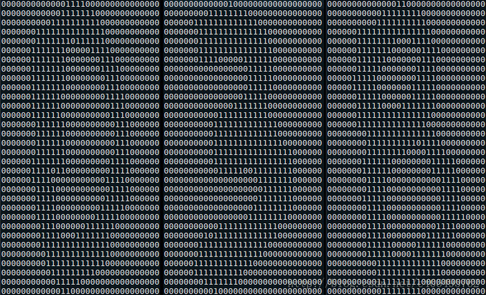

&emsp;&emsp;`k`近邻算法(`kNN`)采用测量不同特征值之间的距离方法进行分类。其优点是精度高、对异常值不敏感、无数据输入假定；缺点是计算复杂度高、空间复杂度高；适用数据范围是数值型和标称型。<!--more-->
&emsp;&emsp;`k`近邻算法的工作原理是：存在一个样本数据集合，也称作`训练样本集`，并且样本集中每个数据都存在标签。输入没有标签的新数据后，将新数据的每个特征与样本集中数据对应的特征进行比较，然后算法提取样本集中特征最相似数据(最近邻)的分类标签。一般来说只选择样本数据集中前`k`个最相似的数据，这就是`k`近邻算法中`k`的出处，通常`k`是不大于`20`的整数。最后选择`k`个最相似数据中出现次数最多的分类，作为新数据的分类。
&emsp;&emsp;现在使用`k`近邻算法分类爱情片和动作片。有人曾经统计过很多电影的打斗镜头和接吻镜头，下图显示了`6`部电影的打斗和接吻镜头数。假如有一部未看过的电影，如何确定它是爱情片还是动作片呢？我们可以使用`kNN`来解决这个问题。


&emsp;&emsp;首先我们需要知道这个未知电影存在多少个打斗镜头和接吻镜头，上图中问号位置是该未知电影出现的镜头数图形化展示，具体数字参见下表：

电影名称                   | 打斗镜头 | 接吻镜头 | 电影类型
---------------------------|---------|---------|--------
California Man             | 3       | 104     | 爱情片
He's Not Really into Dudes | 2       | 100     | 爱情片
Beautiful Woman            | 1       | 81      | 爱情片
Kevin Longblade            | 101     | 10      | 动作片
Robo Slayer 3000           | 99      | 5       | 动作片
Amped II                   | 98      | 2       | 动作片
?                          | 18      | 90      | 未知

计算未知电影与样本集中其他电影的距离，我们可以比较其相似度：

电影名称                    | 与未知电影的距离
---------------------------|----------------
California Man             | 20.5
He's Not Really into Dudes | 18.7
Beautiful Woman            | 19.2
Kevin Longblade            | 115.3
Robo Slayer 3000           | 117.4
Amped II                   | 118.9

&emsp;&emsp;现在得到了样本集中所有电影与未知电影的距离，按照距离递增排序，可以找到`k`个距离最近的电影。假定`k`是`3`，则三个最靠近的电影依次是`He's Not Really into Dudes`、`Beautiful Woman`和`California Man`。`k`近邻算法按照距离最近的三部电影的类型，决定未知电影的类型，而这三部电影全是爱情片，因此我们判定未知电影是爱情片。
&emsp;&emsp;`kNN`算法的一般流程：

1. 收集数据：可以使用任何方法。
2. 准备数据：距离计算所需要的数值，最好是结构化的数据格式。
3. 分析数据：可以使用任何方法。
4. 测试算法：计算错误率。
5. 使用算法：首先需要输入样本数据和结构化的输出结果，然后运行`k`近邻算法判定输入数据分别属于哪个分类。

### 实施kNN算法

&emsp;&emsp;`kNN`算法的伪代码如下：对未知类型属性的数据集中的每个点依次执行以下操作：

1. 计算已知类别数据集中的点与当前点之间的距离。
2. 按照距离增序排序。
3. 选取与当前点距离最近的`k`个点。
4. 决定这`k`个点所属类别的出现频率。
5. 返回前`k`个点出现频率最高的类别作为当前点的预测分类。

创建名为`kNN.py`的文件，添加下面的代码：

``` python
from numpy import *
import operator

def createDataSet():
    group = array([[1.0, 1.1], [1.0, 1.0], [0, 0], [0, 0.1]])
    labels = ['A', 'A', 'B', 'B']
    return group, labels

def classify(inX, dataSet, labels, k):
    dataSetSize = dataSet.shape[0]  # 数据集大小
    # 计算距离
    diffMat = tile(inX, (dataSetSize, 1)) - dataSet
    sqDiffMat = diffMat ** 2
    sqDistances = sqDiffMat.sum(axis=1)
    distances = sqDistances ** 0.5
    sortedDistIndicies = distances.argsort()  # 按距离排序
    # 统计前k个点所属的类别
    classCount = {}

    for i in range(k):
        votaIlabel = labels[sortedDistIndicies[i]]
        classCount[votaIlabel] = classCount.get(votaIlabel, 0) + 1

    sortedClassCount = sorted(classCount.items(), key=operator.itemgetter(1), reverse=True)
    return sortedClassCount[0][0]  # 返回前k个点中频率最高的类别
```

计算距离时直接使用了欧式距离公式，计算两个向量点之间的距离：

$$
d = \sqrt{(xA_{0}-xB_{0})^2 + (xA_{1}-xB_{1})^2}
$$

计算完所有点之间的距离后，可以对数据按照从小到大的次序排序。然后确定前`k`个距离最小元素所在的主要分类，输入`k`总是正整数；最后将`classCount`字典分解为元组列表，然后按照第二个元素的次序对元组进行排序，最后返回发生频率最高的元素标签。
&emsp;&emsp;预测数据所在分类：

``` python
import kNN
group, labels = kNN.createDataSet()
print(kNN.classify([0, 0], group, labels, 3))  # 结果为B
```

### 使用k近邻算法改进约会网站的配对效果

&emsp;&emsp;我的朋友海伦一直使用在线约会网站寻找适合自己的约会对象。尽管约会网站会推荐不同的人选，但她并不是喜欢每一个人。经过一番总结，她发现曾交往过三种类型的人：不喜欢的人；魅力一般的人；极具魅力的人。
&emsp;&emsp;海伦希望我们的分类软件可以更好地帮助她将匹配对象划分到确切的分类中。此外海伦还收集了一些约会网站未曾记录的数据信息，她认为这些数据更有助于匹配对象的归类。

### 准备数据：数据解析

&emsp;&emsp;数据存放在文本文件`datingTestSet.txt`中，每个样本数据占据一行，总共有`1000`行。海伦的样本主要包含以下`3`种特征：

1. 每年获得的飞行常客里程数。
2. 玩视频游戏所耗时间百分比。
3. 每周消费的冰淇淋公升数。

在将上述特征数据输入到分类器之前，必须将待处理数据的格式改变为分类器可以接受的格式。在`kNN.py`中创建名为`file2matrix`的函数，以此来处理输入格式问题。该函数的输入为文件名字符串，输出为训练样本矩阵和类标签向量：

``` python
from numpy import *
import operator

def file2matrix(filename):
    fr = open(filename)  # 打开文件
    arrayOLines = fr.readlines()  # 读取文件所有内容
    numberOfLines = len(arrayOLines)  # 得到文件行数
    returnMat = zeros((numberOfLines, 3))  # 返回的NumPy矩阵，解析完成的数据有numberOfLines行和3列
    classLabelVector = []  # 返回的分类标签向量
    index = 0  # 行的索引值

    for line in arrayOLines:
        line = line.strip()  # 默认删除空白符(包括“\n”、“\r”、“\t”和空格)
        listFromLine = line.split('\t')  # 将字符串根据“\t”分隔符进行切片
        # 将数据前三列提取出来，存放到returnMat的NumPy矩阵中，也就是特征矩阵
        returnMat[index, :] = listFromLine[0:3]

        # 根据文本中标记的喜欢的程度进行分类，1代表不喜欢，2代表魅力一般，3代表极具魅力
        if listFromLine[-1] == 'didntLike':
            classLabelVector.append(1)
        elif listFromLine[-1] == 'smallDoses':
            classLabelVector.append(2)
        elif listFromLine[-1] == 'largeDoses':
            classLabelVector.append(3)
        index += 1

    return returnMat, classLabelVector

if __name__ == '__main__':
    filename = "datingTestSet.txt"
    datingDataMat, datingLabels = file2matrix(filename)
    print(datingDataMat)
    print(datingLabels)
```


### 分析数据：数据可视化

&emsp;&emsp;`showdatas`用来实现将数据可视化：

``` python
from numpy import *
from matplotlib.font_manager import FontProperties
import matplotlib.pyplot as plt

def file2matrix(filename):
    fr = open(filename)  # 打开文件
    arrayOLines = fr.readlines()  # 读取文件所有内容
    numberOfLines = len(arrayOLines)  # 得到文件行数
    returnMat = zeros((numberOfLines, 3))  # 返回的NumPy矩阵，解析完成的数据有numberOfLines行和3列
    classLabelVector = []  # 返回的分类标签向量
    index = 0  # 行的索引值

    for line in arrayOLines:
        line = line.strip()  # 默认删除空白符(包括“\n”、“\r”、“\t”和空格)
        listFromLine = line.split('\t')  # 将字符串根据“\t”分隔符进行切片
        returnMat[index, :] = listFromLine[0:3]  # 将数据前三列提取出来，存放到returnMat的NumPy矩阵中，也就是特征矩阵

        # 根据文本中标记的喜欢的程度进行分类，1代表不喜欢，2代表魅力一般，3代表极具魅力
        if listFromLine[-1] == 'didntLike':
            classLabelVector.append(1)
        elif listFromLine[-1] == 'smallDoses':
            classLabelVector.append(2)
        elif listFromLine[-1] == 'largeDoses':
            classLabelVector.append(3)
        index += 1

    return returnMat, classLabelVector

def showdatas(datingDataMat, datingLabels):
    font = FontProperties(fname=r"c:\windows\fonts\simsun.ttc", size=14)  # 设置汉字格式
    # 将fig画布分隔成1行1列，不共享x轴和y轴，fig画布的大小为(13, 8)。当“nrow = 2”，
    # “nclos = 2”时，代表fig画布被分为四个区域，axs[0][0]表示第一行第一个区域
    fig, axs = plt.subplots(nrows=2, ncols=2, sharex=False, sharey=False, figsize=(13, 8))

    LabelsColors = []

    for i in datingLabels:
        if i == 1:
            LabelsColors.append('black')
        if i == 2:
            LabelsColors.append('orange')
        if i == 3:
            LabelsColors.append('red')

    # 画出散点图，以datingDataMat矩阵的第一(飞行常客例程)、第二列(玩游戏)数据画散点数据，散点大小为15，透明度为0.5
    axs[0][0].scatter(x=datingDataMat[:, 0], y=datingDataMat[:, 1], color=LabelsColors, s=15, alpha=.5)
    # 设置标题、x轴label和y轴label
    axs0_title_text = axs[0][0].set_title(u'每年获得的飞行常客里程数与玩视频游戏所消耗时间占比', FontProperties=font)
    axs0_xlabel_text = axs[0][0].set_xlabel(u'每年获得的飞行常客里程数', FontProperties=font)
    axs0_ylabel_text = axs[0][0].set_ylabel(u'玩视频游戏所消耗时间占', FontProperties=font)
    plt.setp(axs0_title_text, size=9, weight='bold', color='red')
    plt.setp(axs0_xlabel_text, size=7, weight='bold', color='black')
    plt.setp(axs0_ylabel_text, size=7, weight='bold', color='black')

    # 画出散点图，以datingDataMat矩阵的第一(飞行常客例程)、第三列(冰激凌)数据画散点数据，散点大小为15，透明度为0.5
    axs[0][1].scatter(x=datingDataMat[:, 0], y=datingDataMat[:, 2], color=LabelsColors, s=15, alpha=.5)
    # 设置标题、x轴label和y轴label
    axs1_title_text = axs[0][1].set_title(u'每年获得的飞行常客里程数与每周消费的冰激淋公升数', FontProperties=font)
    axs1_xlabel_text = axs[0][1].set_xlabel(u'每年获得的飞行常客里程数', FontProperties=font)
    axs1_ylabel_text = axs[0][1].set_ylabel(u'每周消费的冰激淋公升数', FontProperties=font)
    plt.setp(axs1_title_text, size=9, weight='bold', color='red')
    plt.setp(axs1_xlabel_text, size=7, weight='bold', color='black')
    plt.setp(axs1_ylabel_text, size=7, weight='bold', color='black')

    # 画出散点图，以datingDataMat矩阵的第二(玩游戏)、第三列(冰激凌)数据画散点数据，散点大小为15，透明度为0.5
    axs[1][0].scatter(x=datingDataMat[:, 1], y=datingDataMat[:, 2], color=LabelsColors, s=15, alpha=.5)
    # 设置标题、x轴label和y轴label
    axs2_title_text = axs[1][0].set_title(u'玩视频游戏所消耗时间占比与每周消费的冰激淋公升数', FontProperties=font)
    axs2_xlabel_text = axs[1][0].set_xlabel(u'玩视频游戏所消耗时间占比', FontProperties=font)
    axs2_ylabel_text = axs[1][0].set_ylabel(u'每周消费的冰激淋公升数', FontProperties=font)
    plt.setp(axs2_title_text, size=9, weight='bold', color='red')
    plt.setp(axs2_xlabel_text, size=7, weight='bold', color='black')
    plt.setp(axs2_ylabel_text, size=7, weight='bold', color='black')
    plt.show()  # 显示图片

if __name__ == '__main__':
    filename = "datingTestSet.txt"
    datingDataMat, datingLabels = file2matrix(filename)
    showdatas(datingDataMat, datingLabels)
```


### 准备数据：数据归一化

&emsp;&emsp;下表给出了`4`组样本，如果想要计算样本`3`和样本`4`之间的距离，可以使用欧拉公式计算：

样本 | 玩游戏所耗时间百分比 | 每年获得的飞行常用里程数 | 每周消费的冰淇淋公升数 | 样本分类
-----|--------------------|------------------------|----------------------|---------
1    | 0.8                | 400                    | 0.5                  | 1
2    | 12                 | 134000                 | 0.9                  | 3
3    | 0                  | 20000                  | 1.1                  | 2
4    | 67                 | 32000                  | 0.1                  | 2

计算方法如下：

$$
\sqrt{(0-60)^2 + (20000-32000)^2 + (1.1-0.1)^2}
$$

&emsp;&emsp;我们很容易发现，上面方程中数字差值最大的属性对计算结果的影响最大，也就是说每年获取的飞行常客里程数对于计算结果的影响将远远大于其他两个特征。而产生这种现象的唯一原因，仅仅是因为飞行常客里程数远大于其他特征值。但海伦认为这`3`种特征是同等重要的，因此作为`3`个等权重的特征之一，飞行常客里程数并不应该如此严重地影响到计算结果。
&emsp;&emsp;在处理这种不同取值范围的特征值时，我们通常采用的方法是将数值归一化，如将取值范围处理为`0`到或者`-1`到`1`之间。下面的公式可以将任意取值范围的特征值转化为`0`到`1`区间内的值：

$$
newValue = \frac{oldValue - min}{max - min}
$$

其中`min`和`max`分别是数据集中的最小特征值和最大特征值。虽然改变数值取值范围增加了分类器的复杂度，但为了得到准确结果，我们必须这样做。编写名为`autoNorm`的函数，该函数自动将数据归一化：

``` python
from numpy import *

def file2matrix(filename):
    fr = open(filename)  # 打开文件
    arrayOLines = fr.readlines()  # 读取文件所有内容
    numberOfLines = len(arrayOLines)  # 得到文件行数
    returnMat = zeros((numberOfLines, 3))  # 返回的NumPy矩阵，解析完成的数据有numberOfLines行和3列
    classLabelVector = []  # 返回的分类标签向量
    index = 0  # 行的索引值

    for line in arrayOLines:
        line = line.strip()  # 默认删除空白符(包括“\n”、“\r”、“\t”和空格)
        listFromLine = line.split('\t')  # 将字符串根据“\t”分隔符进行切片
        # 将数据前三列提取出来，存放到returnMat的NumPy矩阵中，也就是特征矩阵
        returnMat[index, :] = listFromLine[0:3]

        # 根据文本中标记的喜欢的程度进行分类，1代表不喜欢，2代表魅力一般，3代表极具魅力
        if listFromLine[-1] == 'didntLike':
            classLabelVector.append(1)
        elif listFromLine[-1] == 'smallDoses':
            classLabelVector.append(2)
        elif listFromLine[-1] == 'largeDoses':
            classLabelVector.append(3)
        index += 1

    return returnMat, classLabelVector

def autoNorm(dataSet):
    minVals = dataSet.min(0)
    maxVals = dataSet.max(0)
    ranges = maxVals - minVals  # 最大值和最小值的范围
    m = dataSet.shape[0]  # 返回dataSet的行数
    normDataSet = dataSet - tile(minVals, (m, 1))  # 原始值减去最小值
    normDataSet = normDataSet / tile(ranges, (m, 1))  # 除以最大和最小值的差，得到归一化数据
    return normDataSet, ranges, minVals  # 返回归一化数据结果、数据范围和最小值

if __name__ == '__main__':
    filename = "datingTestSet.txt"
    datingDataMat, datingLabels = file2matrix(filename)
    normDataSet, ranges, minVals = autoNorm(datingDataMat)
    print(normDataSet)
    print(ranges)
    print(minVals)
```

### 测试算法：验证分类器

&emsp;&emsp;机器学习算法一个很重要的工作就是评估算法的正确率，通常只提供已有数据的`90%`作为训练样本来训练分类器，而使用其余的`10%`数据去测试分类器。需要注意的是，`10%`的测试数据应该是随机选择的，由于海伦提供的数据并没有按照特定目的来排序，所以你可以随意选择`10%`数据而不影响其随机性。
&emsp;&emsp;为了测试分类器效果，创建函数`datingClassTest`：

``` python
from numpy import *
import operator

def classify0(inX, dataSet, labels, k):
    dataSetSize = dataSet.shape[0]
    diffMat = tile(inX, (dataSetSize, 1)) - dataSet
    sqDiffMat = diffMat ** 2
    sqDistances = sqDiffMat.sum(axis=1)
    distances = sqDistances ** 0.5
    sortedDistIndices = distances.argsort()
    classCount = {}

    for i in range(k):
        voteIlabel = labels[sortedDistIndices[i]]
        classCount[voteIlabel] = classCount.get(voteIlabel, 0) + 1

    sortedClassCount = sorted(classCount.items(), key=operator.itemgetter(1), reverse=True)
    return sortedClassCount[0][0]

def file2matrix(filename):
    fr = open(filename)  # 打开文件
    arrayOLines = fr.readlines()  # 读取文件所有内容
    numberOfLines = len(arrayOLines)  # 得到文件行数
    returnMat = zeros((numberOfLines, 3))  # 返回的NumPy矩阵，解析完成的数据有numberOfLines行和3列
    classLabelVector = []  # 返回的分类标签向量
    index = 0  # 行的索引值

    for line in arrayOLines:
        line = line.strip()  # 默认删除空白符(包括“\n”、“\r”、“\t”和空格)
        listFromLine = line.split('\t')  # 将字符串根据“\t”分隔符进行切片
        # 将数据前三列提取出来，存放到returnMat的NumPy矩阵中，也就是特征矩阵
        returnMat[index, :] = listFromLine[0:3]

        # 根据文本中标记的喜欢的程度进行分类，1代表不喜欢，2代表魅力一般，3代表极具魅力
        if listFromLine[-1] == 'didntLike':
            classLabelVector.append(1)
        elif listFromLine[-1] == 'smallDoses':
            classLabelVector.append(2)
        elif listFromLine[-1] == 'largeDoses':
            classLabelVector.append(3)
        index += 1

    return returnMat, classLabelVector

def autoNorm(dataSet):
    minVals = dataSet.min(0)
    maxVals = dataSet.max(0)
    ranges = maxVals - minVals  # 最大值和最小值的范围
    m = dataSet.shape[0]  # 返回dataSet的行数
    normDataSet = dataSet - tile(minVals, (m, 1))  # 原始值减去最小值
    normDataSet = normDataSet / tile(ranges, (m, 1))  # 除以最大和最小值的差，得到归一化数据
    return normDataSet, ranges, minVals  # 返回归一化数据结果、数据范围和最小值

def datingClassTest():
    filename = "datingTestSet.txt"
    # 将返回的特征矩阵和分类向量分别存储到datingDataMat和datingLabels中
    datingDataMat, datingLabels = file2matrix(filename)
    hoRatio = 0.10  # 取所有数据的百分之十
    normMat, ranges, minVals = autoNorm(datingDataMat)  # 数据归一化，返回归一化后的矩阵、数据范围、数据最小值
    m = normMat.shape[0]  # 获得normMat的行数
    numTestVecs = int(m * hoRatio)  # 百分之十的测试数据的个数
    errorCount = 0.0  # 分类错误计数

    for i in range(numTestVecs):
        # 前numTestVecs个数据作为测试集，后“m - numTestVecs”个数据作为训练集
        classifierResult = classify0(normMat[i, :], normMat[numTestVecs:m, :], datingLabels[numTestVecs:m], 4)
        print("分类结果:%d\t真实类别:%d" % (classifierResult, datingLabels[i]))

        if classifierResult != datingLabels[i]:
            errorCount += 1.0

    print("错误率:%f%%" % (errorCount / float(numTestVecs) * 100))

if __name__ == '__main__':
    datingClassTest()
```

&emsp;&emsp;最终的执行结果为，错误率`4%`，这是一个相当不错的结果。我们可以改变函数`datingClassTest`内变量`hoRatio`和分类器`k`的值，检测错误率是否随着变量值的变化而增加。依赖于分类算法、数据集和程序设置，分类器的输出结果可能有很大的不同。

### 使用算法：构建完整可用系统

&emsp;&emsp;我们可以给海伦一个小段程序，通过该程序海伦会在约会网站上找到某个人并输入他的信息，程序会给出她对男方喜欢程度的预测值：

``` python
from numpy import *
import operator

def classify0(inX, dataSet, labels, k):
    dataSetSize = dataSet.shape[0]
    diffMat = tile(inX, (dataSetSize, 1)) - dataSet
    sqDiffMat = diffMat ** 2
    sqDistances = sqDiffMat.sum(axis=1)
    distances = sqDistances ** 0.5
    sortedDistIndices = distances.argsort()
    classCount = {}

    for i in range(k):
        voteIlabel = labels[sortedDistIndices[i]]
        classCount[voteIlabel] = classCount.get(voteIlabel, 0) + 1

    sortedClassCount = sorted(classCount.items(), key=operator.itemgetter(1), reverse=True)
    return sortedClassCount[0][0]

def file2matrix(filename):
    fr = open(filename)  # 打开文件
    arrayOLines = fr.readlines()  # 读取文件所有内容
    numberOfLines = len(arrayOLines)  # 得到文件行数
    # 返回的NumPy矩阵，解析完成的数据有numberOfLines行和3列
    returnMat = zeros((numberOfLines, 3))
    classLabelVector = []  # 返回的分类标签向量
    index = 0  # 行的索引值

    for line in arrayOLines:
        line = line.strip()  # 默认删除空白符(包括“\n”、“\r”、“\t”和空格)
        listFromLine = line.split('\t')  # 将字符串根据“\t”分隔符进行切片
        # 将数据前三列提取出来，存放到returnMat的NumPy矩阵中，也就是特征矩阵
        returnMat[index, :] = listFromLine[0:3]

        # 根据文本中标记的喜欢的程度进行分类，1代表不喜欢，2代表魅力一般，3代表极具魅力
        if listFromLine[-1] == 'didntLike':
            classLabelVector.append(1)
        elif listFromLine[-1] == 'smallDoses':
            classLabelVector.append(2)
        elif listFromLine[-1] == 'largeDoses':
            classLabelVector.append(3)
        index += 1

    return returnMat, classLabelVector

def autoNorm(dataSet):
    minVals = dataSet.min(0)
    maxVals = dataSet.max(0)
    ranges = maxVals - minVals  # 最大值和最小值的范围
    m = dataSet.shape[0]  # 返回dataSet的行数
    normDataSet = dataSet - tile(minVals, (m, 1))  # 原始值减去最小值
    normDataSet = normDataSet / tile(ranges, (m, 1))  # 除以最大和最小值的差，得到归一化数据
    return normDataSet, ranges, minVals  # 返回归一化数据结果、数据范围和最小值

def classifyPerson():
    resultList = ['讨厌', '有些喜欢', '非常喜欢']  # 输出结果
    ffMiles = float(input("每年获得的飞行常客里程数: "))
    precentTats = float(input("玩视频游戏所耗时间百分比: "))
    iceCream = float(input("每周消费的冰激淋公升数: "))
    filename = "datingTestSet.txt"
    datingDataMat, datingLabels = file2matrix(filename)
    normMat, ranges, minVals = autoNorm(datingDataMat)
    inArr = array([ffMiles, precentTats, iceCream])
    norminArr = (inArr - minVals) / ranges  # 测试集归一化
    classifierResult = classify0(norminArr, normMat, datingLabels, 3)  # 返回分类结果
    print("你可能%s这个人" % (resultList[classifierResult - 1]))  # 打印结果

if __name__ == '__main__':
    classifyPerson()
```

### k近邻算法识别手写数字

&emsp;&emsp;对于需要识别的数字，已经使用图形处理软件处理成具有相同的色彩和大小：宽高都是`32`像素。尽管采用本文格式存储图像不能有效地利用内存空间，但是为了方便理解，我们将图片转换为文本格式，数字的文本格式如下图所示：



这些文本格式存储的数字的文件命名也很有特点，格式为`数字的值_该数字的样本序号`，例如`4_174.txt`。

``` python
import numpy as np
import operator
from os import listdir

def classify0(inX, dataSet, labels, k):
    dataSetSize = dataSet.shape[0]
    diffMat = np.tile(inX, (dataSetSize, 1)) - dataSet
    sqDiffMat = diffMat ** 2
    sqDistances = sqDiffMat.sum(axis=1)
    distances = sqDistances ** 0.5
    sortedDistIndices = distances.argsort()
    classCount = {}

    for i in range(k):
        voteIlabel = labels[sortedDistIndices[i]]
        classCount[voteIlabel] = classCount.get(voteIlabel, 0) + 1

    sortedClassCount = sorted(classCount.items(), key=operator.itemgetter(1), reverse=True)
    return sortedClassCount[0][0]

def img2vector(filename):
    returnVect = np.zeros((1, 1024))  # 创建“1*1024”零向量
    fr = open(filename)  # 打开文件

    for i in range(32):  # 按行读取
        lineStr = fr.readline()  # 读一行数据

        for j in range(32):  # 每一行的前32个元素依次添加到returnVect中
            returnVect[0, 32 * i + j] = int(lineStr[j])

    return returnVect  # 返回转换后的“1*1024”向量

def handwritingClassTest():
    hwLabels = []  # 测试集的Labels
    trainingFileList = listdir('trainingDigits')  # 返回trainingDigits目录下的文件名
    m = len(trainingFileList)  # 返回文件夹下文件的个数
    trainingMat = np.zeros((m, 1024))  # 初始化训练的Mat矩阵，测试集

    for i in range(m):  # 从文件名中解析出训练集的类别
        fileNameStr = trainingFileList[i]  # 获得文件的名字
        classNumber = int(fileNameStr.split('_')[0])  # 获得分类的数字
        hwLabels.append(classNumber)  # 将获得的类别添加到hwLabels中
        # 将每一个文件的“1*1024”数据存储到trainingMat矩阵中
        trainingMat[i, :] = img2vector('trainingDigits/%s' % (fileNameStr))

    testFileList = listdir('testDigits')  # 返回testDigits目录下的文件名
    errorCount = 0.0  # 错误检测计数
    mTest = len(testFileList)  # 测试数据的数量

    for i in range(mTest):  # 从文件中解析出测试集的类别并进行分类测试
        fileNameStr = testFileList[i]  # 获得文件的名字
        classNumber = int(fileNameStr.split('_')[0])  # 获得分类的数字
        vectorUnderTest = img2vector('testDigits/%s' % (fileNameStr))  # 获得测试集的“1*1024”向量，用于训练
        classifierResult = classify0(vectorUnderTest, trainingMat, hwLabels, 3)  # 获得预测结果
        print("分类返回结果为%d\t真实结果为%d" % (classifierResult, classNumber))

        if (classifierResult != classNumber):
            errorCount += 1.0

    print("总共错了%d个数据\n错误率为%f%%" % (errorCount, errorCount / mTest))

if __name__ == '__main__':
    handwritingClassTest()
```

### klearn实现k近邻算法

&emsp;&emsp;代码如下：

``` python
import numpy as np
from os import listdir
from sklearn.neighbors import KNeighborsClassifier as kNN

def img2vector(filename):
    returnVect = np.zeros((1, 1024))
    fr = open(filename)

    for i in range(32):
        lineStr = fr.readline()

        for j in range(32):
            returnVect[0, 32 * i + j] = int(lineStr[j])

    return returnVect

def handwritingClassTest():
    hwLabels = []
    trainingFileList = listdir('trainingDigits')
    m = len(trainingFileList)
    trainingMat = np.zeros((m, 1024))

    for i in range(m):
        fileNameStr = trainingFileList[i]
        classNumber = int(fileNameStr.split('_')[0])
        hwLabels.append(classNumber)
        trainingMat[i, :] = img2vector('trainingDigits/%s' % (fileNameStr))

    neigh = kNN(n_neighbors=3, algorithm='auto')  # 构建kNN分类器
    neigh.fit(trainingMat, hwLabels)  # 拟合模型，trainingMat为训练矩阵，hwLabels为对应的标签
    testFileList = listdir('testDigits')
    errorCount = 0.0
    mTest = len(testFileList)

    for i in range(mTest):
        fileNameStr = testFileList[i]
        classNumber = int(fileNameStr.split('_')[0])
        vectorUnderTest = img2vector('testDigits/%s' % (fileNameStr))
        classifierResult = neigh.predict(vectorUnderTest)  # 获得预测结果
        print("分类返回结果为%d\t真实结果为%d" % (classifierResult, classNumber))

        if (classifierResult != classNumber):
            errorCount += 1.0

    print("总共错了%d个数据\n错误率为%f%%" % (errorCount, errorCount / mTest * 100))

if __name__ == '__main__':
    handwritingClassTest()
```