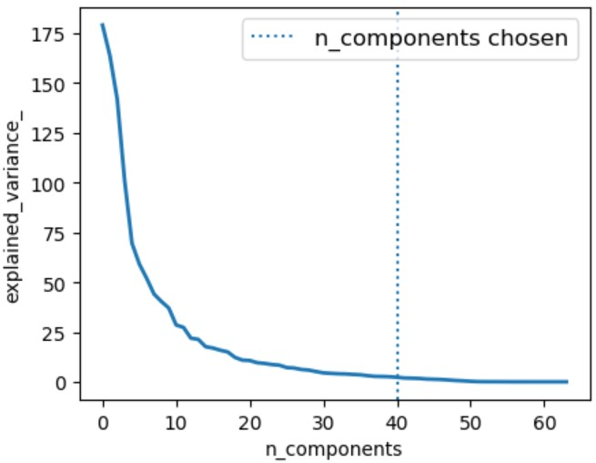

&emsp;&emsp;我们经常需要在训练集和测试集上同时进行训练：<!--more-->

``` python
vect = CountVectorizer()
tfidf = TfidfTransformer()
clf = SGDClassifier()

vX = vect.fit_transform(Xtrain)
tfidfX = tfidf.fit_transform(vX)
predicted = clf.fit_predict(tfidfX)

# Now evaluate all steps on test set
vX = vect.fit_transform(Xtest)
tfidfX = tfidf.fit_transform(vX)
predicted = clf.fit_predict(tfidfX)
```

很容易看出训练测试集重复了代码。而`pipeline`不仅减少了代码量，同时也让机器学习的流程变得更加直观：

``` python
pipeline = Pipeline([
    ('vect', CountVectorizer()),
    ('tfidf', TfidfTransformer()),
    ('clf', SGDClassifier()),
])

predicted = pipeline.fit(Xtrain).predict(Xtrain)
predicted = pipeline.predict(Xtest)  # Now evaluate all steps on test set
```


### 使用pipeline做cross validation

&emsp;&emsp;下面的代码先对手写数字的数据进行`PCA`降维，再通过逻辑回归预测标签。其中我们通过`pipeline`对`PCA`的降维维数`n_components`和逻辑回归的正则项`C`大小做交叉验证，主要步骤有：

1. 依次实例化各成分对象，例如`pca = decomposition.PCA()`。
2. 以`(name, object)`的`tuble`为元素组装`pipeline`，例如`Pipeline(steps=[('pca', pca), ('logistic', logistic)])`。
3. 初始化`CV`参数，例如`n_components = [20, 40, 64]`。
4. 实例化`CV`对象，例如`estimator = GridSearchCV(pipe, dict(pca__n_components=n_components, logistic__C=Cs))`，其中注意参数的传递方式，即`key`为`pipeline`元素名加上函数参数。

``` python
import numpy as np
import matplotlib.pyplot as plt
from sklearn import linear_model, decomposition, datasets
from sklearn.pipeline import Pipeline
from sklearn.model_selection import GridSearchCV

logistic = linear_model.LogisticRegression()
pca = decomposition.PCA()
pipe = Pipeline(steps=[('pca', pca), ('logistic', logistic)])
digits = datasets.load_digits()
X_digits = digits.data
y_digits = digits.target
# Prediction
n_components = [20, 40, 64]
Cs = np.logspace(-4, 4, 3)
pca.fit(X_digits)
estimator = GridSearchCV(pipe, dict(pca__n_components=n_components, logistic__C=Cs))
estimator.fit(X_digits, y_digits)
plt.figure(1, figsize=(4, 3))
plt.clf()
plt.axes([.2, .2, .7, .7])
plt.plot(pca.explained_variance_, linewidth=2)
plt.axis('tight')
plt.xlabel('n_components')
plt.ylabel('explained_variance_')
plt.axvline(estimator.best_estimator_.named_steps['pca'].n_components, linestyle=':', label='n_components chosen')
plt.legend(prop=dict(size=12))
plt.show()
```

