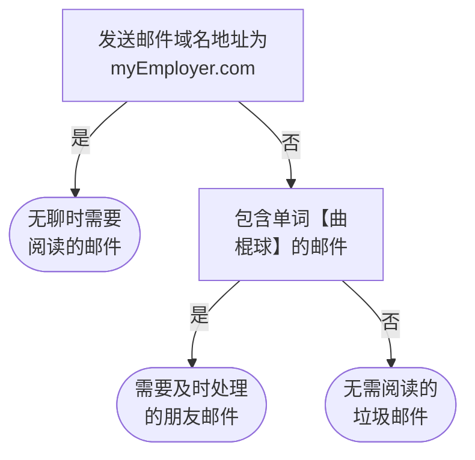
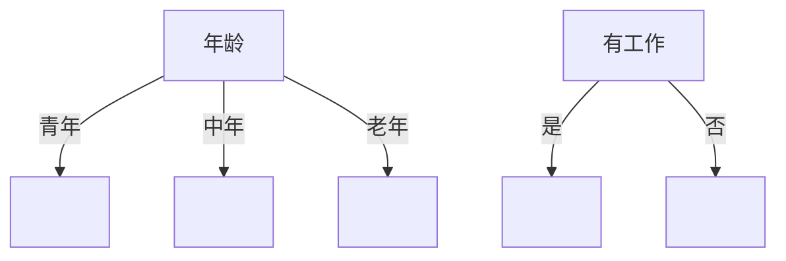
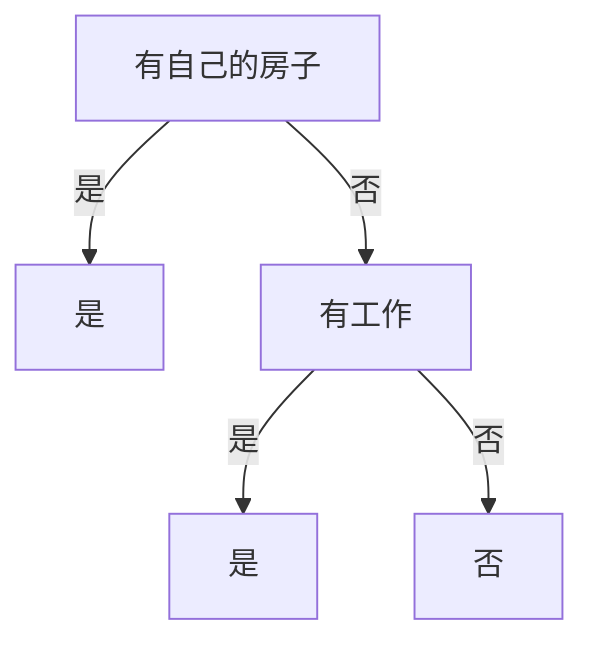
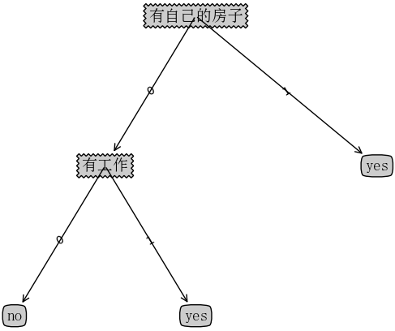
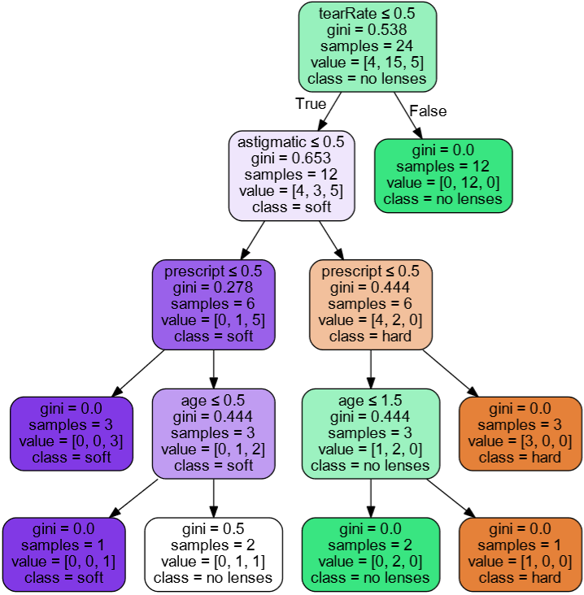

&emsp;&emsp;决策树(`decision tree`)是一种基本的分类与回归方法。下图所示的流程图就是一个决策树，长方形代表判断模块(`decision block`)，椭圆形成代表终止模块(`terminating block`)，表示已经得出结论，可以终止运行。从判断模块引出的左右箭头称作`分支`(`branch`)，它可以达到另一个判断模块或者终止模块。我们还可以这样理解，分类决策树模型是一种描述对实例进行分类的树形结构。决策树由结点(`node`)和有向边(`directed edge`)组成。结点有两种类型：内部结点(`internal node`)和叶结点(`leaf node`)。内部结点表示一个特征或属性，叶结点表示一个类。如下图所示的决策树，长方形和椭圆形都是结点，长方形的结点属于内部结点，椭圆形的结点属于叶结点，从结点引出的左右箭头就是有向边，而最上面的结点就是决策树的根结点(`root node`)。<!--more-->

<div align="center">



</div>

&emsp;&emsp;我们可以把决策树看成一个`if-then`规则的集合，其过程是这样的：由决策树的根结点到叶结点的每一条路径构建一条规则；路径上内部结点的特征对应着规则的条件，而叶结点的类对应着规则的结论。决策树的路径或其对应的`if-then`规则集合具有一个重要的性质：互斥并且完备。这就是说，每一个实例都被一条路径或一条规则所覆盖，而且只被一条路径或一条规则所覆盖。这里所覆盖是指实例的特征与路径上的特征一致或实例满足规则的条件。
&emsp;&emsp;使用决策树做预测需要以下过程：

1. 收集数据：可以使用任何方法。
2. 准备数据：树构造算法只适用于标称型数据，因此数值型数据必须离散化。
3. 分析数据：可以使用任何方法，决策树构造完成之后，我们可以检查决策树图形是否符合预期。
4. 训练算法：这个过程也就是构造决策树，同样也可以说是决策树学习，就是构造一个决策树的数据结构。
5. 测试算法：使用经验树计算错误率。当错误率达到了可接收范围，这个决策树就可以投放使用了。
6. 使用算法：此步骤可以使用适用于任何监督学习算法，而使用决策树可以更好地理解数据的内在含义。

### 决策树构建的准备工作

&emsp;&emsp;使用决策树做预测的每一步骤都很重要，数据收集不到位，将会导致没有足够的特征让我们构建错误率低的决策树。数据特征充足，但是不知道用哪些特征好，将会导致无法构建出分类效果好的决策树模型。从算法方面看，决策树的构建是我们的核心内容。
&emsp;&emsp;决策树要如何构建呢？通常这一过程可以概括为`3`个步骤：

1. 特征选择
2. 决策树的生成
3. 决策树的修剪。

### 特征选择

&emsp;&emsp;特征选择在于选取对训练数据具有分类能力的特征，这样可以提高决策树学习的效率。如果利用一个特征进行分类的结果与随机分类的结果没有很大差别，则称这个特征是没有分类能力的。经验上扔掉这样的特征对决策树学习的精度影响不大。通常特征选择的标准是`信息增益`(`information gain`)或`信息增益比`，为了简单起见，本文章使用信息增益作为选择特征的标准。那么什么是信息增益？在讲解信息增益之前，让我们看一组实例(贷款申请样本数据表)：

ID  | 年龄 | 有工作 | 有自己的房子 | 信贷情况 | 类别(是否给贷款)
----|------|-------|-------------|---------|----------------
1   | 青年 | 否    | 否           | 一般    | 否
2   | 青年 | 否    | 否           | 好      | 否
3   | 青年 | 是    | 否           | 好      | 是
4   | 青年 | 是    | 是           | 一般    | 是
5   | 青年 | 否    | 否           | 一般    | 否
6   | 中年 | 否    | 否           | 一般    | 否
7   | 中年 | 否    | 否           | 好      | 否
8   | 中年 | 是    | 是           | 好      | 是
9   | 中年 | 否    | 是           | 非常好  | 是
10  | 中年 | 否    | 是           | 非常好  | 是
11  | 老年 | 否    | 是           | 非常好  | 是
12  | 老年 | 否    | 是           | 好      | 是
13  | 老年 | 是    | 否           | 好      | 是
14  | 老年 | 是    | 否           | 非常好  | 是
15  | 老年 | 否    | 否           | 一般    | 否

&emsp;&emsp;希望通过所给的训练数据学习一个贷款申请的决策树，用以对未来的贷款申请进行分类，即当新的客户提出贷款申请时，根据申请人的特征利用决策树决定是否批准贷款申请。
&emsp;&emsp;特征选择就是决定用哪个特征来划分特征空间。比如我们通过上述数据表得到两个可能的决策树，分别由两个不同特征的根结点构成：

<div align="center">



</div>

&emsp;&emsp;左图所示的根结点的特征是年龄，有`3`个取值，对应于不同的取值有不同的子结点；右图所示的根节点的特征是工作，有`2`个取值，对应于不同的取值有不同的子结点。两个决策树都可以从此延续下去。问题是究竟选择哪个特征更好些？这就要求确定选择特征的准则。直观上，如果一个特征具有更好的分类能力，或者说按照这一特征将训练数据集分割成子集，使得各个子集在当前条件下有最好的分类，那么就更应该选择这个特征。信息增益就能够很好地表示这一直观的准则。
&emsp;&emsp;什么是信息增益呢？在划分数据集之前之后信息发生的变化成为信息增益，知道如何计算信息增益，我们就可以计算每个特征值划分数据集获得的信息增益，获得信息增益最高的特征就是最好的选择。

### 香农熵

&emsp;&emsp;在评测哪个数据划分方式是最好的数据划分之前，我们必须学习如何计算信息增益。集合信息的度量方式称为`香农熵`或者简称为`熵`(`entropy`)。
&emsp;&emsp;熵定义为信息的期望值。在信息论与概率统计中，熵是表示随机变量不确定性的度量。如果待分类的事务可能划分在多个分类之中，则符号$x_i$的信息定义为：

$$
\begin{align}
l(x_i) = -log_{2}p(x_i) \notag
\end{align}
$$

其中$p(x_i)$是选择该分类的概率。为了计算熵，我们需要计算所有类别所有可能值包含的信息期望值(数学期望)，通过下面的公式得到：

$$
\begin{align}
H = -\sum_{i=1}^{n} p(x_i)log_{2}p(x_i) \notag
\end{align}
$$

其中`n`是分类的数目。熵越大，随机变量的不确定性就越大。
&emsp;&emsp;当熵中的概率由数据估计(特别是最大似然估计)得到时，所对应的熵称为`经验熵`(`empirical entropy`)。什么叫由数据估计？比如有`10`个数据，一共有两个类别，`A`类和`B`类。其中有`7`个数据属于`A`类，则该`A`类的概率即为十分之七；有`3`个数据属于`B`类，则该`B`类的概率即为十分之三。我们定义贷款申请样本数据表中的数据为训练数据集`D`，则训练数据集`D`的经验熵为$H(D)$，$|D|$表示其样本容量(即样本个数)。设有`K`个类$C_k(k = 1, 2, 3, ..., K)$，$|C_k|$为属于类$C_k$的样本个数，这经验熵公式可以写为：

$$
\begin{align}
H(D) = -\sum_{k=1}^K \frac{|C_k|}{|D|}log_2 \frac{|C_k|}{|D|} \notag
\end{align}
$$

根据此公式计算经验熵$H(D)$，分析贷款申请样本数据表中的数据。最终分类结果只有两类，即放贷和不放贷。根据表中的数据统计可知，在`15`个数据中，`9`个数据的结果为放贷，`6`个数据的结果为不放贷。所以数据集`D`的经验熵$H(D)$为：

$$
\begin{align}
H(D) = -\frac{9}{15} log_2 \frac{9}{15} - \frac{6}{15} log_2 \frac{6}{15} = 0.971 \notag
\end{align}
$$

经过计算可知，数据集`D`的经验熵$H(D)$的值为`0.971`。

### 编写代码计算经验熵

&emsp;&emsp;在编写代码之前，我们先对数据集进行属性标注。

- 年龄：`0`代表青年，`1`代表中年，`2`代表老年。
- 有工作：`0`代表否，`1`代表是。
- 有自己的房子：`0`代表否，`1`代表是。
- 信贷情况：`0`代表一般，`1`代表好，`2`代表非常好。
- 类别(是否给贷款)：`no`代表否，`yes`代表是。

``` python
from math import log

def createDataSet():
    dataSet = [  # 数据集
        [0, 0, 0, 0, 'no'],
        [0, 0, 0, 1, 'no'],
        [0, 1, 0, 1, 'yes'],
        [0, 1, 1, 0, 'yes'],
        [0, 0, 0, 0, 'no'],
        [1, 0, 0, 0, 'no'],
        [1, 0, 0, 1, 'no'],
        [1, 1, 1, 1, 'yes'],
        [1, 0, 1, 2, 'yes'],
        [1, 0, 1, 2, 'yes'],
        [2, 0, 1, 2, 'yes'],
        [2, 0, 1, 1, 'yes'],
        [2, 1, 0, 1, 'yes'],
        [2, 1, 0, 2, 'yes'],
        [2, 0, 0, 0, 'no']]

    labels = ['年龄', '有工作', '有自己的房子', '信贷情况']  # 分类属性
    return dataSet, labels  # 返回数据集和分类属性

def calcShannonEnt(dataSet):
    numEntires = len(dataSet)  # 返回数据集的行数
    labelCounts = {}  # 保存每个标签(Label)出现次数的字典

    for featVec in dataSet:  # 对每组特征向量进行统计
        currentLabel = featVec[-1]  # 提取标签(Label)信息

        if currentLabel not in labelCounts.keys():  # 如果标签(Label)没有放入统计次数的字典，添加进去
            labelCounts[currentLabel] = 0

        labelCounts[currentLabel] += 1  # Label计数

    shannonEnt = 0.0  # 经验熵(香农熵)

    for key in labelCounts:  # 计算香农熵
        prob = float(labelCounts[key]) / numEntires  # 选择该标签(Label)的概率
        shannonEnt -= prob * log(prob, 2)  # 利用公式计算

    return shannonEnt  # 返回经验熵(香农熵)

if __name__ == '__main__':
    dataSet, features = createDataSet()
    print(dataSet)
    print(calcShannonEnt(dataSet))
```

### 信息增益

&emsp;&emsp;我们已经说过，如何选择特征，需要看信息增益。也就是说，信息增益是相对于特征而言的，信息增益越大，特征对最终的分类结果影响也就越大，我们就应该选择对最终分类结果影响最大的那个特征作为分类特征。
&emsp;&emsp;在讲解信息增益定义之前，我们还需要了解条件熵。条件熵$H(Y|X)$表示在已知随机变量`X`的条件下随机变量`Y`的不确定性：

$$
\begin{align}
p_i &= P(X = x_i), i = 1, 2, ..., n    \notag \\
H(Y|X) &= \sum_{i=1}^{n}p_i H(Y|X=x_i) \notag
\end{align}
$$

&emsp;&emsp;同理，当条件熵中的概率由数据估计(特别是极大似然估计)得到时，所对应的条件熵成为条件经验熵。
&emsp;&emsp;明确了条件熵和经验条件熵的概念，接下来说说信息增益。前面也提到了，信息增益是相对于特征而言的，所以特征`A`对训练数据集`D`的信息增益$g(D, A)$，定义为集合`D`的经验熵$H(D)$与特征`A`给定条件下`D`的经验条件熵$H(D|A)$之差：

$$
\begin{align}
g(D, A) = H(D) - H(D|A) \notag
\end{align}
$$

一般地，熵$H(D)$与条件熵$H(D|A)$之差成为互信息。决策树学习中的信息增益等价于训练数据集中类与特征的互信息。<br>
&emsp;&emsp;设特征`A`有`n`个不同的取值$\{A_1, A_2, ..., A_n\}$，根据特征`A`的取值将`D`划分为`n`个子集$\{D_1、D_2、...、D_n\}$，$|D_i|$为$D_i$的样本个数。记子集$D_i$中属于$C_k$的样本的集合为$D_{ik}$，即$D_{ik} = D_i \bigcap C_k$，$|D_{ik}|$为$D_{ik}$的样本个数。于是经验条件熵的公式可以是：

$$
\begin{align}
H(D|A) = \sum_{i=1}^{n} \frac{|D_i|}{|D|} H(D_i) = -\sum_{i=1}^{n} \frac{|D_i|}{|D|} \sum_{k=1}^{K} \frac{|D_{ik}|}{|D_i|} log_{2} \frac{|D_{ik}|}{|D_i|} \notag
\end{align}
$$

&emsp;&emsp;以贷款申请样本数据表为例进行说明。看一下年龄这一列的数据，也就是特征`A1`，一共有三个类别，分别是青年、中年和老年。我们只看年龄是青年的数据，年龄是青年的数据一共有`5`个，所以年龄是青年的数据在训练数据集出现的概率是十五分之五，也就是三分之一；同理，年龄是中年和老年的数据在训练数据集出现的概率也都是三分之一。现在我们只看年龄是青年的数据的最终得到贷款的概率为五分之二，因为在五个数据中，只有两个数据显示拿到了最终的贷款；同理，年龄是中年和老年的数据最终得到贷款的概率分别为五分之三、五分之四。所以计算年龄的信息增益，过程如下：

$$
\begin{align}
g(D, A_1) &= H(D) - [\frac{5}{15}H(D_1) + \frac{5}{15}H(D_2) + \frac{5}{15}H(D_3)]                \notag \\
          &= 0.971 - [\frac{5}{15}(-\frac{2}{5}log_2\frac{2}{5} - \frac{3}{5}log_2\frac{3}{5}) +  \notag
                      \frac{5}{15}(-\frac{3}{5}log_2\frac{3}{5} - \frac{2}{5}log_2\frac{2}{5}) +  \notag
                      \frac{5}{15}(-\frac{4}{5}log_2\frac{4}{5} - \frac{1}{5}log_2\frac{1}{5})]   \notag \\
          &= 0.971 - 0.888 = 0.083                                                                \notag
\end{align}
$$

同理，计算其余特征的信息增益$g(D, A_2)$、$g(D, A_3)$和$g(D, A_4)$分别为：

$$
\begin{align}
g(D, A_2) &= H(D) - [\frac{5}{15}H(D_1) + \frac{10}{15}H(D_2)] \notag \\
          &= 0.971 - [\frac{5}{15} * 0 + \frac{10}{15}(-\frac{4}{10}log_2\frac{4}{10} - \frac{6}{10}log_2\frac{6}{10})] \notag \\
          &= 0.971 - 0.647 = 0.324 \notag \\
\notag \\
g(D, A_3) &= H(D) - [\frac{6}{15}H(D_1) + \frac{9}{15}H(D_2)] \notag \\
          &= 0.971 - [\frac{6}{15} * 0 + \frac{9}{15}(-\frac{3}{9}log_2\frac{3}{9} - \frac{6}{9}log_2\frac{6}{9})] \notag \\
          &= 0.971 - 0.551 = 0.420 \notag \\
\notag \\
g(D, A_4) &= 0.971 - 0.608 = 0.363 \notag
\end{align}
$$

最后比较特征的信息增益，由于特征$A_3$(有自己的房子)的信息增益值最大，所以选择$A_3$作为最优特征。

### 编写代码计算信息增益

&emsp;&emsp;接下来编写代码，计算信息增益，选择最优特征：

``` python
from math import log

def calcShannonEnt(dataSet):
    numEntires = len(dataSet)  # 返回数据集的行数
    labelCounts = {}  # 保存每个标签(Label)出现次数的字典

    for featVec in dataSet:  # 对每组特征向量进行统计
        currentLabel = featVec[-1]  # 提取标签(Label)信息

        if currentLabel not in labelCounts.keys():  # 如果标签(Label)没有放入统计次数的字典，添加进去
            labelCounts[currentLabel] = 0

        labelCounts[currentLabel] += 1  # Label计数

    shannonEnt = 0.0  # 经验熵(香农熵)

    for key in labelCounts:  # 计算香农熵
        prob = float(labelCounts[key]) / numEntires  # 选择该标签(Label)的概率
        shannonEnt -= prob * log(prob, 2)  # 利用公式计算

    return shannonEnt  # 返回经验熵(香农熵)

def createDataSet():
    dataSet = [  # 数据集
        [0, 0, 0, 0, 'no'],
        [0, 0, 0, 1, 'no'],
        [0, 1, 0, 1, 'yes'],
        [0, 1, 1, 0, 'yes'],
        [0, 0, 0, 0, 'no'],
        [1, 0, 0, 0, 'no'],
        [1, 0, 0, 1, 'no'],
        [1, 1, 1, 1, 'yes'],
        [1, 0, 1, 2, 'yes'],
        [1, 0, 1, 2, 'yes'],
        [2, 0, 1, 2, 'yes'],
        [2, 0, 1, 1, 'yes'],
        [2, 1, 0, 1, 'yes'],
        [2, 1, 0, 2, 'yes'],
        [2, 0, 0, 0, 'no']]

    labels = ['年龄', '有工作', '有自己的房子', '信贷情况']  # 分类属性
    return dataSet, labels  # 返回数据集和分类属性

def splitDataSet(dataSet, axis, value):
    retDataSet = []  # 创建返回的数据集列表

    for featVec in dataSet:  # 遍历数据集
        if featVec[axis] == value:
            reducedFeatVec = featVec[:axis]  # 去掉axis特征
            reducedFeatVec.extend(featVec[axis + 1:])  # 将符合条件的添加到返回的数据集
            retDataSet.append(reducedFeatVec)

    return retDataSet  # 返回划分后的数据集

def chooseBestFeatureToSplit(dataSet):
    numFeatures = len(dataSet[0]) - 1  # 特征数量
    baseEntropy = calcShannonEnt(dataSet)  # 计算数据集的香农熵
    bestInfoGain = 0.0  # 信息增益
    bestFeature = -1  # 最优特征的索引值

    for i in range(numFeatures):  # 遍历所有特征
        featList = [example[i] for example in dataSet]  # 获取dataSet的第i个所有特征
        uniqueVals = set(featList)  # 创建set集合{}，元素不可重复
        newEntropy = 0.0  # 经验条件熵

        for value in uniqueVals:  # 计算信息增益
            subDataSet = splitDataSet(dataSet, i, value)  # subDataSet划分后的子集
            prob = len(subDataSet) / float(len(dataSet))  # 计算子集的概率
            newEntropy += prob * calcShannonEnt(subDataSet)  # 根据公式计算经验条件熵

        infoGain = baseEntropy - newEntropy  # 信息增益
        print("第%d个特征的增益为%.3f" % (i, infoGain))  # 打印每个特征的信息增益

        if (infoGain > bestInfoGain):  # 计算信息增益
            bestInfoGain = infoGain  # 更新信息增益，找到最大的信息增益
            bestFeature = i  # 记录信息增益最大的特征的索引值

    return bestFeature  # 返回信息增益最大的特征的索引值

if __name__ == '__main__':
    dataSet, features = createDataSet()
    print("最优特征索引值：" + str(chooseBestFeatureToSplit(dataSet)))
```

执行结果：

``` python
第0个特征的增益为0.083
第1个特征的增益为0.324
第2个特征的增益为0.420
第3个特征的增益为0.363
最优特征索引值：2
```

&emsp;&emsp;`splitDataSet`函数是用来选择各个特征的子集的，比如选择年龄(第`0`个特征)的青年(用`0`代表)的子集，我们可以调用`splitDataSet(dataSet, 0, 0)`这样返回的子集就是年龄为青年的`5`个数据集。`chooseBestFeatureToSplit`是选择选择最优特征的函数。

### 决策树生成和修剪

&emsp;&emsp;我们已经学习了从数据集构造决策树算法所需要的子功能模块，包括经验熵的计算和最优特征的选择，其工作原理如下：得到原始数据集，然后基于最好的属性值划分数据集，由于特征值可能多于两个，因此可能存在大于两个分支的数据集划分。第一次划分之后，数据集被向下传递到树的分支的下一个结点。在这个结点上，我们可以再次划分数据，因此可以采用递归的原则处理数据集。
&emsp;&emsp;构建决策树的算法有很多，比如`C4.5`、`ID3`和`CART`，这些算法在运行时并不总是在每次划分数据分组时都会消耗特征。由于特征数目并不是每次划分数据分组时都减少，因此这些算法在实际使用时可能引起一定的问题。目前我们并不需要考虑这个问题，只需要在算法开始运行前计算列的数目，查看算法是否使用了所有属性即可。
&emsp;&emsp;决策树生成算法递归地产生决策树，直到不能继续下去未为止。这样产生的树往往对训练数据的分类很准确，但对未知的测试数据的分类却没有那么准确，即出现过拟合现象。过拟合的原因在于学习时过多地考虑如何提高对训练数据的正确分类，从而构建出过于复杂的决策树。解决这个问题的办法是考虑决策树的复杂度，对已生成的决策树进行简化。

### ID3算法

&emsp;&emsp;`ID3`算法的核心是在决策树各个结点上对应信息增益准则选择特征，递归地构建决策树。具体方法是：从根结点开始，对结点计算所有可能的特征的信息增益，选择信息增益最大的特征作为结点的特征，由该特征的不同取值建立子节点；再对子结点递归地调用以上方法，构建决策树；直到所有特征的信息增益均很小或没有特征可以选择为止，最后得到一个决策树。`ID3`相当于用极大似然法进行概率模型的选择。
&emsp;&emsp;由于特征$A_3$(有自己的房子)的信息增益值最大，所以选择特征$A_3$作为根结点的特征。它将训练集`D`划分为两个子集$D_1$($A_3$取值为`是`)和$D_2$($A_3$取值为`否`)。由于$D_1$只有同一类的样本点，所以它成为一个叶结点，结点的类标记为`是`。
&emsp;&emsp;对$D_2$则需要从特征$A_1$(年龄)、$A_2$(有工作)和$A_4$(信贷情况)中选择新的特征，计算各个特征的信息增益：

$$
\begin{align}
g(D_2, A_1) &= H(D_2) - H(D_2 | A_1) = 0.251 \notag \\
g(D_2, A_2) &= H(D_2) - H(D_2 | A_2) = 0.918 \notag \\
g(D_2, A_3) &= H(D_2) - H(D_2 | A_3) = 0.474 \notag \\
\end{align}
$$

&emsp;&emsp;根据计算，选择信息增益最大的特征$A_2$(有工作)作为结点的特征。由于$A_2$有两个可能取值，从这一结点引出两个子结点：一个对应`是`(有工作)的子结点，包含`3`个样本，它们属于同一类，所以这是一个叶结点，类标记为`是`；另一个是对应`否`(无工作)的子结点，包含`6`个样本，它们也属于同一类，所以这也是一个叶结点，类标记为`否`。这样就生成了一个决策树，该决策树只用了两个特征(有两个内部结点)，生成的决策树如下图：

<div align="center">



</div>

### 编写代码构建决策树

&emsp;&emsp;我们使用字典存储决策树的结构，比如上小节我们分析出来的决策树，用字典可以表示为：

``` json
{'有自己的房子': {0: {'有工作': {0: 'no', 1: 'yes'}}, 1: 'yes'}}
```

创建函数`majorityCnt`统计`classList`中出现此处最多的元素(类标签)，创建函数`createTree`用来递归构建决策树：

``` python
from math import log
import operator

def calcShannonEnt(dataSet):
    numEntires = len(dataSet)  # 返回数据集的行数
    labelCounts = {}  # 保存每个标签(Label)出现次数的字典

    for featVec in dataSet:  # 对每组特征向量进行统计
        currentLabel = featVec[-1]  # 提取标签(Label)信息

        if currentLabel not in labelCounts.keys():  # 如果标签(Label)没有放入统计次数的字典，添加进去
            labelCounts[currentLabel] = 0

        labelCounts[currentLabel] += 1  # Label计数

    shannonEnt = 0.0  # 经验熵(香农熵)

    for key in labelCounts:  # 计算香农熵
        prob = float(labelCounts[key]) / numEntires  # 选择该标签(Label)的概率
        shannonEnt -= prob * log(prob, 2)  # 利用公式计算

    return shannonEnt  # 返回经验熵(香农熵)

def createDataSet():
    dataSet = [  # 数据集
        [0, 0, 0, 0, 'no'],
        [0, 0, 0, 1, 'no'],
        [0, 1, 0, 1, 'yes'],
        [0, 1, 1, 0, 'yes'],
        [0, 0, 0, 0, 'no'],
        [1, 0, 0, 0, 'no'],
        [1, 0, 0, 1, 'no'],
        [1, 1, 1, 1, 'yes'],
        [1, 0, 1, 2, 'yes'],
        [1, 0, 1, 2, 'yes'],
        [2, 0, 1, 2, 'yes'],
        [2, 0, 1, 1, 'yes'],
        [2, 1, 0, 1, 'yes'],
        [2, 1, 0, 2, 'yes'],
        [2, 0, 0, 0, 'no']]

    labels = ['年龄', '有工作', '有自己的房子', '信贷情况']  # 特征标签
    return dataSet, labels  # 返回数据集和分类属性

def splitDataSet(dataSet, axis, value):
    retDataSet = []  # 创建返回的数据集列表

    for featVec in dataSet:  # 遍历数据集
        if featVec[axis] == value:
            reducedFeatVec = featVec[:axis]  # 去掉axis特征
            reducedFeatVec.extend(featVec[axis + 1:])  # 将符合条件的添加到返回的数据集
            retDataSet.append(reducedFeatVec)

    return retDataSet  # 返回划分后的数据集

def chooseBestFeatureToSplit(dataSet):
    numFeatures = len(dataSet[0]) - 1  # 特征数量
    baseEntropy = calcShannonEnt(dataSet)  # 计算数据集的香农熵
    bestInfoGain = 0.0  # 信息增益
    bestFeature = -1  # 最优特征的索引值

    for i in range(numFeatures):  # 遍历所有特征
        # 获取dataSet的第i个所有特征
        featList = [example[i] for example in dataSet]
        uniqueVals = set(featList)  # 创建set集合，元素不可重复
        newEntropy = 0.0  # 经验条件熵

        for value in uniqueVals:  # 计算信息增益
            subDataSet = splitDataSet(dataSet, i, value)  # subDataSet划分后的子集
            prob = len(subDataSet) / float(len(dataSet))  # 计算子集的概率
            newEntropy += prob * calcShannonEnt(subDataSet)  # 根据公式计算经验条件熵

        infoGain = baseEntropy - newEntropy  # 信息增益

        if (infoGain > bestInfoGain):  # 计算信息增益
            bestInfoGain = infoGain  # 更新信息增益，找到最大的信息增益
            bestFeature = i  # 记录信息增益最大的特征的索引值

    return bestFeature  # 返回信息增益最大的特征的索引值

"""
统计classList中出现此处最多的元素(类标签)。参数classList是类
标签列表，返回值sortedClassCount[0][0]是出现此处最多的元素(类标签)
"""
def majorityCnt(classList):
    classCount = {}

    for vote in classList:  # 统计classList中每个元素出现的次数
        if vote not in classCount.keys():
            classCount[vote] = 0

        classCount[vote] += 1

    # 根据字典的值降序排序
    sortedClassCount = sorted(classCount.items(), key=operator.itemgetter(1), reverse=True)
    return sortedClassCount[0][0]  # 返回classList中出现次数最多的元素

"""
创建决策树。参数dataSet是训练数据集，labels是分类属性标签，
featLabels是存储选择的最优特征标签。返回值myTree是决策树
"""
def createTree(dataSet, labels, featLabels):
    classList = [example[-1] for example in dataSet]  # 取分类标签(是否放贷：yes or no)

    if classList.count(classList[0]) == len(classList):  # 如果类别完全相同，则停止继续划分
        return classList[0]

    if len(dataSet[0]) == 1:  # 遍历完所有特征时，返回出现次数最多的类标签
        return majorityCnt(classList)

    bestFeat = chooseBestFeatureToSplit(dataSet)  # 选择最优特征
    bestFeatLabel = labels[bestFeat]  # 最优特征的标签
    featLabels.append(bestFeatLabel)
    myTree = {bestFeatLabel: {}}  # 根据最优特征的标签生成树
    del (labels[bestFeat])  # 删除已经使用特征标签
    featValues = [example[bestFeat] for example in dataSet]  # 得到训练集中所有最优特征的属性值
    uniqueVals = set(featValues)  # 去掉重复的属性值

    for value in uniqueVals:  # 遍历特征，创建决策树
        myTree[bestFeatLabel][value] = createTree(splitDataSet(dataSet, bestFeat, value), labels, featLabels)

    return myTree

if __name__ == '__main__':
    dataSet, labels = createDataSet()
    featLabels = []
    myTree = createTree(dataSet, labels, featLabels)
    print(myTree)
```

执行结果：

``` python
{'有自己的房子': {0: {'有工作': {0: 'no', 1: 'yes'}}, 1: 'yes'}}
```

&emsp;&emsp;递归创建决策树时，递归有两个终止条件：第一个停止条件是所有的类标签完全相同，则直接返回该类标签；第二个停止条件是使用完了所有特征，仍然不能将数据划分仅包含唯一类别的分组，即决策树构建失败，特征不够用。此时说明数据纬度不够，由于第二个停止条件无法简单地返回唯一的类标签，这里挑选出现数量最多的类别作为返回值。

### 决策树可视化

&emsp;&emsp;可视化需要用到的函数：

- `getNumLeafs`：获取决策树叶子结点的数目。
- `getTreeDepth`：获取决策树的层数。
- `plotNode`：绘制结点。
- `plotMidText`：标注有向边属性值。
- `plotTree`：绘制决策树。
- `createPlot`：创建绘制面板。

``` python
from matplotlib.font_manager import FontProperties
import matplotlib.pyplot as plt
from math import log
import operator

def calcShannonEnt(dataSet):
    numEntires = len(dataSet)  # 返回数据集的行数
    labelCounts = {}  # 保存每个标签(Label)出现次数的字典

    for featVec in dataSet:  # 对每组特征向量进行统计
        currentLabel = featVec[-1]  # 提取标签(Label)信息

        if currentLabel not in labelCounts.keys():  # 如果标签(Label)没有放入统计次数的字典，添加进去
            labelCounts[currentLabel] = 0

        labelCounts[currentLabel] += 1  # Label计数

    shannonEnt = 0.0  # 经验熵(香农熵)

    for key in labelCounts:  # 计算香农熵
        prob = float(labelCounts[key]) / numEntires  # 选择该标签(Label)的概率
        shannonEnt -= prob * log(prob, 2)  # 利用公式计算

    return shannonEnt  # 返回经验熵(香农熵)

def createDataSet():
    dataSet = [[0, 0, 0, 0, 'no'],  # 数据集
               [0, 0, 0, 1, 'no'],
               [0, 1, 0, 1, 'yes'],
               [0, 1, 1, 0, 'yes'],
               [0, 0, 0, 0, 'no'],
               [1, 0, 0, 0, 'no'],
               [1, 0, 0, 1, 'no'],
               [1, 1, 1, 1, 'yes'],
               [1, 0, 1, 2, 'yes'],
               [1, 0, 1, 2, 'yes'],
               [2, 0, 1, 2, 'yes'],
               [2, 0, 1, 1, 'yes'],
               [2, 1, 0, 1, 'yes'],
               [2, 1, 0, 2, 'yes'],
               [2, 0, 0, 0, 'no']]

    labels = ['年龄', '有工作', '有自己的房子', '信贷情况']  # 特征标签
    return dataSet, labels  # 返回数据集和分类属性

def splitDataSet(dataSet, axis, value):
    retDataSet = []  # 创建返回的数据集列表

    for featVec in dataSet:  # 遍历数据集
        if featVec[axis] == value:
            reducedFeatVec = featVec[:axis]  # 去掉axis特征
            reducedFeatVec.extend(featVec[axis + 1:])  # 将符合条件的添加到返回的数据集
            retDataSet.append(reducedFeatVec)

    return retDataSet  # 返回划分后的数据集

def chooseBestFeatureToSplit(dataSet):
    numFeatures = len(dataSet[0]) - 1  # 特征数量
    baseEntropy = calcShannonEnt(dataSet)  # 计算数据集的香农熵
    bestInfoGain = 0.0  # 信息增益
    bestFeature = -1  # 最优特征的索引值

    for i in range(numFeatures):  # 遍历所有特征
        featList = [example[i] for example in dataSet]  # 获取dataSet的第i个所有特征
        uniqueVals = set(featList)  # 创建set集合，元素不可重复
        newEntropy = 0.0  # 经验条件熵

        for value in uniqueVals:  # 计算信息增益
            subDataSet = splitDataSet(dataSet, i, value)  # subDataSet划分后的子集
            prob = len(subDataSet) / float(len(dataSet))  # 计算子集的概率
            newEntropy += prob * calcShannonEnt(subDataSet)  # 根据公式计算经验条件熵

        infoGain = baseEntropy - newEntropy  # 信息增益

        if (infoGain > bestInfoGain):  # 计算信息增益
            bestInfoGain = infoGain  # 更新信息增益，找到最大的信息增益
            bestFeature = i  # 记录信息增益最大的特征的索引值

    return bestFeature  # 返回信息增益最大的特征的索引值

def majorityCnt(classList):
    classCount = {}

    for vote in classList:  # 统计classList中每个元素出现的次数
        if vote not in classCount.keys():
            classCount[vote] = 0

        classCount[vote] += 1

    # 根据字典的值降序排序
    sortedClassCount = sorted(classCount.items(), key=operator.itemgetter(1), reverse=True)
    return sortedClassCount[0][0]  # 返回classList中出现次数最多的元素

def createTree(dataSet, labels, featLabels):
    classList = [example[-1] for example in dataSet]  # 取分类标签(是否放贷：yes or no)

    if classList.count(classList[0]) == len(classList):  # 如果类别完全相同则停止继续划分
        return classList[0]

    if len(dataSet[0]) == 1:  # 遍历完所有特征时返回出现次数最多的类标签
        return majorityCnt(classList)

    bestFeat = chooseBestFeatureToSplit(dataSet)  # 选择最优特征
    bestFeatLabel = labels[bestFeat]  # 最优特征的标签
    featLabels.append(bestFeatLabel)
    myTree = {bestFeatLabel: {}}  # 根据最优特征的标签生成树
    del (labels[bestFeat])  # 删除已经使用特征标签
    featValues = [example[bestFeat] for example in dataSet]  # 得到训练集中所有最优特征的属性值
    uniqueVals = set(featValues)  # 去掉重复的属性值

    for value in uniqueVals:  # 遍历特征，创建决策树
        myTree[bestFeatLabel][value] = createTree(splitDataSet(dataSet, bestFeat, value), labels, featLabels)

    return myTree

"""
获取决策树叶子结点的数目。参数myTree是决策树，返回值numLeafs是决策树的叶子结点的数目
"""
def getNumLeafs(myTree):
    numLeafs = 0  # 初始化叶子
    # python3中myTree.keys返回的是dict_keys，不再是list，所以不能使用
    # “myTree.keys()[0]”的方法获取结点属性，可以使用list(myTree.keys())[0]
    firstStr = next(iter(myTree))
    secondDict = myTree[firstStr]  # 获取下一组字典

    for key in secondDict.keys():
        # 测试该结点是否为字典，如果不是字典，代表此结点为叶子结点
        if type(secondDict[key]).__name__ == 'dict':
            numLeafs += getNumLeafs(secondDict[key])
        else:
            numLeafs += 1

    return numLeafs

""" 获取决策树的层数。参数myTree是决策树，返回值maxDepth是决策树的层数 """
def getTreeDepth(myTree):
    maxDepth = 0  # 初始化决策树深度
    # python3中myTree.keys返回的是dict_keys，不再是list，所以不能使用
    # “myTree.keys()[0]”的方法获取结点属性，可以使用list(myTree.keys())[0]
    firstStr = next(iter(myTree))
    secondDict = myTree[firstStr]  # 获取下一个字典

    for key in secondDict.keys():
        # 测试该结点是否为字典，如果不是字典，代表此结点为叶子结点
        if type(secondDict[key]).__name__ == 'dict':
            thisDepth = 1 + getTreeDepth(secondDict[key])
        else:
            thisDepth = 1

        if thisDepth > maxDepth: maxDepth = thisDepth  # 更新层数

    return maxDepth

"""
绘制结点。参数nodeTxt是结点名，centerPt是文本位置，parentPt是标注的箭头位置，nodeType是结点格式
"""
def plotNode(nodeTxt, centerPt, parentPt, nodeType):
    arrow_args = dict(arrowstyle="<-")  # 定义箭头格式
    font = FontProperties(fname=r"c:\windows\fonts\simsun.ttc", size=14)  # 设置中文字体
    createPlot.ax1.annotate(
        nodeTxt, xy=parentPt, xycoords='axes fraction', xytext=centerPt,
        textcoords='axes fraction', va="center", ha="center",
        bbox=nodeType, arrowprops=arrow_args, FontProperties=font)

""" 标注有向边属性值。参数cntrPt、parentPt用于计算标注位置，txtString是标注的内容 """
def plotMidText(cntrPt, parentPt, txtString):
    xMid = (parentPt[0] - cntrPt[0]) / 2.0 + cntrPt[0]  # 计算标注位置
    yMid = (parentPt[1] - cntrPt[1]) / 2.0 + cntrPt[1]
    createPlot.ax1.text(xMid, yMid, txtString, va="center", ha="center", rotation=30)

""" 绘制决策树。参数myTree是决策树(字典)，parentPt是标注的内容，nodeTxt是结点名 """
def plotTree(myTree, parentPt, nodeTxt):
    decisionNode = dict(boxstyle="sawtooth", fc="0.8")  # 设置结点格式
    leafNode = dict(boxstyle="round4", fc="0.8")  # 设置叶结点格式
    numLeafs = getNumLeafs(myTree)  # 获取决策树叶结点数目，决定了树的宽度
    depth = getTreeDepth(myTree)  # 获取决策树层数
    firstStr = next(iter(myTree))  # 下个字典
    cntrPt = (plotTree.xOff + (1.0 + float(numLeafs)) / 2.0 / plotTree.totalW, plotTree.yOff)  # 中心位置
    plotMidText(cntrPt, parentPt, nodeTxt)  # 标注有向边属性值
    plotNode(firstStr, cntrPt, parentPt, decisionNode)  # 绘制结点
    secondDict = myTree[firstStr]  # 下一个字典，也就是继续绘制子结点
    plotTree.yOff = plotTree.yOff - 1.0 / plotTree.totalD  # y偏移

    for key in secondDict.keys():
        if type(secondDict[key]).__name__ == 'dict':  # 测试该结点是否为字典，如果不是字典，代表此结点为叶子结点
            plotTree(secondDict[key], cntrPt, str(key))  # 不是叶结点，递归调用继续绘制
        else:  # 如果是叶结点，绘制叶结点，并标注有向边属性值
            plotTree.xOff = plotTree.xOff + 1.0 / plotTree.totalW
            plotNode(secondDict[key], (plotTree.xOff, plotTree.yOff), cntrPt, leafNode)
            plotMidText((plotTree.xOff, plotTree.yOff), cntrPt, str(key))

    plotTree.yOff = plotTree.yOff + 1.0 / plotTree.totalD

""" 创建绘制面板。参数inTree是决策树(字典) """
def createPlot(inTree):
    fig = plt.figure(1, facecolor='white')  # 创建fig
    fig.clf()  # 清空fig
    axprops = dict(xticks=[], yticks=[])
    createPlot.ax1 = plt.subplot(111, frameon=False, **axprops)  # 去掉x、y轴
    plotTree.totalW = float(getNumLeafs(inTree))  # 获取决策树叶结点数目
    plotTree.totalD = float(getTreeDepth(inTree))  # 获取决策树层数
    plotTree.xOff = -0.5 / plotTree.totalW
    plotTree.yOff = 1.0  # x偏移
    plotTree(inTree, (0.5, 1.0), '')  # 绘制决策树
    plt.show()  # 显示绘制结果

if __name__ == '__main__':
    dataSet, labels = createDataSet()
    featLabels = []
    myTree = createTree(dataSet, labels, featLabels)
    print(myTree)
    createPlot(myTree)
```



&emsp;&emsp;`plotNode`函数的工作就是绘制各个结点，比如`有自己的房子`、`有工作`、`yes`、`no`，包括内结点和叶子结点。`plotMidText`函数的工作就是绘制各个有向边的属性，例如各个有向边的`0`和`1`。

### 使用决策树执行分类

&emsp;&emsp;依靠训练数据构造了决策树之后，我们可以将它用于实际数据的分类。在执行数据分类时，需要决策树以及用于构造树的标签向量；然后程序比较测试数据与决策树上的数值，递归执行该过程直到进入叶子结点；最后将测试数据定义为叶子结点所属的类型。在构建决策树的代码，可以看到有个`featLabels`参数，它是用来记录各个分类结点的，在用决策树做预测的时候，我们按顺序输入需要的分类结点的属性值即可。举个例子，比如我用上述已经训练好的决策树做分类，那么我只需要提供这个人是否有房子，是否有工作这两个信息即可，无需提供冗余的信息。
&emsp;&emsp;使用决策树做分类的代码如下：

``` python
from math import log
import operator

def calcShannonEnt(dataSet):
    numEntires = len(dataSet)  # 返回数据集的行数
    labelCounts = {}  # 保存每个标签(Label)出现次数的字典

    for featVec in dataSet:  # 对每组特征向量进行统计
        currentLabel = featVec[-1]  # 提取标签(Label)信息

        if currentLabel not in labelCounts.keys():  # 如果标签(Label)没有放入统计次数的字典，添加进去
            labelCounts[currentLabel] = 0

        labelCounts[currentLabel] += 1  # Label计数

    shannonEnt = 0.0  # 经验熵(香农熵)

    for key in labelCounts:  # 计算香农熵
        prob = float(labelCounts[key]) / numEntires  # 选择该标签(Label)的概率
        shannonEnt -= prob * log(prob, 2)  # 利用公式计算

    return shannonEnt  # 返回经验熵(香农熵)

def createDataSet():
    dataSet = [[0, 0, 0, 0, 'no'],  # 数据集
               [0, 0, 0, 1, 'no'],
               [0, 1, 0, 1, 'yes'],
               [0, 1, 1, 0, 'yes'],
               [0, 0, 0, 0, 'no'],
               [1, 0, 0, 0, 'no'],
               [1, 0, 0, 1, 'no'],
               [1, 1, 1, 1, 'yes'],
               [1, 0, 1, 2, 'yes'],
               [1, 0, 1, 2, 'yes'],
               [2, 0, 1, 2, 'yes'],
               [2, 0, 1, 1, 'yes'],
               [2, 1, 0, 1, 'yes'],
               [2, 1, 0, 2, 'yes'],
               [2, 0, 0, 0, 'no']]

    labels = ['年龄', '有工作', '有自己的房子', '信贷情况']  # 特征标签
    return dataSet, labels  # 返回数据集和分类属性

def splitDataSet(dataSet, axis, value):
    retDataSet = []  # 创建返回的数据集列表

    for featVec in dataSet:  # 遍历数据集
        if featVec[axis] == value:
            reducedFeatVec = featVec[:axis]  # 去掉axis特征
            reducedFeatVec.extend(featVec[axis + 1:])  # 将符合条件的添加到返回的数据集
            retDataSet.append(reducedFeatVec)

    return retDataSet  # 返回划分后的数据集

def chooseBestFeatureToSplit(dataSet):
    numFeatures = len(dataSet[0]) - 1  # 特征数量
    baseEntropy = calcShannonEnt(dataSet)  # 计算数据集的香农熵
    bestInfoGain = 0.0  # 信息增益
    bestFeature = -1  # 最优特征的索引值

    for i in range(numFeatures):  # 遍历所有特征
        featList = [example[i] for example in dataSet]  # 获取dataSet的第i个所有特征
        uniqueVals = set(featList)  # 创建set集合，元素不可重复
        newEntropy = 0.0  # 经验条件熵

        for value in uniqueVals:  # 计算信息增益
            subDataSet = splitDataSet(dataSet, i, value)  # subDataSet划分后的子集
            prob = len(subDataSet) / float(len(dataSet))  # 计算子集的概率
            newEntropy += prob * calcShannonEnt(subDataSet)  # 根据公式计算经验条件熵

        infoGain = baseEntropy - newEntropy  # 信息增益

        if (infoGain > bestInfoGain):  # 计算信息增益
            bestInfoGain = infoGain  # 更新信息增益，找到最大的信息增益
            bestFeature = i  # 记录信息增益最大的特征的索引值

    return bestFeature  # 返回信息增益最大的特征的索引值

def majorityCnt(classList):
    classCount = {}

    for vote in classList:  # 统计classList中每个元素出现的次数
        if vote not in classCount.keys(): classCount[vote] = 0
        classCount[vote] += 1

    # 根据字典的值降序排序
    sortedClassCount = sorted(classCount.items(), key=operator.itemgetter(1), reverse=True)
    return sortedClassCount[0][0]  # 返回classList中出现次数最多的元素

def createTree(dataSet, labels, featLabels):
    classList = [example[-1] for example in dataSet]  # 取分类标签(是否放贷:yes or no)

    if classList.count(classList[0]) == len(classList):  # 如果类别完全相同则停止继续划分
        return classList[0]

    if len(dataSet[0]) == 1:  # 遍历完所有特征时返回出现次数最多的类标签
        return majorityCnt(classList)

    bestFeat = chooseBestFeatureToSplit(dataSet)  # 选择最优特征
    bestFeatLabel = labels[bestFeat]  # 最优特征的标签
    featLabels.append(bestFeatLabel)
    myTree = {bestFeatLabel: {}}  # 根据最优特征的标签生成树
    del (labels[bestFeat])  # 删除已经使用特征标签
    featValues = [example[bestFeat] for example in dataSet]  # 得到训练集中所有最优特征的属性值
    uniqueVals = set(featValues)  # 去掉重复的属性值

    for value in uniqueVals:  # 遍历特征，创建决策树。
        myTree[bestFeatLabel][value] = createTree(splitDataSet(dataSet, bestFeat, value), labels, featLabels)

    return myTree

"""
使用决策树分类。参数inputTree是已经生成的决策树，featLabels是存储选择的最优特征标签，
testVec是测试数据列表，顺序对应最优特征标。返回值classLabel是分类结果
"""
def classify(inputTree, featLabels, testVec):
    firstStr = next(iter(inputTree))  # 获取决策树结点
    secondDict = inputTree[firstStr]  # 下一个字典
    featIndex = featLabels.index(firstStr)

    for key in secondDict.keys():
        if testVec[featIndex] == key:
            if type(secondDict[key]).__name__ == 'dict':
                classLabel = classify(secondDict[key], featLabels, testVec)
            else:
                classLabel = secondDict[key]

    return classLabel

if __name__ == '__main__':
    dataSet, labels = createDataSet()
    featLabels = []
    myTree = createTree(dataSet, labels, featLabels)
    testVec = [0, 1]  # 测试数据
    result = classify(myTree, featLabels, testVec)

    if result == 'yes':
        print('放贷')

    if result == 'no':
        print('不放贷')
```

这里只增加了`classify`函数，用于决策树分类。输入测试数据`[0, 1]`，它代表没有房子，但是有工作，分类结果为`放贷`。

### 决策树的存储

&emsp;&emsp;构造决策树是很耗时的任务，即使处理很小的数据集(例如前面的样本数据)，也要花费几秒的时间。如果数据集很大，将会耗费很多计算时间。然而用创建好的决策树解决分类问题，则可以很快完成。因此为了节省计算时间，最好能够在每次执行分类时调用已经构造好的决策树。为了解决这个问题，需要使用`Python`模块`pickle`序列化对象。序列化对象可以在磁盘上保存对象，并在需要的时候读取出来。
&emsp;&emsp;假设我们已经得到决策树`{'有自己的房子': {0: {'有工作': {0: 'no', 1: 'yes'}}, 1: 'yes'}}`，使用`pickle.dump`存储决策树：

``` python
import pickle

""" 存储决策树。参数inputTree是已经生成的决策树，filename是决策树的存储文件名 """
def storeTree(inputTree, filename):
    with open(filename, 'wb') as fw:
        pickle.dump(inputTree, fw)

if __name__ == '__main__':
    myTree = {'有自己的房子': {0: {'有工作': {0: 'no', 1: 'yes'}}, 1: 'yes'}}
    storeTree(myTree, 'classifierStorage.txt')
```

运行该代码，在该`Python`文件的相同目录下，会生成一个名为`classifierStorage.txt`的`txt`文件，这个文件二进制存储着我们的决策树。使用`pickle.load`载入该文件即可：

``` python
import pickle

""" 读取决策树。参数filename是决策树的存储文件名，返回值pickle.load(fr)是决策树字典 """
def grabTree(filename):
    fr = open(filename, 'rb')
    return pickle.load(fr)

if __name__ == '__main__':
    myTree = grabTree('classifierStorage.txt')
    print(myTree)
```

### 使用Sklearn构建决策树

&emsp;&emsp;初级版本的代码如下：

``` python
from sklearn import tree

if __name__ == '__main__':
    fr = open('lenses.txt')
    lenses = [inst.strip().split('\t') for inst in fr.readlines()]
    print(lenses)
    lensesLabels = ['age', 'prescript', 'astigmatic', 'tearRate']
    clf = tree.DecisionTreeClassifier()
    lenses = clf.fit(lenses, lensesLabels)
```

但会报出如下错误：

``` python
ValueError: could not convert string to float: 'young'
```

这是因为在`fit`函数不能接收`string`类型的数据。在使用`fit`函数之前，我们需要对数据集进行编码，这里可以使用两种方法：

- `LabelEncoder`：将字符串转换为增量值。
- `OneHotEncoder`：使用`One-of-K`算法将字符串转换为整数。

为了对`string`类型的数据序列化，需要先生成`pandas`数据，这样方便我们的序列化工作。这里我使用的方法是`原始数据 -> 字典 -> pandas数据`：

``` python
import pandas as pd

if __name__ == '__main__':
    with open('lenses.txt', 'r') as fr:  # 加载文件
        lenses = [inst.strip().split('\t') for inst in fr.readlines()]  # 处理文件

    lenses_target = []  # 提取每组数据的类别，保存在列表里

    for each in lenses:
        lenses_target.append(each[-1])

    lensesLabels = ['age', 'prescript', 'astigmatic', 'tearRate']  # 特征标签
    lenses_list = []  # 保存lenses数据的临时列表
    lenses_dict = {}  # 保存lenses数据的字典，用于生成pandas

    for each_label in lensesLabels:  # 提取信息，生成字典
        for each in lenses:
            lenses_list.append(each[lensesLabels.index(each_label)])

        lenses_dict[each_label] = lenses_list
        lenses_list = []

    print(lenses_dict)  # 打印字典信息
    lenses_pd = pd.DataFrame(lenses_dict)  # 生成pandas.DataFrame
    print(lenses_pd)
```

执行结果：

``` python
           age astigmatic prescript tearRate
0        young         no     myope  reduced
1        young         no     myope   normal
2        young        yes     myope  reduced
3        young        yes     myope   normal
4        young         no     hyper  reduced
5        young         no     hyper   normal
6        young        yes     hyper  reduced
7        young        yes     hyper   normal
8          pre         no     myope  reduced
9          pre         no     myope   normal
10         pre        yes     myope  reduced
11         pre        yes     myope   normal
12         pre         no     hyper  reduced
13         pre         no     hyper   normal
14         pre        yes     hyper  reduced
15         pre        yes     hyper   normal
16  presbyopic         no     myope  reduced
17  presbyopic         no     myope   normal
18  presbyopic        yes     myope  reduced
19  presbyopic        yes     myope   normal
20  presbyopic         no     hyper  reduced
21  presbyopic         no     hyper   normal
22  presbyopic        yes     hyper  reduced
23  presbyopic        yes     hyper   normal
```

接下来将数据序列化：

``` python
import pandas as pd
from sklearn.preprocessing import LabelEncoder

if __name__ == '__main__':
    with open('lenses.txt', 'r') as fr:  # 加载文件
        lenses = [inst.strip().split('\t') for inst in fr.readlines()]  # 处理文件

    lenses_target = []  # 提取每组数据的类别，保存在列表里

    for each in lenses:
        lenses_target.append(each[-1])

    lensesLabels = ['age', 'prescript', 'astigmatic', 'tearRate']  # 特征标签
    lenses_list = []  # 保存lenses数据的临时列表
    lenses_dict = {}  # 保存lenses数据的字典，用于生成pandas

    for each_label in lensesLabels:  # 提取信息，生成字典
        for each in lenses:
            lenses_list.append(each[lensesLabels.index(each_label)])

        lenses_dict[each_label] = lenses_list
        lenses_list = []

    lenses_pd = pd.DataFrame(lenses_dict)  # 生成pandas.DataFrame
    le = LabelEncoder()  # 创建LabelEncoder对象，用于序列化

    for col in lenses_pd.columns:  # 为每一列序列化
        lenses_pd[col] = le.fit_transform(lenses_pd[col])

    print(lenses_pd)
```

执行结果：

``` python
    age  astigmatic  prescript  tearRate
0     2           0          1         1
1     2           0          1         0
2     2           1          1         1
3     2           1          1         0
4     2           0          0         1
5     2           0          0         0
6     2           1          0         1
7     2           1          0         0
8     0           0          1         1
9     0           0          1         0
10    0           1          1         1
11    0           1          1         0
12    0           0          0         1
13    0           0          0         0
14    0           1          0         1
15    0           1          0         0
16    1           0          1         1
17    1           0          1         0
18    1           1          1         1
19    1           1          1         0
20    1           0          0         1
21    1           0          0         0
22    1           1          0         1
23    1           1          0         0
```

### 可视化决策树

&emsp;&emsp;代码如下：

``` python
from sklearn.preprocessing import LabelEncoder, OneHotEncoder
from sklearn.externals.six import StringIO
from sklearn import tree
import pandas as pd
import pydotplus

if __name__ == '__main__':
    with open('lenses.txt', 'r') as fr:  # 加载文件
        lenses = [inst.strip().split('\t') for inst in fr.readlines()]  # 处理文件

    lenses_target = []  # 提取每组数据的类别，保存在列表里

    for each in lenses:
        lenses_target.append(each[-1])

    print(lenses_target)

    lensesLabels = ['age', 'prescript', 'astigmatic', 'tearRate']  # 特征标签
    lenses_list = []  # 保存lenses数据的临时列表
    lenses_dict = {}  # 保存lenses数据的字典，用于生成pandas

    for each_label in lensesLabels:  # 提取信息，生成字典
        for each in lenses:
            lenses_list.append(each[lensesLabels.index(each_label)])

        lenses_dict[each_label] = lenses_list
        lenses_list = []

    lenses_pd = pd.DataFrame(lenses_dict)  # 生成pandas.DataFrame
    le = LabelEncoder()  # 创建LabelEncoder对象，用于序列化

    for col in lenses_pd.columns:  # 序列化
        lenses_pd[col] = le.fit_transform(lenses_pd[col])

    clf = tree.DecisionTreeClassifier(max_depth=4)  # 创建DecisionTreeClassifier类
    clf = clf.fit(lenses_pd.values.tolist(), lenses_target)  # 使用数据，构建决策树
    dot_data = StringIO()
    tree.export_graphviz(
        clf, out_file=dot_data, feature_names=lenses_pd.keys(), class_names=clf.classes_,
        filled=True, rounded=True, special_characters=True)  # 绘制决策树
    graph = pydotplus.graph_from_dot_data(dot_data.getvalue())
    graph.write_pdf("tree.pdf")

    print(clf.predict([[1, 1, 1, 0]]))  # 预测
```

