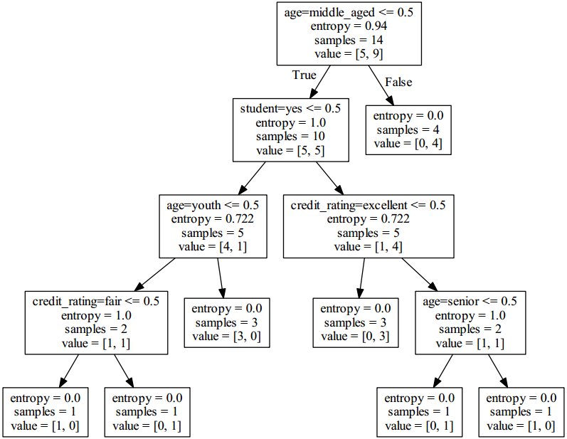

&emsp;&emsp;`sklearn.tree`模块提供了决策树模型，用于解决分类问题和回归问题。方法如下：<!--more-->

方法                                            | 说明
------------------------------------------------|-----
`tree.DecisionTreeClassifier([criterion, ...])` | A decision tree classifier.
`tree.DecisionTreeRegressor([criterion, ...])`  | A decision tree regressor.
`tree.ExtraTreeClassifier([criterion, ...])`    | An extremely randomized tree classifier.
`tree.ExtraTreeRegressor([criterion, ...])`     | An extremely randomized tree regressor.
`tree.export_graphviz(decision_tree[, ...])`    | Export a decision tree in `DOT` format.

&emsp;&emsp;`DecisionTreeClassifier`函数原型如下：

``` python
class sklearn.tree.DecisionTreeClassifier(
    criterion='gini', splitter='best', max_depth=None, min_samples_split=2, min_samples_leaf=1,
    min_weight_fraction_leaf=0.0, max_features=None, random_state=None, max_leaf_nodes=None,
    min_impurity_decrease=0.0, min_impurity_split=None, class_weight=None, presort=False)
```

- `criterion`：特征选择标准，可选参数，可以设置为`entropy`或`gini`。`gini`是基尼不纯度，是将来自集合的某种结果随机应用于某一数据项的预期误差率，是一种基于统计的思想。`entropy`是香农熵，是一种基于信息论的思想。`ID3`算法使用的是`entropy`，`CART`算法使用的则是`gini`。
- `splitter`：特征划分点选择标准，可选参数，可以设置为`random`或`best`。每个结点的选择策略。`best`参数是根据算法选择最佳的切分特征，例如`gini`、`entropy`。`random`随机的在部分划分点中找局部最优的划分点。默认的`best`适合样本量不大的时候，而如果样本数据量非常大，此时决策树构建推荐`random`。
- `max_features`：划分时考虑的最大特征数，可选参数。寻找最佳切分时考虑的最大特征数(`n_features`为总共的特征数)，有如下`6`种情况：

1. 如果`max_features`是整型的数，则考虑`max_features`个特征。
2. 如果`max_features`是浮点型的数，则考虑`int(max_features * n_features)`个特征。
3. 如果`max_features`设为`auto`，那么`max_features = sqrt(n_features)`。
4. 如果`max_features`设为`sqrt`，那么`max_featrues = sqrt(n_features)`，跟`auto`一样。
5. 如果`max_features`设为`log2`，那么`max_features = log2(n_features)`。
6. 如果`max_features`设为`None`，那么`max_features = n_features`，也就是所有特征都用。

一般来说，如果样本特征数不多(比如小于`50`)，我们用默认的`None`就可以了；如果特征数非常多，我们可以灵活使用刚才描述的其他取值来控制划分时考虑的最大特征数，以控制决策树的生成时间。

- `max_depth`：决策树的最大层数，可选参数。如果这个参数设置为`None`，那么决策树在建立子树的时候不会限制子树的深度。一般来说，数据少或者特征少的时候可以不管这个值。或者如果设置了`min_samples_slipt`参数，那么直到少于`min_smaples_split`个样本为止。如果模型样本量多，特征也多的情况下，推荐限制这个最大深度，具体的取值取决于数据的分布。常用的可以取值为`10`至`100`之间。
- `min_samples_split`：内部节点再划分所需最小样本数，可选参数。这个值限制了子树继续划分的条件。如果`min_samples_split`为整数，那么在切分内部结点的时候，`min_samples_split`作为最小的样本数，也就是说，如果样本已经少于`min_samples_split`个样本，则停止继续切分。如果`min_samples_split`为浮点数，那么`min_samples_split`就是一个百分比，`ceil(min_samples_split * n_samples)`，数是向上取整的。如果样本量不大，不需要管这个值。如果样本量数量级非常大，则推荐增大这个值。
- `min_weight_fraction_leaf`：叶子节点最小的样本权重和，可选参数。这个值限制了叶子节点所有样本权重和的最小值，如果小于这个值，则会和兄弟节点一起被剪枝。一般来说，如果我们有较多样本有缺失值，或者分类树样本的分布类别偏差很大，就会引入样本权重，这时我们就要注意这个值了。
- `max_leaf_nodes`：最大叶子节点数，可选参数。通过限制最大叶子节点数，可以防止过拟合。如果加了限制，算法会建立在最大叶子节点数内最优的决策树。如果特征不多，可以不考虑这个值，但是如果特征分成多的话，可以加以限制，具体的值可以通过交叉验证得到。
- `class_weight`：类别权重，可选参数，默认是`None`，也可以是字典、字典列表、`balanced`。指定样本各类别的的权重，主要是为了防止训练集某些类别的样本过多，导致训练的决策树过于偏向这些类别。类别的权重可以通过`{class_label: weight}`这样的格式给出，这里可以自己指定各个样本的权重。如果使用`balanced`，则算法会自己计算权重，样本量少的类别所对应的样本权重会高。当然，如果你的样本类别分布没有明显的偏倚，则可以不管这个参数，选择默认的`None`。
- `random_state`：可选参数，随机数种子。如果是整数，那么`random_state`会作为随机数生成器的随机数种子。如果没有设置随机数，随机出来的数与当前系统时间有关，每个时刻都是不同的。如果设置了随机数种子，那么相同随机数种子在不同时刻产生的随机数也是相同的。如果是`RandomState instance`，那么`random_state`是随机数生成器；如果为`None`，则随机数生成器使用`np.random`。
- `min_impurity_split`：节点划分最小不纯度，可选参数。这是一个阈值，它限制了决策树的增长。如果某节点的不纯度(基尼系数、信息增益、均方差、绝对差)小于这个阈值，则该节点不再生成子节点，即成为叶子节点。
- `presort`：数据是否预排序，可选参数，默认是`False`，即不排序。一般来说，如果样本量少或者限制了一个深度很小的决策树，设置为`true`可以让划分点选择更加快，决策树建立的更加快。如果样本量太大的话，反而没有什么好处。

&emsp;&emsp;除了这些参数要注意以外，其他在调参时的注意点有：

- 当样本数量少但是样本特征非常多的时候，决策树很容易过拟合。一般来说，样本数比特征数多一些会比较容易建立健壮的模型。
- 如果样本数量少但是样本特征非常多，在拟合决策树模型前，推荐先做维度规约，比如主成分分析`PCA`、特征选择`Losso`或者独立成分分析`ICA`。这样特征的维度会大大减小，再来拟合决策树模型效果会好。
- 推荐多用决策树的可视化，同时先限制决策树的深度，这样可以先观察下生成的决策树里数据的初步拟合情况，然后再决定是否要增加深度。
- 在训练模型时，注意观察样本的类别情况(主要指分类树)，如果类别分布非常不均匀，就要考虑用`class_weight`来限制模型过于偏向样本多的类别。
- 决策树的数组使用的是`numpy.float32`类型，如果训练数据不是这样的格式，算法会先做`copy`再运行。
- 如果输入的样本矩阵是稀疏的，推荐在拟合前调用`csc_matrix`稀疏化，在预测前调用`csr_matrix`稀疏化。

&emsp;&emsp;`sklearn.tree.DecisionTreeClassifier`提供了一些方法：

方法                                           | 说明
-----------------------------------------------|-------
`apply(X[, check_input])`                      | Returns the index of the leaf that each sample is predicted as.
`decision_path(X[, check_input])`              | Return the decision path in the tree.
`fit(X, y[, sample_weight, check_input, ...])` | Build a decision tree classifier from the training `set (X, y)`.
`get_params([deep])`                           | Get parameters for this estimator.
`predict(X[, check_input])`                    | Predict class or regression value for `X`.
`predict_log_proba(X)`                         | Predict class `log-probabilities` of the input samples `X`.
`predict_proba(X[, check_input])`              | Predict class probabilities of the input samples `X`.
`score(X, y[, sample_weight])`                 | Returns the mean accuracy on the given test data and labels.
`set_params(**params)`                         | Set the parameters of this estimator.

&emsp;&emsp;训练数据如下：

RID | age         | income | student | credit_rating | class_buys_computer
----|-------------|--------|---------|---------------|--------------------
1   | youth       | high   | no      | fair          | no
2   | youth       | high   | no      | excellent     | no
3   | middle_aged | high   | no      | fair          | yes
4   | senior      | medium | no      | fair          | yes
5   | senior      | low    | yes     | fair          | yes
6   | senior      | low    | yes     | excellent     | no
7   | middle_aged | low    | yes     | excellent     | yes
8   | youth       | medium | no      | fair          | no
9   | youth       | low    | yes     | fair          | yes
10  | senior      | medium | yes     | fair          | yes
11  | youth       | medium | yes     | excellent     | yes
12  | middle_aged | medium | no      | excellent     | yes
13  | middle_aged | high   | yes     | fair          | yes
14  | senior      | medium | no      | excellent     | no

&emsp;&emsp;首先导入一些可能用到的库：

``` python
from sklearn.feature_extraction import DictVectorizer
import csv
from sklearn import tree
from sklearn import preprocessing
```

读取`data.csv`中的数据：

``` python
allElectronicsData = open(r'test.csv', 'rt')
reader = csv.reader(allElectronicsData)
headers = next(reader)
```

到此我们已经拿到数据了，但是这些数据是不能直接使用的，因为计算机不认识字符，它只认识数字，所以要把字符串转换成数组。这里怎样进行转换呢？例如我们把`age`分为了三类，即`youth`、`middle_aged`和`senior`，如果第一条数据是`youth`，就转换为`0 0 1`。当然还有另外的转换方法，也可以使用`1`、`2`、`3`来分别表示三类数据。下面使用`sklearn`自带的工具进行转换，它就使用第一种转换方式，即`youth = 0 0 1`：

``` python
featureList = []  # save feature Dict
labelList = []  # save label

for row in reader:
    labelList.append(row[len(row) - 1])  # 将每一行的label标记存到labellist
    rowDict = {}

    for i in range(1, len(row) - 1):
        rowDict[headers[i]] = row[i]

    featureList.append(rowDict)  # 将每一行的特征向量存到featurelist
```

转换数据集如下：

``` python
vec = DictVectorizer()  # 将数据集转换为0和1的格式
dummyX = vec.fit_transform(featureList).toarray()  # 对特征向量进行转换
print("dummyX: " + str(dummyX))
print(vec.get_feature_names())
print("labelList: " + str(labelList))
lb = preprocessing.LabelBinarizer()  # 对标记进行转换
dummyY = lb.fit_transform(labelList)
print("dummyY: " + str(dummyY))
```

到此为止我们的数据已经准好了，下面就可以开始训练数据，然后建立模型了。建立决策树模型的方法非常简单，直接调用函数即可：

``` python
clf = tree.DecisionTreeClassifier(criterion='entropy')  # entropy(使用信息熵)
clf = clf.fit(dummyX, dummyY)  # 建模
print("clf: " + str(clf))

with open("allElectronicInformationGainOri.dot", 'w') as f:  # save clf to dot
    f = tree.export_graphviz(clf, feature_names=vec.get_feature_names(), out_file=f)
```

上面的代码执行之后，决策树模型就建立好了，并且已经保存在`allElectronicInformationGainOri.dot`文件中了。怎么来进行预测呢？代码如下：

``` python
oneRowX = dummyX[0, :]
print("oneRowX: " + str(oneRowX))
newRowX = oneRowX
newRowX[0] = 1
newRowX[2] = 0
print("newRowX: " + str(newRowX))
predictedY = clf.predict(newRowX.reshape(1, -1))  # 开始预测
print("predictedY: " + str(predictedY))  # 打印预测结果
```

到此为止，基本的决策树应用就算完成了。其实在建模部分，有一些参数是需要调整的，要根据正确率，不断地进行调整。如果特征值比较多的话，还有可能牵扯到降维，那就比较复杂了。
&emsp;&emsp;完整的代码如下：

``` python
from sklearn.feature_extraction import DictVectorizer
import csv
from sklearn import tree
from sklearn import preprocessing

# Read in the csv file and put features into list of dict and list of class label
allElectronicsData = open(r'test.csv', 'rt')
reader = csv.reader(allElectronicsData)
headers = next(reader)
print(headers)

featureList = []
labelList = []

for row in reader:
    labelList.append(row[len(row) - 1])
    rowDict = {}

    for i in range(1, len(row) - 1):
        rowDict[headers[i]] = row[i]

    featureList.append(rowDict)

print(featureList)

vec = DictVectorizer()  # Vetorize features
dummyX = vec.fit_transform(featureList).toarray()

print("dummyX: " + str(dummyX))
print(vec.get_feature_names())
print("labelList: " + str(labelList))

# vectorize class labels
lb = preprocessing.LabelBinarizer()
dummyY = lb.fit_transform(labelList)
print("dummyY: " + str(dummyY))

# Using decision tree for classification
clf = tree.DecisionTreeClassifier(criterion='entropy')
clf = clf.fit(dummyX, dummyY)
print("clf: " + str(clf))

with open("allElectronicInformationGainOri.dot", 'w') as f:  # Visualize model
    f = tree.export_graphviz(clf, feature_names=vec.get_feature_names(), out_file=f)

oneRowX = dummyX[0, :]
print("oneRowX: " + str(oneRowX))

newRowX = oneRowX
newRowX[0] = 1
newRowX[2] = 0
print("newRowX: " + str(newRowX))

predictedY = clf.predict(newRowX.reshape(1, -1))
print("predictedY: " + str(predictedY))
```

使用`Graphviz`将生成的`allElectronicInformationGainOri.dot`文件转换为`pdf`文件：

